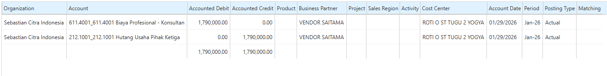
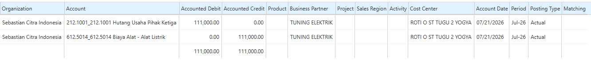
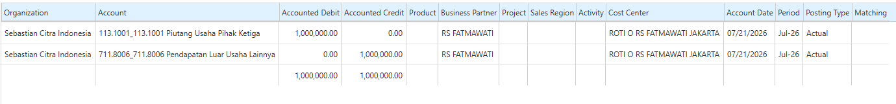
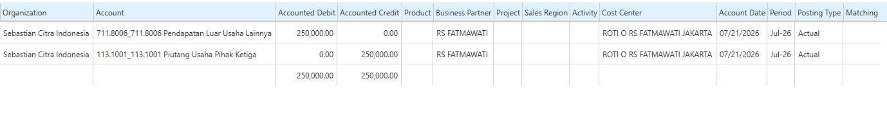

# AP dan AR Manual

Invoice adalah dokumen yang digunakan untuk mencatat transaksi yang menimbulkan hutang (_Accounts Payable/AP_) maupun piutang (_Accounts Receivable/AR_). Invoice dapat dibuat melalui proses bisnis standar (dari Purchase Order atau Sales Order) maupun secara langsung (_manual_). Sistem juga menyediakan dokumen **Credit Note** untuk melakukan koreksi atau pengurangan terhadap invoice yang telah diterbitkan.
## Account Payable (AP)

### AP Invoice Manual

AP Invoice Manual digunakan untuk mencatat kewajiban perusahaan kepada vendor tanpa melalui proses pembelian standar (Purchase Order → Material Receipt → Invoice). Dokumen ini digunakan untuk transaksi yang tidak memerlukan penerimaan barang atau Purchase Order, seperti tagihan jasa konsultan, tagihan listrik, biaya sewa, dan tagihan lainnya dari vendor. Dengan AP Manual, perusahaan tetap dapat mencatat hutang secara lengkap meskipun transaksi tidak berasal dari modul Purchasing.

Ikuti langkah berikut untuk membuat AP Invoice Manual:

1. Buka menu **Purchase Invoice and Credit/Debit Note**.
2. Tentukan **Target Document Type**.
3. Tentukan **Business Partner**.
4. Tentukan **Price List** yang digunakan.
5. Tentukan **Payment Rule**.
6. Masuk ke **Invoice Line**.
7. Tentukan **Charge** atau biaya yang akan diproses.
8. Tentukan **Qty** _(default 1)_.
9. Tentukan **Price** untuk tagihan tersebut.
10. Klik **Save**.
11. Klik **Complete**.

Setelah dokumen di-complete, saldo hutang kepada vendor bertambah dan sistem membentuk jurnal akuntansi. Contoh jurnal untuk pembayaran tagihan biaya profesional konsultan:

 {#Figure173}
### AP Credit Note

AP Credit Note digunakan untuk mengurangi kewajiban perusahaan kepada vendor. Dokumen ini bukan merupakan pembayaran, melainkan koreksi terhadap invoice yang telah diterbitkan.

Ikuti langkah berikut untuk membuat AP Credit Note:

1. Buka menu **Purchase Invoice and Credit/Debit Note**.
2. Pilih Target Document Type **AP Credit Memo**.
3. Tentukan **Business Partner**.
4. Tentukan **Price List** yang digunakan.
5. Tentukan **Payment Rule**.
6. Masuk ke **Invoice Line**.
7. Tentukan **Charge** atau biaya yang akan diproses.
8. Tentukan **Qty** _(default 1)_.
9. Tentukan **Price** untuk tagihan tersebut.
10. Klik **Save**.
11. Klik **Complete**.

Setelah dokumen di-complete, hutang kepada vendor berkurang dan sistem membentuk jurnal Hutang Usaha pada debit dan Persediaan Dalam Perjalanan pada kredit:

 {#Figure174}
## Account Receivable (AR)

### AR Manual

AR Invoice Manual digunakan untuk mencatat piutang pelanggan tanpa melalui Sales Order maupun Shipment. Dokumen ini digunakan untuk transaksi non-penjualan barang.

Ikuti langkah berikut untuk membuat AR Invoice Manual:

1. Buka menu **Sales Invoice and Credit/Debit Note**.
2. Tentukan **Target Document Type**.
3. Tentukan **Business Partner**.
4. Tentukan **Price List** yang digunakan.
5. Tentukan **Payment Rule**.
6. Masuk ke **Invoice Line**.
7. Tentukan **Charge**, pendapatan, atau penjualan yang akan diproses.
8. Tentukan **Qty** _(default 1)_.
9. Tentukan **Price** untuk tagihan tersebut.
10. Klik **Save**.
11. Klik **Complete**.

Setelah dokumen di-complete, sistem membentuk piutang dan jurnal akuntansi. Contoh jurnal untuk pendapatan usaha lainnya:

 {#Figure175}
### AR Credit Note

AR Credit Note digunakan untuk mengurangi piutang customer. Dokumen ini umumnya diterbitkan saat customer melakukan retur atau terdapat koreksi transaksi.

Ikuti langkah berikut untuk membuat AR Credit Note:

1. Buka menu **Sales Invoice and Credit/Debit Note**.
2. Tentukan **Target Document Type**.
3. Tentukan **Business Partner**.
4. Tentukan **Price List** yang digunakan.
5. Tentukan **Payment Rule**.
6. Masuk ke **Invoice Line**.
7. Tentukan **Charge**, pendapatan, atau penjualan yang akan diproses.
8. Tentukan **Qty** _(default 1)_.
9. Tentukan **Price** untuk tagihan tersebut.
10. Klik **Save**.
11. Klik **Complete**.

Setelah dokumen di-complete, sistem mengurangi piutang dan membentuk jurnal akuntansi. Contoh jurnal untuk pendapatan usaha lainnya:

 {#Figure176}