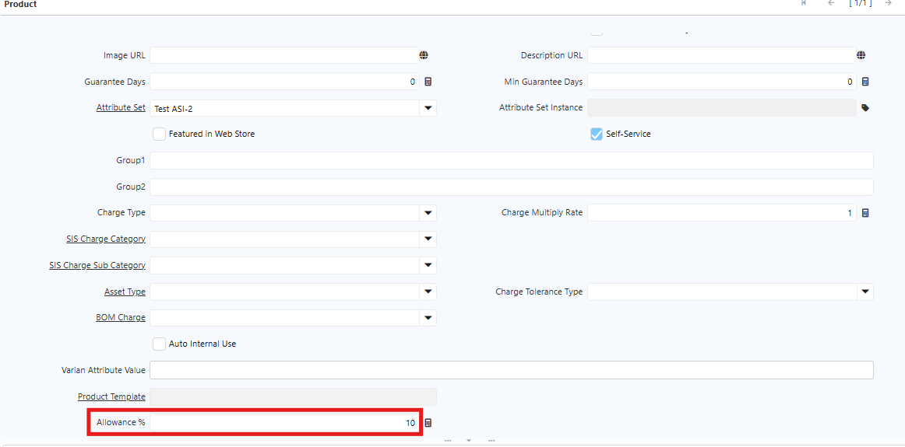
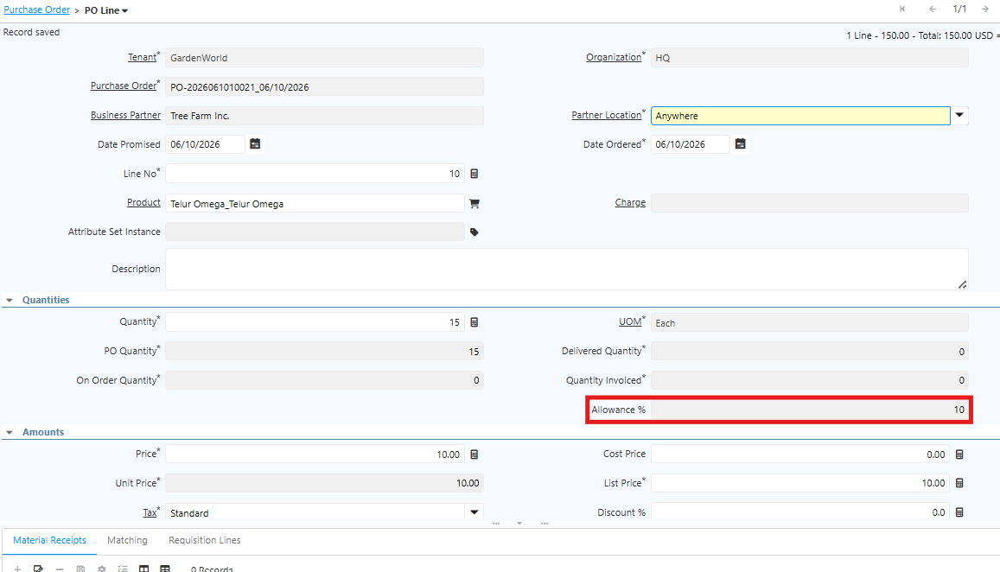
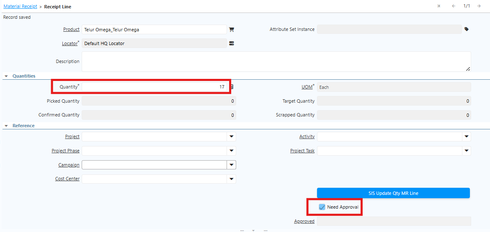

# Allowance Penerimaan (Material Receipt)

Allowance adalah batas toleransi maksimum penerimaan barang (dalam persentase) yang diizinkan melebihi quantity Purchase Order tanpa memerlukan justifikasi tambahan. Jika quantity yang diterima melampaui batas ini, sistem otomatis menandai transaksi untuk memerlukan persetujuan dari PIC yang berwenang sebelum dokumen dapat di-finalisasi.
## Konfigurasi Allowance di Product

Allowance dikonfigurasi di level master produk. Saat produk tersebut dibeli melalui Purchase Order, allowance akan berlaku otomatis saat penerimaan barang (Material Receipt). Ikuti langkah berikut untuk mengkonfigurasi allowance di product:

1. Buka menu **Product**.
2. Buat produk baru.
3. Tentukan **Product Category**.
4. Pada field **Allowance**, tentukan batas toleransi maksimum untuk produk tersebut dalam satuan persen.

 {#Figure131}

5. Klik **Save**.
## Implementasi Allowance
### Skenario Qty dalam batas Allowance

1. Buka menu **Purchase Order**.
2. Input **Business Partner**.
3. Input **Warehouse** untuk penempatan produk.
4. Masuk ke tab **PO Line**.
5. Pilih **produk** yang akan diproses.
6. Input **quantity** produk.
7. Klik **Save**. Saat disimpan, field **Allowance** di PO Line terisi otomatis sesuai konfigurasi di master produk.

 {#Figure132}

8. Klik **Complete** pada dokumen Purchase Order.
9. Masuk ke tab **Material Receipt**, lalu masuk ke **Receipt Line**.
10. Input quantity barang yang diterima _(masih dalam batas allowance)_.
11. Klik **Save**.
12. Klik **Complete** pada dokumen Material Receipt.
### Skenario Qty Melebihi Allowance

1. Buka menu **Purchase Order**.
2. Input **Business Partner**.
3. Input **Warehouse** untuk penempatan produk.
4. Masuk ke tab **PO Line**.
5. Pilih **produk** yang akan diproses.
6. Input **quantity** produk.
7. Klik **Save**. Saat disimpan, field **Allowance** di PO Line terisi otomatis sesuai konfigurasi di master produk.
8. Klik **Complete** pada dokumen Purchase Order.
9. Masuk ke tab **Material Receipt**, lalu masuk ke **Receipt Line**.
10. Input quantity barang yang diterima _(melebihi allowance)_.
11. Klik **Save** — sistem otomatis mencentang field **Need Approval** karena quantity melebihi batas allowance.

 {#Figure133}

12. PIC yang berwenang harus mengklik menu **SIS Update Qty MR Line** untuk melakukan approval.
13. Klik **Complete** pada dokumen Material Receipt.

>**Catatan:** Jika PIC yang berwenang belum melakukan approval, dokumen Material Receipt tidak dapat di-complete dan tidak dapat diproses lebih lanjut.