# Asset Management

## Asset Movement

Asset Movement adalah proses perpindahan aset dari satu lokasi ke lokasi tujuan untuk aktivasi aset. Saat dokumen Invoice atau Purchase Order aset di-complete, sistem otomatis memindahkan aset ke warehouse atau locator tujuan sesuai Material Receipt/BPB, dan field **Locator** di SIS Asset terisi otomatis sesuai locator di Material Receipt.

Jika aset perlu dipindahkan lagi ke outlet tujuan, user harus melakukan **Inventory Move** secara manual. Perpindahan ini menentukan proses depresiasi aset tersebut. Setelah aset dipindahkan ke locator atau outlet tujuan, status aset berubah menjadi **aktif**. Perpindahan aset ditentukan berdasarkan **ASI (Attribute Set Instance)**.

Sebelum melakukan perpindahan aset, konfigurasi warehouse tujuan terlebih dahulu sebagai warehouse untuk depresiasi. Ikuti langkah berikut:

1. Buka menu **Warehouse & Locator**.
2. Centang field **Depreciate**.
3. Tentukan **Operational Date** untuk warehouse atau outlet yang akan diproses.
4. Klik **Save**.

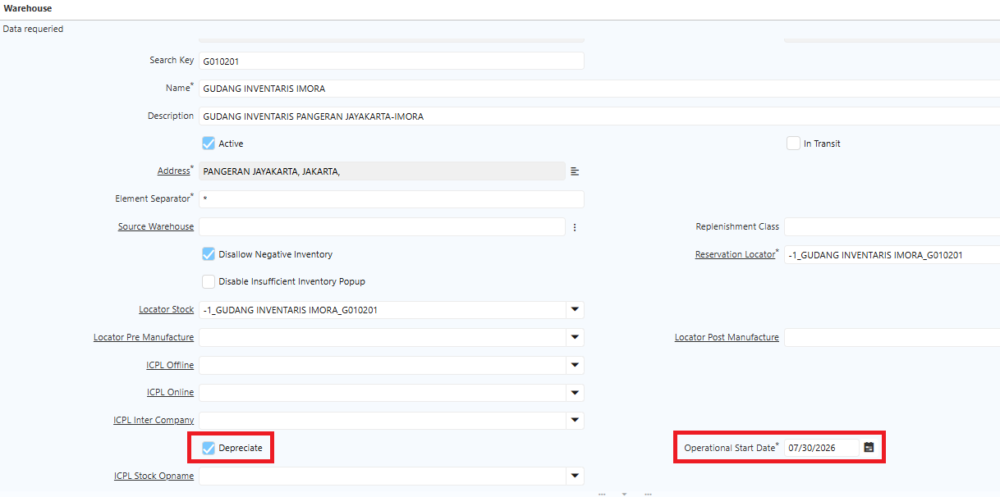 {#Figure115}

Setelah field Depreciate dicentang, aset akan otomatis aktif saat dipindahkan ke warehouse tersebut.

Ikuti langkah berikut untuk melakukan perpindahan aset:
1. Buka menu **Inventory Move**
2. Tentukan **warehouse** asal dan **warehouse** tujuan
3. Masuk ke tab **Move Line**
4. Tentukan **asset** yang akan diproses
5. Tentukan **locator** asal dan **locator** tujuan

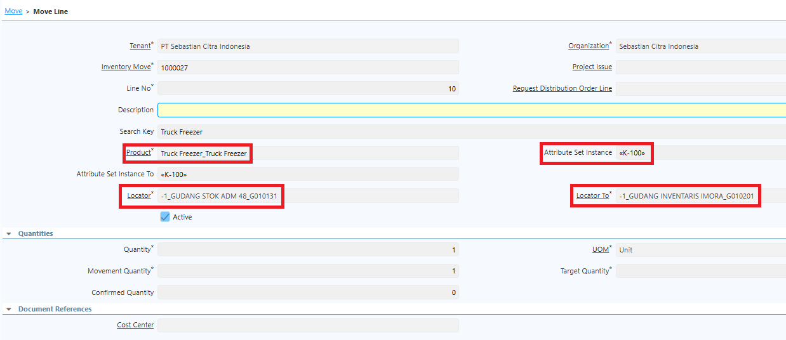 {#Figure116}

6. Masuk ke tab **Attribute**
7. Tentukan **Attribute Set Instance** (ASI) atas aset yang akan dipindahkan
8. Klik **save**
9. Klik **complete** pada dokumen movement

Di belakang layar, saat movement di-complete, sistem otomatis meng-complete dokumen aset atas ASI tersebut. Locator pada dokumen aset juga terisi otomatis sesuai locator Movement, dan dokumen aset teraktivasi secara otomatis.

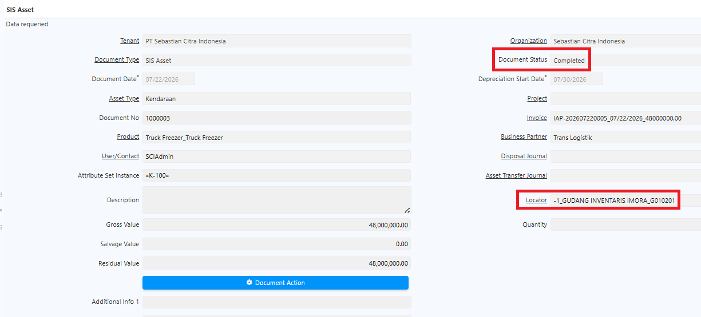 {#Figure117}
## Asset Addition

Asset Addition adalah proses penambahan nilai pada aset yang telah ada, akibat investasi lanjutan, peningkatan kapasitas, perbaikan mayor (major overhaul), renovasi, revaluasi, atau kapitalisasi biaya.

Ikuti langkah berikut untuk melakukan Asset Addition:
1. Buka menu **SIS Asset Addition**.
2. Klik **New**.
3. Input field-field pada header.
4. Pada field **Asset Addition Type**, pilih **Addition**.
5. Masuk ke tab **Line**.
6. Input **nomor dokumen aset** yang akan diproses.
7. Input **Addition Amount** yang akan diproses.

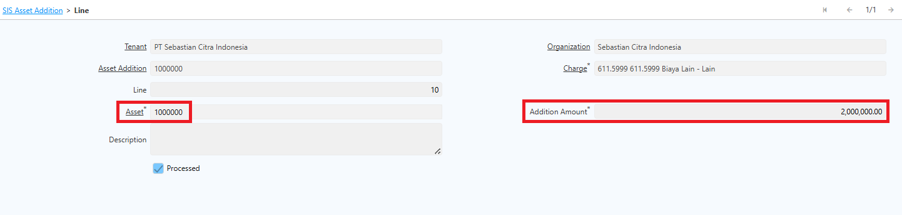 {#Figure118}

8. Klik **Save**.
9. Klik **Complete** pada dokumen.

Setelah dokumen Asset Addition di-complete, sistem otomatis mengkalkulasi ulang **Gross Value** dan **Residual Value** aset dengan menambahkan Addition Amount. Nilai depresiasi juga ikut menyesuaikan dengan Gross Value yang baru.

Selain itu, sistem otomatis membentuk dokumen pendukung berikut:
### Cost Adjustment

Merevaluasi nilai inventory aset sebelumnya dengan nilai saat ini, sehingga nilai aset diperbarui dengan _new cost_.

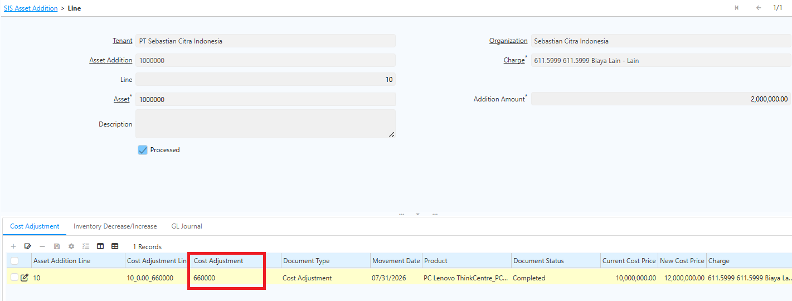 {#Figure141}

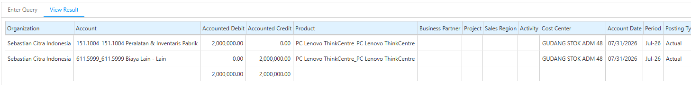 {#Figure158}

Dokumen **Cost Adjustment** akan ditampilkan di tab **Asset Addition Line** dan mereferensikan ke dokumen tersebut.
## Asset Transfer

Asset Transfer adalah proses pengalihan nilai antar aset. Fitur ini digunakan untuk menggabungkan beberapa aset yang sebelumnya dicatat secara terpisah menjadi satu **aset induk (parent asset)**, guna memudahkan pengelolaan.

Ikuti langkah berikut untuk melakukan Asset Transfer:

1. Buka menu **SIS Asset Addition**.
2. Klik **New**.
3. Input field-field pada header.
4. Pada field **Asset Addition Type**, pilih **Transfer**.
5. Masuk ke tab **Line**.
6. Pada field **Asset From**, input nomor dokumen aset asal (aset yang akan digabungkan).
7. Pada field **Asset To**, input nomor dokumen aset tujuan (aset induk).
8. Field **Addition Amount** terisi otomatis dengan nilai sisa (_Residual Value_) dari aset asal.

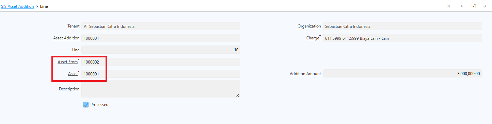 {#Figure119}

9. Klik **Save**.
10. Klik **Complete** pada dokumen.

Setelah dokumen Asset Transfer di-complete, **Residual Value** aset tujuan terkalkulasi dengan nilai dari aset asal, sedangkan **Residual Value** aset asal menjadi 0 karena nilainya telah digabungkan ke aset tujuan. Depresiasi dilanjutkan sesuai masa manfaat ekonomi pada aset tujuan.

Saat melakukan Asset Transfer, sistem otomatis menjalankan mekanisme berikut:
### Jurnal Aset

Sistem membuat jurnal atas aset from dan aset to. Contoh jurnal yang terbentuk: akun aset to (Kendaraan) dan Peralatan (aset from) pada debit, serta akun Cash pada kredit.

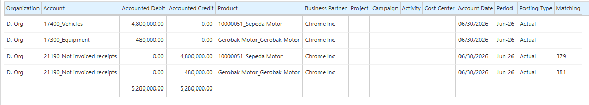 {#Figure124}

### Depresiasi Asset

Apabila aset from telah terdepresiasi, sistem akan mencatat depresiasi atas aset yang terbentuk. Contoh jurnal depresiasi: Depresiasi Aset (aset from) pada debit dan Akumulasi Depresiasi Aset (aset from) pada kredit.

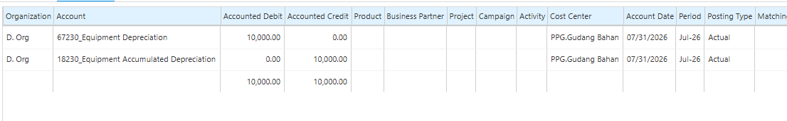 {#Figure115}

### GL Journal

Sistem membuat jurnal pembalik untuk transfer aset dengan ketentuan berikut:

  - **Debit** — Akumulasi penyusutan atas aset from.
  - **Kredit** — Akumulasi penyusutan atas aset to.

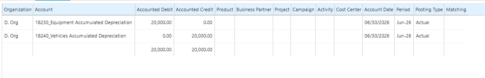 {#Figure121}

### Inventory Decrease/Increase (Internal Use)

Sistem memproses pengurangan inventory atas aset asal yang ditransfer. Jurnalnya: akun Persediaan pada debit dan Peralatan (aset from) pada kredit.

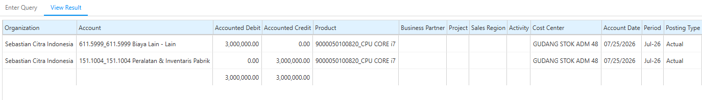 {#Figure122}

### Cost Adjustment

Setelah Internal Use selesai, sistem menambahkan nilai inventory aset tujuan melalui Cost Adjustment senilai aset from dari asset transfer.

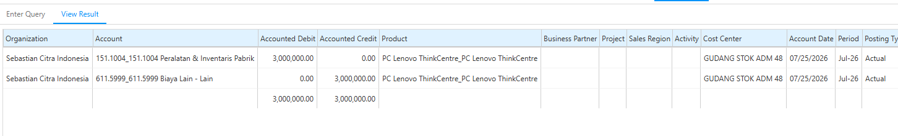 {#Figure123}

Konfigurasi charge untuk **Internal Use** dan **Cost Adjustment** dilakukan di level **Asset Type**. Dokumen yang terbentuk —  **Cost Adjustment**, **Inventory Decrease/Increase**, dan **GL Journal** — akan ditampilkan di tab **Asset Addition Line** dan mereferensikan masing-masing dokumen terkait.

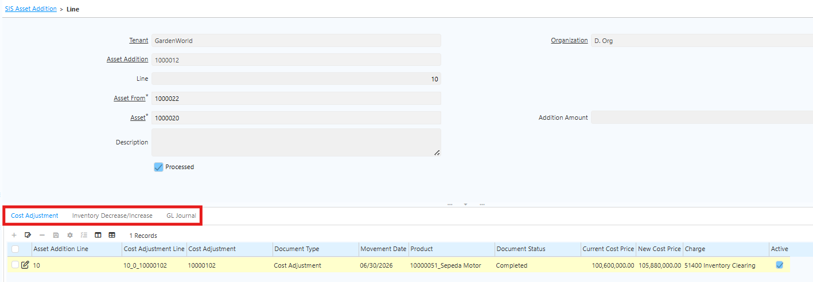 {#Figure124}
## Asset Depreciation

Asset Depreciation adalah proses pencatatan penurunan nilai ekonomis aset tetap secara sistematis selama masa manfaatnya, sesuai kebijakan akuntansi perusahaan dan standar pelaporan keuangan yang berlaku. Periode atau masa manfaat aset dikonfigurasi di **Asset Type**.

Di iDempiere, masa manfaat aset — yang disebut **Number of Entry** — hanya dapat diedit sebelum dokumen aset di-complete. Setelah dokumen di-complete, masa manfaat tidak dapat diubah.

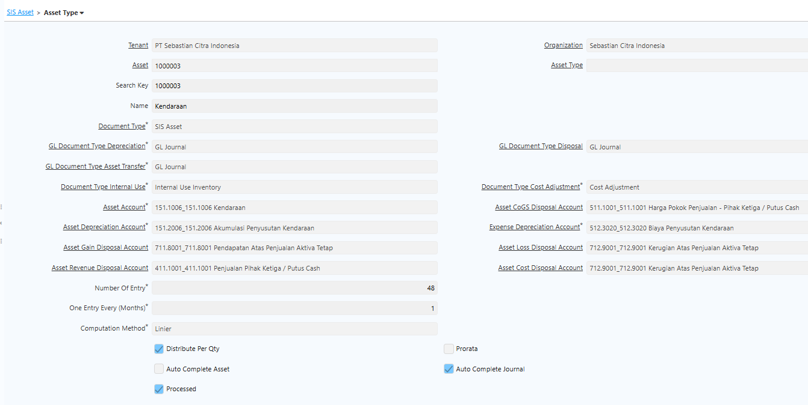 {#Figure126}

Sistem otomatis menyesuaikan **Depreciation Amount** berdasarkan masa manfaat yang diperbarui. Hal ini diperlukan untuk mengakomodasi kondisi penggabungan beberapa aset yang sebelumnya dicatat secara terpisah menjadi satu aset induk (parent asset), di mana aset induk tersebut kemungkinan sudah mengalami depresiasi sebelumnya.
### Mekanisme Depresiasi

Depresiasi aset berjalan jika aset sudah berada di warehouse atau outlet tujuan yang memiliki field **Depreciate** tercentang, dan dalam jangka **tanggal operasional** outlet tersebut. Jika operasional outlet belum dimulai, aset tidak dapat didepresiasi.

> **Catatan:** Movement date aset dari warehouse asal ke outlet atau warehouse tujuan harus lebih besar dari tanggal operasional outlet. Aset akan terdepresiasi otomatis setelah melewati tanggal operasional tersebut.

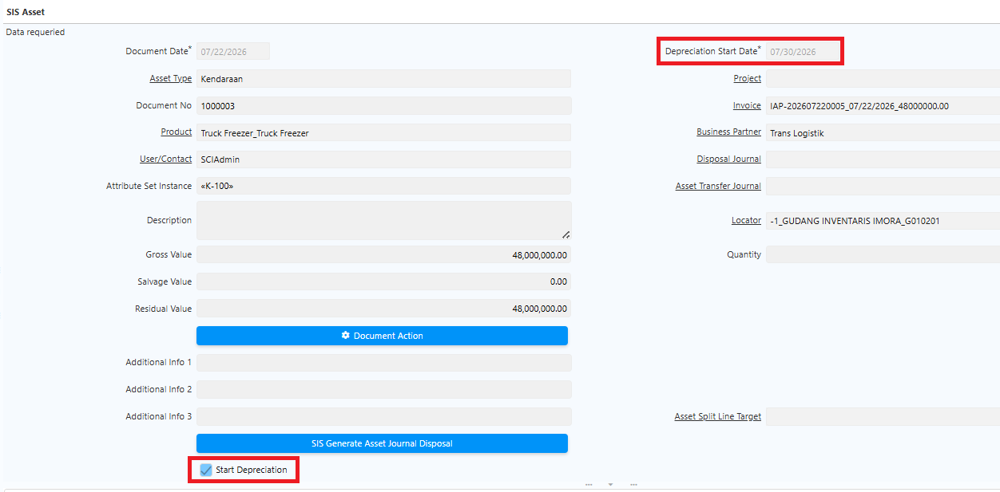 {#Figure125}

Konfigurasi **auto complete aset** dapat dilakukan di **Asset Type**. Jika dikonfigurasi, depresiasi langsung berjalan secara otomatis tanpa tindakan manual.

Ikuti langkah berikut untuk melakukan verifikasi depresiasi aset:
1. Buka menu **SIS Asset**
2. Pilih asset yang akan diproses
3. Pada tab **Line**, periksa **Depreciation Date** dan nilai depresiasi aset selama masa manfaatnya.

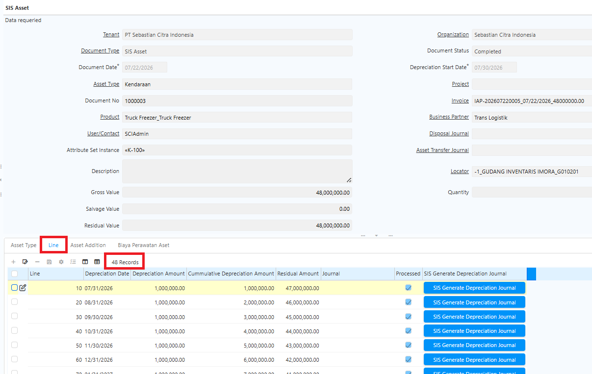 {#Figure120}

Depresiasi berjalan secara otomatis sesuai scheduler yang telah dikonfigurasi. 
## Report Asset

Report Asset digunakan untuk memantau posisi aset tetap perusahaan, meliputi nilai perolehan, nilai buku berjalan, status penyusutan, dan lokasi fisik aset. Laporan ini umumnya digunakan untuk:

- **Audit fisik aset** — Mencocokkan data locator dan Attribute Set Instance dengan kondisi fisik di lapangan.
- **Rekonsiliasi nilai buku** — Membandingkan Gross Value dan Residual Value untuk keperluan laporan neraca.
- **Pemantauan penyusutan** — Memverifikasi kelengkapan proses depresiasi berdasarkan Depreciation Date.
- **Penelusuran asal aset** — Menelusuri kembali aset ke dokumen pembelian terkait.
### Langkah Akses Report Asset

1. Buka menu **SIS Report Asset**.
2. Input field berikut sesuai kebutuhan:

  - **Organization**
  - **Asset Type**
  - **Locator**
  - **Document Status**
  - **Depreciation Date**

3. Klik **Ok**.

Sistem menampilkan daftar aset sesuai filter yang dikonfigurasi.

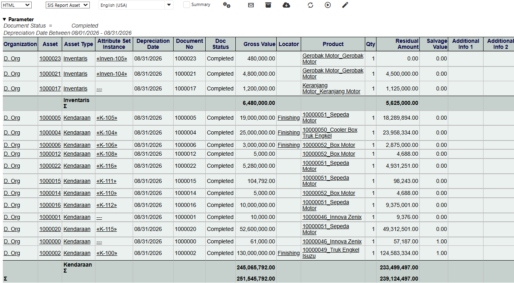 {#Figure125}

Berikut penjelasan kolom yang tercantum pada report aset:
- **Asset dan Document** — Dokumen transaksi asal yang menjadi dasar pembentukan aset. Digunakan sebagai jejak audit untuk menelusuri asal usul perolehan aset.
- **Product** — Produk acuan yang digunakan sebagai dasar pembentukan aset.
- **Gross Value** — Nilai perolehan awal aset (harga beli) sebelum dikurangi akumulasi penyusutan.
- **Residual Value** — Nilai buku saat ini setelah dikurangi penyusutan berjalan.
- **Depreciation Date** — Tanggal proses penyusutan terakhir dicatat untuk aset tersebut.
- **Locator** — Lokasi fisik penyimpanan aset, digunakan untuk pelacakan fisik saat stock opname atau audit aset.
- **Attribute Set Instance** — Atribut spesifik unik aset, seperti nomor lot yang membedakan satu unit fisik dari unit lain meski berasal dari produk yang sama.
- **Document Status** — Status dokumen aset: _Draft_, _Completed_, atau _Closed_.

## Asset Maintenance

Asset Maintenance adalah proses perbaikan dan perawatan yang dilakukan perusahaan terhadap aset-aset yang sudah ada. Perbaikan ini mencakup biaya perawatan, penggantian sparepart, dan biaya lainnya. Seluruh biaya tersebut diakui langsung sebagai beban — tidak menambah nilai aset dan tidak membentuk aset baru.

Perbedaan utama antara **Asset Maintenance** dan **Asset Addition**:

- **Asset Addition** — Biaya perbaikan atau penggantian diakui sebagai penambah nilai aset, sehingga nilai aset tujuan bertambah sesuai perbaikan yang dilakukan.
- **Asset Maintenance** — Biaya perbaikan atau perawatan diakui sebagai beban dan tidak mempengaruhi nilai aset yang ada.
### Langkah Proses Asset Maintenance melalui Purchase Order

Biaya perawatan dan perbaikan diproses melalui Purchase Order, di mana tagihannya akan terhubung ke aset yang diperbaiki. Ikuti langkah berikut:

1. Buka menu **Purchase Order**.
2. Tentukan **Business Partner** yang akan diproses.
3. Masuk ke tab **PO Line**.
4. Tentukan **produk** yang akan diproses.
5. Tentukan **quantity** produk.
6. Klik **Save**.
7. Klik **Complete** pada dokumen Purchase Order.
8. Masuk ke tab **Material Receipt**, lalu klik **Complete**.
9. Masuk ke **Receipt Line**, kemudian masuk ke tab **Invoice**.
10. Masuk ke tab **Invoice Line**.
11. Pada field **SIS Asset**, input dokumen aset yang akan diproses.

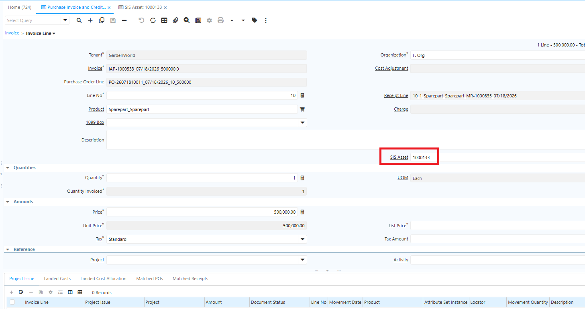 {#Figure147}

12. Klik **Save**.
13. Klik **Complete** pada dokumen Invoice. 

Setelah Invoice di-complete, informasi pada Invoice Line otomatis tersalin ke dokumen **SIS Asset** pada tab **Biaya Perawatan Aset**. Data pada tab tersebut bersifat _read-only_ dan berfungsi sebagai histori perawatan atau perbaikan aset.

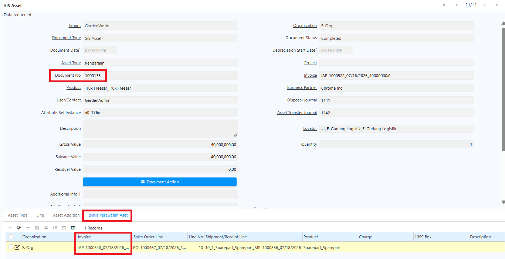 {#Figure150}

> **Catatan:** Asset Maintenance hanya dapat diproses pada aset yang sudah aktif (status dokumen aset _Complete_). Aset yang masih berstatus _Draft_ tidak akan muncul di Invoice Line.