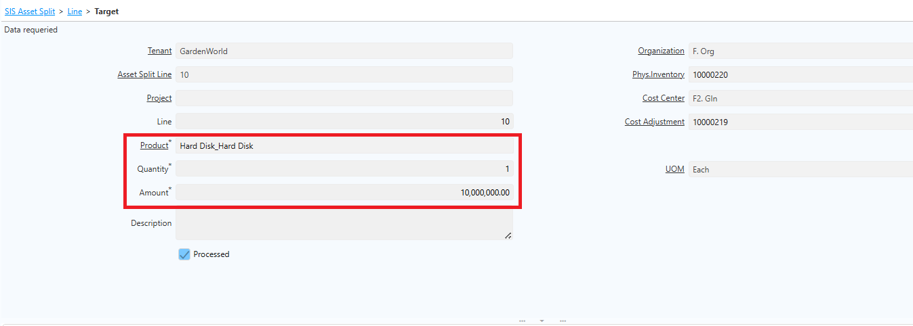
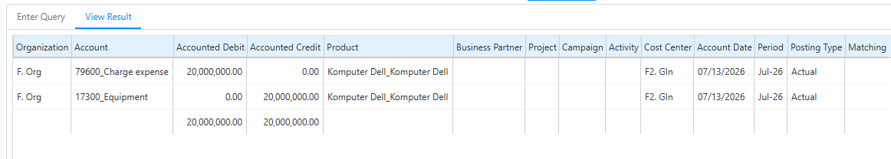
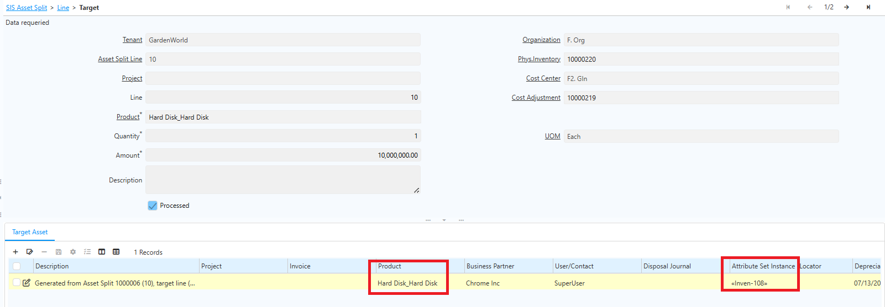
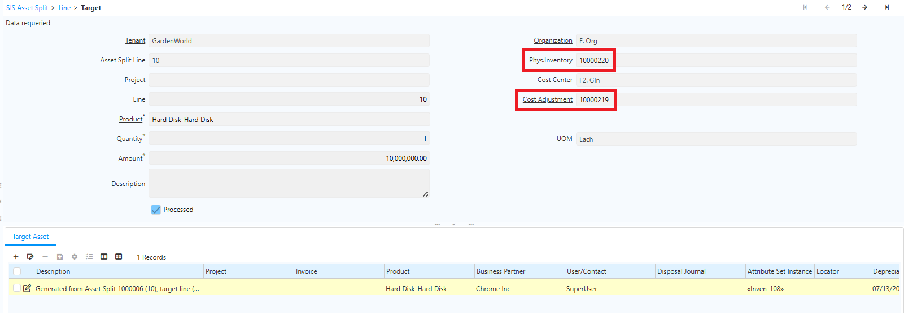

# Asset Split

Asset Split adalah fitur yang digunakan untuk memecah satu aset menjadi beberapa aset baru (target asset) dengan quantity yang lebih kecil, tanpa mengubah total nilai perolehan aset secara keseluruhan. Fitur ini umumnya digunakan ketika sebuah aset yang tercatat dengan quantity lebih dari satu perlu dipisahkan kepemilikan, lokasi, atau penanggung jawabnya menjadi beberapa unit aset tersendiri. 
## Langkah Implementasi Asset Split

1. Buka menu **SIS Asset Split**.
2. Input **Cost Center**.
3. Input **Warehouse** penempatan aset.
4. Input **Locator** untuk penyimpanan aset.
5. Klik **Save**.
6. Masuk ke tab **Line**.
7. Pada field **Asset From**, input dokumen aset yang akan diproses.
8. Masuk ke tab **Target**.
9. Input **Product** yang akan diproses.
10. Input **Qty** target asset.
11. Input **Amount** dari target asset.

 {#Figure134}

12. Klik **Save**.
13. Ulangi langkah 9–12 untuk target asset lainnya.
14. Klik **Complete** pada dokumen SIS Asset Split.

Setelah dokumen Asset Split di-complete, sistem otomatis membentuk dokumen dan transaksi berikut:
### Internal Use (Inventory Decrease/Increase)

Sistem akan menggenerate dokumen Internal Use untuk mengurangi quantity pada aset sumber (aset yang dipecah) sesuai jumlah yang dipindahkan ke aset target.

 {#Figure131}
### Jurnal Pembalik Akumulasi Penyusutan

Jika aset sumber sudah pernah disusutkan, sistem membuat jurnal untuk membalik (_reverse_) akumulasi penyusutan secara proporsional terhadap quantity yang dipecah. Hal ini memastikan nilai buku target asset dimulai secara akurat sesuai porsi nilai yang dialihkan.
### Pembentukan Target Asset

Sistem membentuk aset baru sejumlah quantity yang diinput pada dokumen Asset Split. Setiap target asset yang terbentuk memiliki:

- Dokumen Asset tersendiri.
- ASI (Attribute Set Instance) yang ter-generate otomatis, sehingga masing-masing target asset dapat dibedakan dan ditelusuri secara individual.

 {#Figure132}
### Cost Adjustment (CA) untuk Masing-Masing Target Asset

Sistem membuat dokumen **Cost Adjustment** untuk setiap target asset dengan nilai sesuai amount yang dialokasikan. Cost Adjustment ini mencatat nilai perolehan awal target asset sesuai porsi nilai yang dipecah dari aset sumber.
### Physical Inventory untuk Masing-Masing Target Asset

Sistem membentuk dokumen Physical Inventory untuk setiap target asset dengan ketentuan berikut:

- Book Qty = 0 (target asset merupakan aset baru yang belum memiliki catatan quantity).
- Count Qty = 1 (mencerminkan quantity aktual target asset hasil split).
- Value = sesuai nilai yang tercatat pada Cost Adjustment target asset.

 {#Figure133}

Dokumen Physical Inventory ini mencatat keberadaan fisik dan nilai target asset di sistem, selaras dengan nilai yang telah ditetapkan pada Cost Adjustment.

Dengan proses otomatis ini, user tidak perlu membuat dokumen-dokumen tersebut secara manual — seluruh dokumen turunan terbentuk otomatis saat Asset Split di-complete, sehingga konsistensi data quantity, nilai buku, dan pencatatan akuntansi aset terjaga.

>**Catatan:** 
>- **Total amount target asset harus sama dengan residual value aset asal.** Penjumlahan seluruh amount yang dialokasikan ke masing-masing target asset harus sama persis dengan residual value (nilai buku) dari aset asal (asset from) pada saat dokumen Asset Split diproses. Hal ini bertujuan agar tidak terjadi selisih nilai antara aset sumber dengan total nilai aset hasil pemecahan.
- **Aset asal (asset from) harus berada di warehouse dan locator tujuan.** Sebelum dokumen Asset Split dapat diproses, aset yang akan dipecah wajib sudah berada pada warehouse dan locator yang sama dengan warehouse dan locator tujuan yang akan digunakan untuk target asset. Ketentuan ini diperlukan karena proses split menggunakan mekanisme Internal Use Inventory (decrease dan increase), sehingga lokasi aset sumber dan aset target harus konsisten agar pencatatan quantity dan lokasi persediaan tidak menimbulkan selisih.

