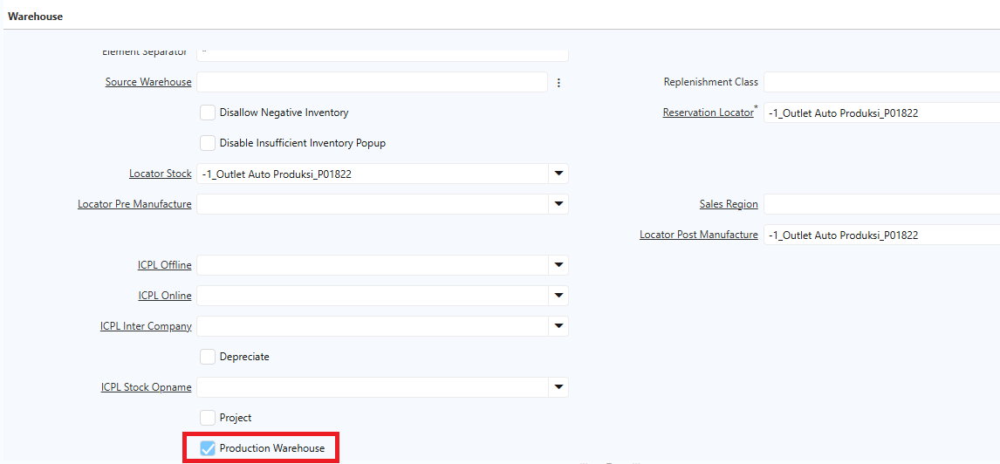
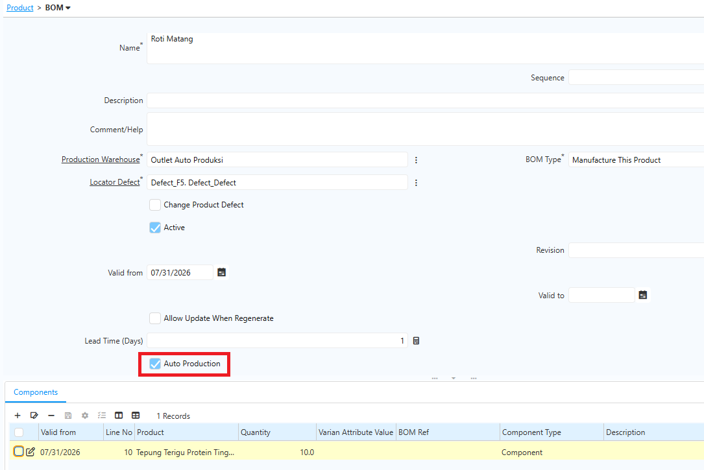
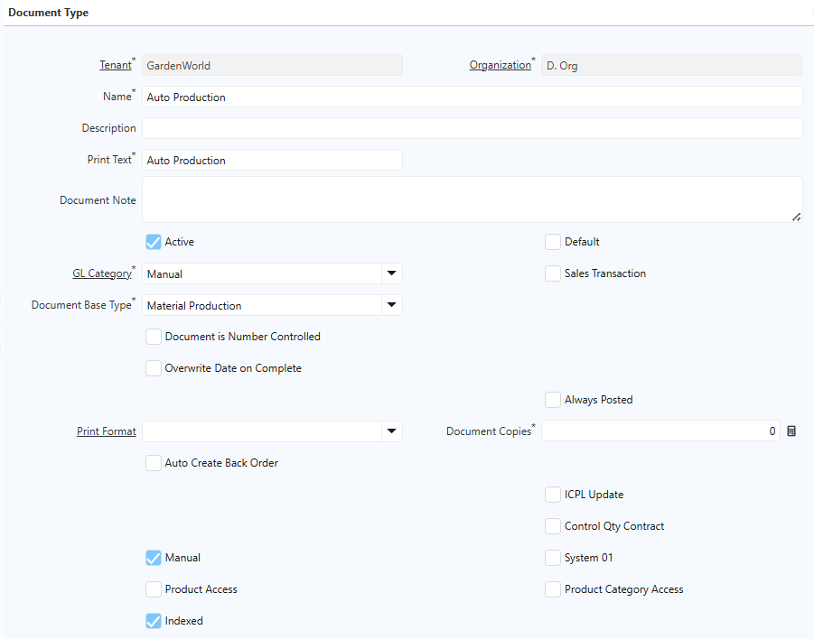
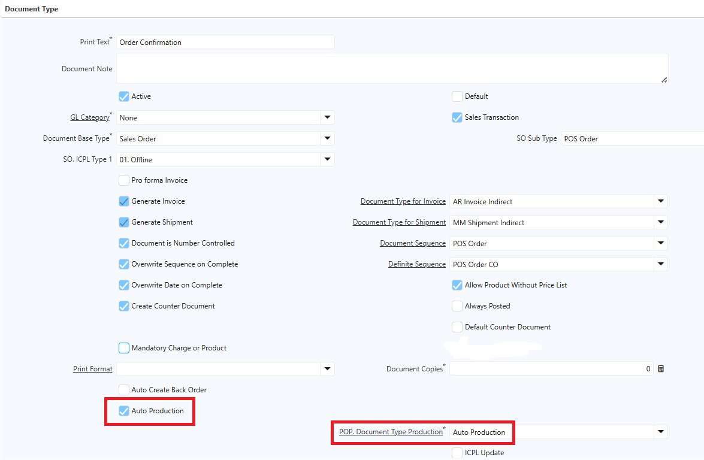
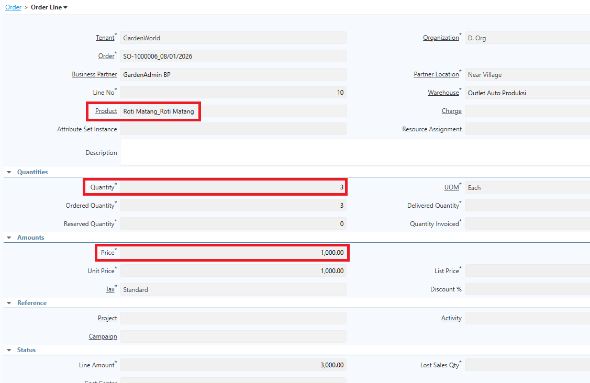
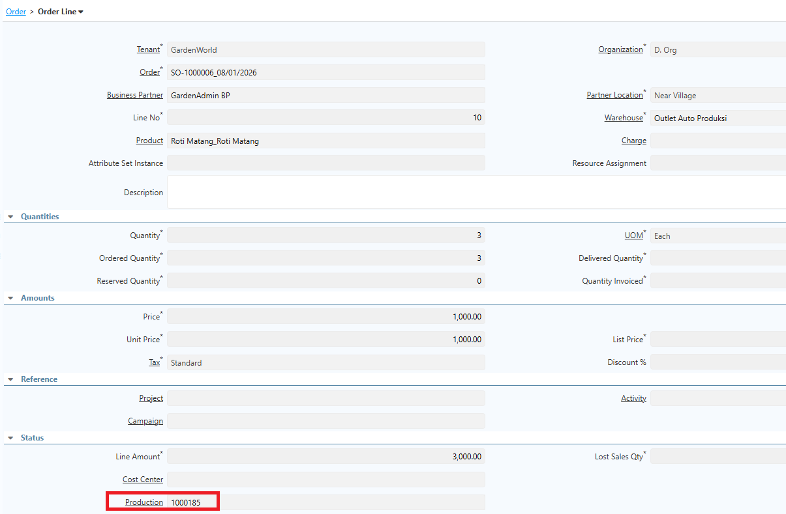
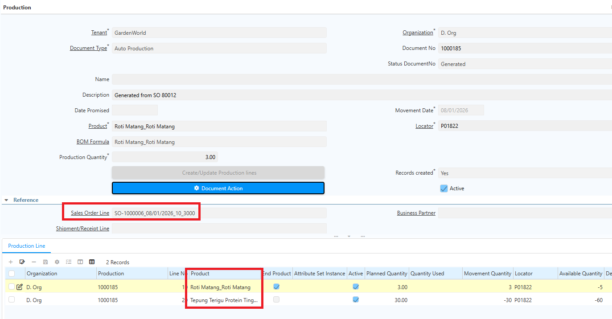

# Auto Production POS Order

Auto Production adalah mekanisme yang memungkinkan sistem membuat transaksi produksi secara otomatis berdasarkan transaksi penjualan dari **POS Order**. Transaksi POS diproses menjadi Sales Order, sehingga setiap penjualan yang diselesaikan langsung memicu proses produksi tanpa perlu membuat Production Order secara manual.

Sebelum menggunakan Auto Production, pastikan konfigurasi berikut sudah tersedia:

- Produk sudah dikonfigurasi sebagai Manufactured Product.
- Produk memiliki Bill of Material (BoM) yang aktif.
- Seluruh bahan baku memiliki stok yang mencukupi untuk proses produksi.
- Field Auto Production sudah dikonfigurasi di level Product, Warehouse and Locator, dan Document Type POS Order.

Jika salah satu konfigurasi belum tersedia, sistem tidak dapat membuat transaksi produksi secara otomatis.
## Konfigurasi Warehouse and Locator

1. Buka menu **Warehouse and Locator**.
2. Cari warehouse yang akan dikonfigurasi.
3. Centang field **Auto Production**.

 {#Figure202}

4. Klik **Save**.
## Konfigurasi Product

1. Buka menu **Product**.
2. Centang field **Bill of Material**.
3. Masuk ke tab **BoM**.
4. Centang field **Auto Production**.
5. Pada field **BoM Type**, pilih **Manufacture This Product**.
6. Tentukan **Production Warehouse** sesuai konfigurasi sebelumnya.
7. Tentukan **Locator Defect**.

 {#Figure203}

8. Klik **Save**.

## Konfigurasi Document Type

Lakukan konfigurasi pada dua document type berikut:

### Document Type Production

1. Buka menu **Document Type**.
2. Buat document type baru.
3. Input **Name** sesuai kebutuhan.
4. Pada field **GL Category**, pilih **Material Management**.
5. Pada field **Document Base Type**, pilih **Material Production**.
6. Pada field **Document Sequence**, pilih **Material Production**.

 {#Figure204}

7. Klik **Save**.

### Document Type Sales Order

1. Buka menu **Document Type**.
2. Buat document type baru.
3. Input **Name** sesuai kebutuhan.
4. Pada field **GL Category**, pilih **Material None**.
5. Pada field **Document Base Type**, pilih **Sales Order**.
6. Centang field **Sales Transaction**.
7. Centang field **Auto Production**.
8. Pada field **POP Document Type Production**, pilih document type Production yang telah dikonfigurasi sebelumnya.

 {#Figure205}

9. Klik **Save**.

## Mekanisme Auto Production

1. Buka menu **Sales Order**.
2. Tentukan **Document Type** yang telah dikonfigurasi.
3. Tentukan **Business Partner**.
4. Tentukan **Warehouse** produksi.
5. Masuk ke **Order Line**.
6. Tentukan **produk** yang akan diproses.
7. Tentukan **quantity** produk.
8. Tentukan **price** atas produk tersebut.

 {#Figure206}

9. Klik **Save**.
10. Klik **Complete** pada dokumen Sales Order.

Setelah Sales Order di-complete, sistem otomatis membuat dokumen **Production** atas produk tersebut dengan status _Complete_. 

 {#Figure207}

Sistem kemudian otomatis memproduksi artikel dan memindahkannya ke locator sesuai yang dikonfigurasi di Sales Order.

 {#Figure208}