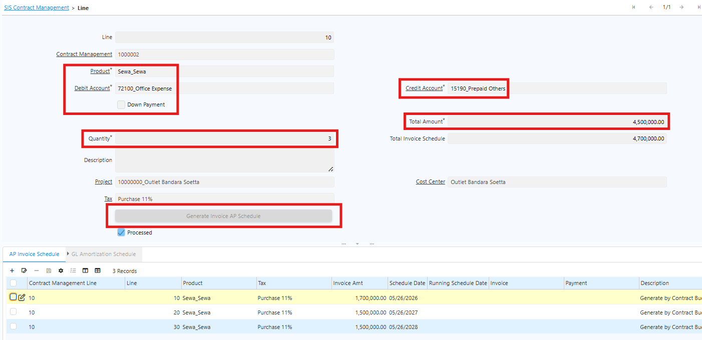
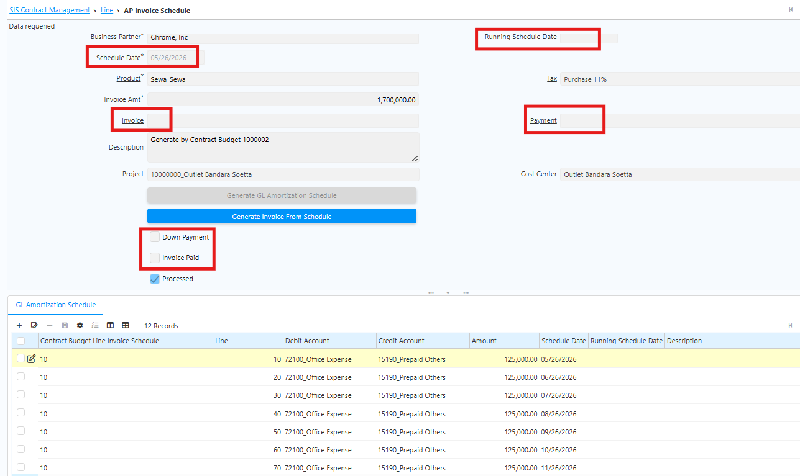
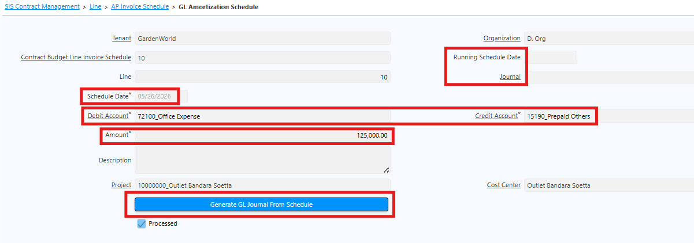

# Contract Management

Contract Management digunakan untuk dua keperluan utama:

- Mencatat jadwal penerbitan AP Invoice untuk biaya yang sudah pasti dalam periode tertentu, sesuai dokumen kontrak dengan pihak ketiga.
- Membuat jadwal amortisasi otomatis untuk biaya yang bersifat recurring selama periode tertentu.

Sebelum memulai transaksi Contract Management, siapkan master data berikut:

- Cost Center (outlet/showroom/plant)
- Project (opsional)
## Langkah Akses Contract Management di Sistem

Ikuti langkah berikut untuk mengakses Contract Management di iDempiere:
1. Buka menu **SIS Contract Management**
2. Isi field pada **Header**:
  - Period Type — Pilih Year (Tahun) atau Month (Bulan).
  - Cost Center — Isi sesuai outlet atau showroom.
  - Tax — Isi pajak yang akan digunakan.
  - Business Partner — Isi rekanan yang bekerja sama dalam kontrak.
  - Project — **Opsional**, isi jika terkait pekerjaan pembangunan outlet atau showroom.

!(80%)[Contract Management](../Header_Contract_Management.png "Contract Management") {#Figure67}

3. Masuk ke tab Contract Management **Line**. Isi field berikut:
  - Product — Isi dengan produk biaya.
  - Debit Account — Isi akun debit untuk amortisasi.
  - Credit Account — Isi akun kredit untuk amortisasi.
  - Down Payment — Isi jika terdapat mekanisme DP.
  - Quantity — Isi jumlah periode kontrak (mengikuti Period Type di header: Year/Month).
  - Total Amount — Isi nilai kontrak sebelum pajak.

 {#Figure68}

4. Jalankan **Generate Invoice AP Schedule** untuk membuat jadwal AP Invoice. Secara default, sistem mengikuti amount dan quantity pada line. Qty dan Amount dapat diubah selama total amount di schedule tetap sama dengan amount di line.
5. Hasil generate akan muncul di tab **AP Invoice Schedule**.
6. Masuk ke tab **AP Invoice Schedule**. Berikut field yang tersedia:
  - Schedule Date — Tanggal generate AP Invoice (Complete).
  - Running Schedule Date — Informasi eksekusi schedule.
  - Invoice — Dokumen AP Invoice yang ter-generate.
  - Payment — Dokumen payment dari AP Invoice.
  - Down Payment — Invoice Down Payment.
  - Invoice Paid — Status pembayaran invoice.

 {#Figure66}

7. Jalankan **Generate GL Amortization Schedule** untuk membuat jadwal amortisasi bulanan.
8. Hasil generate akan muncul di tab **GL Amortization Schedule**.
9. Masuk ke tab **GL Amortization Schedule**. Berikut field yang tersedia:
  - Schedule Date — Tanggal generate GL Journal (Complete).
  - Journal — Dokumen GL Journal yang ter-generate.
  - Debit Account — Akun debit GL Journal.
  - Credit Account — Akun kredit GL Journal.
  - Amount — Nominal debit dan kredit yang akan terjurnal di GL Journal.

 {#Figure65}

10. Jalankan **Generate GL Journal From Schedule** untuk men-generate GL Journal dengan status **Complete**.
11. **Generate Invoice From Schedule** untuk men-generate AP Invoice secara manual di luar jadwal yang telah dikonfigurasi.