# Contract Management

Contract Management digunakan untuk dua keperluan utama:

- Mencatat jadwal penerbitan AP Invoice untuk biaya yang sudah pasti dalam periode tertentu, sesuai dokumen kontrak dengan pihak ketiga.
- Membuat jadwal amortisasi otomatis untuk biaya yang bersifat recurring selama periode tertentu.

Sebelum memulai transaksi Contract Management, siapkan master data berikut:

- Cost Center (outlet/showroom/plant)
- Project (opsional)

Ikuti langkah berikut untuk membuat master data Cost Center:
1. Buka menu **Cost Center**
2. Input **Search Key** dan Name **sesuai** kebutuhan operasional

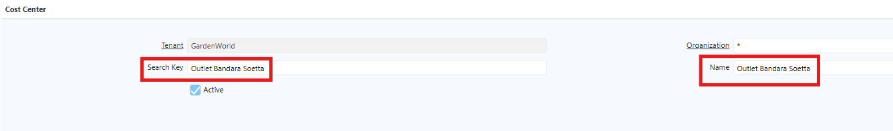 {#Figure66}

3. Klik **save**

## Konfigurasi Product Biaya

Sebelum menggunakan Contract Management, buat master data product untuk komponen biaya pada kontrak. Ikuti langkah berikut:
1. Buka menu **Product**
2. Klik **new**
3. Input **nama product**
4. Input **Product Category**
5. Input **Product Type** — pilih **Expense** karena product berfungsi sebagai biaya kontrak
6. Pada field **Doc Type Invoice AP Contract Management**, buat Doc Type AP Invoice per masing-masing komponen kontrak.
7. Set **Charge AR Receipt Contract Management** jika product expense atas kontrak dapat diklaim kembali.

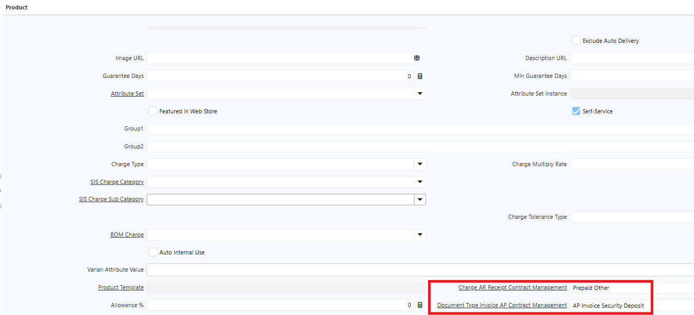 {#Figure67}

8. Masuk ke tab **Accounting**, lakukan konfigurasi akun berikut:
  - Product Expense → di-set sebagai Akun Kredit untuk GL Journal Amortization.
  - Amortization Expense → di-set sebagai Akun Debit untuk GL Jurnal Amortisasi.

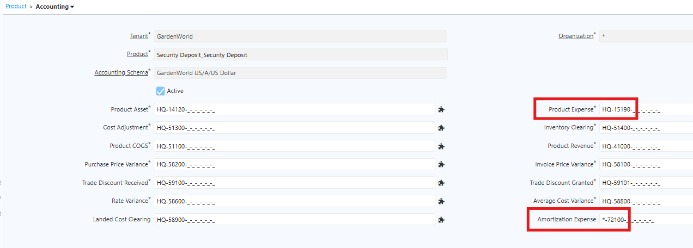 {#Figure68}
## Langkah Akses Contract Management di Sistem

Ikuti langkah berikut untuk mengakses Contract Management di iDempiere:
1. Buka menu **SIS Contract Management**
2. Isi field pada **Header**:
  - Period Type — Pilih Year (Tahun) atau Month (Bulan).
  - Cost Center — Isi sesuai outlet atau showroom.
  - Tax — Isi pajak yang akan digunakan.
  - Business Partner — Isi rekanan yang bekerja sama dalam kontrak.
  - Project — **Opsional**, isi jika terkait pekerjaan pembangunan outlet atau showroom.
  - Informasi tambahan — Isi Luas Sewa, Harga per M2, Grace Periode, dan Harga per Tahun.
  - Period Contract — Tentukan periode selama masa kontrak
  - Periode Sewa Awal — Tentukan tanggal kontrak awal

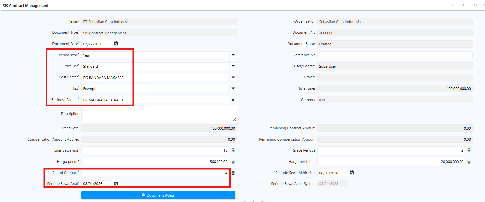 {#Figure69}

3. Masuk ke tab **Contract Management Line**. 
4. Klik **New**, kemudian isi field berikut:
  - Product — Isi dengan produk biaya yang akan diproses.
  - Total Amount — Isi nilai kontrak sebelum pajak.
  - Percentage — Tentukan persentase dari total amount (jika ada)
  - UnAmortized — Centang jika biaya merupakan deposit yang dapat diklaim

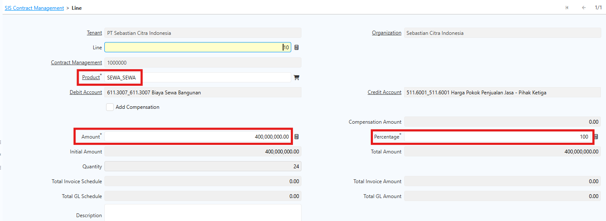 {#Figure70}

5. Ulangi langkah 4 untuk komponen biaya lainnya
6. Jalankan **Generate Schedule** untuk membuat jadwal AP Invoice dan GL Amortization. Secara default, sistem mengikuti amount dan periode kontrak. Date schedule dan amount dapat diubah, namun total amount di AP Schedule dan GL Amortization harus tetap sama.
7. Hasil generate akan muncul di tab **AP Invoice Schedule** dan **GL Amortization**
8. Jika terdapat perubahan pada schedule, amount, atau periode, gunakan tombol aksi yang tersedia di Contract Management Line. Berikut fungsi masing-masing tombol:
  - Generate schedule — Meng-generate schedule untuk penerbitan AP Invoice dan GL Amortization
  - Update Amount Schedule Invoice — Memperbarui nominal jika terdapat perubahan.
  - Update Date Schedule Invoice — Memperbarui tanggal; jika ada kompensasi, tanggal dapat dimajukan atau dimundurkan
  - Decrease Period CM Invoice — Mengurangi periode; nominal akan ter-kalkulasi otomatis sesuai periode baru.
  - Update Amount Schedule Amortisasi — Memperbarui nominal amortisasi jika terdapat perubahan.
  - Update Date Schedule Amortisasi — Memperbarui tanggal amortisasi
  - SIS Update Total Amount Schedule CM — Memperbarui total amount schedule jika terdapat perubahan nominal di pertengahan periode; jika amount di AP Schedule Invoice diperbarui, amount di GL Amortisasi akan ikut disesuaikan secara otomatis.

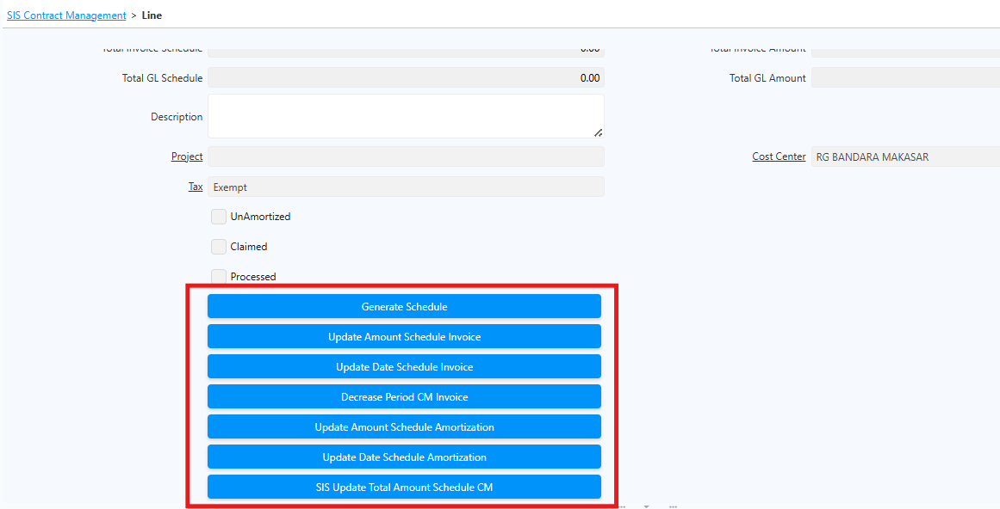 {#Figure71}

9. Setelah schedule AP Invoice dan GL Amortization sudah sesuai, klik **Complete** pada dokumen Contract Management.
10. Sistem otomatis men-generate AP Invoice dan GL Amortization sesuai date schedule yang telah dikonfigurasi.

## Langkah Proses Kompensasi

Jika terdapat kompensasi, proses kompensasi dapat dilakukan atas kontrak lain melalui field **Add Compensation**. Ikuti langkah berikut:

1. Buka menu **SIS Contract Management**
2. Isi field pada **Header**
3. Masuk ke tab Contract Management **Line**. 
4. Klik New kemudian Isi field berikut:
  - Product — Isi dengan produk biaya yang akan diproses.
  - Centang field **Add Compensation**.
  - Pada field **Contract Management Compensation**, pilih dokumen kontrak yang akan dikompensasi.

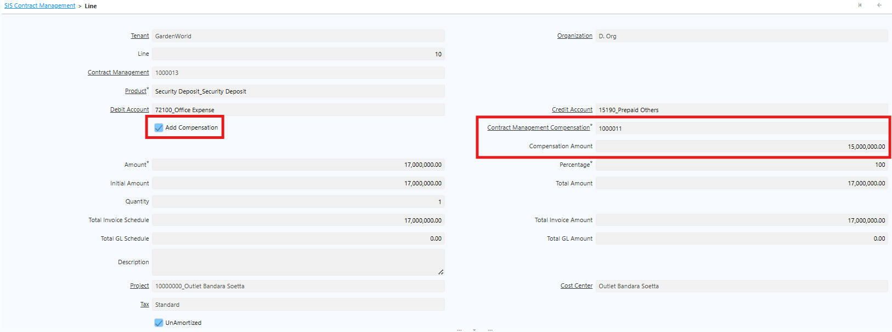 {#Figure73}

5. Klik **Generate Schedule**
6. Klik **complete** dokumen contract management
7. Masuk ke tab **AP Invoice Schedule**, lalu jalankan **Generate Invoice From Schedule**.

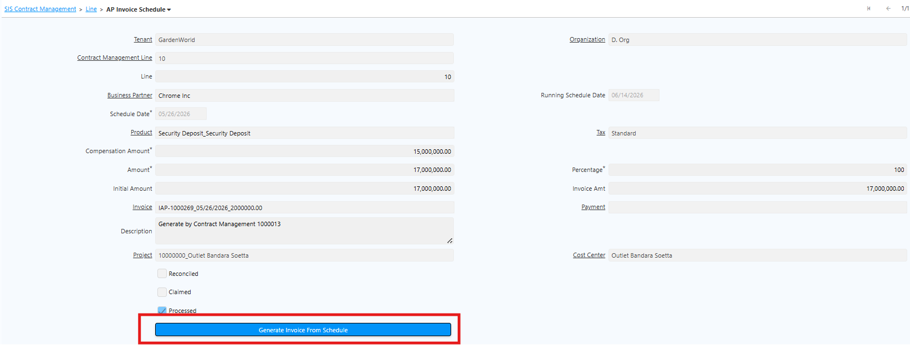 {#Figure74}

7. Sistem membentuk 2 Invoice Line pada invoice: invoice amount awal dan invoice kompensasi yang mengurangi total amount invoice.

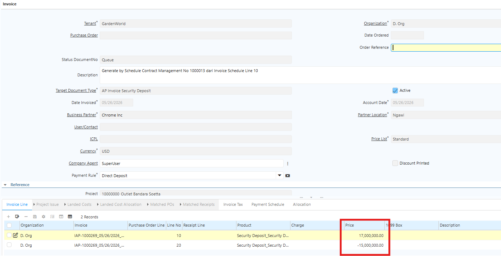 {#Figure75}

8. Klik **complete** pada dokumen AP Invoice

## Langkah Klaim Deposit

Jika terdapat biaya deposit yang dapat diklaim, pastikan invoice atas biaya deposit tersebut sudah ter-generate sebelum melakukan klaim. Ikuti langkah berikut:
1. Setelah dokumen Contract Management di-complete, tombol **Claim CM to AR Receipt** akan muncul pada biaya deposit.

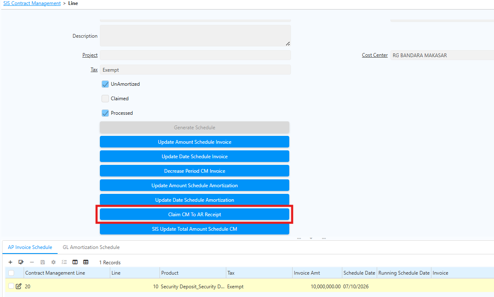 {#Figure72}

2. Klik **Claim CM to AR Receipt**
3. Isi field yang tersedia:
  - Bank account
  - Document type
  - Document action
  - Transaction date
  
4. Klik **ok**

Sistem otomatis membentuk **Payment AR Receipt** atas klaim yang di-generate dan field **Claimed** akan tercentang secara otomatis.

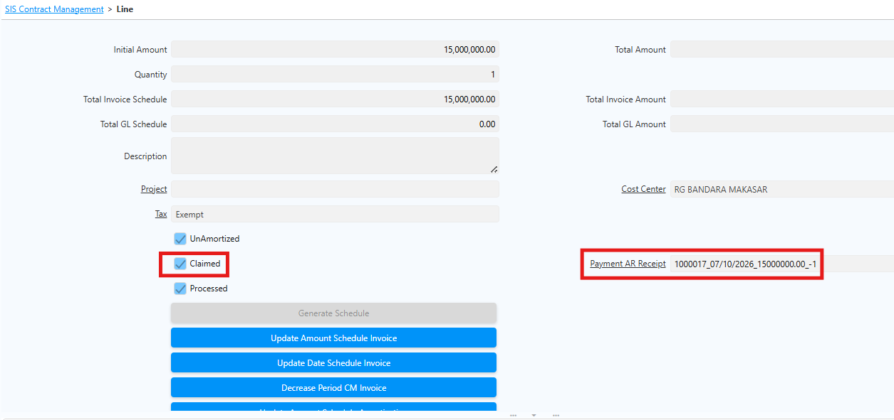 {#Figure160}
## Report Contract Management

Report Contract Management digunakan untuk menampilkan daftar dokumen Contract Management berdasarkan parameter pencarian yang dipilih. Gunakan report ini untuk memantau informasi kontrak yang telah dibuat tanpa perlu membuka setiap dokumen satu per satu.
### Langkah Akses Report Contract Management

1. Buka menu **SIS Report Contract Management**.
2. Input field berikut sesuai kebutuhan:
- **Business Partner**
- **Document Status**

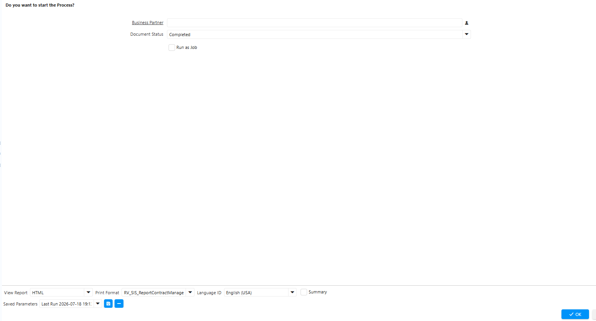 {#Figure147}

3. Klik **OK**.

Report menampilkan seluruh informasi yang terdapat pada **Header Contract Management**.

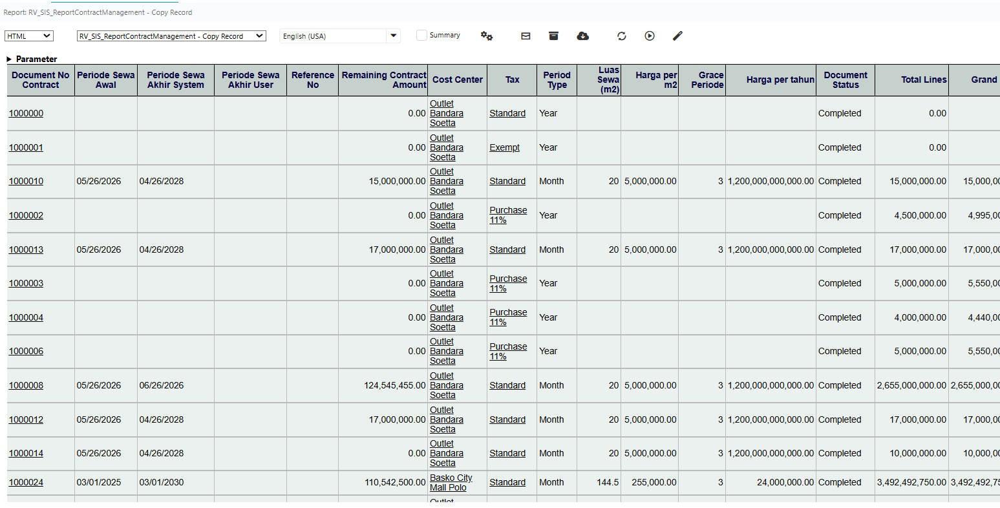 {#Figure148}
## Report Contract Management Detail

Report Contract Management Detail digunakan untuk menampilkan rincian setiap item pada dokumen Contract Management. Berbeda dengan Report Contract Management yang hanya menampilkan informasi header, report ini menampilkan seluruh data pada **Contract Management Line**.
### Langkah Akses Report Contract Management Detail

1. Buka menu **SIS Report Contract Management Detail**.
2. Input field berikut sesuai kebutuhan:

- **Contract Management**
- **Cost Center**
- **Schedule Date**

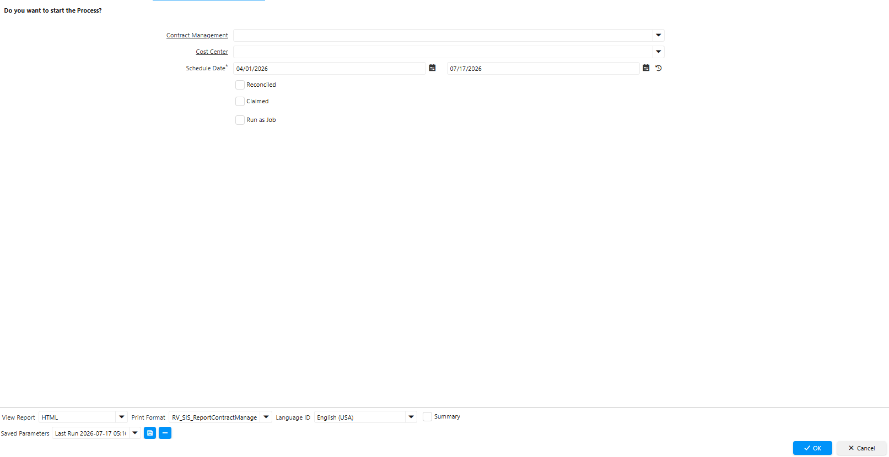 {#Figure149}

3. Klik **OK**.

Report menampilkan seluruh informasi yang terdapat pada **Contract Management Line**.

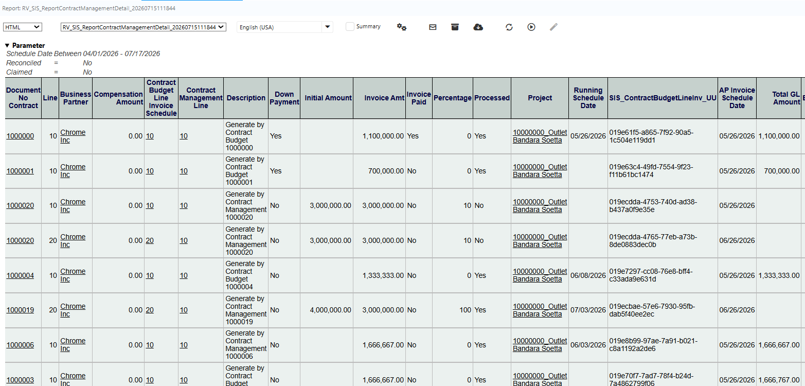 {#Figure150}

> **Catatan:** Seluruh parameter bersifat opsional. Jika parameter tidak diisi, sistem menampilkan seluruh data tanpa filter, kecuali parameter yang dikonfigurasi sebagai wajib pada implementasi.