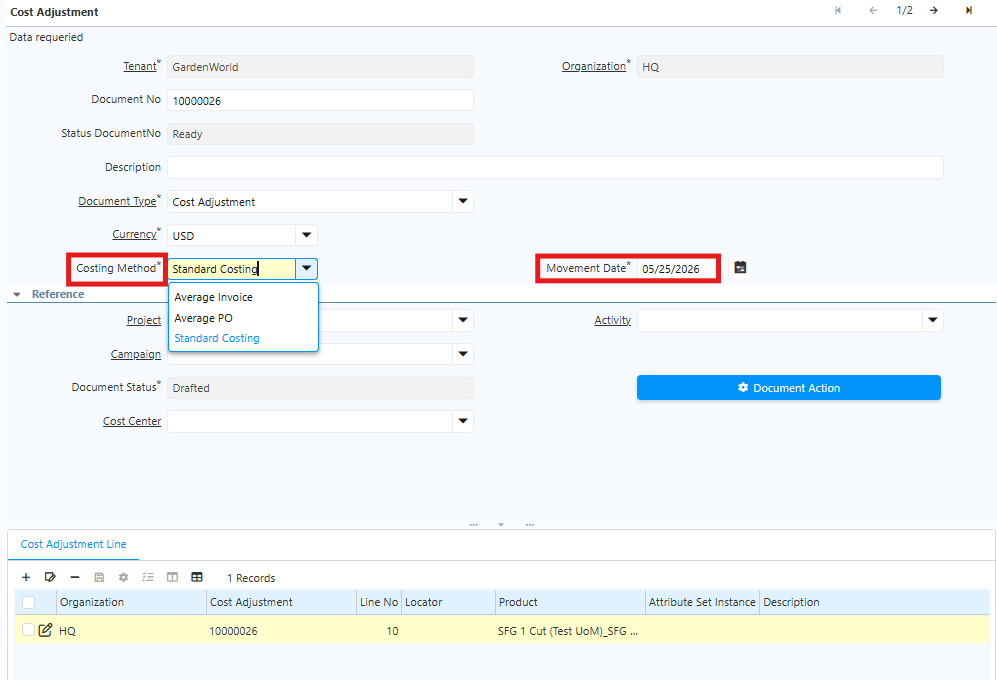
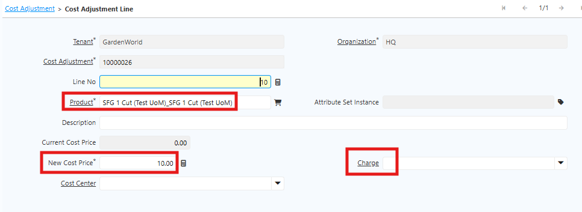

# Cost Adjustment

Cost Adjustment adalah proses penyesuaian nilai valuasi produk atau barang yang sudah tercatat di sistem. Penyesuaian ini dilakukan karena:

- Perbedaan harga
- Kesalahan pencatatan sebelumnya

Cost Adjustment tidak melakukan revaluasi terhadap transaksi historis. Sistem hanya akan menggunakan nilai cost baru untuk transaksi berjalan dan transaksi berikutnya.

## Ketentuan Costing Method

Costing Method tidak boleh diubah setelah digunakan dalam transaksi. Pembatasan ini bertujuan untuk:
- Menjaga konsistensi data
- Menjaga integritas transaksi
- Menghindari ketidaksesuaian laporan costing

Jika perusahaan perlu menggunakan costing method yang berbeda, buat product atau article baru lalu arahkan ke Product Category yang sesuai.

## Langkah Cost Adjustment di Sistem

Ikuti langkah berikut untuk melakukan Cost Adjustment:
1. Buka menu **Cost Adjustment**
2. Klik **New**
3. Pilih **Costing Method** pada produk
4. Pilih **Movement Date**

 {#Figure42}

5. Masuk ke tab **Cost Adjustment Line**
6. Pilih produk yang akan disesuaikan
7. Input nilai harga baru pada field **New Cost Price**
8. Input **Charge**

 {#Figure43}

8. Klik **save**
9. Klik **complete**

## Cost Adjustment pada Batch/Lot

Jika terjadi kesalahan harga pada level Batch atau Lot, lakukan penyesuaian cost average per Batch atau Lot.

Sistem akan menghitung harga rata-rata berdasarkan harga beli material terakhir pada masing-masing Batch atau Lot

Metode ini membantu menjaga akurasi nilai persediaan pada setiap Batch atau Lot.

## Penanganan Kesalahan Harga pada Purchase Order

Jika terdapat kesalahan harga pada material yang sudah diproses melalui Purchase Order, perusahaan dapat menyelesaikannya menggunakan:
- Credit Note
- Return Material

Proses penyelesaian mengikuti kebijakan perusahaan.

1. Jika perusahaan menggunakan Credit Note, tim accounting menentukan akun yang digunakan untuk penyesuaian.
2. Jika stock masih tersedia, lakukan proses return material kepada vendor
3. Jika material sudah digunakan dalam proses produksi, lakukan adjustment minus untuk menambah stok sesuai kondisi existing saat ini

Proses ini membantu menjaga kesesuaian nilai costing dan persediaan di sistem.