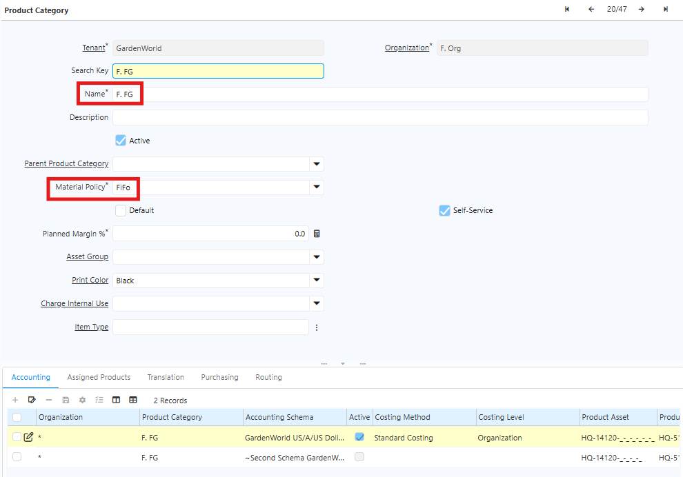
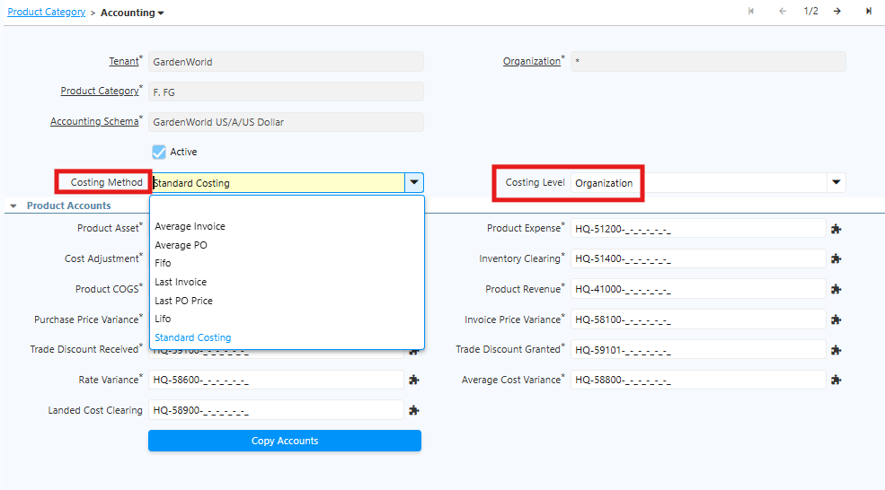

# Cost of Production

Cost of Production adalah biaya yang dikeluarkan untuk memproduksi barang. Biaya ini mencakup bahan baku, tenaga kerja, dan biaya overhead produksi.

Di iDempiere, Cost of Production terdiri dari tiga elemen utama:

1. Biaya Bahan Baku Langsung. Biaya bahan yang langsung digunakan dalam proses produksi, seperti tepung, kain, atau bahan utama lainnya.
2. Biaya Tenaga Kerja Langsung. Biaya tenaga kerja yang langsung mengerjakan proses produksi, seperti upah operator mesin.
3. Biaya Overhead Pabrik. Biaya tidak langsung yang mendukung proses produksi, seperti listrik pabrik dan depresiasi mesin.

## Metode Perhitungan Biaya di iDempiere

### Standar Cost

Standard Cost menggunakan biaya standar yang ditetapkan di awal periode. Sistem akan membandingkan biaya aktual dengan biaya standar dan mencatat selisihnya sebagai variance.

Metode ini membantu perusahaan:
- Mengontrol biaya produksi
- Mempermudah evaluasi selisih biaya
- Menjaga kestabilan nilai persediaan
### Average Cost

Average Cost menghitung ulang biaya rata-rata setiap kali terjadi transaksi masuk.

Nilai persediaan akan selalu mengikuti rata-rata harga terbaru. Metode ini cocok digunakan untuk:
- Raw Material
- Produk dengan perubahan harga yang tidak terlalu signifikan
### FIFO (First In First Out)

FIFO menggunakan stok berdasarkan urutan barang masuk pertama. Sistem akan menghitung harga pokok penjualan menggunakan biaya dari lot yang pertama kali diterima. Metode ini cocok digunakan untuk:
- Produk dengan masa simpan tertentu
- Barang yang harus keluar berdasarkan urutan penerimaan

## Variance

Variance adalah selisih antara biaya standar dan biaya aktual. Perusahaan dapat menggunakan variance untuk:
- Evaluasi biaya produksi
- Penyesuaian standard costing
- Analisis efisiensi produksi

Komponen variance dapat mencakup:

a. FOH (Factory Overhead)

b. Biaya tambahan lainnya
## Konfigurasi Costing

Sebelum melakukan transaksi, tentukan costing method untuk setiap kategori produk. User dapat melakukan konfigurasi di Product Category. Ikuti langkah berikut untuk mengatur costing pada Product Category:

1. Buka menu **Product Category**
2. Klik **New**
3. Isi field **Name**, contoh Raw Material
4. Isi field **Material Policy**

 {#Figure40}

5. Masuk ke tab **Accounting**
6. Klik **Accounting Schema**
7. Pilih **Costing Method** dan **Costing Level** sesuai kebijakan perusahaan

 {#Figure41}

8. Klik **Save**

## Implementasi Penggunaan Costing

### Finished Goods & Semi Finished Goods

Tim PSI merekomendasikan penggunaan Standard Costing untuk Finished Goods dan Semi Finished Goods. Metode ini:

- Sudah menjadi praktik umum di sistem manufaktur
- Mengacu pada blueprint costing perusahaan
- Membantu menjaga akurasi laporan keuangan
- Mempermudah kontrol dan evaluasi biaya produksi
### Raw Material

Tim PSI merekomendasikan penggunaan Average Cost untuk Raw Material.

Metode ini dinilai cukup karena perubahan harga bahan baku biasanya tidak menghasilkan selisih biaya yang signifikan.
### Sub-Contracting

Proses subcontracting dapat menggunakan:
- Standard Costing
- Average Costing

Pemilihan metode mengikuti kebijakan perusahaan. Pada proses subcontracting:
- Sistem akan membuat movement dari warehouse internal ke warehouse subcontractor.
- Sistem juga akan membuat jurnal internal use secara otomatis di belakang proses transaksi.

## Tujuan Penggunaan Standar Costing

Penggunaan Standard Costing membantu perusahaan:
- Mengendalikan koreksi HPP atau costing
- Mengurangi kesalahan operasional
- Mempermudah proses monitoring biaya

Dengan minimnya koreksi costing, perusahaan dapat menyusun laporan keuangan dalam kurun waktu yang lebih cepat dan lebih stabil. 