# Cost of Production

Cost of Production adalah biaya yang dikeluarkan untuk memproduksi barang. Biaya ini mencakup bahan baku, tenaga kerja, dan biaya overhead produksi.

Di iDempiere, Cost of Production terdiri dari tiga elemen utama:

1. Biaya Bahan Baku Langsung. Biaya bahan yang langsung digunakan dalam proses produksi, seperti tepung, kain, atau bahan utama lainnya.
2. Biaya Tenaga Kerja Langsung. Biaya tenaga kerja yang langsung mengerjakan proses produksi, seperti upah operator mesin.
3. Biaya Overhead Pabrik. Biaya tidak langsung yang mendukung proses produksi, seperti listrik pabrik dan depresiasi mesin.

## Metode Perhitungan Biaya di iDempiere

### Standar Cost

Standard Cost menggunakan biaya standar yang ditetapkan di awal periode. Sistem akan membandingkan biaya aktual dengan biaya standar dan mencatat selisihnya sebagai variance.

Metode ini membantu perusahaan:
- Mengontrol biaya produksi
- Mempermudah evaluasi selisih biaya
- Menjaga kestabilan nilai persediaan
### Average Cost

Average Cost menghitung ulang biaya rata-rata setiap kali terjadi transaksi masuk.

Nilai persediaan akan selalu mengikuti rata-rata harga terbaru. Metode ini cocok digunakan untuk:
- Raw Material
- Produk dengan perubahan harga yang tidak terlalu signifikan
### FIFO (First In First Out)

FIFO menggunakan stok berdasarkan urutan barang masuk pertama. Sistem akan menghitung harga pokok penjualan menggunakan biaya dari lot yang pertama kali diterima. Metode ini cocok digunakan untuk:
- Produk dengan masa simpan tertentu
- Barang yang harus keluar berdasarkan urutan penerimaan

## Variance

Variance adalah selisih antara biaya standar dan biaya aktual. Perusahaan dapat menggunakan variance untuk:
- Evaluasi biaya produksi
- Penyesuaian standard costing
- Analisis efisiensi produksi

Komponen variance dapat mencakup:
  - FOH (Factory Overhead)
  - Biaya tambahan lainnya
## Konfigurasi Costing

Sebelum melakukan transaksi, tentukan costing method untuk setiap kategori produk. User dapat melakukan konfigurasi di Product Category. Ikuti langkah berikut untuk mengatur costing pada Product Category:

1. Buka menu **Product Category**
2. Klik **New**
3. Isi field **Name**, contoh Raw Material
4. Isi field **Material Policy**

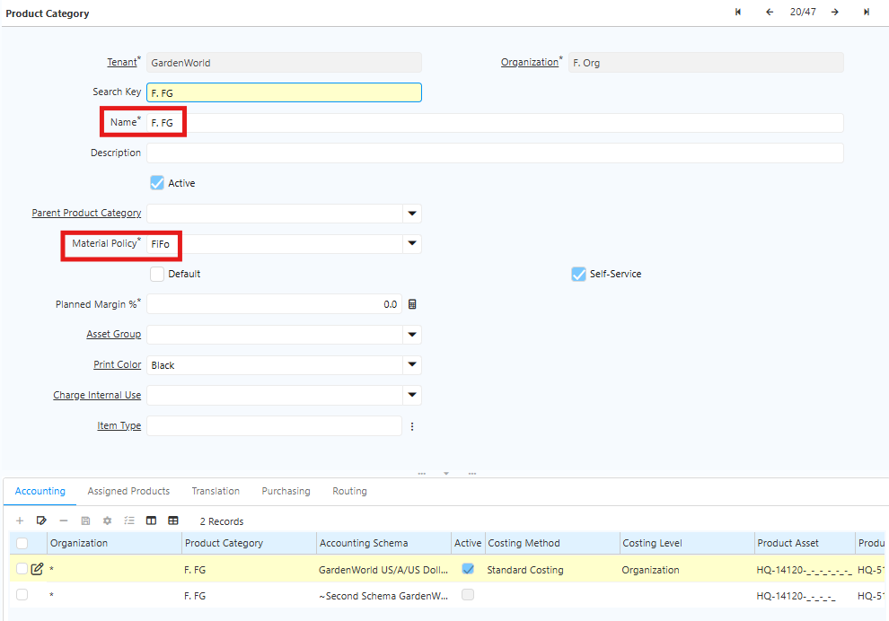 {#Figure40}

5. Masuk ke tab **Accounting**
6. Klik **Accounting Schema**
7. Pilih **Costing Method** dan **Costing Level** sesuai kebijakan perusahaan

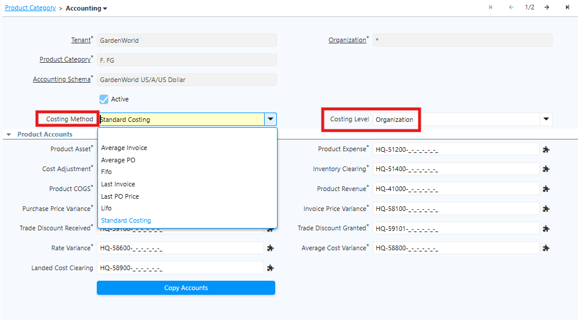 {#Figure41}

8. Klik **Save**

## Implementasi Penggunaan Costing

### Finished Goods & Semi Finished Goods

Tim PSI merekomendasikan penggunaan Standard Costing untuk Finished Goods dan Semi Finished Goods. Metode ini:

- Sudah menjadi praktik umum di sistem manufaktur
- Mengacu pada blueprint costing perusahaan
- Membantu menjaga akurasi laporan keuangan
- Mempermudah kontrol dan evaluasi biaya produksi
### Raw Material

Tim PSI merekomendasikan penggunaan Average Cost untuk Raw Material.

Metode ini dinilai cukup karena perubahan harga bahan baku biasanya tidak menghasilkan selisih biaya yang signifikan.
### Sub-Contracting

Proses subcontracting dapat menggunakan:
- Standard Costing
- Average Costing

Pemilihan metode mengikuti kebijakan perusahaan. Pada proses subcontracting:
- Sistem akan membuat movement dari warehouse internal ke warehouse subcontractor.
- Sistem juga akan membuat jurnal internal use secara otomatis di belakang proses transaksi.

## Tujuan Penggunaan Standar Costing

Penggunaan Standard Costing membantu perusahaan:
- Mengendalikan koreksi HPP atau costing
- Mengurangi kesalahan operasional
- Mempermudah proses monitoring biaya

Dengan minimnya koreksi costing, perusahaan dapat menyusun laporan keuangan dalam kurun waktu yang lebih cepat dan lebih stabil. 

## Create Costing Product Baru

Di iDempiere, terdapat mekanisme untuk membuat costing atas product baru yang belum memiliki riwayat transaksi maupun stok di gudang. Saat product baru dibuat, cost untuk product tersebut belum tersedia. Gunakan menu **SIS Create Costing Record** untuk membuat costing pada product baru tersebut. Costing yang terbentuk mengikuti nilai **Initial HPP Value** yang dikonfigurasi di master product.

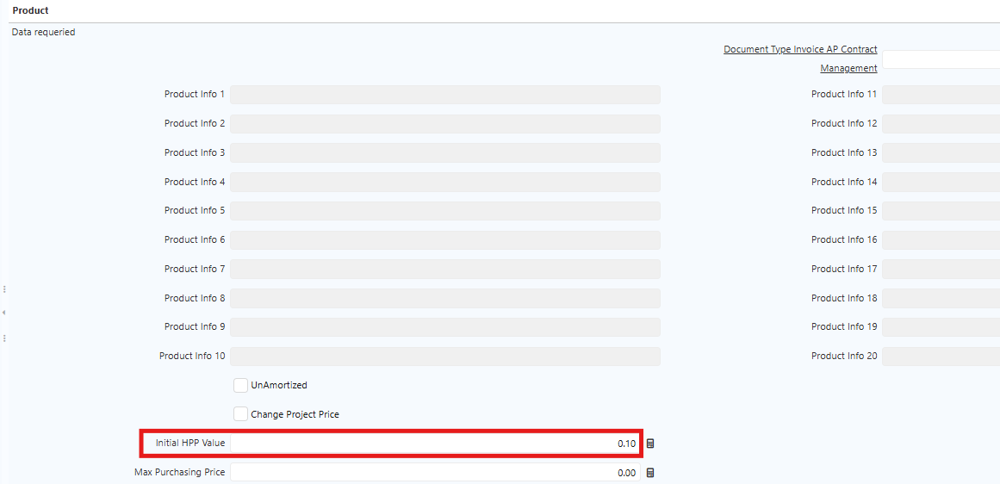 {#Figure281}

Saat membuat product baru, sistem secara default mengisi **Initial HPP Value** dengan nilai **0.10**. Jika belum dikonfigurasi ulang, sistem akan menggunakan nilai tersebut saat proses create costing dijalankan.

Ikuti langkah berikut untuk membuat costing pada product baru:

1. Buka menu **SIS Create Costing Record**.
2. Tentukan **product** yang akan diproses.
3. Klik **OK**.

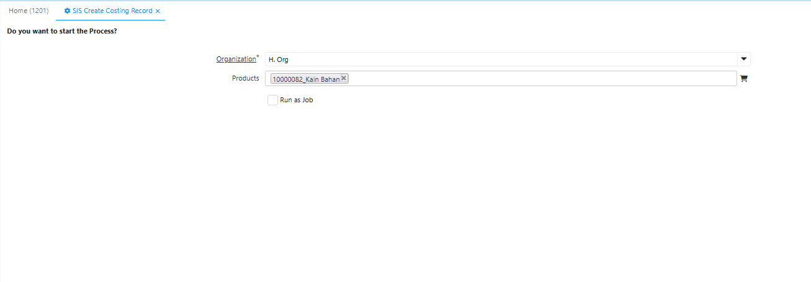 {#Figure282}

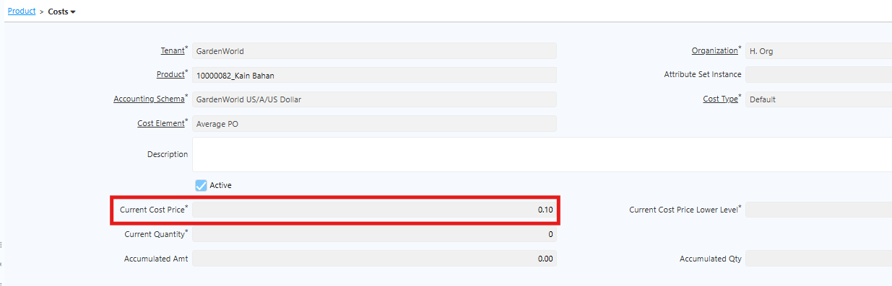 {#Figure283}

Sistem otomatis membuat costing pada product tersebut sesuai Initial HPP Value. Setelah costing terbentuk, jika dilakukan **inventory adjustment** positif maupun negatif, jurnal akan ter-posting dengan nilai sesuai cost yang telah dikonfigurasi.

## Costing Average PO Level Organization pada Product dengan ASI

Pada iDempiere, metode costing Average PO mendukung dua pilihan Costing Level, yaitu Organization dan Batch/Lot.

- Costing Level Organization → Sistem menghitung cost pada level organisasi.
- Costing Level Batch/Lot → Sistem menghitung cost berdasarkan batch/lot atau ASI.

Pada kondisi tertentu, product menggunakan **Costing Level Organization**, tetapi product tersebut juga memiliki **ASI (Attribute Set Instance)**. Dalam kondisi ini, sistem membentuk costing berdasarkan organisasi dengan nilai cost dihitung rata-rata berdasarkan transaksi pembelian.

Contoh berikut menjelaskan proses pembelian product dengan metode costing Average PO, Costing Level Organization, menggunakan ASI, dan menerapkan Minimum Order Quantity (MOQ) sebesar 100 kilogram.

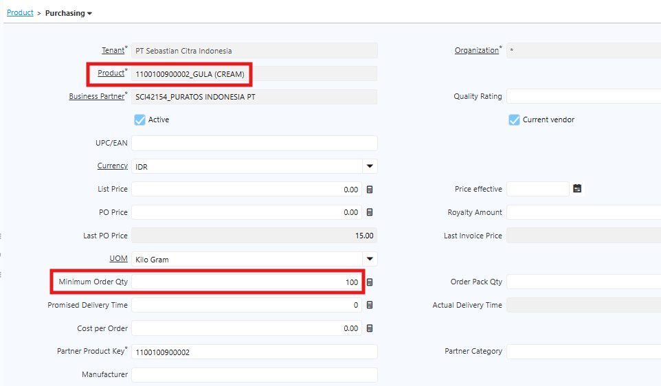 {#Figure343}
### Requisition

User membuat Requisition sebagai permintaan pembelian product. Pada contoh ini, user menginput quantity sebesar 90 kilogram, sedangkan MOQ product adalah 100 kilogram.

Langkah-langkah membuat Requisition:

1. Buka menu **Requisition**.
2. Tentukan **Document Type**.
3. Tentukan tanggal transaksi.
4. Tentukan **Warehouse**.
5. Masuk ke tab **Requisition Line**.
6. Tentukan **Business Partner**.
7. Pilih **Product** yang akan diproses.
8. Input **Qty** contoh sebesar 90 kilogram.

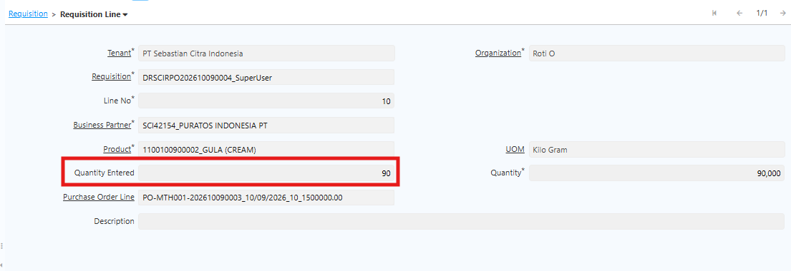 {#Figure344}

9. Klik **Save**.
10. Klik **Complete**.
### Generate PO From Requisition

Setelah Requisition selesai diproses, user dapat membuat Purchase Order melalui fitur SIS Generate PO From Requisition. Langkah-langkahnya:

1. Buka menu **SIS Generate PO From Requisition**.
2. Masukkan nomor dokumen Requisition.
3. Pilih Requisition Line yang akan diproses.
4. Klik **Requery**.
5. Tentukan **Target Document Type** untuk Purchase Order.
6. Tentukan **Tax**.
7. Klik **SIS Generate PO From Requisition**.

Sistem akan membuat Purchase Order secara otomatis. Karena product memiliki MOQ sebesar 100 kilogram, quantity pada PO Line akan mengikuti MOQ tersebut, meskipun quantity pada Requisition hanya 90 kilogram.
### Purchase Order

Setelah sistem membuat Purchase Order, user perlu memeriksa quantity dan harga sebelum menyelesaikan transaksi. Langkah-langkahnya:

1. Buka menu **Purchase Order**.
2. Cari Purchase Order yang terbentuk dari proses generate sebelumnya.
3. Masuk ke tab **PO Line**.
4. Verifikasi **Qty Ordered** sebesar 100 kilogram dan harga product.

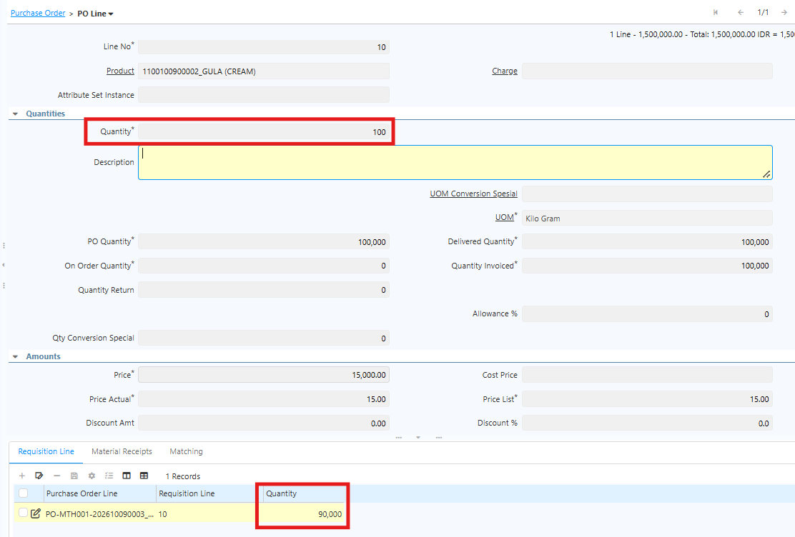 {#Figure345}

5. Klik **Save**.
6. Klik **Complete**.

### Material Receipt

Setelah Purchase Order selesai diproses, user dapat melakukan penerimaan barang melalui Material Receipt. Langkah-langkahnya:

1. Buka menu **Material Receipt**.
2. Klik **New**.
3. Masukkan nomor dokumen Purchase Order.
4. Klik **Create Lines From**.
5. Pilih PO Line yang akan diterima.
6. Klik **OK**.
7. Masuk ke tab **Receipt Line**.
8. Verifikasi product dan quantity yang akan diterima.
9. Klik **Setting**.
10. Klik **SIS Generate Distribute Attribute**, lalu tentukan batch yang akan diproses.

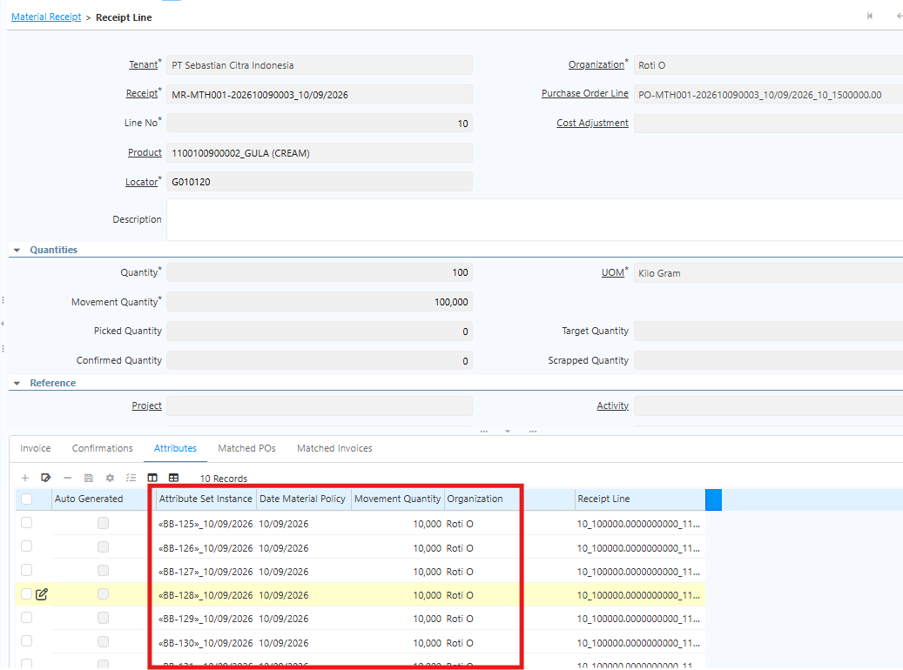 {#Figure346}

11. Klik **Save**.
12. Klik **Complete**.

Setelah user menyelesaikan Material Receipt, sistem akan membentuk data costing menggunakan metode Average PO dengan Costing Level Organization. Sistem membentuk costing pada level organisasi, sedangkan stock pada locator tetap tercatat berdasarkan ASI. Organisasi pada data costing mengikuti organisasi yang digunakan pada dokumen Material Receipt, sementara nilai cost mengikuti nilai transaksi Purchase Order.

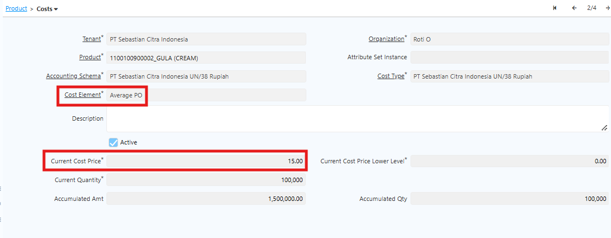 {#Figure347}

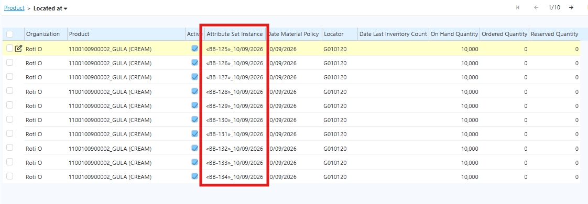 {#Figure348}

Dengan demikian, sistem dapat memproses product yang menggunakan ASI dan menerapkan MOQ pada proses pembelian meskipun Costing Level dikonfigurasi pada Organization.