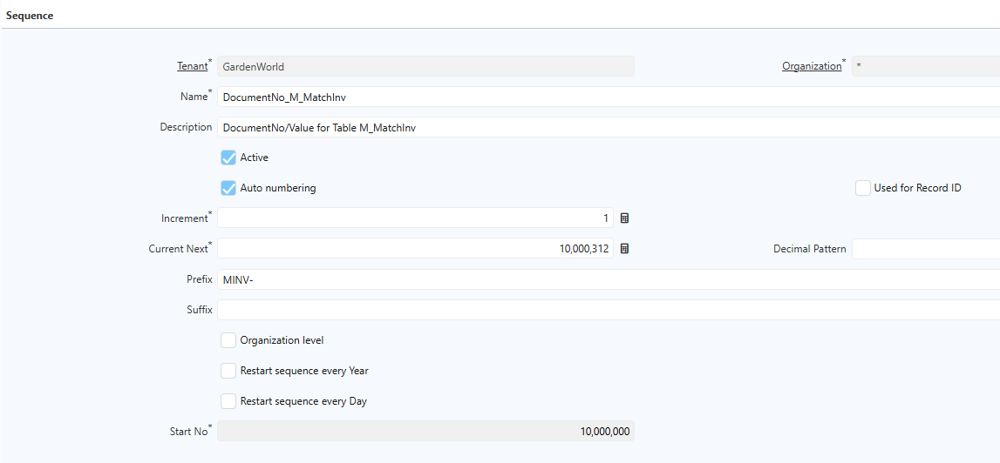
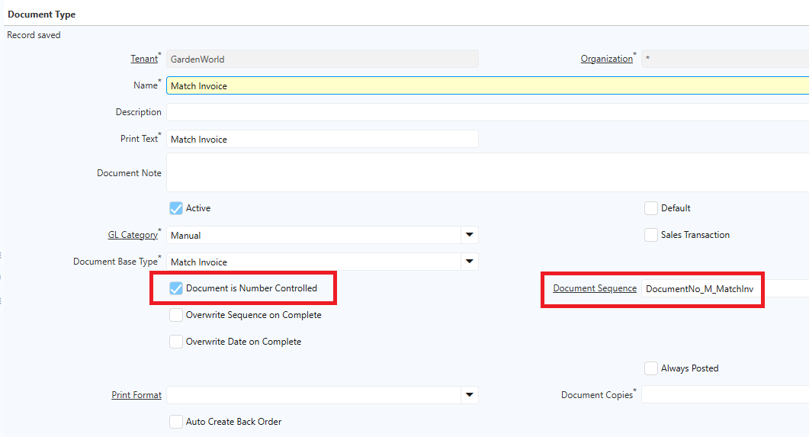
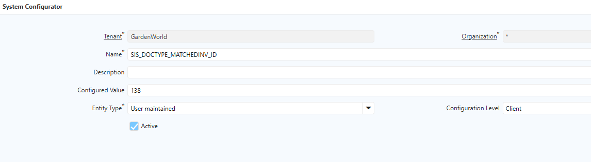
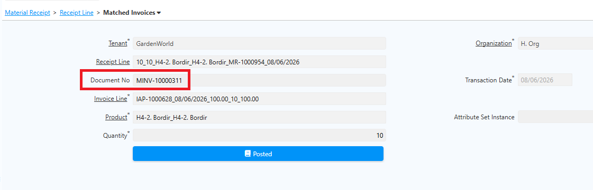

# Document Sequence

Document Sequence adalah konfigurasi yang digunakan untuk menghasilkan nomor dokumen secara otomatis pada setiap transaksi di iDempiere. Setiap nomor dokumen bersifat unik dan mengikuti format yang telah ditentukan perusahaan.

Nomor dokumen dapat disesuaikan melalui konfigurasi **Prefix**, **Suffix**, dan **Start No**, sehingga setiap jenis transaksi memiliki penomoran yang berbeda. Setiap Document Type dapat menggunakan Document Sequence yang berbeda. Saat user membuat transaksi, sistem membaca Document Type yang dipilih dan mengambil Document Sequence yang dikonfigurasi pada Document Type tersebut.
## Konfigurasi Document Sequence

1. Buka menu **Document Sequence**.
2. Centang field **Auto Numbering**.
3. Isi field berikut:
- **Prefix** — Awalan nomor dokumen yang muncul sebelum angka.
- **Suffix** — Akhiran nomor dokumen.
- **Increment** — Penambahan angka setiap kali nomor baru di-generate.
- **Start No** — Angka awal sequence, akan bertambah setiap dokumen baru dibuat.
- **Decimal Pattern** — Format padding angka. Contoh: _000_ menghasilkan 000, 001, dan seterusnya.
- **Restart Sequence Every Year** — Merestart penomoran setiap tahun.
- **Restart Sequence Every Month** — Merestart penomoran setiap bulan.
- **Restart Sequence Every Day** — Merestart penomoran setiap hari.
- **Date Column** — Input tanggal masing-masing dokumen.

 {#Figure216}

4. Klik **Save**.
## Konfigurasi di Document Type

1. Buka menu **Document Type**.
2. Cari document type yang akan diproses.
3. Centang field **Document is Number Controlled**.
4. Pada field **Document Sequence**, pilih Document Sequence yang telah dikonfigurasi.

 {#Figure217}

5. Klik **Save**.
## Konfigurasi Sistem

1. Buka menu **System Configurator**.
2. Klik **New**.
3. Isi **Name** dengan **SIS_DOCTYPE_MATCHEDINV_ID**.
4. Pada field **Configured Value**, pilih dokumen Matched Invoice yang akan dikonfigurasi.
5. Pada field **Configuration Level**, pilih **Client**.

 {#Figure218}

6. Klik **Save**.

## Implementasi Document Sequence

Setelah konfigurasi selesai, setiap transaksi yang menggunakan Document Type tersebut akan memperoleh nomor dokumen secara otomatis sesuai Document Sequence yang dipilih. Berikut contoh implementasi document number pada transaksi:

 {#Figure219}