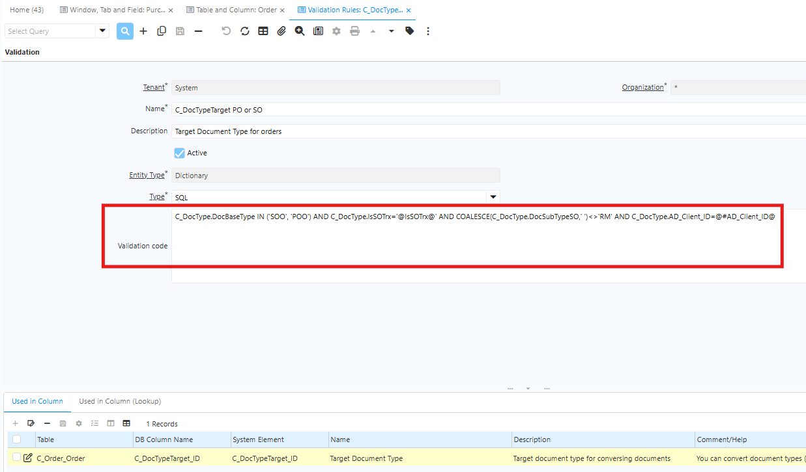
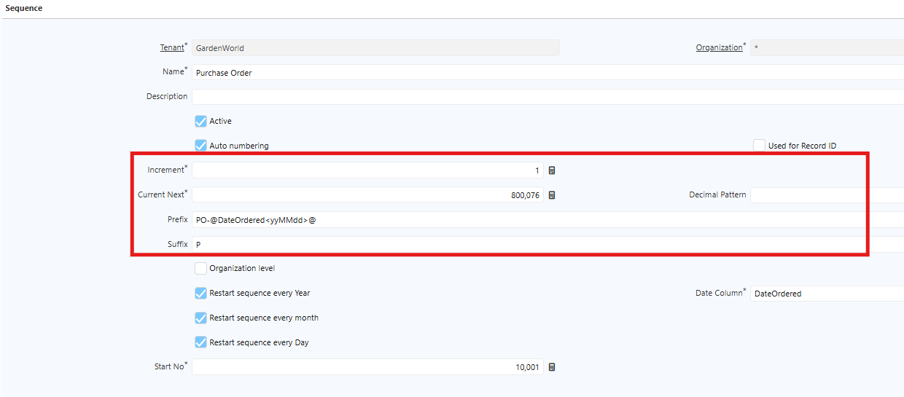
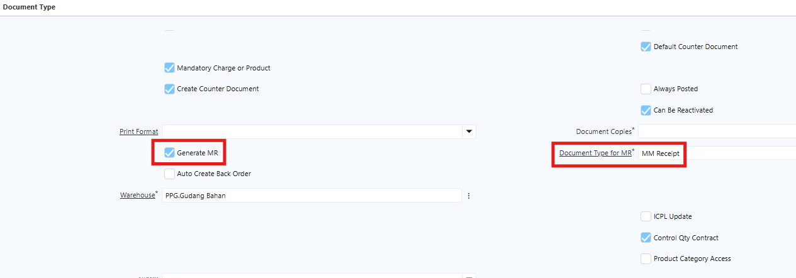
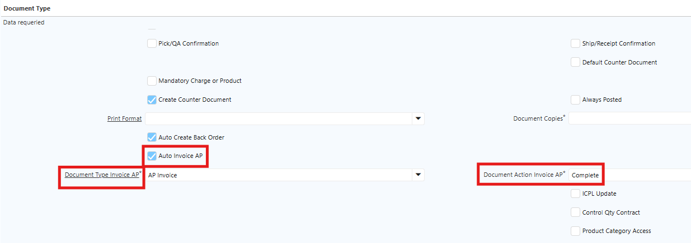
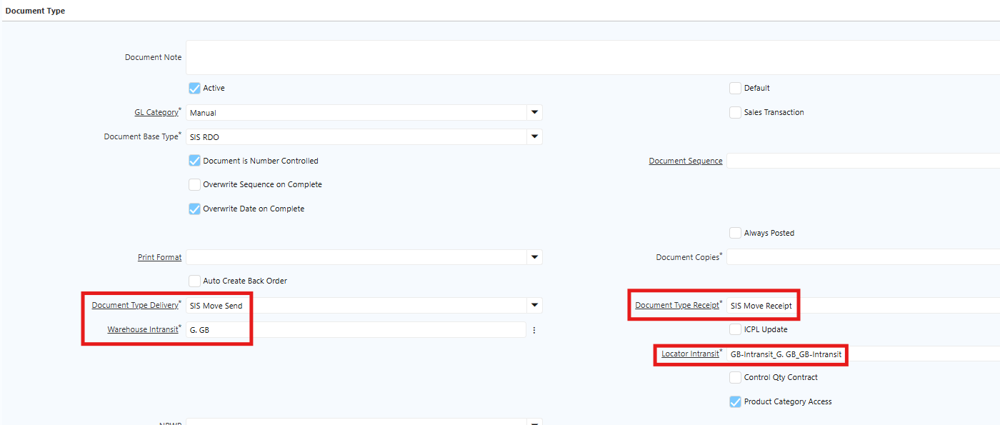

# Document Type

Document Type adalah konfigurasi yang mendefinisikan perilaku sebuah dokumen transaksi — seperti Purchase Order, Sales Invoice, Payment, dan sebagainya. Setiap dokumen di iDempiere memiliki tipe yang mengontrol:

- Nomor dokumen (sequence/auto-numbering)
- Alur persetujuan (DocAction)
- Jurnal akuntansi yang dihasilkan

Di iDempiere, terdapat tiga lapisan yang berbeda namun saling terkait:

- Document Base Type — Lapisan sistem iDempiere yang tidak dapat ditambah atau diubah oleh pengguna. Document Base Type menentukan kategori utama suatu dokumen
- Document Type — Lapisan konfigurasi yang dibuat dan dikustomisasi oleh admin per organisasi, dan selalu terhubung ke salah satu Document Base Type. Document type menentukan konfigurasi operasional dokumen.
- Document Sub Type — Lapisan ketiga dalam hierarki dokumen iDempiere, yang berada di bawah Document Base Type dan Document Type. Document Sub Type menentukan fungsi dan perilaku spesifik dari dokumen yang berada dalam kategori yang sama.

Document Sub Type mengendalikan logika bisnis yang lebih spesifik, seperti perlakuan akuntansi, pergerakan persediaan, serta jurnal akuntansi yang dihasilkan. Field ini hanya tersedia pada Document Base Type yang mendukung penggunaan sub type. Apabila suatu Document Base Type tidak memiliki sub type, maka field ini akan kosong dan tidak memengaruhi proses transaksi.

Sebagai contoh, Material Physical Inventory memiliki tiga Document Sub Type, yaitu:

- Cost Adjustment digunakan untuk melakukan penyesuaian nilai persediaan atau revaluasi Harga Pokok Persediaan (HPP) tanpa mengubah kuantitas stok.
- Internal Use Inventory digunakan untuk mencatat pengeluaran persediaan untuk kebutuhan internal perusahaan.
- Physical Inventory digunakan untuk mencatat hasil stock opname dan menyesuaikan kuantitas persediaan berdasarkan kondisi fisik di gudang.

Ketiga Document Sub Type tersebut menggunakan Document Base Type yang sama, yaitu Material Physical Inventory, namun masing-masing menjalankan fungsi bisnis yang berbeda. Oleh karena itu, setiap sub type menerapkan logika proses, perlakuan akuntansi, dan jurnal yang berbeda sesuai dengan tujuan transaksinya. 

Berikut Document Base Type yang telah terdefinisi di sistem iDempiere:

| Name                        | Value |
| --------------------------- | ----- |
| AP Credit Memo              | APC   |
| AP Invoice                  | API   |
| AP Payment                  | APP   |
| AR Credit Memo              | ARC   |
| AR Invoice                  | ARI   |
| AR Pro Forma Invoice        | ARF   |
| AR Receipt                  | ARR   |
| Bank Statement              | CMB   |
| GL Document                 | GLD   |
| GL Journal                  | GLJ   |
| ICPL                        | ICP   |
| ICPL Update                 | ICU   |
| Match Invoice               | MXI   |
| Match PO                    | MXP   |
| Material Delivery           | MMS   |
| Material Movement           | MMM   |
| Material Physical Inventory | MMI   |
| Material Production         | MMP   |
| Material Receipt            | MMR   |
| Payment Allocation          | CMA   |
| Production Order Planning   | POP   |
| Project Issue               | PJI   |
| Purchase Order              | POO   |
| Purchase Requisition        | POR   |
| Sales Order                 | SOO   |
| SIS Asset                   | AST   |
| SIS Asset Addition          | AAD   |
| SIS Contract Management     | CBT   |
| SIS MPS                     | MPS   |
| SIS Price Contract          | SPC   |
| SIS RDO                     | RDO   |
"Document Base Type"{#Tabel5}
## Konfigurasi Document Type di Sistem

1. Buka menu **Window, Tab and Field**.
2. Cari **Document Type** yang akan dikonfigurasi.
3. Masuk ke tab **Tab**.
4. Masuk ke **Field**, kemudian cari Document Base Type atau Target Document Type.
5. Klik tab **Column**.
6. Klik **Dynamic Validation** — pada Validation Code akan tertera Document Base Type yang terhubung ke Document Type tersebut.

 {#Figure110}

7. Klik **save**

Saat user membuat Document Type baru dan memilih Base Type, sistem otomatis mewarisi sejumlah perilaku dari Base Type tersebut yang tidak dapat diubah di level Document Type. Satu Base Type dapat memiliki banyak Document Type, namun satu Document Type hanya boleh memiliki satu Base Type.
## Header Document Type

Berikut penjelasan field yang terdapat pada header Document Type:

1. Name — Nama Document Type yang muncul di dropdown saat user membuat dokumen transaksi. Contoh: Purchase Order, Material Movement.
2. Document Base Type — Tipe dasar dokumen. Wajib diisi. Menentukan logika akuntansi, alur DocAction, dan form yang digunakan. Tidak dapat diubah setelah record disimpan.
3. Sales Transaction — Menandakan transaksi ke customer (sisi AR/Sales). Biarkan _unchecked_ untuk transaksi ke vendor (sisi AP/Purchase).
4. Default — Menjadikan Document Type ini sebagai default untuk Base Type-nya. Hanya satu yang boleh dicentang per kategori per organisasi.
5. Document Sequence — Sequence penomoran yang digunakan untuk menghasilkan nomor dokumen otomatis. Dikonfigurasi di menu Sequence.
6. Definite Sequence — Sequence kedua yang digunakan saat dokumen berstatus _Completed_. Berguna jika nomor draft berbeda dengan nomor dokumen final.
7. GL Category — Kategori General Ledger untuk pengelompokan jurnal di laporan GL. Wajib diisi untuk Base Type yang menghasilkan posting akuntansi.
8. Document Number Controlled — Jika dicentang, nomor dokumen dikontrol penuh oleh system sequence dan tidak dapat diedit manual.
9. Overwrite Sequence on Complete — Menentukan apakah sequence akan ditimpa ulang saat dokumen dinyatakan selesai.
10. Overwrite Date on Complete — Mengizinkan sistem mengubah tanggal transaksi menjadi tanggal penyelesaian secara otomatis saat status berubah menjadi _Complete_.
11. Create Counter Document — Untuk dokumen antar-organisasi (_intercompany_). Jika dicentang, sistem otomatis membuat dokumen balasan di organisasi lain saat dokumen dibuat.
12. Counter Document Type — Menentukan tipe dokumen yang di-generate di organisasi lawan.
13. Document Copies — Jumlah salinan yang dicetak secara default saat dokumen ini dicetak.
14. Print Format — Format cetak default yang digunakan saat mencetak dokumen.
15. Product Access — Membatasi produk secara spesifik yang dapat diproses dalam suatu transaksi.
16. Product Category Access — Membatasi produk yang dapat diproses berdasarkan kategori produk yang dikonfigurasi di level Product Category.

Header Document Type juga memiliki field **Auto Back Order**. Field ini berfungsi memisahkan pesanan yang belum terpenuhi akibat stok kosong menjadi dokumen baru secara otomatis, sehingga sisa pesanan tetap tercatat dan dapat diproses segera setelah stok tersedia.
## Setup Auto Sequence Number (Penomoran Otomatis)

Penomoran otomatis dokumen di iDempiere dikelola melalui mekanisme Sequence yang terhubung ke Document Type. Ikuti langkah berikut untuk melakukan konfigurasi:

1. Buka **Document Type** yang akan diproses
2. Klik field **Document Sequence**
3. Isi field-field berikut:
  - **Name** — Nama sequence
  - **Prefix** — Awalan nomor dokumen yang muncul sebelum angka
  - **Suffix** — Akhiran nomor
  - **Increment** — Penambahan angka setiap kali nomor baru digenerate
  - **Start No** — Angka awal sequence. Akan increment setiap dokumen baru
  - **Decimal Pattern** — Format padding angka, contoh 000 akan menghasilkan 000, 001, dan seterusnya.
  - **Restart sequence every year** — merestart penomoran setiap tahun.
  - **Restart sequence every month** — merestart penomoran setiap bulan.
  - **Restart sequence every day** — merestart penomoran setiap hari.
  - **Date Column** — Input DateOrdered

 {#Figure111}

4. Centang field **Auto Numbering**.
5. Klik **save**
## Setup Auto Generate Material Receipt

Material Receipt (MR) adalah dokumen yang mencatat penerimaan barang fisik dari vendor. MR dapat di-generate langsung dari Purchase Order yang sudah berstatus _Completed_. Ikuti langkah berikut untuk mengkonfigurasi auto generate Material Receipt:

1. Buka document type **Purchase Order**
2. Centang field **Generate MR** — field **Document Type for MR** akan muncul secara otomatis.
3. Pilih **Document Type for MR** sesuai kebutuhan perusahaan

 {#Figure112}

4. Klik save

Saat Purchase Order di-complete, sistem otomatis men-generate Material Receipt dengan status _Draft_. Dokumen tersebut dapat diverifikasi dan di-complete jika sudah sesuai.
## Setup Auto Invoice dari Material Receipt

Fitur Auto Invoice memungkinkan sistem membuat **AP Invoice** secara otomatis saat Material Receipt (MR) di-complete, tanpa input manual dari pengguna. Ikuti langkah berikut untuk melakukan konfigurasi:

1. Buka menu Document Type **Material Receipt**.
2. Centang field **Auto Invoice AP** untuk mengaktifkan auto-generation invoice.
3. Pada field **Document Type Invoice AP** yang muncul, pilih document type invoice yang sesuai.
4. Pada field **Document Action Invoice AP**, pilih document action untuk menentukan status invoice yang ter-generate — _Draft_ atau _Complete_.

 {#Figure113}

5. Klik save.

## Document Type SIS RDO

RDO adalah dokumen yang digunakan untuk mendistribusikan dan mengalokasikan permintaan barang ke warehouse tujuan masing-masing. Dokumen **SIS RDO** memiliki beberapa field khusus yang hanya tersedia pada dokumen ini, yaitu:

1. **Document Type Delivery** — Mencatat barang keluar dari gudang asal.
2. **Document Type Receipt** — Mencatat penerimaan barang dari vendor.
3. **Warehouse Intransit** — Gudang penerima barang dari gudang asal.
4. **Locator Transit** — Lokasi penyimpanan di gudang penerima barang.

 {#Figure114}

Saat dokumen RDO di-complete, sistem otomatis membentuk dokumen **Delivery** dan merilis dokumen **Receipt**. Oleh karena itu, pastikan konfigurasi **Document Type** untuk Delivery dan Receipt sudah dilakukan sebelum memproses RDO.