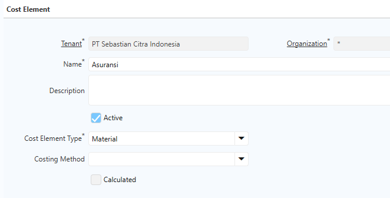
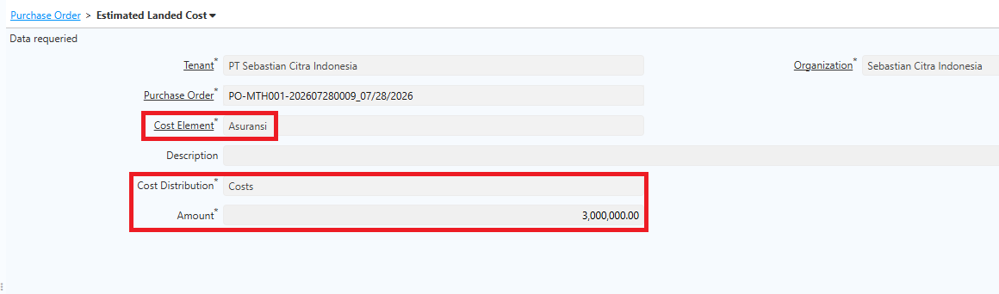
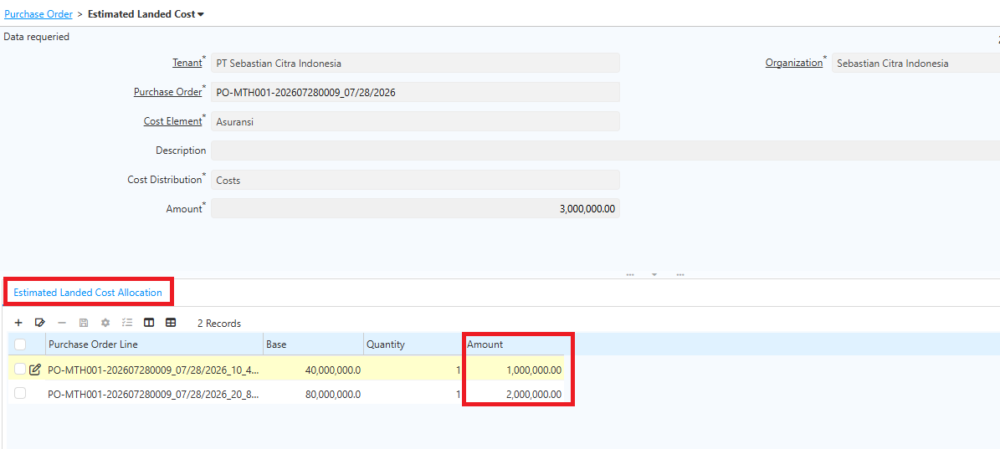
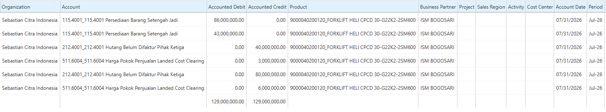
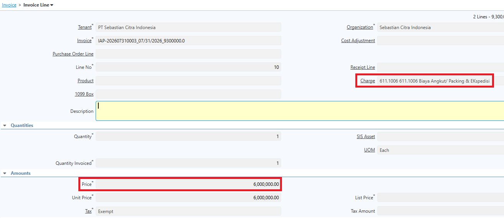
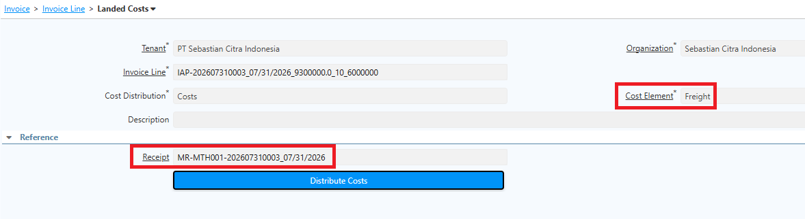
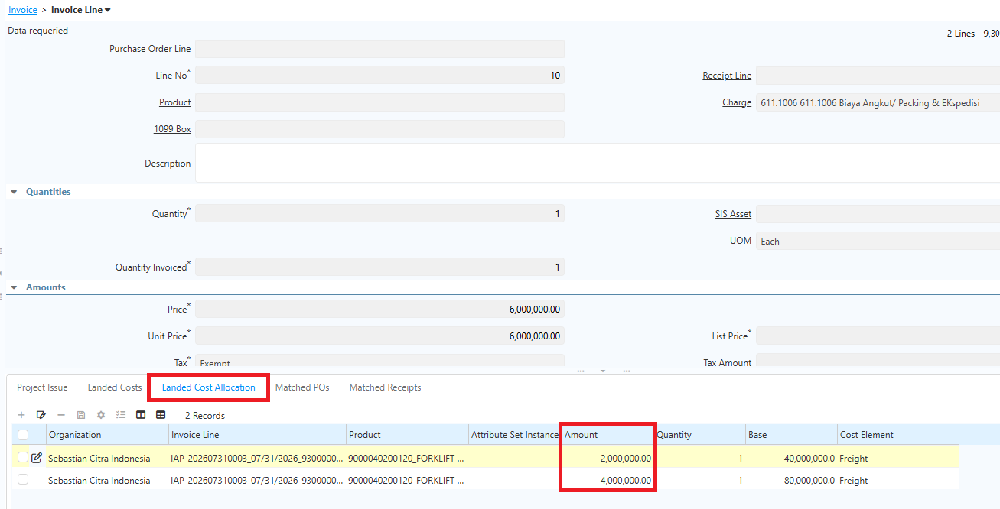
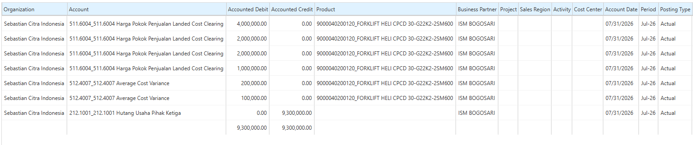

# Estimated Landed Cost

Estimated Landed Cost digunakan untuk memperkirakan biaya tambahan yang akan timbul selama proses pengadaan barang. Estimasi ini dimasukkan sejak pembuatan Purchase Order (PO) sehingga perusahaan dapat memperkirakan total biaya perolehan barang sebelum seluruh biaya aktual diterima.

Estimated Landed Cost bersifat estimasi sehingga nilainya masih dapat berubah. Setelah seluruh biaya aktual diterima, perusahaan tetap harus melakukan proses **Landed Cost Allocation** agar biaya perolehan barang disesuaikan dengan nilai yang sebenarnya.

## Komponen Estimated Landed Cost

Nilai Estimated Landed Cost dapat berasal dari berbagai biaya yang diperkirakan muncul selama proses pengadaan, antara lain:

- Biaya pengiriman (_Freight_)
- Biaya asuransi pengiriman
- Bea masuk
- Biaya _handling_ atau bongkar muat
- Biaya ekspedisi
- Biaya administrasi impor
- Biaya _forwarding_
- Biaya lain yang berkaitan langsung dengan pengadaan barang

Besarnya estimasi dapat ditentukan berdasarkan pengalaman transaksi sebelumnya, penawaran dari vendor jasa logistik, atau perhitungan internal perusahaan.
## Konfigurasi Cost Element

Sebelum menentukan Landed Cost, buat **Cost Element** terlebih dahulu. Ikuti langkah berikut:

1. Buka menu **Cost Element**.
2. Input **Name** cost.
3. Pada field **Cost Element Type**, pilih **Material**.
4. Pada field **Costing Method**, biarkan kosong (_blank_).

 {#Figure190}

5. Klik **Save**.

Cost Element adalah jenis biaya yang akan dipasang di Estimated Landed Cost.
## Mekanisme Estimated Landed Cost

1. Buka menu **Purchase Order**.
2. Buat PO seperti biasa.
3. Masuk ke tab **Estimated Landed Cost**.
4. Tentukan **Cost Element** — jenis biaya yang akan ditambahkan ke nilai barang yang dibeli.
5. Pada field **Cost Distribution**, pilih metode distribusi biaya sesuai nilai pembelian.
6. Tentukan **Amount Cost** — nilai perkiraan biaya yang akan ditambahkan ke barang yang dibeli.

 {#Figure191}

7. Klik **Save**.
8. Ulangi langkah 4–7 untuk biaya lainnya.
9. Klik **Complete** pada dokumen Purchase Order.

Setelah PO di-complete, **Estimated Landed Cost Allocation** pada masing-masing cost element terisi otomatis sesuai perhitungan sistem. 

 {#Figure192}

Selanjutnya, proses **Complete Material Receipt (MR/BPB)**. Saat MR di-complete, sistem membentuk jurnal atas MR sesuai PO. Karena terdapat tambahan Estimated Landed Cost, jurnal yang terbentuk di MR mencakup jurnal **Clearing Landed Cost** dan penambahan nilai persediaan. Berikut contoh jurnal atas PO dengan Estimated Landed Cost:

 {#Figure193}
### Realisasi Landed Cost

Karena Landed Cost bersifat estimasi, invoice yang terbentuk atas PO tersebut sesuai dengan total amount PO tanpa landed cost. Realisasi landed cost dibuat pada invoice yang berbeda secara manual. Ikuti langkah berikut:

1. Buka menu **Purchase Invoice and Credit/Debit Note**.
2. Input **Business Partner** sesuai PO.
3. Masuk ke **Invoice Line**.
4. Tentukan **Charge** sesuai landed cost.
5. Input **biaya aktual** atas cost tersebut.

 {#Figure194}

6. Masuk ke tab **Landed Cost**.
7. Pada field **Cost Element**, tentukan cost element yang sebelumnya diproses di PO.
8. Pada field **Receipt**, input nomor MR yang sebelumnya diproses.

 {#Figure195}

9. Klik **Complete** pada dokumen Invoice.

Setelah Invoice di-complete, **Landed Cost Allocation** pada masing-masing cost element terisi otomatis sesuai perhitungan sistem.

 {#Figure196}

Jika terdapat selisih antara Estimated Landed Cost dan realisasi biaya, sistem membentuk **jurnal variance** pada jurnal invoice. Berikut contoh jurnalnya:

 {#Figure197}