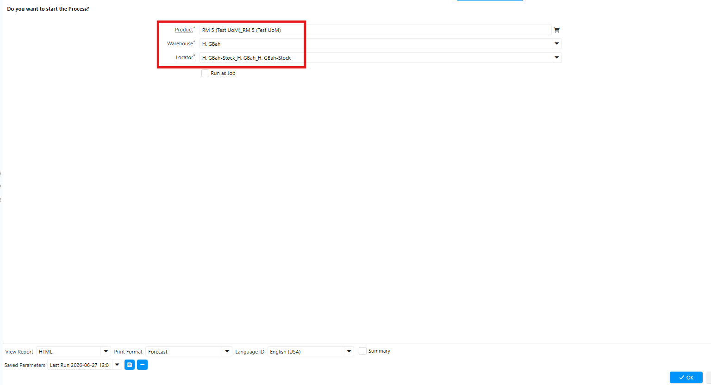
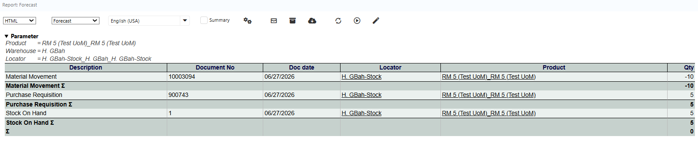

# Forecast Report

Forecast report adalah laporan yang menampilkan stok di gudang/locator, asal transaksi, dan movement antar gudang. Ikuti langkah berikut untuk mengakses Forecast Report di iDempiere:

1. Buka menu SIS Forecast Report
2. Pilih Product yang akan dicek.
3. T Warehouse yang akan diperiksa.
4. Tentukan Locator atau lokasi penyimpanan produk di dalam warehouse.

 {#Figure 94}

5. Klik Ok

Sistem menampilkan informasi ketersediaan stock produk sesuai kriteria yang dipilih, meliputi data produk pada warehouse dan locator yang ditentukan. 

 {#Figure 95}

Forecast report menyediakan informasi Stock On Hand, Purchase Requisition, dan Material Movement untuk membantu user memantau ketersediaan material, kebutuhan pembelian, serta penggunaan material di gudang.
## Stock On Hand

Stock On Hand menampilkan jumlah stok material yang tersedia di gudang secara aktual. Sistem akan memperbarui jumlah stok secara otomatis setiap kali terjadi transaksi yang memengaruhi persediaan, seperti:

- Penerimaan barang (Material Receipt)
- Pengeluaran material untuk produksi (Material Movement)
## Purchase Requisition

Purchase Requisition mencatat kebutuhan pembelian material yang tidak dapat dipenuhi oleh stok yang tersedia di gudang.

Purchase Requisition merupakan dasar bagi tim Purchasing untuk melanjutkan proses pengadaan melalui Purchase Order. Dengan demikian, perusahaan dapat memastikan ketersediaan material sesuai kebutuhan operasional dan produksi.
## Material Movement

Material Movement mencatat setiap perpindahan atau penggunaan material di dalam gudang, termasuk pengeluaran material untuk proses produksi.

Setiap transaksi Material Movement akan memperbarui jumlah Stock On Hand secara otomatis sesuai dengan jenis perpindahan yang dilakukan. Oleh karena itu, informasi ini dapat digunakan untuk menelusuri riwayat penggunaan maupun perpindahan material.
## Informasi Summary Stock

Kolom Summary menampilkan total stok material yang masih tersedia di gudang.

- Summary > 0 menunjukkan bahwa material masih tersedia di gudang dan belum seluruhnya digunakan.
- Summary = 0 menunjukkan bahwa seluruh stok material di gudang telah digunakan untuk proses produksi atau telah dikeluarkan melalui transaksi Material Movement, sehingga tidak ada stok yang tersisa.

Apabila nilai Summary = 0, user perlu memastikan ketersediaan material sebelum melanjutkan proses produksi. Jika material masih dibutuhkan, buat Purchase Requisition untuk memulai proses pengadaan dan lakukan penerimaan barang (Material Receipt) agar stok kembali tersedia di gudang.

Dengan memantau informasi Stock On Hand, Purchase Requisition, Material Movement, dan Summary, user dapat mengendalikan ketersediaan material secara lebih efektif, memonitor penggunaan stok, serta memastikan proses produksi berjalan tanpa kendala akibat kekurangan persediaan.