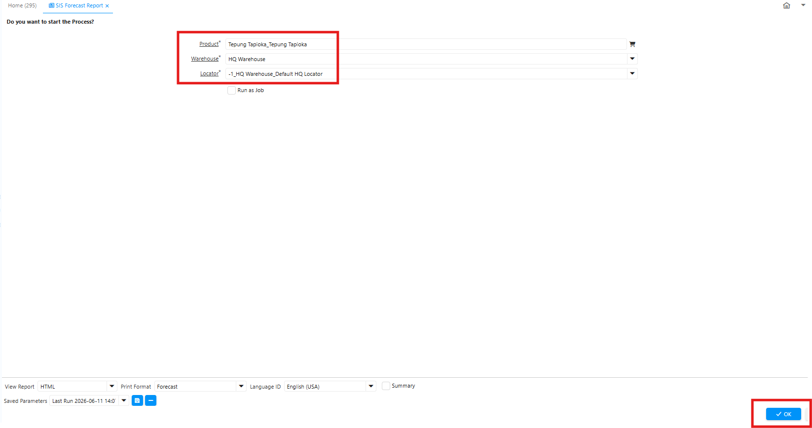
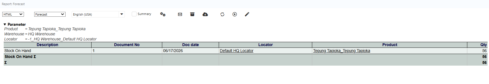

# Forecast Report

Forecast report adalah laporan yang menampilkan stok di gudang/locator, asal transaksi, dan movement antar gudang. Ikuti langkah berikut untuk mengakses Forecast Report di iDempiere:

1. Buka menu SIS Forecast Report
2. Pilih Product yang akan dicek.
3. Pilih Warehouse yang akan diperiksa.
4. Tentukan Locator atau lokasi penyimpanan produk di dalam warehouse.

 {#Figure 94}

5. Klik Ok

Sistem menampilkan informasi ketersediaan stock produk sesuai kriteria yang dipilih, meliputi data produk pada warehouse dan locator yang ditentukan. 

 {#Figure 95}