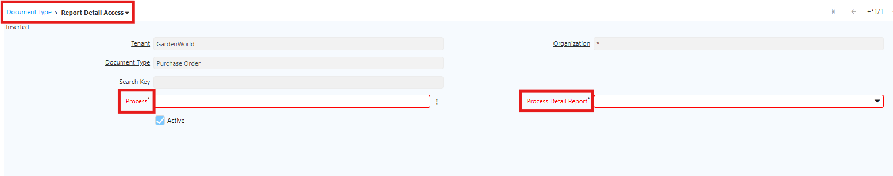

# Format Report

Satu document type dapat memiliki beberapa pilihan sub document type pada dropdown. Contoh: document type Purchase Order dapat memiliki pilihan PO General, PO Bahan Baku, PO Inventaris, PO Barang Kemas, PO Perlengkapan, dan sebagainya. Konfigurasi serupa juga dapat diterapkan pada document type lain, seperti Invoice dengan pilihan _Credit Note_, _Invoice Vendor Lain-lain, dan sebagainya.

Untuk mengatur dropdown tersebut, lakukan konfigurasi pada setiap document type yang membutuhkan.

Konfigurasi ini bertujuan untuk:

- Memisahkan penomoran dokumen.
- Menerapkan Print Format berbeda — setiap document type dapat menggunakan Print Format PDF dengan kolom, layout, atau logo yang berbeda.
- Menerapkan workflow approval berbeda — misalnya, PO Inventaris memerlukan approval lebih tinggi dibanding PO Bahan Baku.
- Memudahkan filter dan pelaporan per kategori pembelian.

## Konfigurasi Document Type

Ikuti langkah berikut untuk melakukan konfigurasi:

1. Buka menu **Document Type** yang akan dikonfigurasi, contoh: **Purchase Order**.
2. Masuk ke tab **Report Detail Access**.
3. Klik **New**.
4. Pada field **Process**, pilih proses sesuai kebutuhan perusahaan.
5. Pada field **Process Detail Report**, input report sesuai kebutuhan perusahaan.

 {#Figure101}

6. Klik **save**.

Ulangi langkah di atas untuk document type lain yang memerlukan konfigurasi serupa. Setelah konfigurasi selesai, sistem akan menampilkan pilihan-pilihan document type tersebut saat user melakukan report pada document yang bersangkutan.