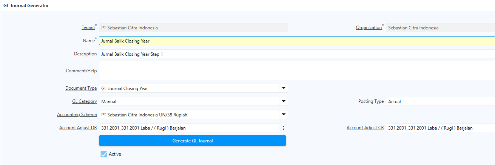
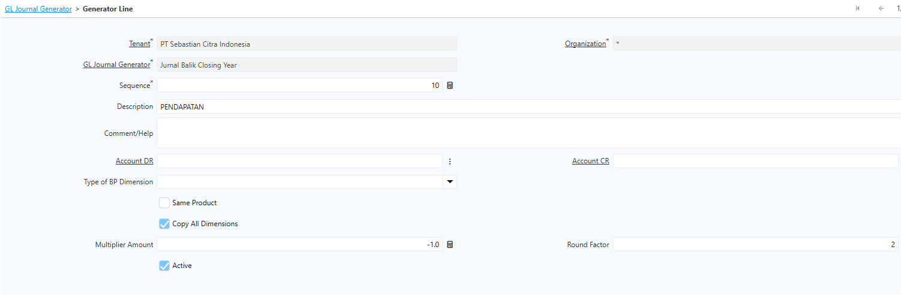
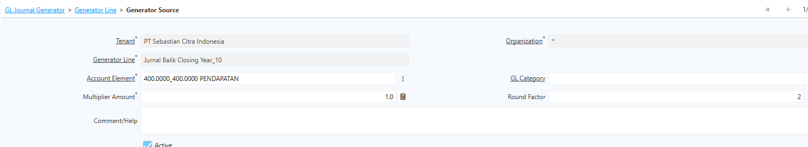
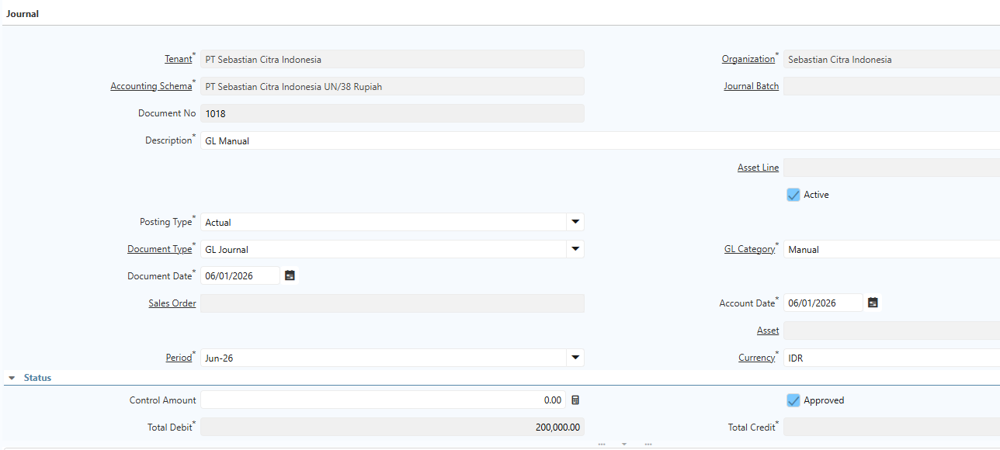
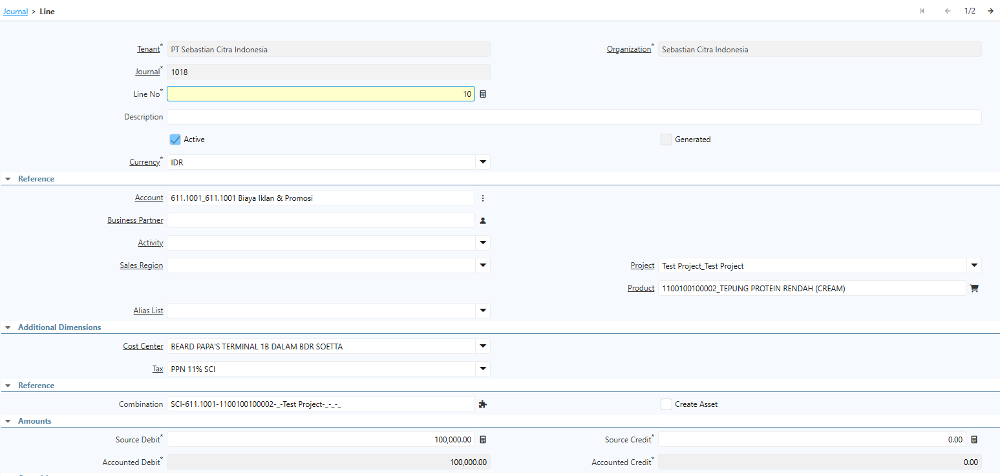

# GL Journal Generator

## Konfigurasi Adjustment Period

Sebelum menjalankan **GL Journal Generator**, buat terlebih dahulu **Adjustment Period (Periode 13)** yang digunakan khusus untuk proses penyesuaian dan jurnal penutup akhir tahun.

Lakukan konfigurasi melalui menu **Calendar and Year** dengan parameter sebagai berikut:

- **Start Date** : 31 Desember.
- **End Date** : 31 Desember.
- **Period Type** : **Adjustment**, yaitu periode khusus yang digunakan untuk proses jurnal penutup dan jurnal pembalik akhir tahun. 

Periode ini terpisah dari periode transaksi operasional sehingga jurnal penyesuaian dapat diproses tanpa memengaruhi aktivitas transaksi pada periode normal.

## GL Journal Generator

**GL Journal Generator** digunakan untuk menghasilkan jurnal penutup (closing) akhir tahun secara otomatis, sehingga saldo akun laba rugi dapat dipindahkan sesuai konfigurasi yang telah ditentukan.

Lakukan konfigurasi **GL Journal Generator** sebagai berikut:

1. Buka menu **GL Journal Generator**
2. Input field yang ada di header:
- **Name** – Nama konfigurasi GL Journal Generator.
- **Document Type** – Tipe dokumen GL Journal yang akan dihasilkan. Seluruh konfigurasi menggunakan **Document Type** yang sama, sedangkan pembeda setiap dokumen berada pada **Sequence** yang digunakan.
- **GL Category** – Pilih **Manual**.
- **Posting Type** – Pilih **Actual** untuk mengambil transaksi realisasi.
- **Accounting Schema** – Pilih skema akuntansi yang berlaku pada level **Client**.
- **Account Adjust DR** – Akun penyesuaian yang digunakan untuk jurnal pembalik sisi **Debit**.
- **Account Adjust CR** – Akun penyesuaian yang digunakan untuk jurnal pembalik sisi **Kredit**.

 {#Figure176}

3. Masuk ke **GL Generator Line**
- **Description** – Menentukan deskripsi yang akan ditampilkan pada setiap **GL Journal Line**. 
- **Copy All Dimension** – Menyalin seluruh informasi dimensi (misalnya Business Partner, Product, Project, Cost Center, dan dimensi lainnya) dari data **Accounting Fact**.
- **Multiplier Amount** – Isi **-1** agar sistem membalik seluruh nilai jurnal dari akun yang dipilih. 
- **Round Factor** – Menentukan pembulatan nilai desimal pada jurnal yang dihasilkan.    

 {#Figure177}

4. Masuk ke tab **Generate Source**
- **Account Element** – Pilih **parent account** paling atas sehingga sistem akan mengambil seluruh akun turunannya yang memiliki transaksi.
- **Multiplier Amount** – Isi **1** agar nilai transaksi digunakan tanpa perubahan.
- **Round Factor** – Menentukan pembulatan nilai hingga dua angka di belakang koma.

 {#Figure178}

5. Klik **Generate GL Journal**

Sistem akan membuat **GL Journal** berdasarkan transaksi pada periode yang dipilih. Setelah proses generate selesai, ubah **Period** pada GL Journal yang terbentuk menjadi **Adjustment Period (Periode 13)** agar jurnal penutup tercatat pada periode penyesuaian akhir tahun.

## Membuat GL Journal Manual

Selain menggunakan **GL Journal Generator**, user dapat membuat jurnal secara manual melalui menu **GL Journal** untuk mencatat transaksi yang tidak berasal dari proses otomatis sistem.

1. Buka menu **GL Journal**
2. Input field yang ada di header:
- **Description** – Keterangan atau tujuan pembuatan jurnal.
- **Posting Type** – Pilih **Actual** untuk transaksi realisasi atau **Budget** untuk pencatatan RKAP.
- **Document Type** – Pilih **GL Journal**.
- **Document Date** – Tanggal pencatatan jurnal.
- **GL Category** – Pilih **Manual**.
- **Currency** – Mata uang yang digunakan.
- **Control Amount** – Nilai kontrol untuk memastikan total debit dan kredit tetap seimbang sebelum jurnal diproses.

 {#Figure179}

3. Masuk ke tab GL Journal Line
- **Account** – Akun COA yang akan dijurnal.
- **Business Partner** – Business Partner yang terkait dengan transaksi (jika diperlukan).
- **Project** – Informasi proyek sebagai dimensi tambahan.
- **Product** – Informasi produk sebagai dimensi tambahan.
- **Cost Center** – Informasi sebagai dimensi tambahan.
- **Source Debit** – Nilai debit.
- **Source Credit** – Nilai kredit.

 {#Figure180}

Pastikan total nilai debit dan kredit seimbang sebelum dokumen diubah ke status **Completed**.
## Upload GL Journal Line

Apabila jumlah baris jurnal cukup banyak, gunakan fitur **Import GL Journal Line** untuk mempercepat proses input data.

Langkah-langkah yang dilakukan adalah sebagai berikut:

1. Lakukan **Export** untuk mengunduh template **GL Journal Line**.
2. Lengkapi data jurnal pada file template sesuai format yang telah disediakan.
3. Klik **Import**, kemudian pilih file yang akan diproses.    
4. Sistem akan mengimpor seluruh data ke **GL Journal Line**. Pastikan seluruh data berhasil diimpor tanpa error sebelum jurnal diproses ke status **Completed**.