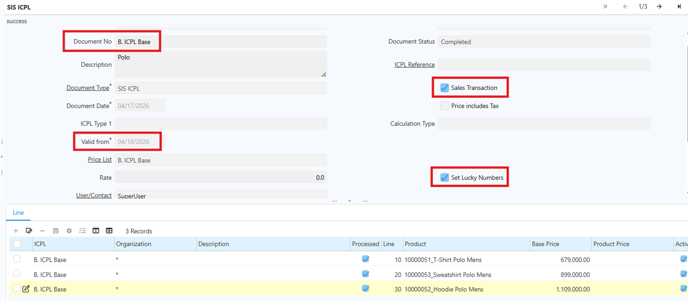
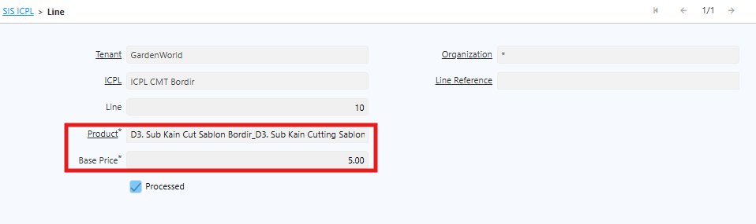
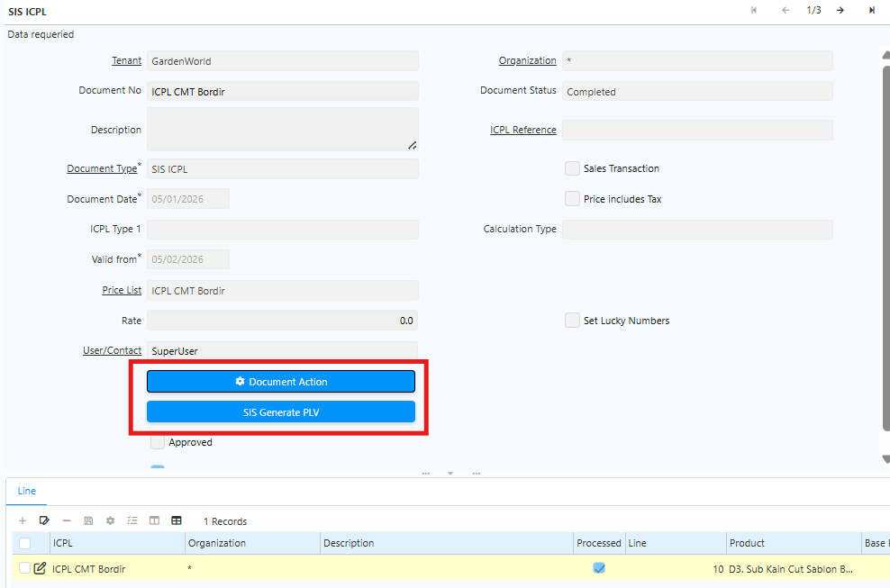
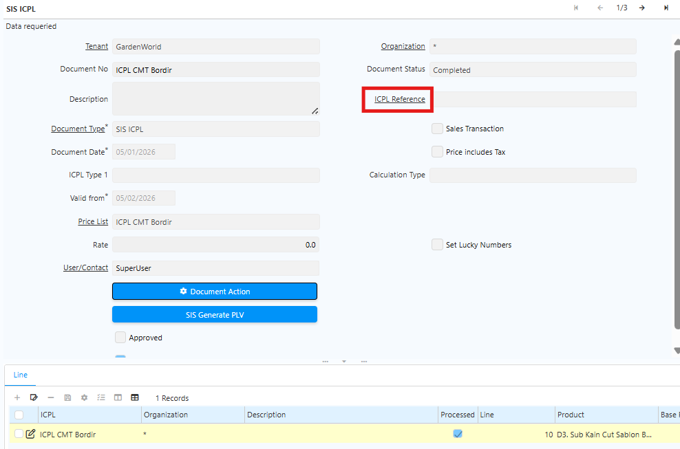
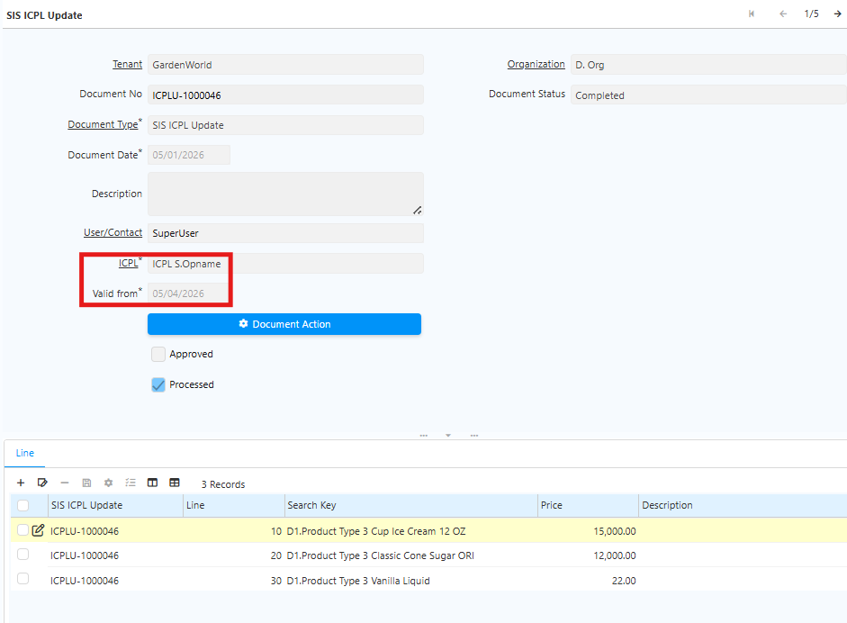
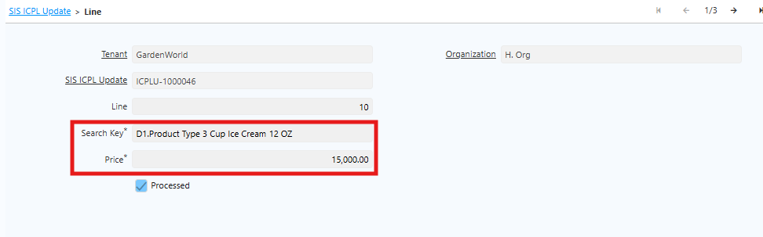
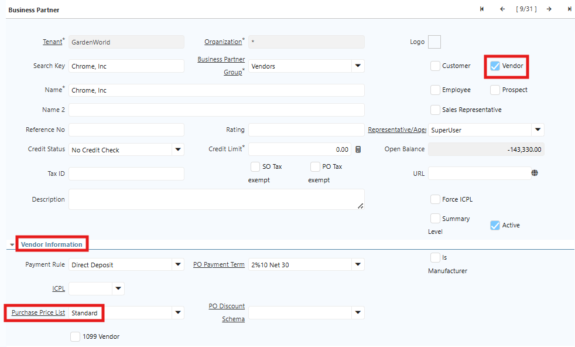

# ICPL

ICPL atau Price List adalah fitur untuk mengelola dan menyimpan informasi harga jual maupun harga beli produk. Dengan ICPL, perusahaan dapat menetapkan harga yang berbeda untuk setiap pelanggan atau vendor dalam periode tertentu.

ICPL menjadi dasar perhitungan harga pada setiap transaksi. Sistem hanya dapat mengisi harga otomatis pada Sales Order maupun Purchase Order jika price list sudah dikonfigurasi dengan benar.

## Manfaat ICPL

1. Menstandarkan harga produk secara terpusat sehingga user tidak perlu menginput harga secara manual pada setiap transaksi.
2. Mendukung beberapa jenis harga, seperti retail, grosir, dan distributor dalam satu sistem.
3. Menyimpan histori perubahan harga sebagai versi baru.
4. Menghitung diskon atau markup secara otomatis berdasarkan produk atau kategori.

## Pengaturan ICPL Base

### Membuat ICPL Base

Ikuti langkah berikut untuk membuat ICPL Base:
1. Buka Menu **SIS ICPL**
2. Klik **New**
3. Isi semua field
  - ICPL Type. Tentukan jenis harga yang digunakan, seperti online, offline, intercompany, atau stock opname.
  - Price include tax. Tentukan apakah harga sudah termasuk pajak.
  - Valid from. Tentukan tanggal mulai berlaku harga.
  - Sales transaction. Aktifkan jika ICPL digunakan untuk transaksi penjualan.
  - Set lucky number. Opsional, jika diperlukan untuk perhitungan tambahan dapat diaktifkan.
  - Calculate type. Tentukan metode perhitungan seperti Add (+), Subtract (-), Multiply (*) atau Divide (/)

		 {#Figure32}

4. Klik **Save**
### Menambahkan Produk ke ICPL Base

Setelah header ICPL tersimpan, tambahkan daftar harga produk melalui tab **Line**.

5. Buka tab **Line**
6. Klik tombol **New**
7. Pilih **Product**
8. Input **Base Price** produk

		 {#Figure33}

9. Klik **save**
10. Ulangi langkah di atas untuk seluruh produk
11. Klik **complete**
12. Jalankan proses **Generate PLV** (Price List Version).
	
		 {#Figure34}

13. Sistem akan menyimpan data header dan menyiapkan versi harga.

## ICPL With Reference

ICPL With Reference digunakan untuk membuat versi harga baru berdasarkan ICPL Base yang sudah ada. Sistem akan menghitung harga secara otomatis berdasarkan referensi yang dipilih.

### Membuat ICPL with Reference

1. Buka Menu **SIS ICPL**
2. Klik **New**
3. Isi seluruh field
4. Pada field **ICPL Reference**, pilih ICPL Base yang akan dijadikan acuan.
	

 {#Figure35}

5. Klik **save**
6. Klik **complete**
7. Jalankan proses **Generate PLV (Price List Version)**.
8. Sistem akan menampilkan produk beserta harga yang dihitung otomatis berdasarkan harga ICPL Base + (Rate %) 

User tidak perlu membuat ICPL Line secara manual karena sistem akan membuat data otomatis saat proses Generate PLV dijalankan. ICPL With Reference juga dapat digunakan sebagai referensi untuk ICPL turunan lainnya.
## Update ICPL

Perubahan ICPL hanya dapat dilakukan melalui menu ICPL Update. User tidak dapat mengubah langsung dokumen ICPL dengan status Complete. Hanya ICPL Base yang dapat diperbarui.
### Langkah Update ICPL

1. Buka menu **SIS ICPL Update**
2. Pilih ICPL Base yang akan diperbarui.
3. Input tanggal baru pada field **Valid From**
	
	
	 {#Figure36}

4. Masuk ke tab **Line**
5. Pilih **Produk**
6. Input **Price** terbaru

	 {#Figure37}
	

7. Klik **save**
8. Klik **complete**

Saat ICPL Base diperbarui, seluruh ICPL turunan akan ikut ter-update secara otomatis.
## Implementasi ICPL

### ICPL Pada Warehouse

Setiap warehouse atau outlet harus memiliki ICPL yang digunakan dalam transaksi. Satu warehouse dapat memiliki 4 jenis ICPL:

- ICPL Online
- ICPL Offline
- ICPL Intercompany
- ICPL Stock Opname

!(70%)[ICPL Warehouse](../ICPL_WH.png "Konfigurasi ICPL di Warehouse") {#Figure38}

Jika terdapat perubahan ICPL atau Price List pada warehouse, lakukan perubahan langsung melalui field **ICPL 1–4**. Setiap perubahan akan tercatat secara otomatis di tab **Listing ICPL for Warehouse**, yang berfungsi menampilkan histori perubahan ICPL pada warehouse tersebut. Berikut contoh perubahan ICPL untuk warehouse:

!(80%)[Perubahan ICPL](../Change_ICPL_WH.png "Change ICPL Warehouse") {#Figure101}

### ICPL Pada Purchase Order

ICPL dapat digunakan untuk menentukan harga pembelian dari vendor. Setiap vendor dapat memiliki price list yang berbeda sesuai kesepakatan harga atau kontrak pembelian. Satu vendor hanya dapat menggunakan satu ICPL Purchase.
#### Setup ICPL Purchase pada Vendor

1. Buka menu **Business Partner**
2. Masuk ke bagian **Vendor Information**.
3. Isi field **Purchase Price List** dengan ICPL yang digunakan.

	
	
	 {#Figure39}

		
4. Klik **save**

Setelah ICPL Purchase dikonfigurasi, sistem akan otomatis menampilkan harga pada transaksi Purchase Order sesuai price list vendor yang dipilih.