# ICPL

ICPL atau Price List adalah fitur untuk mengelola dan menyimpan informasi harga jual maupun harga beli produk. Dengan ICPL, perusahaan dapat menetapkan harga yang berbeda untuk setiap pelanggan atau vendor dalam periode tertentu.

ICPL menjadi dasar perhitungan harga pada setiap transaksi. Sistem hanya dapat mengisi harga otomatis pada Sales Order maupun Purchase Order jika price list sudah dikonfigurasi dengan benar.

## Manfaat ICPL

1. Menstandarkan harga produk secara terpusat sehingga user tidak perlu menginput harga secara manual pada setiap transaksi.
2. Mendukung beberapa jenis harga, seperti retail, grosir, dan distributor dalam satu sistem.
3. Menyimpan histori perubahan harga sebagai versi baru.
4. Menghitung diskon atau markup secara otomatis berdasarkan produk atau kategori.
## Pengaturan ICPL Base

### Membuat ICPL Base

Ikuti langkah berikut untuk membuat ICPL Base:
1. Buka Menu **SIS ICPL**
2. Klik **New**
3. Isi field pada header:
  - ICPL Type — Opsional, tentukan jenis harga yang digunakan seperti online, offline, intercompany, atau stock opname.
  - Price Include Tax — Tentukan apakah harga sudah termasuk pajak.
  - Valid From — Tentukan tanggal mulai berlaku harga.
  - Sales Transaction — Centang jika ICPL digunakan untuk transaksi penjualan.
  - Set Lucky Number — Opsional, aktifkan jika diperlukan untuk perhitungan tambahan.

	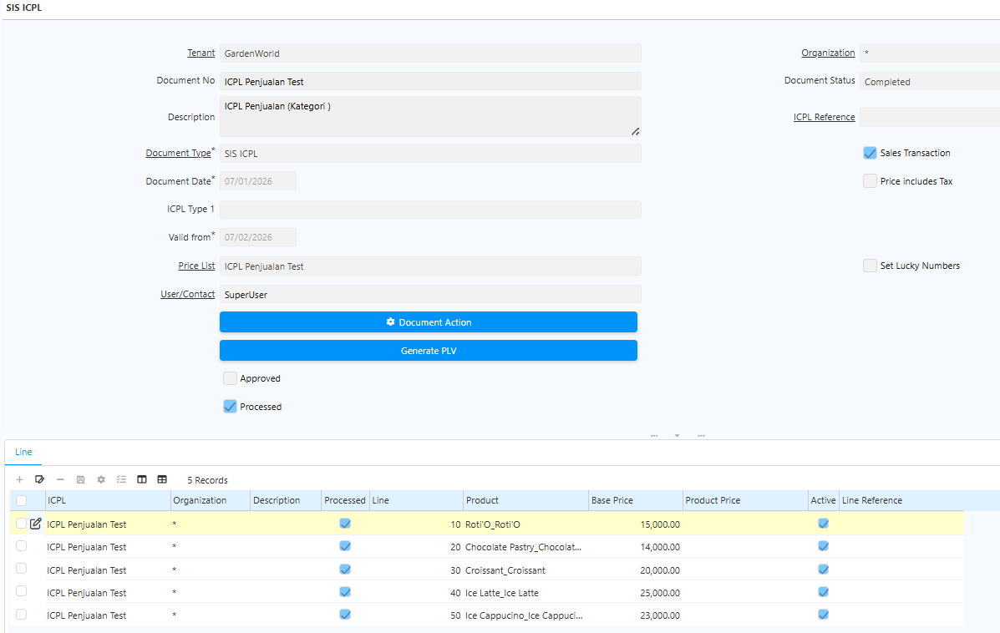 {#Figure32}

4. Klik **Save**
### Menambahkan Produk ke ICPL Base

Setelah header ICPL tersimpan, tambahkan daftar harga produk melalui tab **Line**.

5. Buka tab **Line**
6. Klik tombol **New**
7. Pilih **Product**
8. Input **Base Price** produk

	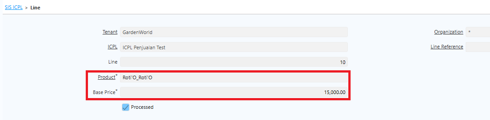 {#Figure33}

9. Klik **save**
10. Ulangi langkah di atas untuk seluruh produk
11. Klik **complete**
12. Jalankan proses **Generate PLV** (Price List Version).
13. Sistem akan menyimpan data header dan menyiapkan versi harga.

## ICPL With Reference

ICPL With Reference digunakan untuk membuat versi harga baru berdasarkan ICPL Base yang sudah ada. Sistem menghitung harga secara otomatis berdasarkan referensi yang dipilih.

### ICPL with Reference dengan Product Category

ICPL With Reference dengan Product Category digunakan ketika satu ICPL memuat beberapa produk dengan kategori berbeda yang memiliki perhitungan harga yang berbeda pula. ICPL Base mencakup semua produk dengan base price masing-masing tanpa filter kategori. Sedangkan di ICPL Reference, perhitungan harga dapat dibedakan per kategori — misalnya produk makanan ditambah Rp2.000 dan produk minuman ditambah Rp3.000.

Ikuti langkah berikut untuk mengkonfigurasi perhitungan harga per kategori:

1. Buka menu **SIS ICPL**.
2. Klik **New**.
3. Isi seluruh field pada header.
4. Pada field **ICPL Reference**, pilih ICPL Base yang akan dijadikan acuan.

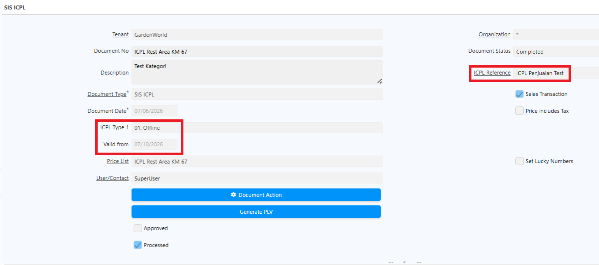 {#Figure35}

5. Klik Save.
6. Masuk ke tab Criteria.
7. Input Product Category yang akan diproses.
8. Pada field Calculate Type, tentukan metode perhitungan: Add (+), Subtract (-), Multiply ()*, atau Divide (/).
9. Pada field Rate, tentukan rate untuk product category tersebut.

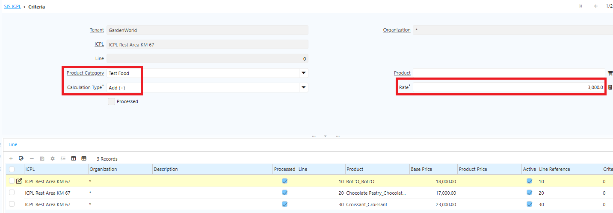 {#Figure135}

10. Klik **complete**
11. Jalankan proses **Generate PLV (Price List Version)**.
12. Sistem menampilkan produk beserta harga yang dihitung otomatis berdasarkan harga ICPL Base + Rate, dengan perbedaan perhitungan price sesuai masing-masing kategori.
### ICPL with Reference Tanpa Product Category

Jika penentuan harga berlaku untuk semua produk tanpa filter kategori — misalnya berdasarkan ICPL Type seperti _Online_, _Offline_, _Stock Opname_, atau _Inter Company_ — konfigurasi rate tidak perlu dibedakan per kategori.

Ikuti langkah berikut untuk mengkonfigurasi ICPL Reference tanpa filter Product Category:

1. Buka menu **SIS ICPL**.
2. Klik **New**.
3. Isi seluruh field pada header.
4. Pada field **ICPL Reference**, pilih ICPL Base yang akan dijadikan acuan.
5. Klik **Save**.
6. Masuk ke tab **Criteria**.
7. Kosongkan field **Product Category**.
8. Pada field **Calculate Type**, tentukan metode perhitungan: _Add (+)_, _Subtract (-)_, _Multiply (_)*, atau _Divide (/)_.
9. Pada field **Rate**, tentukan rate untuk produk tersebut.

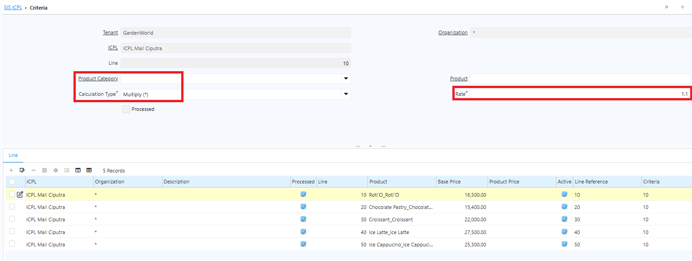 {#Figure135}

9. Klik **complete**
10. Jalankan proses **Generate PLV (Price List Version)**.
11. Sistem menampilkan produk beserta harga yang dihitung otomatis berdasarkan harga ICPL Base + Rate.

Tanpa filter Product Category, seluruh produk di ICPL Base dikalkulasi dengan rate yang sama sehingga perhitungan harga setiap produk seragam.

User tidak perlu membuat ICPL Line secara manual karena sistem otomatis membuat data saat proses **Generate PLV** dijalankan. ICPL With Reference juga dapat digunakan sebagai referensi untuk ICPL turunan lainnya.

### ICPL with Reference Produk Tertentu

ICPL Reference memungkinkan penyesuaian harga tidak hanya berdasarkan **Product Category**, tetapi juga berdasarkan **produk tertentu** dalam kategori tersebut. Konfigurasi ini digunakan apabila terdapat produk yang memiliki penambahan atau pengurangan harga berbeda dari aturan umum kategori.

Sebagai contoh, pada outlet **Rest Area** berlaku ketentuan sebagai berikut:

- Kategori **Makanan** memiliki penambahan harga sebesar **Rp2.000** dari harga dasar (Base Price). Namun, produk **Croissant** dan **Beef Pastry** memiliki kebijakan khusus dengan penambahan harga sebesar **Rp5.000**.
- Kategori **Ice Cream** memiliki penambahan harga sebesar **Rp4.000** dari harga dasar. Namun, produk **Ice Cream Cone** dan **Ice Cream Sundae** memiliki penambahan harga sebesar **Rp6.000**.

Untuk memenuhi kebutuhan tersebut, lakukan konfigurasi ICPL Reference pada level **Product Category** sebagai aturan umum, kemudian tambahkan konfigurasi pada level **Product** sebagai pengecualian (override). Saat sistem menghasilkan Price List Version, konfigurasi pada level produk akan diprioritaskan dibandingkan konfigurasi kategori.

1. Buka menu **SIS ICPL**.
2. Klik **New**.
3. Isi seluruh field pada header.
4. Tentukan tanggal Valid From.
5. Pada field **ICPL Reference**, pilih ICPL Base yang akan dijadikan acuan.
6. Klik Save.
7. Masuk ke tab **Criteria**.
8. Input Product Category yang akan diproses.
9. Pada field Calculate Type, tentukan metode perhitungan: Add (+), Subtract (-), Multiply ()*, atau Divide (/).
10. Pada field Rate, tentukan rate untuk product category tersebut.

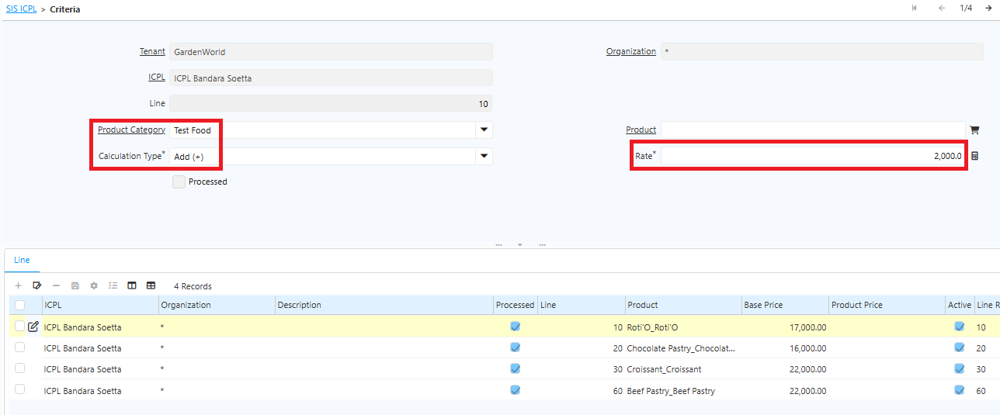 {#Figure136}

10. Klik save
11. Untuk menambahkan pengecualian pada produk tertentu, klik New kembali pada tab Criteria.
12. Kosongkan field Product Category.
13. Pada field Product, pilih produk yang memiliki penyesuaian harga berbeda dari kategori.
14. Tentukan Calculate Type sesuai kebutuhan.
15. Masukkan nilai Rate yang berlaku khusus untuk produk tersebut.

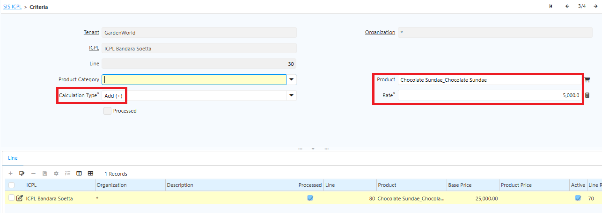 {#Figure165}

16. Klik **save**.
17. Klik **complete**.
18. Jalankan proses Generate PLV (Price List Version).

Setelah proses Generate PLV dijalankan, sistem akan menghitung harga jual berdasarkan Base Price pada ICPL Base dengan aturan berikut:

- Produk yang tidak memiliki konfigurasi khusus akan menggunakan nilai Rate yang ditentukan pada Product Category.
- Produk yang memiliki konfigurasi khusus akan menggunakan nilai Rate pada level Product, sehingga mengabaikan konfigurasi yang terdapat pada Product Category.

Dengan mekanisme ini, perusahaan dapat menerapkan aturan harga umum untuk satu kategori sekaligus memberikan penyesuaian harga khusus pada produk tertentu tanpa perlu membuat ICPL yang terpisah.
## Update ICPL

Perubahan ICPL hanya dapat dilakukan melalui menu ICPL Update. User tidak dapat mengubah langsung dokumen ICPL dengan status Complete. Hanya ICPL Base yang dapat diperbarui.
### Langkah Update ICPL

1. Buka menu **SIS ICPL Update**
2. Pilih ICPL Base yang akan diperbarui.
3. Input tanggal baru pada field **Valid From**	

 {#Figure36}

4. Masuk ke tab **Line**
5. Pilih **Produk**
6. Input **Price** terbaru

 {#Figure37}

7. Klik **save**
8. Klik **complete**

Saat ICPL Base diperbarui, seluruh ICPL turunan akan ikut ter-update secara otomatis.
## Implementasi ICPL

### ICPL Pada Warehouse

Setiap warehouse atau outlet harus memiliki ICPL yang digunakan dalam transaksi. Satu warehouse dapat memiliki 4 jenis ICPL:

- ICPL Online
- ICPL Offline
- ICPL Intercompany
- ICPL Stock Opname

!(70%)[ICPL Warehouse](../ICPL_WH.png "Konfigurasi ICPL di Warehouse") {#Figure38}

Jika terdapat perubahan ICPL atau Price List pada warehouse, lakukan perubahan langsung melalui field **ICPL 1–4**. Setiap perubahan akan tercatat secara otomatis di tab **Listing ICPL for Warehouse**, yang berfungsi menampilkan histori perubahan ICPL pada warehouse tersebut. Berikut contoh perubahan ICPL untuk warehouse:

!(80%)[Perubahan ICPL](../Change_ICPL_WH.png "Change ICPL Warehouse") {#Figure101}

### ICPL Pada Purchase Order

ICPL dapat digunakan untuk menentukan harga pembelian dari vendor. Setiap vendor dapat memiliki price list yang berbeda sesuai kesepakatan harga atau kontrak pembelian. Satu vendor hanya dapat menggunakan satu ICPL Purchase.
#### Setup ICPL Purchase pada Vendor

1. Buka menu **Business Partner**
2. Masuk ke bagian **Vendor Information**.
3. Isi field **Purchase Price List** dengan ICPL yang digunakan.

	
	
	 {#Figure39}

		
4. Klik **save**

Setelah ICPL Purchase dikonfigurasi, sistem akan otomatis menampilkan harga pada transaksi Purchase Order sesuai price list vendor yang dipilih.

### ICPL Penjualan

Untuk membatasi pilihan ICPL yang muncul pada transaksi penjualan, lakukan konfigurasi **Target Document Type** terlebih dahulu sebelum membuat Sales Order. Ikuti langkah berikut:

1. Buka menu **Document Type**.
2. Pilih document **POS Order**.
3. Pada field **ICPL Type 1**, tentukan ICPL yang akan digunakan — _Online_, _Offline_, _Intercompany_, atau _Stock Opname_.

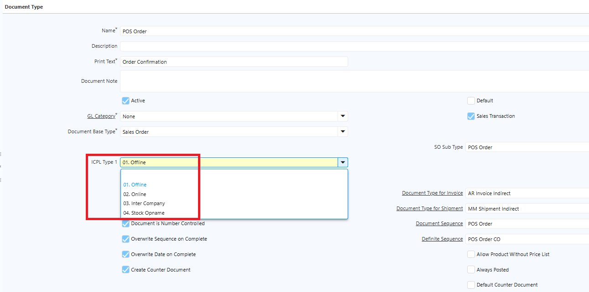 {#Figure145}

4. Klik **Save**.

Pada transaksi penjualan, sistem membaca harga produk berdasarkan ICPL yang telah dikonfigurasi di masing-masing warehouse. Karena setiap warehouse atau outlet memiliki ICPL tersendiri, lakukan konfigurasi ICPL untuk setiap warehouse atau outlet. Ikuti langkah berikut:

1. Buka menu **Warehouse and Locators**.
2. Input **Search Key** dan **Name** sesuai kebutuhan.
3. Tentukan **Address** untuk outlet.
4. Pada field **ICPL Online**, **Offline**, **Inter Company**, dan **Stock**, tentukan ICPL yang digunakan.

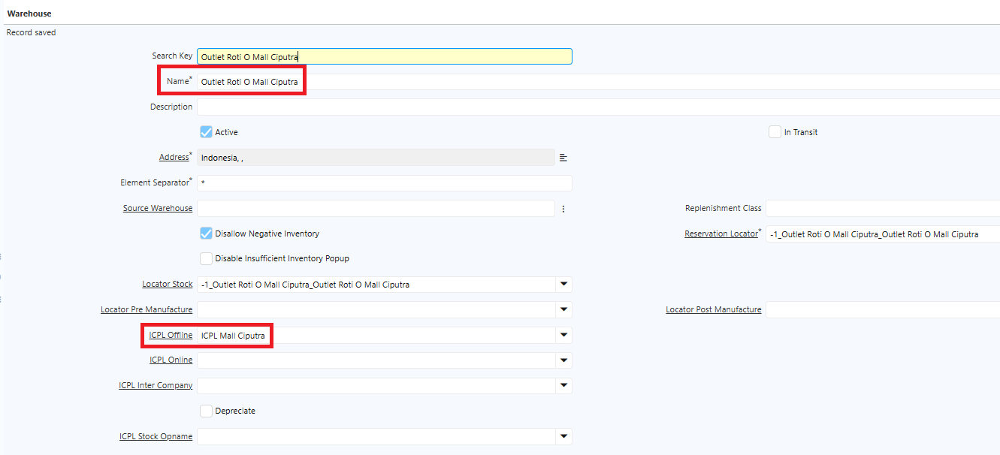 {#Figure146}

5. Klik **Save**.
#### Implementasi ICPL pada Sales Order

1. Buka menu **Sales Order**.
2. Tentukan **Target Document Type** sesuai konfigurasi sebelumnya.
3. Tentukan **Warehouse** untuk transaksi tersebut.
4. Klik **Save**.

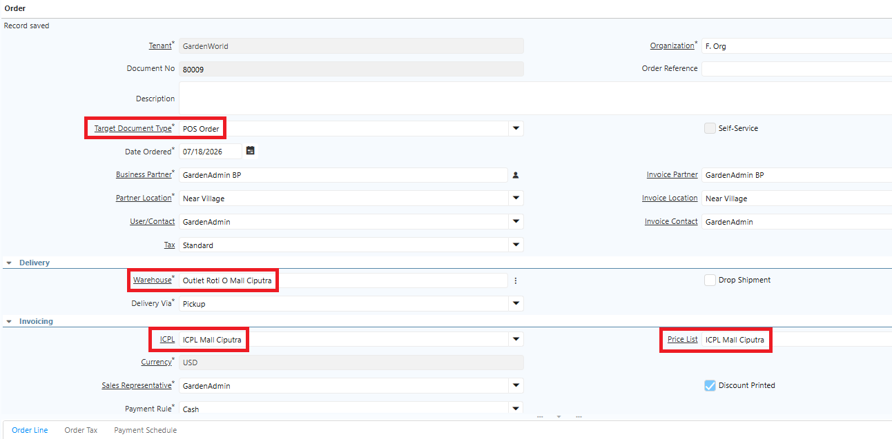 {#Figure147}

Saat dokumen disimpan, sistem otomatis mengisi field **ICPL** dan **Price List** pada Sales Order sesuai konfigurasi ICPL di warehouse yang dipilih. Saat user memilih produk yang akan dijual, harga terisi otomatis sesuai konfigurasi ICPL tersebut.
## Product Without Price List

Beberapa produk tidak memiliki price list, sehingga saat membuat Purchase Order, tim purchasing menentukan harga sesuai kebijakan perusahaan. Untuk mengakomodasi kondisi ini, iDempiere menyediakan field **Allow Product Without Pricelist** yang memungkinkan produk tanpa price list tetap dapat diproses dalam Purchase Order.

Namun, karena fleksibilitas ini berisiko menimbulkan lonjakan harga yang belum disepakati, perusahaan dapat mengatur **batas maksimal harga pembelian** untuk setiap produk guna melindungi kepentingan perusahaan.
### Konfigurasi di Document Type Purchase Order

Ikuti langkah berikut untuk mengaktifkan atau menonaktifkan fitur ini:

1. Buka menu **Document Type**.
2. Cari dokumen **Purchase Order**.
3. Pada field **Allow Product Without Pricelist**:
- **Centang** — Produk tanpa price list dapat diproses pada dokumen tersebut.
- **Tidak dicentang** — Produk tanpa price list tidak dapat diproses.

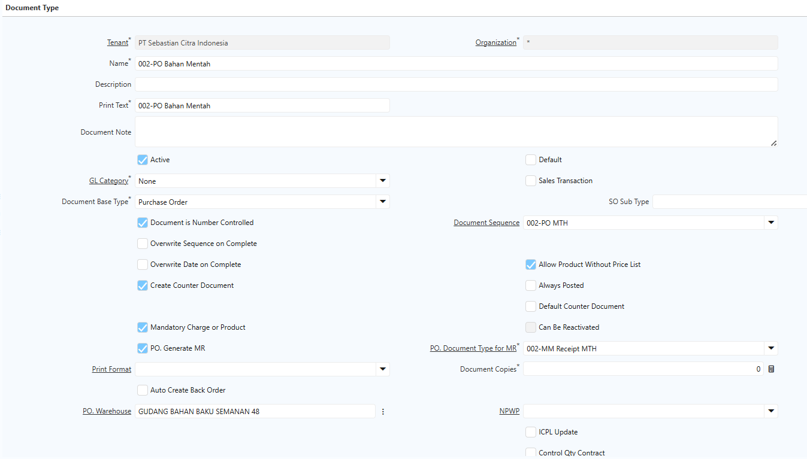 {#Figure156}

4. Klik **Save**.

### Konfigurasi Maksimal Harga di Level Product

Ikuti langkah berikut untuk mengatur batas maksimal harga pembelian per produk:

1. Buka menu **Product**.
2. Cari produk yang akan dikonfigurasi.
3. Pada field **Max Purchasing Price**, input batas maksimal harga untuk produk tersebut.

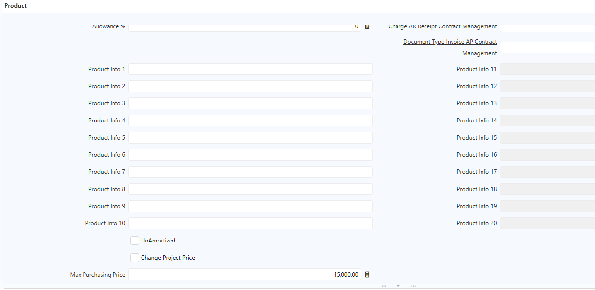 {#Figure157}

4. Klik **Save**.

Setelah dikonfigurasi, jika harga yang diinput pada Purchase Order melebihi **Max Purchasing Price**, sistem otomatis menampilkan pesan error bahwa harga yang diinput melebihi batas maksimal yang telah ditetapkan.

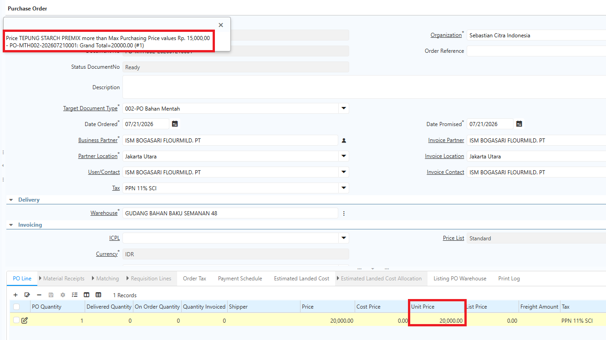 {#Figure158}