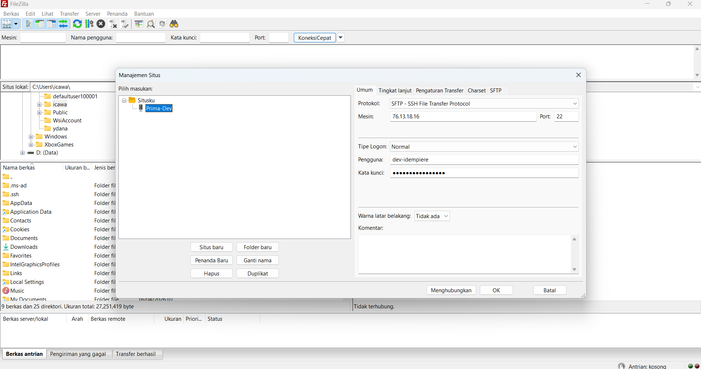
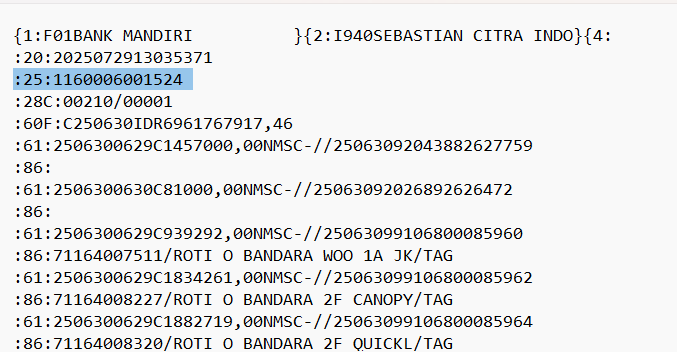
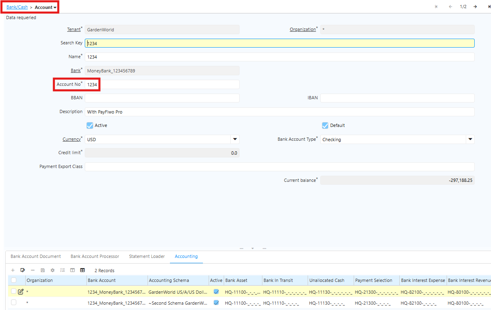
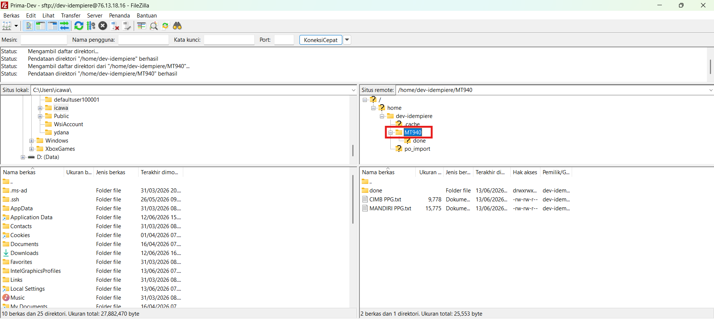
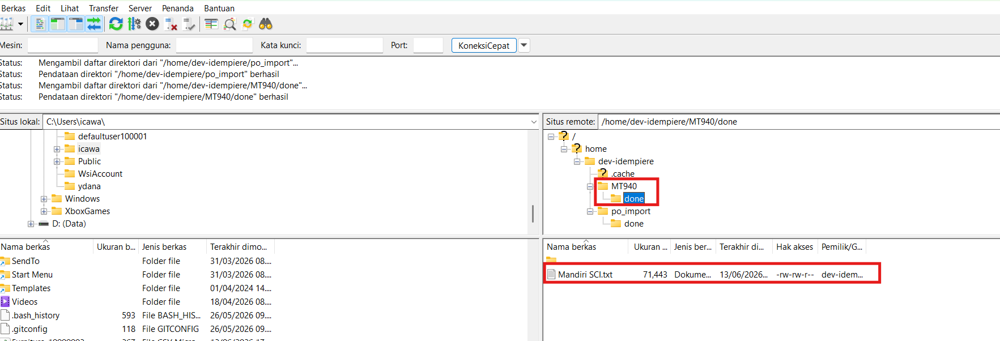
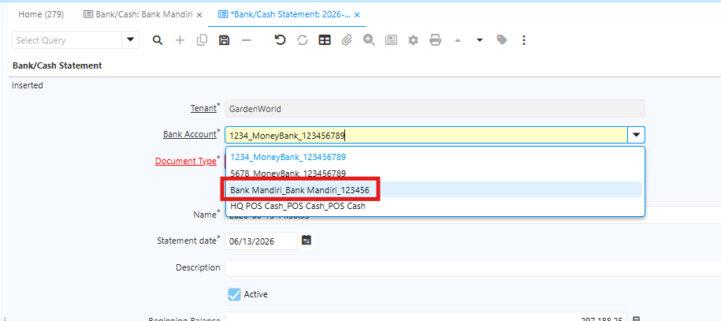
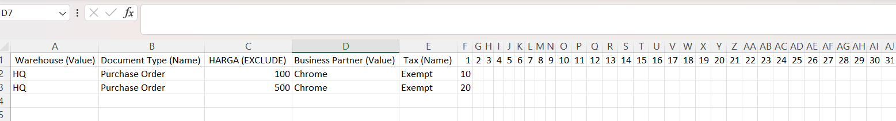
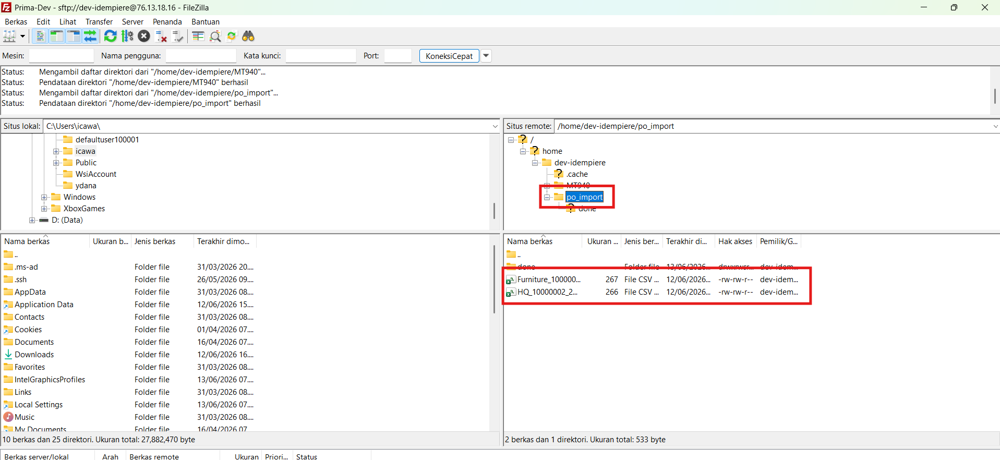
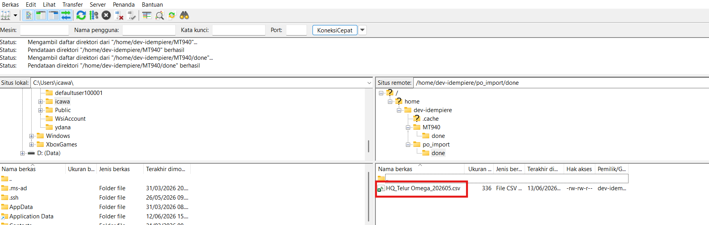
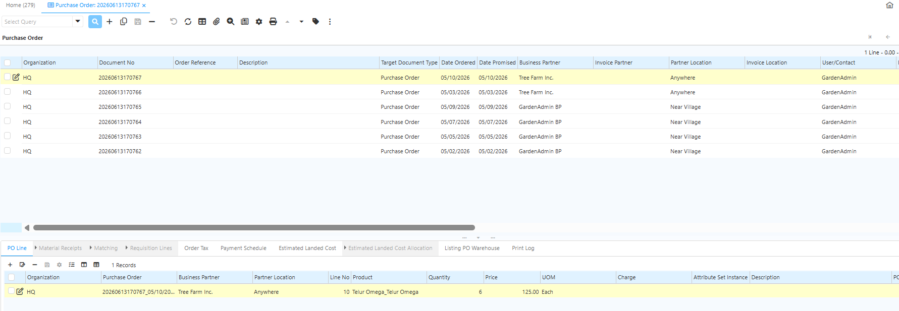

# Import Data

Import Data adalah proses memasukkan data dari sumber eksternal seperti file CSV atau Excel ke dalam sistem iDempiere. Tujuan utama import data meliputi:
- Migrasi data — memindahkan data dari sistem lama ke iDempiere
- Input massal — memasukkan ratusan/ribuan record sekaligus tanpa input manual satu per satu
- Efisiensi — menghemat waktu dibandingkan proses entry manual

## FileZilla

FileZilla adalah aplikasi transfer file open source yang digunakan untuk memindahkan file antara komputer lokal dan server melalui jaringan internet atau jaringan lokal. Dalam konteks iDempiere, FileZilla digunakan untuk mengupload file Excel atau CSV dari PC ke folder di server iDempiere.

### Langkah Instalasi & Koneksi FileZilla:

**Langkah 1: Install FileZilla**

1. Download dari [https://filezilla-project.org/](https://filezilla-project.org/)
2. Install Filezilla dan buka aplikasi

**Langkah 2: Menghubungkan ke server FTP**

1. Klik menu Manajemen Situs
2. Klik New Site dan beri nama contoh “Prima-Dev”
3. Input konfigurasi koneksi sebagai berikut:
  - Protocol : SFTP – SSH File Transfer Protocol
  - Host : 76.13.18.16
  - Port : (sesuai kebijakan)
  - Logon : Normal
  - User : (sesuai kebijakan)
  - Password : (sesuai kebijakan)

 {#Figure81}

4. Klik Connect untuk menghubungkan ke server.

## Import Data MT940

MT940 adalah format standar SWIFT (Society for Worldwide Interbank Financial Telecommunication) untuk rekening koran elektronik (electronic bank statement). File MT940 berisi informasi transaksi perbankan mencakup saldo awal, daftar debit/kredit, dan saldo akhir yang dikirim bank kepada nasabah korporat. Di iDempiere, MT940 digunakan dalam modul Bank Statement. Berikut contoh format file yang digunakan untuk import data Bank Statement.

    
    {#Figure91}

Langkah Import File MT940:
1. Siapkan file MT940 dari bank. File MT940 menggunakan format **TXT**.
2. Konfigurasi Bank Account di iDempiere:
  - Masuk ke Bank/Cash → Account → Account No

   {#Figure82}

  - Pastikan nomor rekening **cocok** dengan field :**25**: di file MT940
  - Set Currency sesuai (IDR untuk rupiah)

3. Import melalui FileZilla
  - Navigasi ke /home/dev-idempiere/MT940 → Import Bank Statement
  - Pilih file MT940 yang akan diimport

 {#Figure83}

4. Jika import berhasil, file otomatis berpindah ke folder **done**

 {#Figure87}

5. Dokumen **Bank Statement** akan menampilkan bank tersebut sebagai pilihan pada field **Bank Account**.

 {#Figure88}

## Import Data PO Kecil

Sebelum melakukan import, pastikan nama file sesuai format yang ditentukan, yaitu: organisasi, value product/search key pada product, dan tahun bulan transaksi. Berikut contoh format file yang digunakan untuk import data PO Kecil.

    {#Figure90}

Langkah Import File PO Kecil:
1. Siapkan file PO Kecil dalam format csv
2. Import melalui FileZilla
  - Navigasi ke /home/dev-idempiere/po_import → Import PO Kecil
  - Pilih file PO Kecil yang akan diimport

 {#Figure84}

4. Jika import berhasil, file otomatis berpindah ke folder **done**

 {#Figure89}

5. Sistem iDempiere akan membuat dokumen PO dengan status Draft atau In Progress, yang selanjutnya dapat di-confirm sesuai kebutuhan operasional.

 {#Figure90}