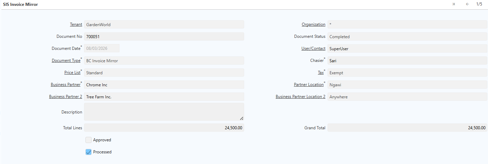
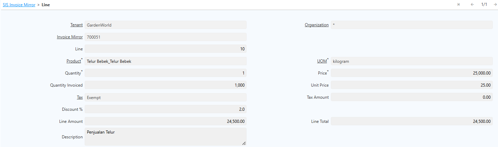
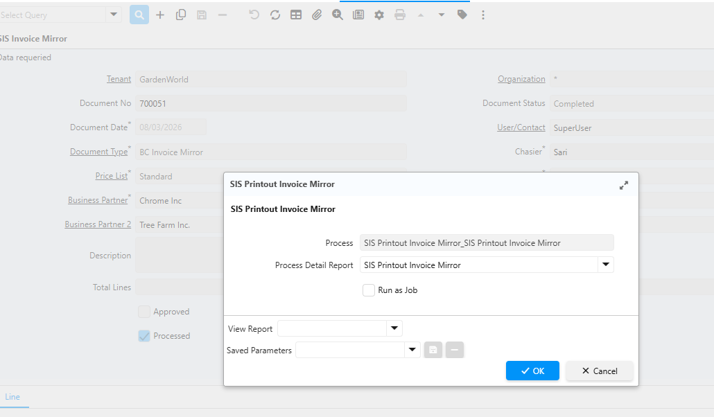
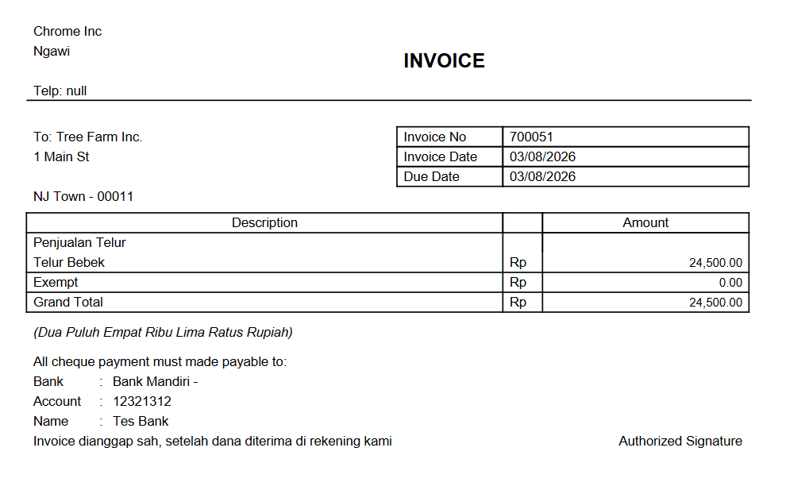

# Invoice Bayangan

Invoice Bayangan (_Shadow Invoice_) adalah dokumen invoice yang digunakan untuk mencatat transaksi antara **Business Partner Penjual (_Seller_)** dan **Business Partner Pembeli (_Buyer_)** dalam satu dokumen. Berbeda dengan invoice standar yang hanya menggunakan satu Business Partner, Invoice Bayangan menyimpan informasi kedua pihak sehingga hubungan transaksi terdokumentasi secara lengkap.

Selain informasi Seller dan Buyer, Invoice Bayangan juga memuat detail transaksi seperti produk, kuantitas, harga, diskon, pajak (_Tax_), dan total nilai invoice. Sistem menghitung seluruh nilai transaksi secara otomatis berdasarkan konfigurasi yang berlaku.
## Mekanisme Invoice Bayangan

1. Buka menu **SIS Invoice Mirror**.
2. Input field pada header:
- **Document Date**
- **Price List**
- **Cashier**
- **Tax**
- **Business Partner** (Seller)
- **Partner Location** (Seller)
- **Business Partner 2** (Buyer)
- **Partner Location** (Buyer)

 {#Figure210}

3. Klik **Save**.
4. Masuk ke tab **Line**.
5. Input field pada Line:
- **Produk**
- **Quantity**
- **Unit of Measure (UoM)**
- **Price**
- **Discount**

 {#Figure211}

6. Klik **Save**.
7. Klik tombol **Setting (⚙)**, kemudian pada **Document Action** pilih **Complete**.

## Perhitungan Nilai Invoice

Sistem menghitung nilai Invoice Bayangan secara otomatis dengan urutan berikut:

1. Menghitung nilai setiap line berdasarkan **Quantity** × **Unit Price**.
2. Mengurangi nilai transaksi sesuai **Discount** yang diberikan (jika ada).
3. Menghitung **Tax** berdasarkan konfigurasi tax pada setiap line.
4. Menjumlahkan seluruh nilai line untuk memperoleh **Sub Total**.
5. Menjumlahkan seluruh nilai tax untuk memperoleh **Total Tax**.
6. Menghitung **Grand Total** dari Sub Total dikurangi Discount ditambah Total Tax.

Dengan mekanisme ini, seluruh perhitungan berjalan otomatis sehingga meminimalkan risiko kesalahan perhitungan manual.

## Report Invoice Bayangan

1. Klik tombol **Setting (⚙)**.
2. Klik **SIS Printout Invoice Mirror**.
3. Pada field **Process Detail Report**, pilih **SIS Printout Invoice Mirror**.

 {#Figure212}

4. Klik **OK**.

Berikut contoh report Invoice Bayangan:

 {#Figure213}