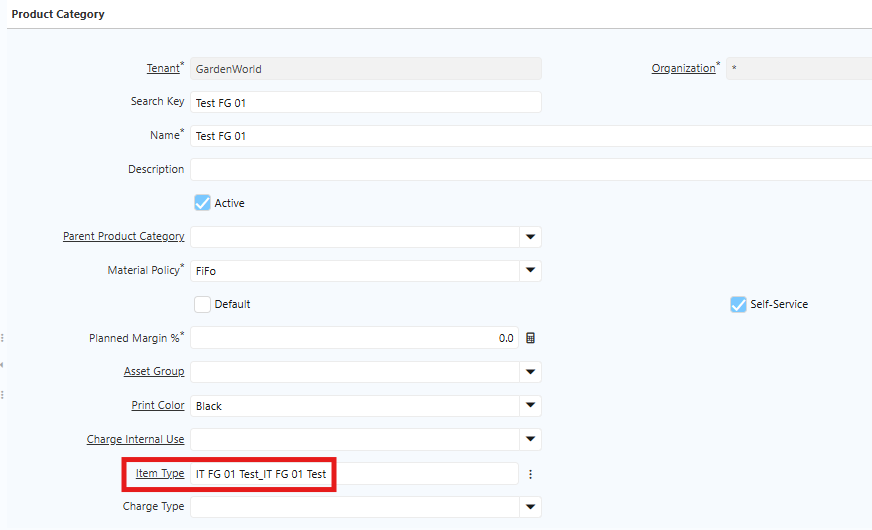
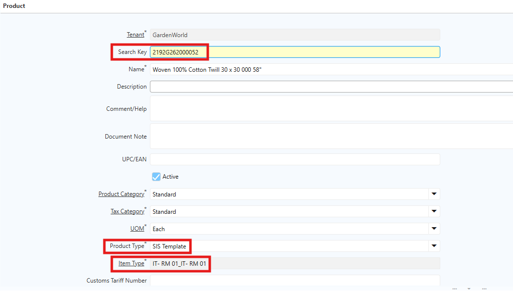
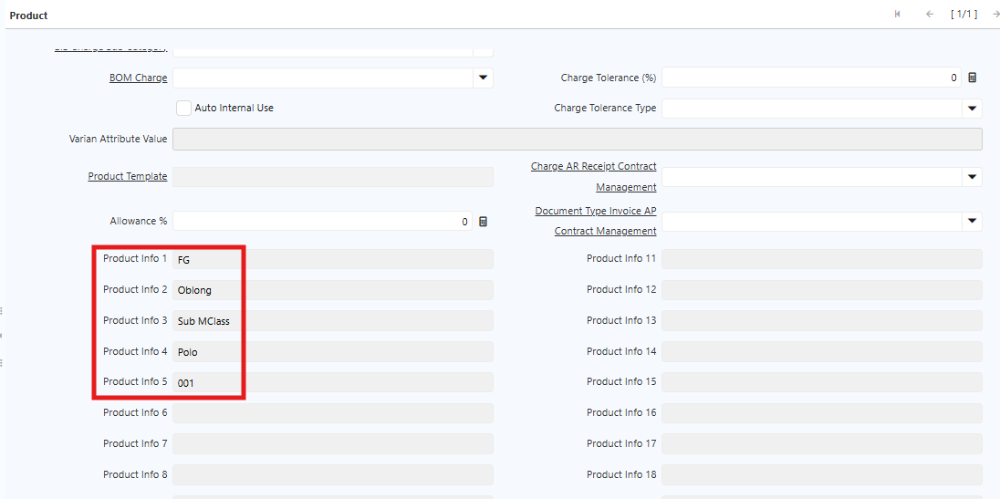
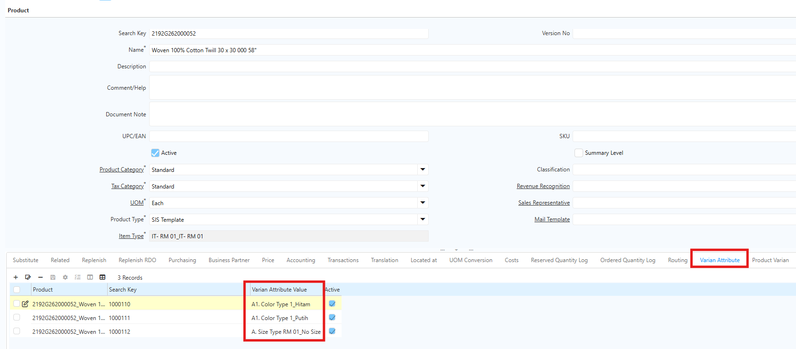
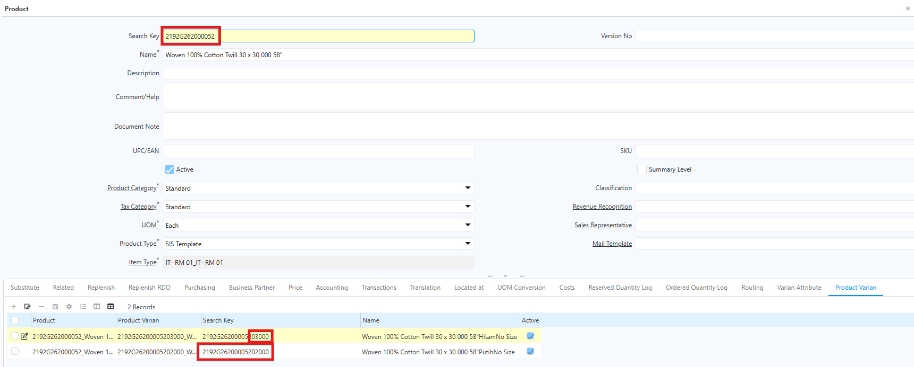

# Implementasi Item Type di Product

Setelah konfigurasi Item Type selesai, langkah berikutnya adalah membuat produk menggunakan segment yang sudah ditentukan.

## Implementasi Item Type di Product Category

Langkah selanjutnya adalah mengimplementasikan Item Type pada Product Category dengan cara sebagai berikut:

1. Buka Menu **Product Category**
2. Pada field **Item Type**, pilih Item Type yang telah dikonfigurasi sesuai kebutuhan.
3. Klik **Save** untuk menyimpan konfigurasi.

 {#Figure105}
## Langkah Pembuatan Produk Baru dengan Product Segment

1. Buka Menu **Product**. 
2. Pada field **Product Type**, pilih **SIS Template**. 
3. Pada field **Product Category**, pilih Product Category yang telah dikonfigurasi, di mana **Item Type** sudah dikonfigurasi di level Product Category tersebut.

 {#Figure6}

4. Klik **Save**. Saat produk disimpan, sistem otomatis membuat **Kode artikel** dan **Nama Artikel**. Di sistem, kode artikel disebut sebagai **Search Key**. Nama artikel terbentuk dari gabungan nama masing-masing segment yang dipisahkan dengan spasi agar mudah dibaca.

Informasi segment yang telah dikonfigurasi akan muncul di header Product pada field **Product Info**. Field ini menampilkan informasi segment sesuai urutan yang dikonfigurasi di Item Type.

 {#Figure7}

Apabila produk memiliki varian, user dapat mengatur varian tersebut pada menu **Variant Attribute**.

 {#Figure7}

Setelah Variant Attribute selesai dikonfigurasi, user dapat menjalankan proses **Generate Product Variant**. Sistem akan otomatis membentuk kode artikel berdasarkan template Item Type yang telah dikonfigurasi, kemudian menambahkan kode varian sesuai atribut produk.

 {#Figure8}