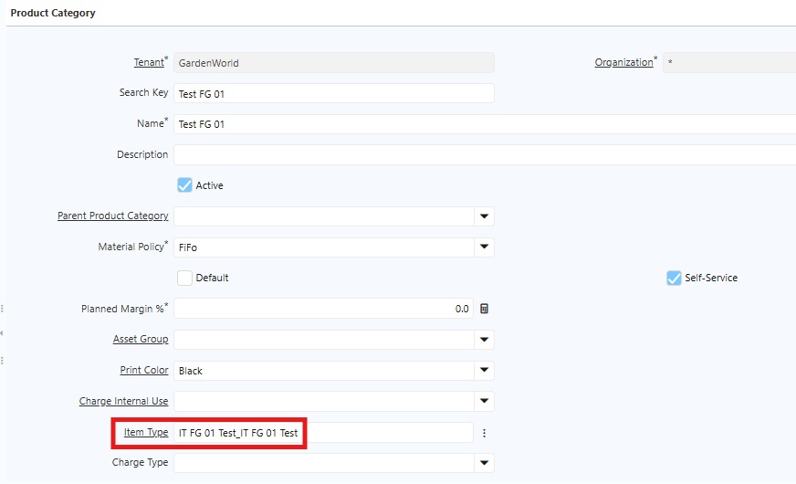
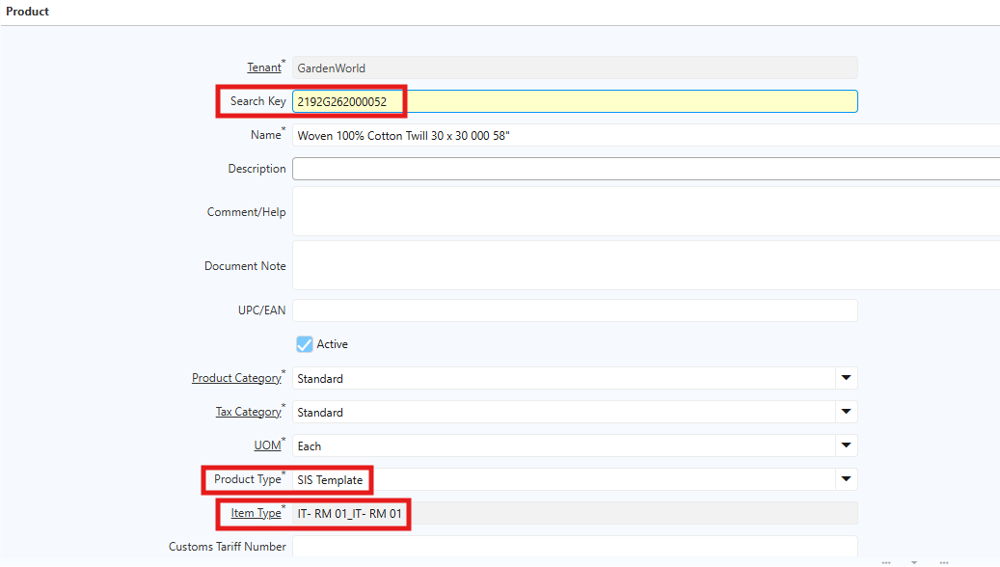
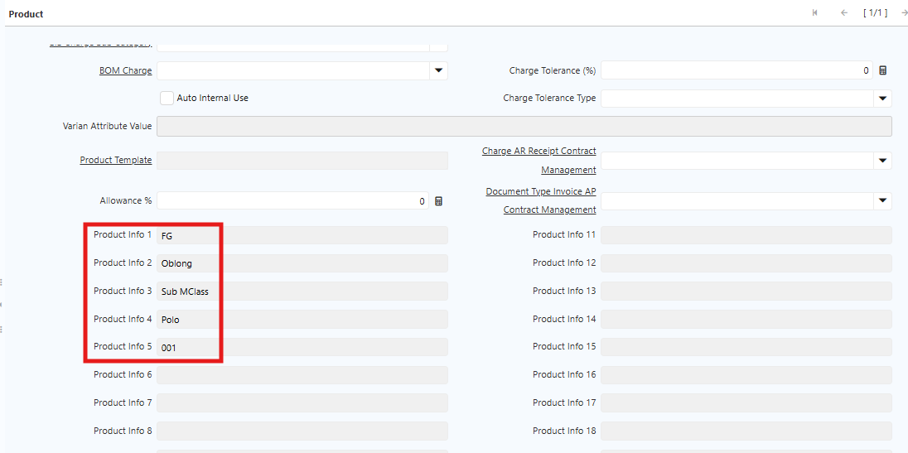
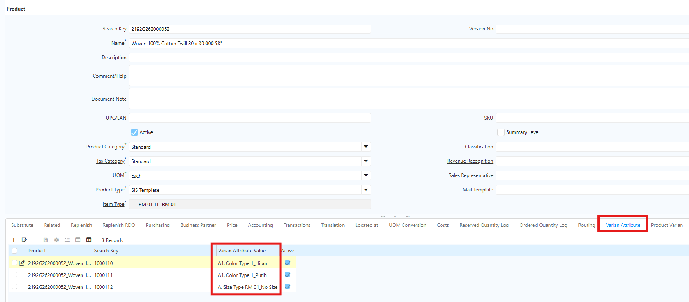
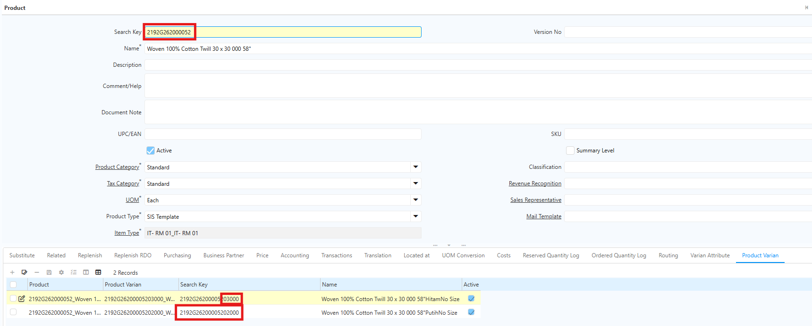

# Implementasi Item Type di Product

Setelah konfigurasi Item Type selesai, langkah berikutnya adalah membuat produk menggunakan segment yang sudah ditentukan.

## Implementasi Item Type di Product Category

Langkah selanjutnya adalah mengimplementasikan Item Type pada Product Category dengan cara sebagai berikut:

1. Buka Menu **Product Category**
2. Pada field **Item Type**, pilih Item Type yang telah dikonfigurasi sesuai kebutuhan.
3. Klik **Save** untuk menyimpan konfigurasi.

 {#Figure105}
## Langkah Pembuatan Produk Baru dengan Product Segment

1. Buka Menu **Product**. 
2. Pada field **Product Type**, pilih **SIS Template**. 
3. Pada field **Product Category**, pilih Product Category yang telah dikonfigurasi, di mana **Item Type** sudah dikonfigurasi di level Product Category tersebut.

 {#Figure6}

4. Klik **Save**. Saat produk disimpan, sistem otomatis membuat **Kode artikel** dan **Nama Artikel**. Di sistem, kode artikel disebut sebagai **Search Key**. Nama artikel terbentuk dari gabungan nama masing-masing segment yang dipisahkan dengan spasi agar mudah dibaca.

Informasi segment yang telah dikonfigurasi akan muncul di header Product pada field **Product Info**. Field ini menampilkan informasi segment sesuai urutan yang dikonfigurasi di Item Type.

 {#Figure7}

Apabila produk memiliki varian, user dapat mengatur varian tersebut pada menu **Variant Attribute**.

 {#Figure7}

Setelah Variant Attribute selesai dikonfigurasi, user dapat menjalankan proses **Generate Product Variant**. Sistem akan otomatis membentuk kode artikel berdasarkan template Item Type yang telah dikonfigurasi, kemudian menambahkan kode varian sesuai atribut produk.

 {#Figure8}

## Product Type SIS Template Compatible

### Create Product dengan Copy Product dengan Item Type

Langkah untuk membuat product baru dengan copy product yang memiliki item type:

1. Buka menu **Product**.
2. Pilih Product yang memiliki **Item Type** sebagai template.
3. Klik **Copy Product**.
4. Pada Product baru, pilih **Product Type = SIS Template Compatible**.
5. Input **Kode Artikel** sesuai artikel yang akan dibuat.
6. Klik save.

Saat product disimpan sistem akan:

- Jika **Product Segment** dengan kode yang sama sudah tersedia, sistem menggunakan Product Segment tersebut.
- Jika **Product Segment** belum tersedia, sistem otomatis membuat **Product Segment baru** berdasarkan Kode Artikel.
- Sistem otomatis membentuk **Product Info** berdasarkan Product Segment.
- Jika Kode Artikel Product baru berbeda dengan Kode Artikel pada Product Item Type yang disalin, sistem otomatis memperbarui **Item Type** mengikuti Product Segment pada Product baru.
### Create Product Baru Menggunakan Tombol Plus (+)

Langkah untuk membuat product baru:

1. Buka menu **Product**.
2. Klik tombol **Plus (+)** untuk membuat Product baru.
3. Pilih **Product Type = SIS Template Compatible**.
4. Input **Kode Artikel**.
5. Input **Nama Product** sesuai kebutuhan.
6. Klik save.

Saat product disimpan:

- Nama Product tetap menggunakan nama yang diinput oleh user.
- Nama Product **tidak terhubung dengan Product Segment** pada kode artikel.
- Saat Product disimpan, sistem **tidak otomatis membentuk Product Info**.
