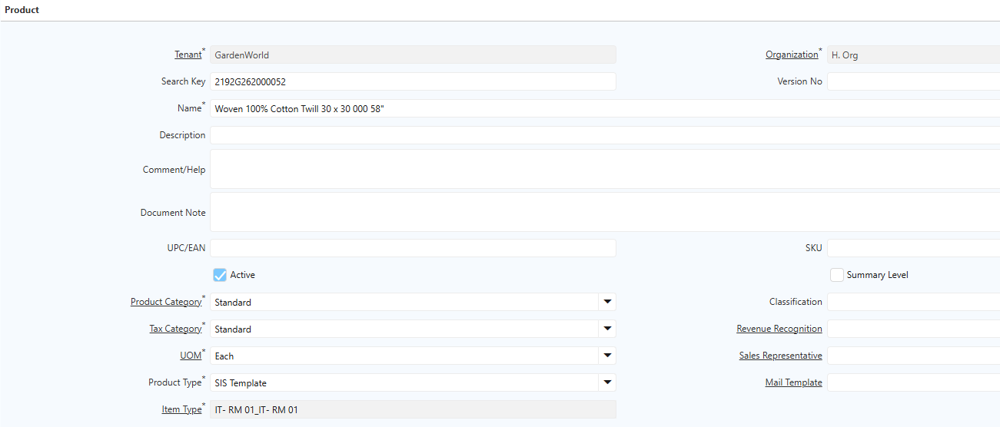
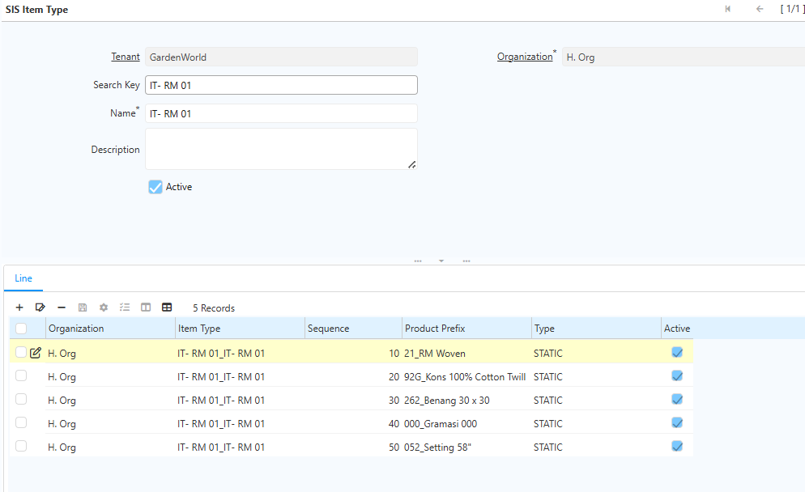
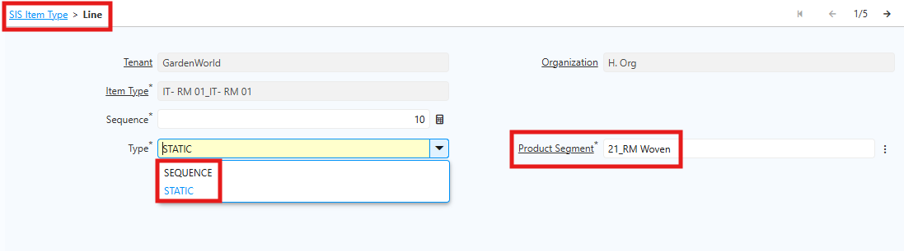

# Item Type Product

Item Type adalah konfigurasi penyusun kode artikel berdasarkan Product Segment yang telah dibuat sebelumnya.

Sistem akan membentuk kode artikel secara otomatis berdasarkan urutan segment pada Item Type.

**Contoh Kode Artikel:**

| Kode Artikel         | Keterangan          |
| -------------------- | ------------------- |
| 1015015971761200     | Barang Jadi Polo    |
| 2192G2620000527S6000 | Bahan Baku Woven    |
| 20010TR91200660ZP091 | Bahan Baku Knitting |
"Kode Artikel Product"{#Tabel2}

 {#Figure3}

## Konfigurasi Item Type

Langkah-Langkah Konfigurasi Item Type:

1. Buka Menu **SIS Item Type**
2. Klik **New**
3. Isi field **Search Key** dan **Name** sesuai kebutuhan operasional

	 {#Figure4}

4. Masuk ke **Item Type Line**. Pada bagian Item Type Line, terdapat dua jenis konfigurasi segment, yaitu **Sequence** (nomor urut otomatis) dan **Static** (Kode tetap artikel), contoh: 59 untuk Brand Polo, 28 untuk MClass Kemeja). Penggunaan Sequence bersifat opsional dan disesuaikan dengan kebutuhan perusahaan.

	 {#Figure5}

5. Klik **Save**

***Urutan segment pada Item Type mengikuti standar kode perusahaan karena urutan tersebut menentukan hasil akhir kode artikel.***

Setelah Item Type selesai dikonfigurasi, user dapat membuat artikel atau produk baru dengan menghubungkan segment yang telah diatur sebelumnya. Sistem kemudian akan menghasilkan kode artikel secara otomatis.