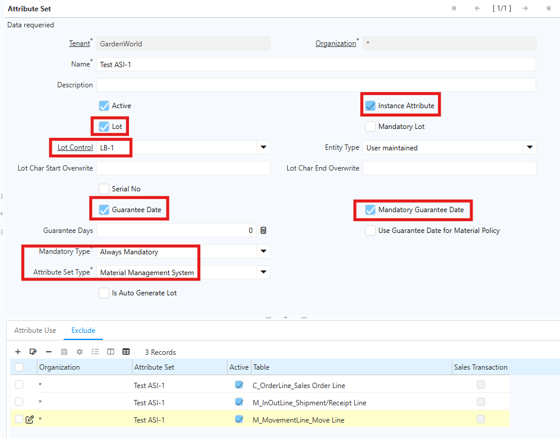
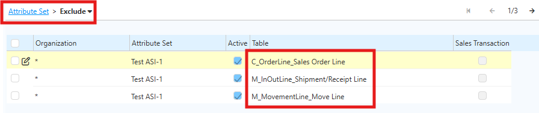
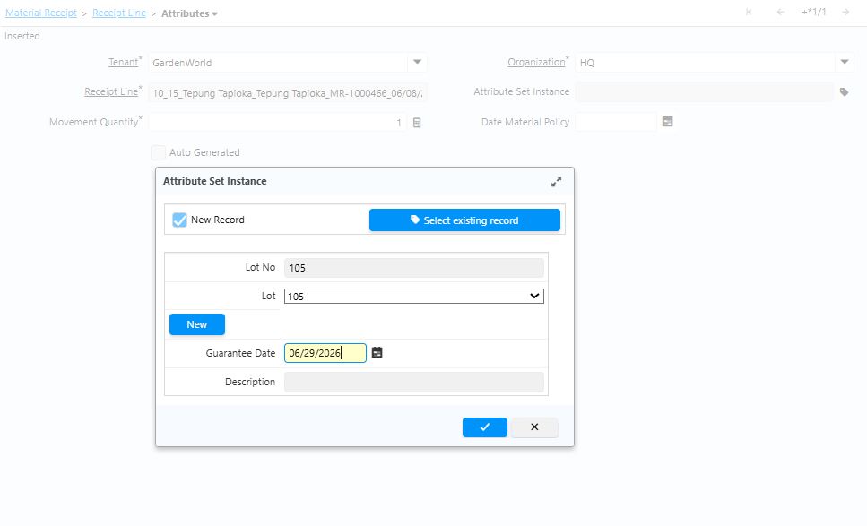

# Attribute Set

Attribute Set adalah fitur yang memungkinkan pencatatan atribut tambahan pada produk di level lot, serial number, atau batch. Fitur ini sangat berguna untuk produk yang memerlukan pelacakan kualitas, tanggal kedaluwarsa, atau identifikasi individual.
## Komponen Attribut Set
1. Lot — Pengelompokan produk dalam satu batch produksi atau pengiriman. Produk dengan lot yang sama dianggap memiliki karakteristik yang sama.memiliki karakteristik yang sama.
2. Lot Control — Format dan urutan penomoran lot yang dibuat sistem secara konsisten. Tanpa Lot Control, operator harus mengetik nomor lot secara manual setiap kali menerima barang — rentan typo, tidak seragam, dan sulit dianalisis.
3. Guarantee Date — Tanggal sampai kapan produk dijamin kualitasnya (tanggal kedaluwarsa/best before). Atribut ini paling kritis untuk produk pangan, farmasi, dan bahan kimia.

## Fungsi Guarantee Date
Guarantee Date digunakan untuk:
- Mencatat tanggal kedaluwarsa produk saat penerimaan barang.
- Menjadi dasar perhitungan otomatis melalui Guarantee Days yang dikonfigurasi di level Product.
- Menjadi basis peringatan jika stok mendekati tanggal kedaluwarsa.

## Implementasi Attribute Set

### Konfigurasi Master Data Attribute Set

1. Buka menu **Attribute Set**
2. Centang field **Lot**
3. Centang field **Guarantee Date**
4. Centang field **Instance Attribute**
5. Centang field **Mandatory Guarantee Date**
6. Pada field **Mandatory Type**, pilih **Always Mandatory**
7. Pada field **Attribute Set Type**, pilih **Material Management System**

 {#Figure75}

8. Masuk ke tab Exclude, input data berikut:
  - C_OrderLine – Sales Order Line
  - M_InOutLine – Shipment/Receipt Line
  - M_MovementLine_Move Line
  - Un-check field **Sales Transaction**

   {#Figure76}
  
9. Klik **Save**

### Setup Attribute Set Instance di Produk
1. Buka Menu Product
2. Input field-field sesuai kebutuhan
3. Pada field **Attribute Set**, pilih ASI yang konfigurasi
4. Klik **Save**
### Purchase Order & Penerimaan Barang
1. Buka menu **Purchase Order**
2. Input field-field mandatory
3. Masuk ke tab **PO Line**, input produk dan quantity produk yang akan diproses
4. Klik **Complete**
5. Masuk ke tab **Material Receipt**, lalu masuk ke Receipt Line
6. Pada tab **Attributes**, buat **Attribute Set Instance (ASI)** dan isi **Guarantee Date** sesuai konfigurasi.

 {#Figure77}

7. Klik **save**
8. Klik **complete** dokumen material receipt

Pada report Material Receipt, sistem menampilkan expired date yang merupakan Guarantee Date untuk masing-masing produk dan ASI.