# Kontra Bon

Fitur Kontra Bon digunakan untuk mengelola proses pengumpulan dan verifikasi tagihan vendor/customer sebelum dilakukan pembayaran atau penagihan. Kontra Bon adalah dokumen yang membuktikan bahwa sejumlah dokumen tagihan telah diserahkan dan diverifikasi untuk diproses ke tahap pembayaran.

Kontra Bon bukan transaksi pembayaran — fungsinya adalah mengelompokkan dan mengontrol invoice yang akan dibayarkan.
## Konfigurasi Document Type Kontra Bon

1. Buka menu **Document Type**.
2. Klik **New**.
3. Isi **Name** sesuai kebutuhan operasional.
4. Pada field **Document Base Type**, pilih **SIS Kontra Bon**.
5. Centang field **Document Number Is Controlled**.
6. Pada field **Kontra Bon Type**, tentukan tipe kontra bon:
- **Non PO**
- **PO Lengkap**
- **PO Invoice**

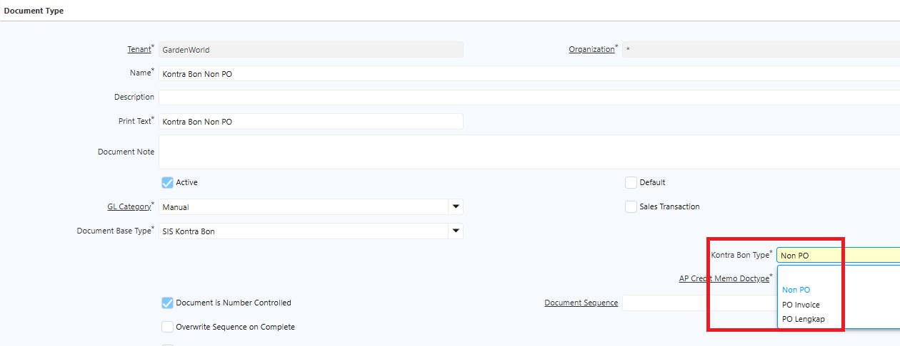 {#Figure245}

7. Pada field **AP Credit Memo Doctype**, tentukan document type yang akan digunakan.

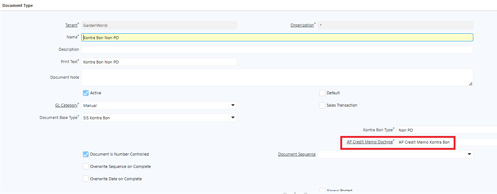 {#Figure241}

8. Klik **Save**.

## Konfigurasi Faktur Pajak di Kontra Bon

Field **nomor faktur pajak** pada Kontra Bon berkaitan dengan status **PKP (Pengusaha Kena Pajak)** Business Partner. Karena tidak semua Business Partner terdaftar sebagai PKP, field ini bersifat fleksibel:

- **Business Partner PKP** — Field nomor faktur pajak bersifat **mandatory**.
- **Business Partner Non-PKP** — Field nomor faktur pajak **tidak mandatory**.

Ikuti langkah berikut untuk mengkonfigurasi flag PKP di master Business Partner:

1. Buka menu **Business Partner**.
2. Centang field **Vendor**.
3. Pada **Vendor Information**, konfigurasi field **PKP**:
- **Dicentang** — Nomor faktur pajak bersifat mandatory.

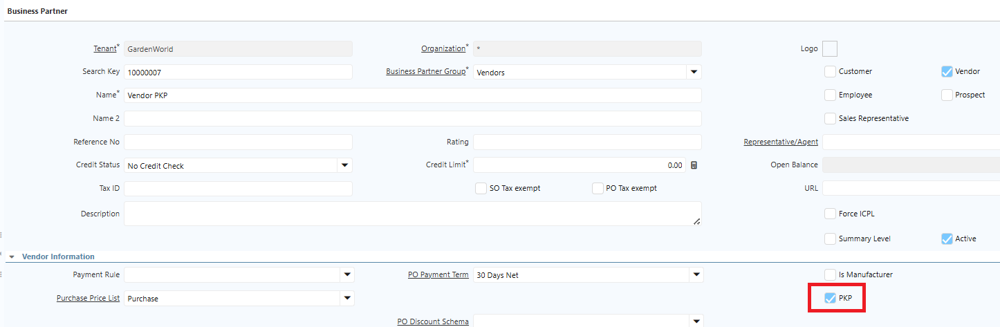 {#Figure245}

- **Tidak dicentang** — Nomor faktur pajak tidak mandatory.

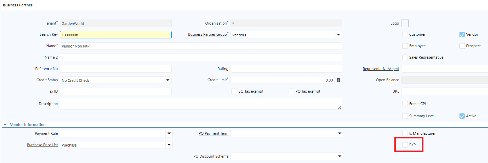 {#Figure246}

4. Klik **Save**.

Berikut contoh implementasi PKP di Kontra Bon:

- Business Partner dengan PKP

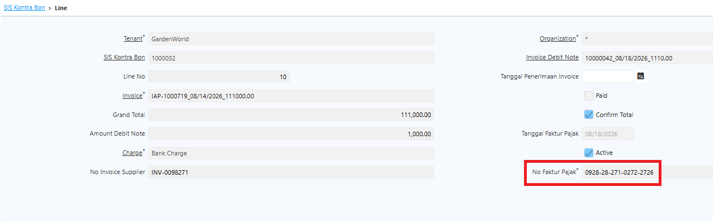 {#Figure247}

- Business Partner Non-PKP

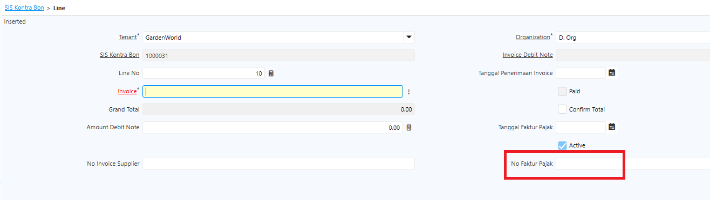 {#Figure248}
## Mekanisme Tanggal Penerimaan Invoice

**Tanggal Penerimaan Invoice** dan **Tanggal Kontra Bon** adalah dua tanggal yang berbeda dengan fungsi masing-masing dalam proses Kontra Bon. Kedua tanggal ini bersifat _updatable_ karena dalam kondisi tertentu perusahaan dapat menerima invoice setelah tanggal jatuh tempo.

Pada kondisi tersebut, Tanggal Penerimaan Invoice dapat diinput atau diperbarui sesuai tanggal aktual penerimaan invoice — bahkan setelah dokumen Kontra Bon di-complete.

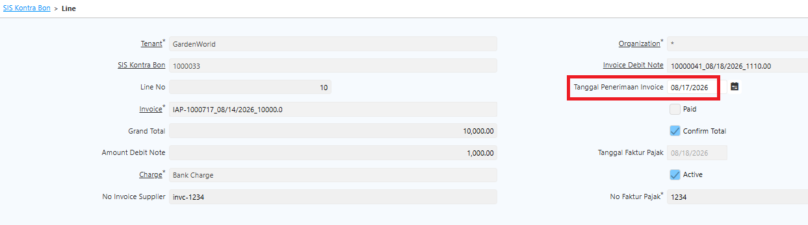 {#Figure249}

Mekanisme ini memastikan sistem dapat merepresentasikan kondisi aktual proses administrasi invoice, khususnya ketika invoice dari vendor diterima perusahaan setelah melewati tanggal jatuh tempo.
## Mekanisme Kontra Bon

### Kontra Bon dengan Purchase Order

1. Buat **Purchase Order** seperti biasa.
2. Proses **Material Receipt** dari PO yang telah dibuat.
3. Proses **Invoice** dari Material Receipt yang telah diproses.
4. Buka menu **SIS Kontra Bon**.
5. Tentukan **Document Type** — pilih **Kontra Bon PO Lengkap**.
6. Tentukan **Document Date**.
7. Tentukan **Business Partner**.
8. Klik **Generate Kontra Bon Line**.
9. **Nomor PO, Nomor MR, Nomor Invoice** akan tergenerate otomatis.
10. Masuk ke tab **Line**.
11. Tentukan **tanggal penerimaan invoice**.
12. Tentukan **tanggal faktur pajak**.
13. Input **nomor invoice supplier**.
14. Input **nomor faktur pajak**.
15. Input **Amount Debit Note** — isi jika terdapat pengurangan nilai pada tagihan.
16. Tentukan **Charge** atas Amount Debit Note.
17. Centang field **Confirm Qty**.
18. Centang field **Confirm Total**.

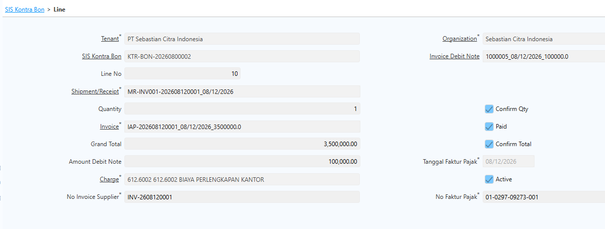 {#Figure223}

18. Klik **Save**.
19. Klik **Complete** pada dokumen.

Saat dokumen Kontra Bon di-complete, sistem otomatis menyalin informasi **nomor invoice supplier** dan **nomor faktur pajak** ke invoice. Sistem juga menghitung dan menampilkan **tanggal jatuh tempo** pada invoice berdasarkan tanggal invoice dan **Term of Payment (TOP)** dari Business Partner.

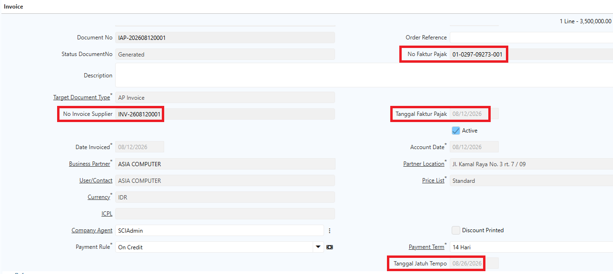 {#Figure224}

Jika terdapat debit note, sistem otomatis membentuk **Invoice Debit Note** atau **AP Invoice Credit Memo** saat dokumen Kontra Bon di-complete, dan melakukan alokasi pada invoice tersebut secara otomatis.

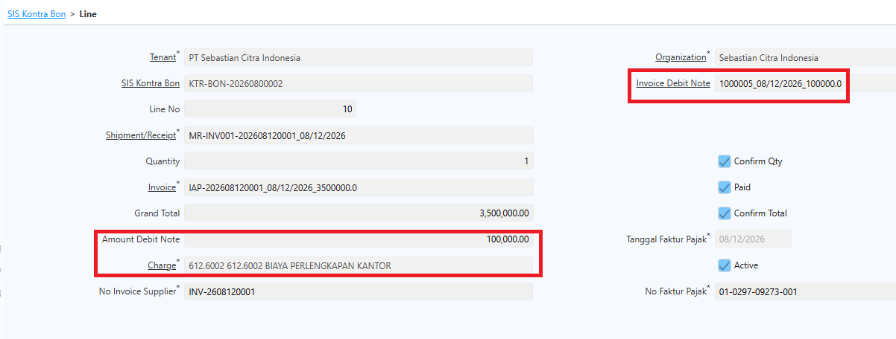 {#Figure225}

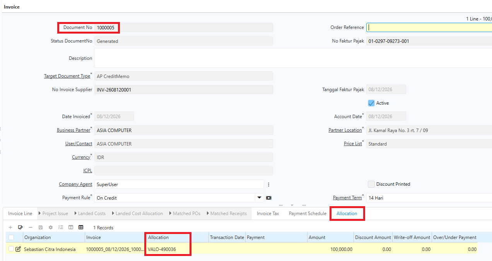 {#Figure226}

Berikut contoh jurnal alokasi atas Invoice Credit Memo tersebut:

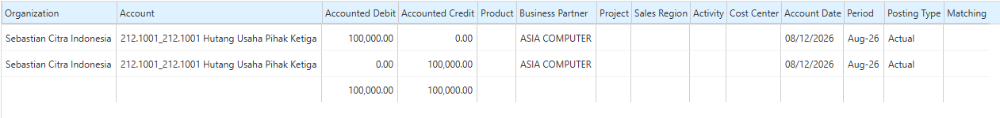 {#Figure227}
### Kontra Bon tanpa Purchase Order

1. Buka menu **Purchase Invoice and Credit/Debit Note**.
2. Tentukan **Target Document Type**.
3. Tentukan **Business Partner**.
4. Tentukan **Price List** yang digunakan.
5. Tentukan **Payment Rule**.
6. Masuk ke **Invoice Line**.
7. Tentukan **Charge** atau biaya yang akan diproses.
8. Tentukan **Qty**.
9. Tentukan **Price** untuk tagihan tersebut.
10. Klik **Save**.
11. Klik **Complete**.
12. Buka menu **SIS Kontra Bon**.
13. Tentukan **Document Type** — pilih **Kontra Bon Non PO** atau **PO Invoice**.
14. Tentukan **Document Date**.
15. Tentukan **Business Partner**.
16. Klik **Generate Kontra Bon Line**.
17. **Nomor Invoice** akan tergenerate otomatis.
18. Masuk ke tab **Line**.
19. Tentukan **tanggal penerimaan invoice**.
20. Tentukan **tanggal faktur pajak**.
21. Input **nomor invoice supplier**.
22. Input **nomor faktur pajak**.
23. Centang field **Confirm Qty**.
24. Centang field **Confirm Total**.

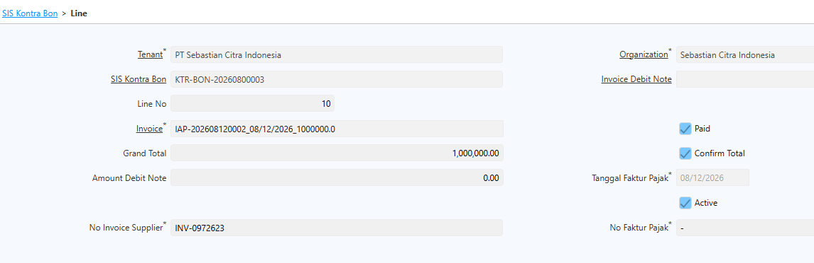 {#Figure228}

24. Klik **Save**.
25. Klik **Complete** pada dokumen.

Saat dokumen Kontra Bon di-complete, sistem otomatis menyalin informasi **nomor invoice supplier** dan **nomor faktur pajak** ke invoice. Sistem juga menghitung dan menampilkan **tanggal jatuh tempo** pada invoice berdasarkan tanggal invoice dan **Term of Payment (TOP)** dari Business Partner.

> **Catatan:** Field **Generate Kontra Bon Line** mengakomodasi kondisi di mana satu Kontra Bon dapat memuat multi invoice dan multi PO dengan Business Partner yang sama, sehingga satu dokumen Kontra Bon dapat terdiri dari beberapa line. Proses generate ini hanya berlaku untuk PO, MR, dan Invoice berstatus _Complete_. PO atau Invoice yang sudah ter-generate tidak akan muncul di window jika dilakukan generate ulang dengan Business Partner yang sama pada dokumen yang berbeda.
## Pembayaran Kontra Bon

1. Buka menu **Payment and Receipt**.
2. Tentukan **Document Type**.
3. Pilih **Bank Account** yang digunakan untuk pembayaran.
4. Tentukan **Transaction Date**.
5. Pilih **Business Partner** sebagai pihak yang melakukan atau menerima pembayaran.
6. Klik tombol **Setting (⚙)**.
7. Klik **Generate Allocate Kontra Bon**.
8. Pilih **AP Invoice** yang akan diproses.

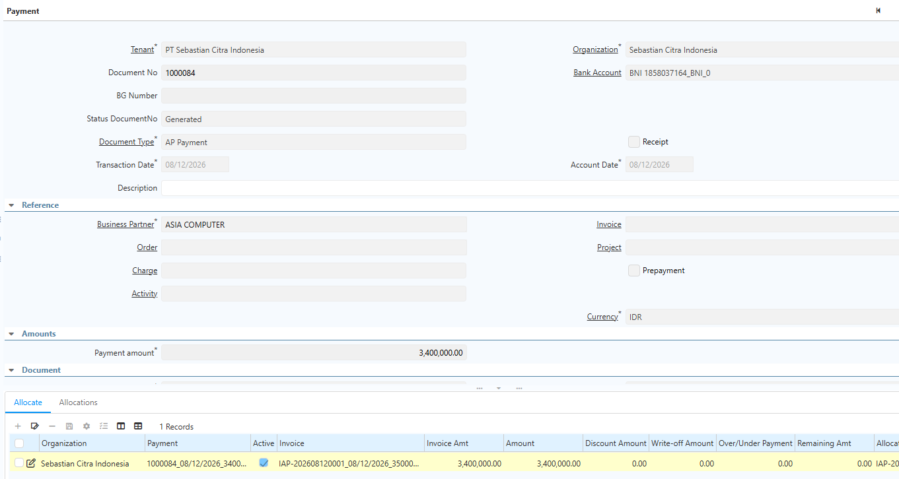 {#Figure229}

9. Klik **Complete**.

Status invoice yang diproses berubah menjadi **Paid** dan sistem membentuk alokasi atas invoice tersebut sebesar amount yang diproses. Berikut contoh jurnal yang terbentuk atas pembayaran invoice Kontra Bon:

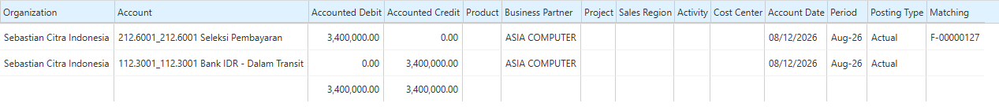 {#Figure230}