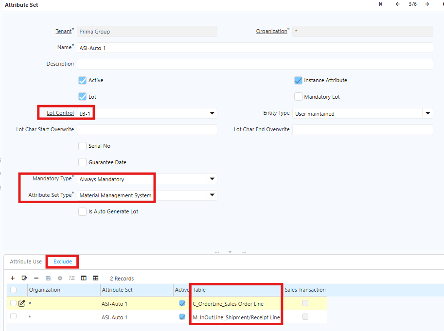
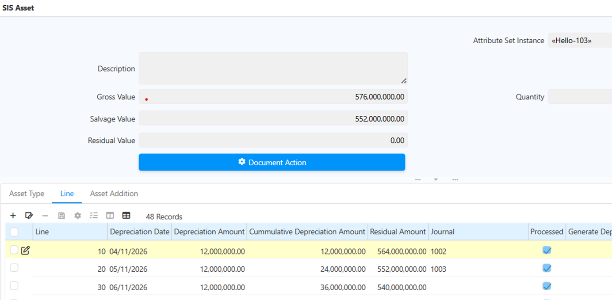
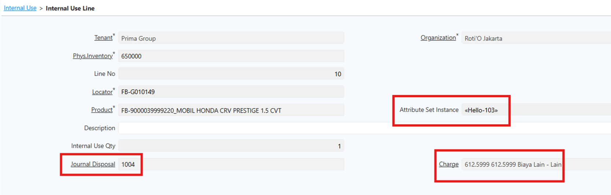

## Manajemen Penyusutan

Penyusutan asset adalah proses mengalokasikan biaya asset secara sistematis selama masa manfaatnya. Setiap periode, sistem mencatat beban penyusutan dan mengurangi nilai buku asset. Sebelum melakukan penyusutan, pastikan konfigurasi berikut telah selesai:

1. Product Category — Gunakan costing method **Average PO** dan costing level **Batch/Lot**.

	!(80%)[Costing](../Product_Category_Acc.png "Konfigurasi Costing") {#Figure46}

2. Attribute Set — Pilih **Lot Control** dengan pengaturan berikut:
  - Mandatory Type: **Always**
  - Attribute Set Type: Material Management System
  - Exclude:

        * C_OrderLine – Sales Order Line
        * M_InOutLine – Shipment/Receipt Line

  - Un-check field **Sales Transaction**

 {#Figure47}

3. Master Data Asset Type — Tentukan klasifikasi asset, metode penyusutan, dan GL Document Type.
4. Set Product — Atur Product Type ke **Item**.
5. Attribute Set — Sesuaikan dengan kategori asset.
6. Asset Type — Sesuaikan dengan kategori asset.

### Proses Pengadaan Asset

Pengadaan asset dilakukan melalui tahapan berikut:

1. Purchase order
2. Material receipt
3. Invoice
4. Matching invoicee

Setelah proses penerimaan selesai, sistem otomatis membentuk data asset berdasarkan ASI (Attribute Set Instance). Data asset tersebut dapat diakses melalui menu SIS Asset.

### Proses Manajemen Penyusutan Asset

Lakukan penyusutan asset melalui langkah-langkah berikut:
1. Akses menu **SIS Asset**.

	 {#Figure48}

2. Generate asset — Data awal akan berstatus Draft.
3. Evaluasi asset — Lakukan evaluasi terhadap asset yang berstatus Draft.
4. Konfirmasi asset — Validasi asset sebelum digunakan.
5. Sistem menampilkan:
  - Daftar asset berdasarkan ASI
  - Proposal depresiasi sesuai masa manfaat asset
6. Penyusutan berjalan sesuai konfigurasi Asset Type.

Jurnal penyusutan di-generate secara otomatis, berdasarkan permintaan user atau jadwal automation scheduler yang berjalan setiap bulan.

### Mekanisme Penyusutan Asset

Penyusutan asset bekerja dengan ketentuan berikut:
1. Dasar penyusutan menggunakan harga perolehan (harga beli).
2. Penentuan batch/lot dilakukan saat penerimaan barang.
3. Setiap penerimaan dicatat berdasarkan batch/lot dan mereferensikan dokumen pembelian terkait.
4. Penyusutan mengikuti harga Purchase Order, sedangkan nilai disposal dapat disesuaikan dengan kebutuhan bisnis.

## Manajemen Disposal Asset

Disposal adalah proses penghapusan asset dari catatan perusahaan secara permanen. Disposal dilakukan ketika asset sudah tidak layak pakai, dijual, dihibahkan, atau dihancurkan. 

Disposal asset dapat dilakukan melalui dua mekanisme:

1. **Sales order**
  - Buka menu **Sales Order,** pastikan Document Type menggunakan **Standard Order**.
  - Pilih asset berdasarkan **ASI** yang sesuai.
  - Proses Shipment, lalu buat Invoice Customer (AR).	

	!(90%)[Sales Order](../Sales_Order.png "Penyusutan dengan Sales Order") {#Figure49}

    
2. **Physical Inventory (Internal Use)**
  * Buka menu **Inventory Decrease/Increase**.
  * Pilih Document Type **Internal Use Inventory**.
  * Masuk ke **Internal Use Line**.
  * Pilih asset yang akan didisposal berdasarkan **ASI**.
  * Tentukan **Charge** sebagai beban disposal

	 {#Figure50}

Setelah proses disposal selesai — baik melalui Sales Order maupun Internal Use — sistem otomatis memperbarui status disposal pada data asset dan men-generate jurnal disposal.

Berikut ketentuan qty pada inventory decrease/increase:

- **Nilai positif** — Sistem mengurangi (_decrease_) stok on-hand sebesar quantity yang diinput.
- **Nilai negatif** — Sistem menambah (_increase_) stok on-hand sebesar quantity yang diinput.

Ketentuan ini berlaku pada kombinasi **Product**, **Locator**, dan **Attribute Set Instance (ASI)** yang dipilih pada baris dokumen.
## Pergerakan dan Pengelolaan asset

- Perpindahan asset antar lokasi memengaruhi pencatatan penyusutan
- Penyusutan dapat disesuaikan berdasarkan lokasi atau outlet tempat asset berada.
- Asset yang belum digunakan (misalnya masih di gudang) tidak langsung disusutkan. Penyusutan baru dimulai saat asset mulai digunakan di outlet.