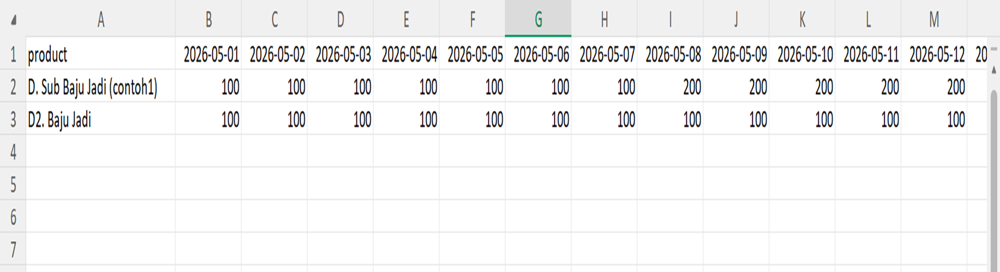
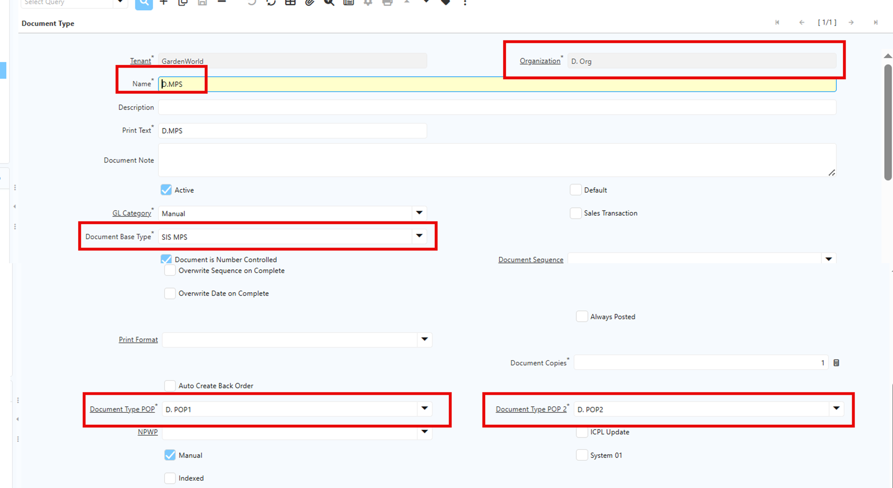
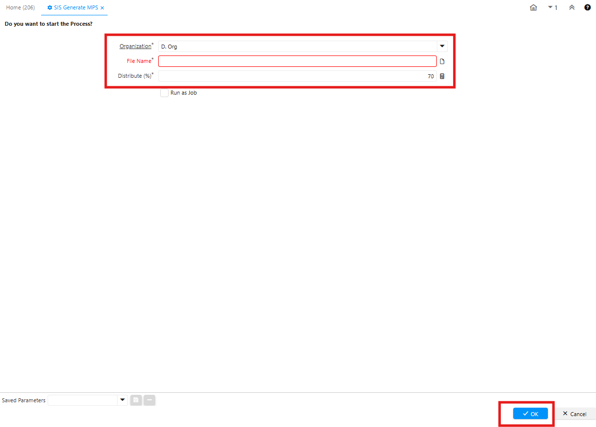
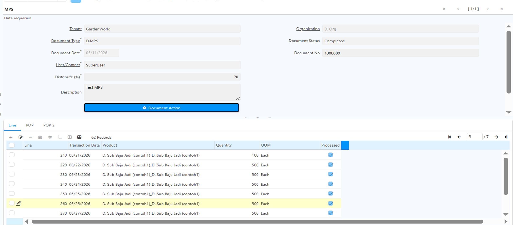
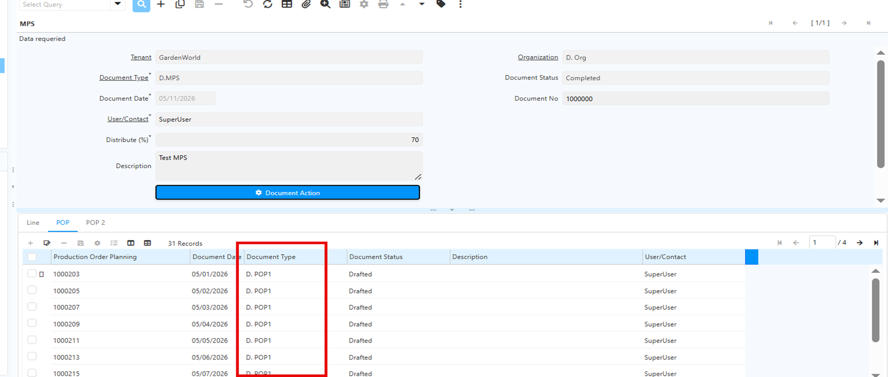

# Master Production Schedule

Master Production Schedule (MPS) adalah rencana produksi utama yang menentukan produk apa yang akan diproduksi, kapan diproduksi dan berapa jumlah yang diproduksi.

Master Production Schedule (MPS) ini menjadi penghubung antara forecast permintaan, sales order, kapasitas produksi dan kebutuhan material. 

Fungsi adanya MPS di sistem iDempiere adalah untuk:
1. Menjadwalkan produksi finished goods
2. Menentukan target produksi per periode
3. Mengontrol kapasitas produksi
4. Menghindari overstock maupun kekurangan stock

## Konfigurasi Sebelum Proses MPS

Sebelum menjalankan proses Master Production Schedule, pastikan beberapa hal berikut sudah disiapkan:
1. Template CSV sebagai sumber data produksi
2. Product yang akan dijadwalkan produksinya
3. Date schedule sebagai acuan tanggal rencana produksi

	 {#Figure25}
## Konfigurasi Document MPS

Sebelum menjalankan proses Generate MPS, lakukan konfigurasi Document Type MPS terlebih dahulu.
1. Nama Document Type MPS
2. Document Base MPS
3. Document Type POP, dibedakan menjadi 2, yaitu:
  - POP 1 -> Non System 01
  - POP 2 -> System 01

	 {#Figure26}

## Langkah Proses Master Production Schedule

1. Buka menu **Generate MPS**
2. Pilih organisasi yang akan digunakan
3. Pilih file **CSV** sebagai sumber data produksi
4. Tentukan nilai Distribute (%) untuk mengatur distribusi produksi antara:
  - Non System 01
  - System 01

	Sisa persentase dari distribusi Non System 01 akan otomatis dialokasikan ke System 01.

	 {#Figure27}

	
5. Jalankan proses **Generate MPS**.

6. Setelah proses berhasil, sistem akan membentuk dokumen MPS berdasarkan:
  - Tanggal produksi
  - Quantity produk
  - Mapping data pada file CSV

		 {#Figure28}

	
7. Setelah dokumen MPS di-Complete, sistem otomatis membentuk: POP 1 dan POP 2

	 {#Figure29}

8. Document Date pada POP yang terbentuk akan mengikuti Date Schedule yang telah ditentukan sebelumnya.
9. Dokumen POP yang terbentuk memiliki status **Draft** dan dapat di-Complete secara manual sesuai kebutuhan

Proses MPS akan menghasilkan dua dokumen Production Order Planning (POP):
- POP 1 → untuk pendistribusian Non System 01
- POP 2 → untuk pendistribusian System 01