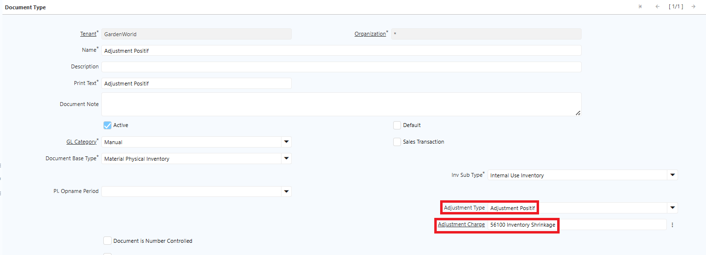

# Material Management
## Stock Opname

Stock Opname — atau dikenal sebagai **Physical Inventory** di iDempiere — adalah fitur untuk merekonsiliasi stok fisik di gudang dengan stok yang tercatat di sistem. Jika terdapat selisih antara quantity fisik dan quantity di sistem (_book_), selisih tersebut diproses sebagai penyesuaian.
### Langkah Proses Stock Opname

1. Buka menu **Physical Inventory**.
2. Klik **New**.
3. Input field pada header:
- **Warehouse** — Lokasi inventory yang akan diproses.
- **Movement Date** — Tanggal dilakukan perhitungan stok. 
- **Cost Center** — Dimensi tambahan untuk financial report.
4. Klik **Create Inventory Count List** — Sistem otomatis men-generate line dari daftar inventory di warehouse yang dipilih, dengan filter berikut:
- Locator — Lokasi dari warehouse yang diproses.
- Product Category — Kategori produk yang akan diproses.
- Inventory Qty — **Not 0** = hanya produk yang memiliki stok di locator
5. Klik **SIS Generate Inventory Charge Amount** — Menghitung biaya charging jika terdapat selisih minus.
6. Masuk ke **Inventory Count Line**, kemudian input field berikut:
- **Locator** — Lokasi dari warehouse yang diproses.
- **Product** — Produk yang akan diproses.
- **Qty Count** — Jumlah quantity fisik hasil perhitungan aktual.
- **Inventory Type** — Tipe charging untuk biaya yang dicatat.
- **Attribute** — ASI pada produk _(jika ada)_.
- **Charge** — Menentukan biaya yang akan dicatat atas selisih (plus atau minus).
7. Klik **Complete** pada dokumen Physical Inventory.

> **Catatan:** Jika ASI tidak diinput saat memproses Physical Inventory, sistem mengkalkulasi quantity berdasarkan artikel tanpa spesifikasi ke ASI atau batch/lot.

## Adjustment Plus dan Minus

Untuk mencatat penggunaan persediaan atau melakukan adjustment plus/minus tanpa melalui proses penjualan, gunakan fitur **Inventory Decrease/Increase**.
### Konfigurasi Document Type

Penentuan adjustment plus atau minus dikonfigurasi di level **Document Type**, sehingga adjustment plus dan minus menggunakan document type yang berbeda.

1. Buka menu **Document Type**.
2. Cari dokumen **Inventory Decrease/Increase**.
3. Pada field **Adjustment Type**, tentukan jenis adjustment yang digunakan untuk dokumen tersebut:
- - **Adjustment Negatif** — Dokumen khusus untuk adjustment negatif. Saat diproses, Internal Use Qty bernilai positif dan sistem **menambah** stok.
- **Adjustment Positif** — Dokumen khusus untuk adjustment positif. Saat diproses, Internal Use Qty bernilai negatif dan sistem **mengurangi** stok.

 {#Figure161}

4. Pada field **Charge**, input charge atas transaksi jika charge sudah ditentukan. Jika tidak, user dapat memilih charge secara manual saat transaksi.
5. Klik **Save**.
### Langkah Proses Inventory Decrease/Increase

1. Buka menu **Inventory Decrease/Increase**.
2. Input field pada header:
- **Warehouse** — Tentukan warehouse inventory yang akan diproses.
- **Movement Date** — Tanggal adjustment dilakukan.
- **Document Type** — Tipe dokumen yang digunakan.
- **Cost Center** — Dimensi tambahan untuk financial report.
3. Masuk ke **Internal Use Line**, kemudian input field berikut:
- **Locator** — Lokasi inventory yang akan diproses.
- **Product** — Artikel yang akan diproses.
- **Qty** — Quantity produk yang akan di-adjust.
- **Attribute Set Instance** — Nomor ASI yang akan diproses _(jika ada)_.
4. Klik **Save**.
5. Klik **Complete** pada dokumen Inventory Decrease/Increase.

### Ketentuan Adjustment

- **Adjustment Positif** — Menunjukkan adanya kelebihan stok yang harus dikurangi dari sistem. Sistem otomatis **mengurangi** stok produk.
- **Adjustment Negatif** — Menunjukkan adanya kekurangan stok yang harus ditambahkan ke sistem. Sistem otomatis **menambah** stok produk.

Setelah dokumen di-complete, sistem otomatis mengkalkulasi ulang quantity produk sesuai konfigurasi dan membentuk jurnal atas penyesuaian tersebut. Nilai jurnal mengikuti cost pada artikel.