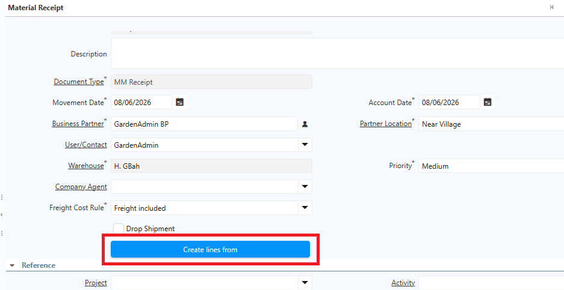
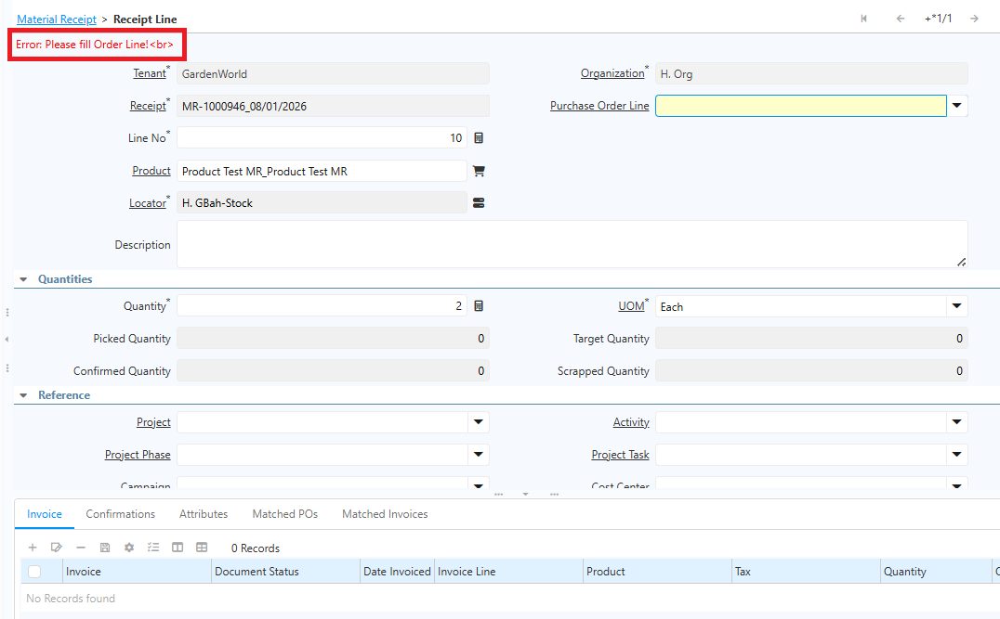

# Material Receipt

**Material Receipt (MR)** atau **BPB (Bukti Penerimaan Barang)** adalah transaksi di iDempiere yang digunakan untuk mencatat penerimaan barang atau material ke dalam warehouse. MR/BPB umumnya dibuat saat perusahaan menerima barang dari vendor berdasarkan Purchase Order (PO).

Ikuti langkah berikut untuk membuat Material Receipt secara manual:

1. Buka menu **Material Receipt**.
2. Tentukan **Business Partner**.
3. Tentukan **Warehouse**.
4. Klik **Create Lines From**.
5. Pilih dokumen **Purchase Order (PO)** yang akan diproses.
6. Klik **Create Lines From Shipment/Receipt**.

 {#Figure214}

7. Receipt Line terisi otomatis sesuai informasi di PO — meliputi produk, locator, dan quantity.
8. Klik **Save**.
9. Klik **Complete** pada dokumen Material Receipt.

> **Catatan:** MR Line wajib terhubung dengan PO Line. Jika tidak terhubung, sistem akan menampilkan pesan error bahwa Receipt Line harus terhubung dengan PO. Tidak ada Material Receipt yang dapat diproses tanpa referensi PO. Berikut contoh error yang muncul jika MR Line tidak terhubung dengan PO Line:

 {#Figure215}

## Ketentuan Movement Date pada MR

**Movement Date** pada Material Receipt menentukan tanggal terjadinya penerimaan barang. Sistem menerapkan batas tanggal agar transaksi MR/BPB tidak dapat diproses menggunakan tanggal yang tidak sesuai dengan periode yang diperbolehkan.
### Movement Date tidak boleh menggunakan future date

Movement Date tidak dapat melebihi tanggal saat dokumen diproses. Tanggal maksimal yang dapat digunakan adalah tanggal saat proses MR/BPB dilakukan.

Contoh:

- Tanggal proses: 20 Agustus
- Movement Date 20 Agustus → **diperbolehkan**
- Movement Date 21 Agustus → **tidak diperbolehkan**
### Movement Date memiliki batas minimum

Sistem menetapkan batas tanggal paling awal yang dapat digunakan. Jika Movement Date lebih kecil dari tanggal minimum yang diperbolehkan, MR/BPB tidak dapat diproses.

Batas minimum tanggal dikonfigurasi melalui field **Max MR Back Dated Days** pada Document Type MR/BPB. Field ini menentukan berapa hari ke belakang transaksi MR/BPB masih dapat menggunakan Movement Date.

Contoh:

- Tanggal proses: 20 Agustus
- **Max MR Back Dated Days**: 3 hari
- Movement Date yang diperbolehkan: **17–20 Agustus**

Jika tanggal yang diinput berada di luar rentang tersebut, sistem tidak mengizinkan MR/BPB untuk diproses.