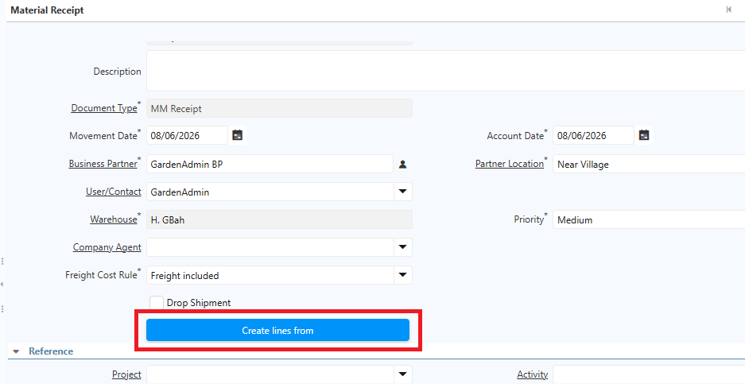
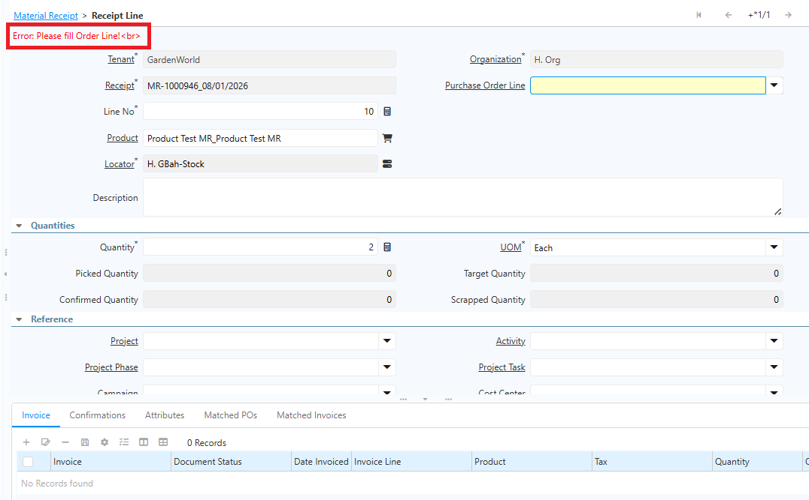
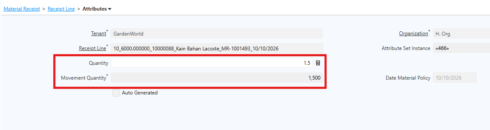

# Material Receipt

**Material Receipt (MR)** atau **BPB (Bukti Penerimaan Barang)** adalah transaksi di iDempiere yang digunakan untuk mencatat penerimaan barang atau material ke dalam warehouse. MR/BPB umumnya dibuat saat perusahaan menerima barang dari vendor berdasarkan Purchase Order (PO).

Ikuti langkah berikut untuk membuat Material Receipt secara manual:

1. Buka menu **Material Receipt**.
2. Tentukan **Business Partner**.
3. Tentukan **Warehouse**.
4. Klik **Create Lines From**.
5. Pilih dokumen **Purchase Order (PO)** yang akan diproses.
6. Klik **Create Lines From Shipment/Receipt**.

 {#Figure214}

7. Receipt Line terisi otomatis sesuai informasi di PO — meliputi produk, locator, dan quantity.
8. Klik **Save**.
9. Klik **Complete** pada dokumen Material Receipt.

> **Catatan:** MR Line wajib terhubung dengan PO Line. Jika tidak terhubung, sistem akan menampilkan pesan error bahwa Receipt Line harus terhubung dengan PO. Tidak ada Material Receipt yang dapat diproses tanpa referensi PO. Berikut contoh error yang muncul jika MR Line tidak terhubung dengan PO Line:

 {#Figure215}

## Ketentuan Movement Date pada MR

**Movement Date** pada Material Receipt menentukan tanggal terjadinya penerimaan barang. Sistem menerapkan batas tanggal agar transaksi MR/BPB tidak dapat diproses menggunakan tanggal yang tidak sesuai dengan periode yang diperbolehkan.
### Movement Date tidak boleh menggunakan future date

Movement Date tidak dapat melebihi tanggal saat dokumen diproses. Tanggal maksimal yang dapat digunakan adalah tanggal saat proses MR/BPB dilakukan.

Contoh:

- Tanggal proses: 20 Agustus
- Movement Date 20 Agustus → **diperbolehkan**
- Movement Date 21 Agustus → **tidak diperbolehkan**
### Movement Date memiliki batas minimum

Sistem menetapkan batas tanggal paling awal yang dapat digunakan. Jika Movement Date lebih kecil dari tanggal minimum yang diperbolehkan, MR/BPB tidak dapat diproses.

Batas minimum tanggal dikonfigurasi melalui field **Max MR Back Dated Days** pada Document Type MR/BPB. Field ini menentukan berapa hari ke belakang transaksi MR/BPB masih dapat menggunakan Movement Date.

Contoh:

- Tanggal proses: 20 Agustus
- **Max MR Back Dated Days**: 3 hari
- Movement Date yang diperbolehkan: **17–20 Agustus**

Jika tanggal yang diinput berada di luar rentang tersebut, sistem tidak mengizinkan MR/BPB untuk diproses.
## Validasi Quantity MR/BPB terhadap PO dan ASI

Sistem melakukan validasi quantity pada **Material Receipt (MR)/BPB** untuk memastikan quantity barang yang diterima sesuai dengan quantity yang tercantum pada **Purchase Order (PO)**. Jika transaksi menggunakan **ASI**, sistem juga melakukan validasi terhadap quantity yang tercantum pada ASI.

Validasi ini bertujuan untuk memastikan quantity penerimaan tidak melebihi batas yang diperbolehkan serta menjaga kesesuaian antara dokumen PO, ASI, dan MR/BPB.
### Ketentuan Quantity MR/BPB terhadap PO

Quantity yang diproses pada MR/BPB tidak boleh melebihi quantity pada PO. Sistem akan membandingkan quantity yang akan diterima dengan sisa quantity PO yang masih dapat diterima.

Jika product memiliki **allowance**, sistem memperbolehkan quantity MR/BPB melebihi quantity PO sesuai dengan batas allowance yang telah ditentukan.

Allowance berfungsi sebagai batas toleransi penerimaan dan hanya dapat digunakan sampai dengan nilai yang telah ditentukan. Jika quantity MR/BPB melebihi quantity PO dan juga melewati batas allowance, sistem akan menolak proses MR/BPB. Sistem juga memperhitungkan quantity yang telah diterima sebelumnya sehingga user tidak dapat melakukan penerimaan melebihi total quantity yang masih diperbolehkan.
### Ketentuan Quantity dengan ASI

Untuk transaksi yang menggunakan **ASI**, quantity yang tercantum pada ASI harus sesuai dengan quantity yang diproses pada MR.

Sistem melakukan validasi dengan membandingkan quantity ASI dengan quantity pada MR. **Quantity ASI dan quantity MR harus sama** agar MR dapat diproses. Apabila terdapat perbedaan quantity antara ASI dan MR, sistem tidak dapat memproses MR sampai quantity pada keduanya tersebut disesuaikan.

Ketentuan ini berlaku baik apabila quantity MR lebih kecil maupun lebih besar dari quantity yang tercantum pada ASI.

### Informasi Qty ASI di MR/BPB

Untuk produk yang memiliki ASI, user perlu menjalankan **Generate Distribute Attribute** saat melakukan penerimaan barang (Material Receipt) dan menentukan jumlah _lines_ atau batch yang akan di-generate. Setelah di-generate, user dapat melihat hasil dan nomor ASI pada tab **Attribute**.

Pada tab Attribute terdapat dua informasi quantity:

- **Qty Entered** — Menampilkan quantity dalam satuan UoM sesuai PO yang ada di Receipt Line. User perlu menginput nilai ini secara manual dan masih dapat diedit sebelum dokumen di-complete.
- **Movement Qty** — Menampilkan quantity dalam satuan **Base UoM**.

 {#Figure349}

Field Qty Entered bertujuan untuk mengakomodasi perbedaan antara Qty Entered dan Movement Qty yang disebabkan oleh konversi UoM. Sistem akan melakukan pembulatan ke depan pada Qty Entered saat konversi dilakukan.istem akan melakukan pembulatan ke depan.