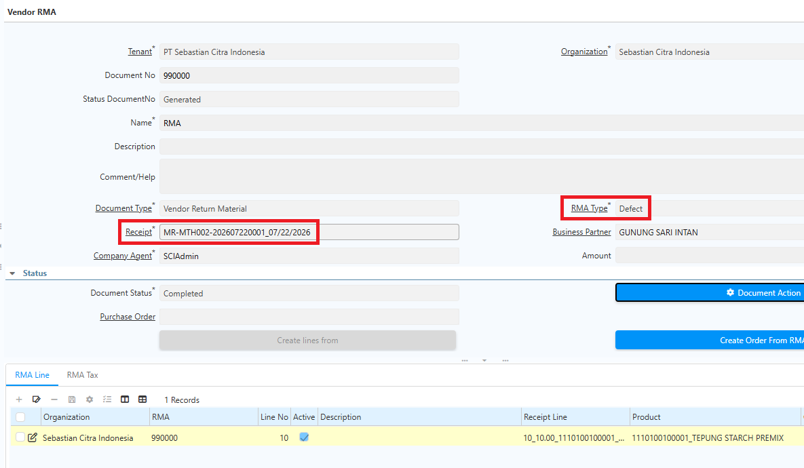
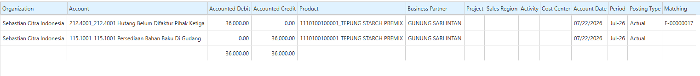
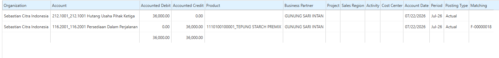
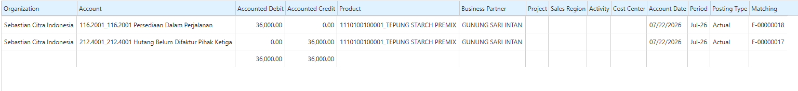

# Mekanisme Movement

**Inventory Move** digunakan untuk memindahkan persediaan dari satu locator ke locator lain, baik dalam warehouse yang sama maupun antar warehouse. Proses ini hanya mengubah lokasi penyimpanan barang dan **tidak mengubah nilai persediaan (inventory value).**

Sistem iDempiere menyediakan dua mekanisme perpindahan persediaan:

- **Movement Langsung** – Memindahkan produk langsung dari locator asal ke locator tujuan tanpa melalui locator In-Transit.
- **Movement Standard** – Memindahkan produk antar warehouse melalui warehouse dan locator **In-Transit** sebelum diterima di warehouse tujuan.

Pada **Movement Standard**, perpindahan barang terdiri dari dua tahap, yaitu **Delivery** (pengiriman) dan **Receipt** (penerimaan). Barang tidak langsung masuk ke warehouse tujuan, tetapi terlebih dahulu berada pada status **In-Transit**, sehingga proses perpindahan dapat dipantau dengan lebih akurat.

Karena proses Delivery dan Receipt saling terhubung, lakukan konfigurasi dua **Document Type**, yaitu **Movement Standard Delivery** dan **Movement Standard Receipt**.
## Konfigurasi Document Type

### Document Type Movement Langsung

1. Buka menu **Document Type**.
2. Klik **New**.
3. Isi **Name** sesuai kebutuhan operasional.
4. Pada field **Document Base Type**, pilih **Material Movement**.
5. Pada field **Internal Use Doc Type**, tentukan dokumen Internal Use yang digunakan.
6. Centang field **Auto Create Back Order**.
7. Klik **Save**.
### Document Type Movement Penerimaan (Receipt)

1. Buka menu **Document Type**.
2. Klik **New**.
3. Isi **Name** sesuai kebutuhan operasional.
4. Pada field **Document Base Type**, pilih **Material Movement**.
5. Pada field **Internal Use Doc Type**, tentukan dokumen Internal Use yang digunakan.
6. Centang field **Auto Create Back Order**.
7. Klik **Save**.
### Document Type Movement Pengiriman (Delivery)

1. Buka menu **Document Type**.
2. Klik **New**.
3. Isi **Name** sesuai kebutuhan operasional.
4. Pada field **Document Base Type**, pilih **Material Movement**.
5. Pada field **Internal Use Doc Type**, tentukan dokumen Internal Use yang digunakan.
6. Pada field **Warehouse Intransit**, tentukan warehouse yang digunakan untuk intransit.
7. Pada field **Locator Intransit**, tentukan locator yang digunakan untuk intransit.
8. Pada field **Document Type Receipt**, pilih document Movement Penerimaan yang telah dikonfigurasi.
9. Klik **Save**.
## Implementasi Movement Standard

### Proses Pengiriman (Delivery)

1. Buka menu **Inventory Move**.
2. Tentukan **Document Type** yang akan digunakan.
3. Tentukan **Warehouse** asal dan **Warehouse** tujuan.
4. Klik **Save**.
5. Masuk ke **Move Line**.
6. Tentukan **produk** yang akan diproses.
7. Tentukan **Locator** asal dan **Locator** tujuan.
8. Tentukan **quantity** produk yang akan diproses.
9. Klik **Save**.
10. Klik **Complete** pada dokumen Movement.

Saat Movement di-complete, warehouse dan locator tujuan otomatis berubah menjadi warehouse dan locator **In-Transit** sesuai konfigurasi document type. Sistem juga otomatis membuat **Movement Receipt** dari In-Transit ke warehouse dan locator tujuan, beserta informasi **Movement Source/Target** sesuai alur perpindahan barang.

 {#Figure148}
### Proses Penerimaan (Receipt)

Setelah produk berpindah ke warehouse intransit, proses Movement Receipt untuk memindahkan produk ke warehouse dan locator tujuan. Ikuti langkah berikut:

1. Buka menu **Inventory Move**.
2. Cari dokumen dengan memfilter **Movement Source/Target** — input Movement Source/Target yang tercantum di dokumen Movement Delivery.
3. Masuk ke **Move Line**.
4. Tentukan **quantity** produk yang akan diproses.
5. Klik **Save**.
6. Klik **Complete** pada dokumen Movement.

Jika quantity yang diterima hanya sebagian (_parsial_), sistem otomatis membuat **back order** atas kekurangan quantity tersebut yang dapat ditelusuri melalui **Movement Source/Target**.
## Return to Vendor

**Return to Vendor** digunakan untuk mengembalikan barang kepada vendor atas barang yang sebelumnya diterima melalui proses pembelian. Saat proses ini dijalankan, sistem akan mengurangi stok, mencatat transaksi pengembalian, dan menjaga konsistensi data inventory serta transaksi pembelian.
### Konfigurasi RMA Type

Sebelum melakukan **Return to Vendor**, buat terlebih dahulu **RMA Type** sebagai kategori atau alasan pengembalian barang. Langkah konfigurasi:

1. Buka menu **RMA Type**.
2. Isi **Name** sesuai kebutuhan operasional.

 {#Figure197}

3. Klik **Save**.
### Konfigurasi Vendor RMA

**Vendor RMA** berfungsi sebagai dokumen otorisasi pengembalian barang kepada vendor. Dokumen ini menghubungkan proses Return to Vendor dengan **Material Receipt** yang menjadi referensi. Langkah konfigurasi:

1. Buka menu **Vendor RMA**.
2. Pilih **Document Type**.
3. Tentukan **RMA Type**.
4. Pada field **Receipt**, pilih dokumen **Material Receipt** yang akan direferensikan.

 {#Figure198}

5. Buka tab **RMA Line**.
6. Pilih **Receipt Line** yang akan dikembalikan.
7. Klik **Save**.
8. Klik **Complete**.
### Langkah Proses Return to Vendor

1. Buka menu **Return to Vendor**.
2. Pilih **Document Type**.
3. Tentukan **Movement Date**.
4. Pilih **Business Partner**.
5. Tentukan **Warehouse** tempat penyimpanan barang.
6. Klik **Create Lines From**.
7. Pilih dokumen **Vendor RMA** yang telah dibuat.

  {#Figure199}

8. Klik **Complete**.

Setelah dokumen **Return to Vendor** di-_complete_, sistem akan:

- Mengurangi stok sesuai quantity yang dikembalikan.
- Mencatat perpindahan barang keluar dari warehouse.
- Membentuk jurnal Return to Vendor.

 {#Figure190}

- Menyimpan riwayat pengembalian pada menu **Product**, tab **Transactions** dan **Located At**.
### Pembuatan AP Credit Memo

Setelah proses **Return to Vendor** selesai, buat **AP Credit Memo** sebagai dokumen koreksi atas transaksi pembelian.

Langkah-langkahnya sebagai berikut:

1. Buka dokumen **Return to Vendor**.
2. Klik tombol **Settings**.
3. Pilih **Generate Invoice From Receipt**.
4. Klik **OK**.

Sistem akan secara otomatis:

- Membuat dokumen **AP Credit Memo**.
- Menyalin seluruh informasi dari dokumen **Return to Vendor** ke **Invoice Line**.
- Menyelesaikan dokumen dengan status **Complete**.

Selanjutnya sistem membentuk jurnal **AP Credit Memo** sesuai transaksi yang dihasilkan.

 {#Figure191}

Selain itu, sistem juga menjalankan proses **Matching** antara transaksi **Return to Vendor** dan **AP Credit Memo** sehingga tidak terdapat saldo maupun akun yang masih menggantung pada proses pembelian.

 {#Figure192}