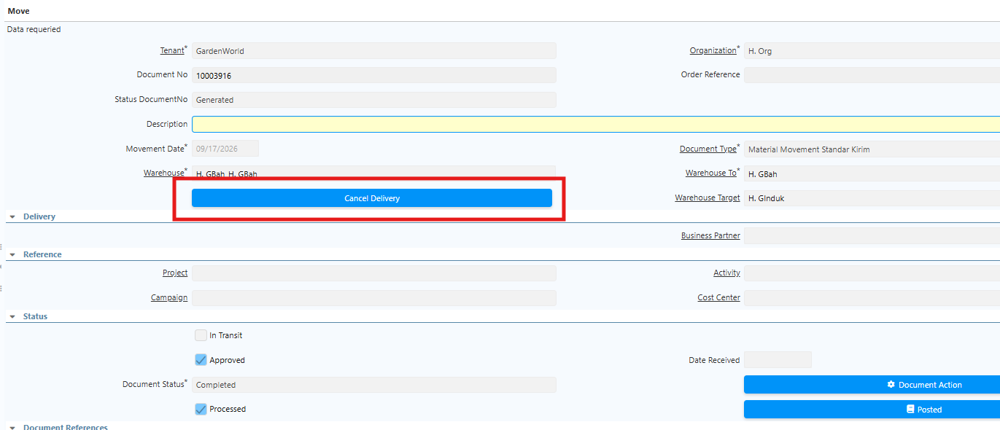
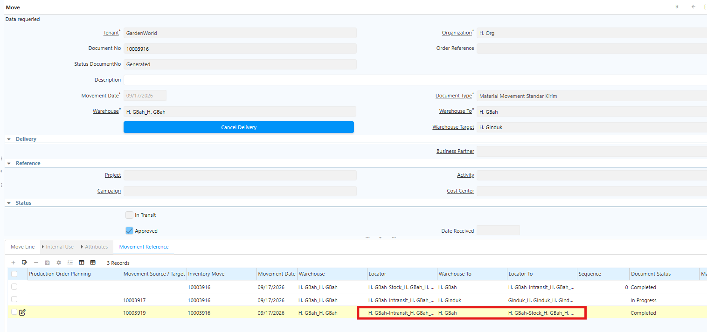

# Mekanisme Movement

**Inventory Move** digunakan untuk memindahkan persediaan dari satu locator ke locator lain, baik dalam warehouse yang sama maupun antar warehouse. Proses ini hanya mengubah lokasi penyimpanan barang dan **tidak mengubah nilai persediaan (inventory value).**

Sistem iDempiere menyediakan dua mekanisme perpindahan persediaan:

- **Movement Langsung** – Memindahkan produk langsung dari locator asal ke locator tujuan tanpa melalui locator In-Transit.
- **Movement Standard** – Memindahkan produk antar warehouse melalui warehouse dan locator **In-Transit** sebelum diterima di warehouse tujuan.

Pada **Movement Standard**, perpindahan barang terdiri dari dua tahap, yaitu **Delivery** (pengiriman) dan **Receipt** (penerimaan). Barang tidak langsung masuk ke warehouse tujuan, tetapi terlebih dahulu berada pada status **In-Transit**, sehingga proses perpindahan dapat dipantau dengan lebih akurat.

Karena proses Delivery dan Receipt saling terhubung, lakukan konfigurasi dua **Document Type**, yaitu **Movement Standard Delivery** dan **Movement Standard Receipt**.
## Konfigurasi Document Type

### Document Type Movement Langsung

1. Buka menu **Document Type**.
2. Klik **New**.
3. Isi **Name** sesuai kebutuhan operasional.
4. Pada field **Document Base Type**, pilih **Material Movement**.
5. Pada field **Internal Use Doc Type**, tentukan dokumen Internal Use yang digunakan.
6. Centang field **Auto Create Back Order**.
7. Klik **Save**.
### Document Type Movement Penerimaan (Receipt)

1. Buka menu **Document Type**.
2. Klik **New**.
3. Isi **Name** sesuai kebutuhan operasional.
4. Pada field **Document Base Type**, pilih **Material Movement**.
5. Pada field **Internal Use Doc Type**, tentukan dokumen Internal Use yang digunakan.
6. Centang field **Auto Create Back Order**.
7. Klik **Save**.
### Document Type Movement Pengiriman (Delivery)

1. Buka menu **Document Type**.
2. Klik **New**.
3. Isi **Name** sesuai kebutuhan operasional.
4. Pada field **Document Base Type**, pilih **Material Movement**.
5. Pada field **Internal Use Doc Type**, tentukan dokumen Internal Use yang digunakan.
6. Pada field **Warehouse Intransit**, tentukan warehouse yang digunakan untuk intransit.
7. Pada field **Locator Intransit**, tentukan locator yang digunakan untuk intransit.
8. Pada field **Document Type Receipt**, pilih document Movement Penerimaan yang telah dikonfigurasi.
9. Klik **Save**.
## Implementasi Movement Standard

### Proses Pengiriman (Delivery)

1. Buka menu **Inventory Move**.
2. Tentukan **Document Type** yang akan digunakan.
3. Tentukan **Warehouse** asal dan **Warehouse** tujuan.
4. Klik **Save**.
5. Masuk ke **Move Line**.
6. Tentukan **produk** yang akan diproses.
7. Tentukan **Locator** asal dan **Locator** tujuan.
8. Tentukan **quantity** produk yang akan diproses.
9. Klik **Save**.
10. Klik **Complete** pada dokumen Movement.

Saat Movement di-complete, warehouse dan locator tujuan otomatis berubah menjadi warehouse dan locator **In-Transit** sesuai konfigurasi document type. Selain itu, field **Warehouse Target** — yaitu warehouse tujuan movement — akan muncul secara otomatis.

 {#Figure258}

Sistem juga otomatis membuat **Movement Receipt** dari In-Transit ke warehouse dan locator tujuan, beserta informasi **Movement Source/Target** sesuai alur perpindahan barang.

 {#Figure148}
### Proses Penerimaan (Receipt)

Setelah produk berpindah ke warehouse intransit, proses Movement Receipt untuk memindahkan produk ke warehouse dan locator tujuan. Ikuti langkah berikut:

1. Buka menu **Inventory Move**.
2. Cari dokumen dengan memfilter **Movement Source/Target** — input Movement Source/Target yang tercantum di dokumen Movement Delivery.
3. Masuk ke **Move Line**.
4. Tentukan **quantity** produk yang akan diproses.
5. Klik **Save**.
6. Klik **Complete** pada dokumen Movement.

Jika quantity yang diterima hanya sebagian (_parsial_), sistem otomatis membuat **back order** atas kekurangan quantity tersebut yang dapat ditelusuri melalui **Movement Source/Target**.
## Ekspedisi

Movement dengan Ekspedisi digunakan untuk mencatat perpindahan barang antar warehouse yang melibatkan pihak ekspedisi atau proses pengiriman. Mekanisme ini memisahkan proses pengiriman dari proses penerimaan barang di warehouse tujuan, sehingga status barang dapat dipantau selama proses distribusi.
### Konfigurasi Ekspedisi

Sebelum melakukan movement dengan ekspedisi, lakukan konfigurasi pada warehouse asal. Ikuti langkah berikut:

1. Buka menu **Warehouse and Locators**.
2. Input **Search Key** dan **Name** untuk warehouse.
3. Input **alamat** warehouse.
4. Centang field **Source Expedition**.

 {#Figure208}

5. Klik **Save**.

### Mekanisme Ekspedisi

#### Membuat Dokumen Movement

1. Buka menu **Inventory Move**.
2. Tentukan **warehouse asal** yang telah dikonfigurasi dan **warehouse tujuan**.

 {#Figure209}

3. Masuk ke **Move Line**.
4. Tentukan **produk** yang akan diproses.
5. Tentukan **quantity** produk.
6. Tentukan **Locator** asal dan **Locator** tujuan.
7. Klik **Save**.
8. Klik **Complete** pada dokumen Inventory Move.

Dokumen Inventory Move ini digunakan sebagai acuan oleh pihak gudang untuk memproses produk melalui ekspedisi.
#### Proses Pengiriman (Ekspedisi)

1. Buka menu **SIS Expedition**.
2. Tentukan **Document Date**.
3. Tentukan **Business Partner** — dalam hal ini adalah pihak ekspedisi.
4. Masuk ke tab **Line**.
5. Input dokumen **Inventory Move** yang akan diproses.
6. Tentukan **quantity** produk yang akan diproses.

 {#Figure210}

7. Klik **Save**.
8. Klik **Complete** pada dokumen.

Saat nomor Inventory Move diinput, field **Warehouse** terisi otomatis sesuai warehouse tujuan di Inventory Move tersebut — user tidak dapat menginput warehouse tujuan secara manual di dokumen ekspedisi.

Setelah dokumen di-complete, sistem otomatis menandai dokumen Inventory Move terkait dengan flag **SIS_Expedition = Y**, yang berarti dokumen tersebut tidak dapat digunakan untuk proses pengiriman ekspedisi lain. Field **Active** pada Line SIS Expedition juga tercentang secara otomatis.
#### Pembatalan Ekspedisi

Jika proses pengiriman mengalami kendala, lakukan pembatalan ekspedisi dengan langkah berikut:

1. Buka menu **SIS Expedition**.
2. Pilih dokumen ekspedisi yang akan dibatalkan.
3. Masuk ke tab **Line**.
4. Klik **Cancel Expedition**.

 {#Figure211}

Saat ekspedisi dibatalkan, field **Active** pada Line akan ter-uncheck secara otomatis. Flag **SIS_Expedition** pada dokumen Inventory Move terkait juga direset, sehingga dokumen tersebut dapat ditautkan ke dokumen ekspedisi yang baru.

 {#Figure212}

> **Catatan:** Jika pengiriman dilakukan secara bertahap, gunakan dokumen Movement yang berbeda untuk setiap tahap pengiriman agar setiap pengiriman memiliki dokumen ekspedisi dan penerimaan tersendiri.

## Pembatalan Sebagian

**Pembatalan Sebagian** digunakan untuk membatalkan **produk tertentu** pada dokumen **Inventory Move Delivery** tanpa harus membatalkan seluruh produk dalam satu dokumen. Pembatalan dilakukan pada level **Inventory Move Line** dengan ketentuan sebagai berikut:

- Pembatalan sebagian hanya dapat dilakukan apabila dokumen Inventory Move Delivery sudah berstatus **Complete**.
- Pembatalan dilakukan **per line**, bukan per qty. Apabila satu line dibatalkan, maka **seluruh qty** yang ada di line tersebut akan ikut dibatalkan.

### Proses Pembatalan Sebagian

1. Buka menu **Inventory Move**.
2. Tentukan dokumen **Inventory Move Delivery** yang akan diproses dan berstatus **complete**.
3. Setelah dokumen berstatus Complete, sistem akan menampilkan button **Cancel Delivery**.

 {#Figure300}

4. Klik button **Cancel Delivery** untuk memulai proses pembatalan.
5. Pilih **Inventory Move Line** yang akan dibatalkan.

 {#Figure301}

6. Klik **SIS Cancel Delivery**.

Setelah pembatalan dilakukan, sistem secara otomatis akan membentuk **Inventory Move pembalik** untuk Inventory Move Line yang dibatalkan. Sistem juga akan menyesuaikan dokumen **Inventory Move Receipt** yang terkait dengan Inventory Move Delivery tersebut. 

 {#Figure302}

Inventory Move Line yang dibatalkan akan **terhapus secara otomatis** dari Inventory Move Receipt. Inventory Move Line yang tidak dibatalkan tetap tersedia pada Inventory Move Receipt dan dapat dilanjutkan ke proses penerimaan.

Dengan demikian, apabila dalam satu Inventory Move Delivery terdapat beberapa produk dan hanya sebagian produk yang dibatalkan, maka **hanya produk yang tidak dibatalkan yang akan diproses pada Inventory Move Receipt**.