# Mekanisme Movement

**Inventory Move** digunakan untuk memindahkan persediaan dari satu locator ke locator lain, baik dalam warehouse yang sama maupun antar warehouse. Proses ini hanya mengubah lokasi penyimpanan barang dan **tidak mengubah nilai persediaan (inventory value).**

Sistem iDempiere menyediakan dua mekanisme perpindahan persediaan:

- **Movement Langsung** – Memindahkan produk langsung dari locator asal ke locator tujuan tanpa melalui locator In-Transit.
- **Movement Standard** – Memindahkan produk antar warehouse melalui warehouse dan locator **In-Transit** sebelum diterima di warehouse tujuan.

Pada **Movement Standard**, perpindahan barang terdiri dari dua tahap, yaitu **Delivery** (pengiriman) dan **Receipt** (penerimaan). Barang tidak langsung masuk ke warehouse tujuan, tetapi terlebih dahulu berada pada status **In-Transit**, sehingga proses perpindahan dapat dipantau dengan lebih akurat.

Karena proses Delivery dan Receipt saling terhubung, lakukan konfigurasi dua **Document Type**, yaitu **Movement Standard Delivery** dan **Movement Standard Receipt**.
## Konfigurasi Document Type

### Document Type Movement Langsung

1. Buka menu **Document Type**.
2. Klik **New**.
3. Isi **Name** sesuai kebutuhan operasional.
4. Pada field **Document Base Type**, pilih **Material Movement**.
5. Pada field **Internal Use Doc Type**, tentukan dokumen Internal Use yang digunakan.
6. Centang field **Auto Create Back Order**.
7. Klik **Save**.
### Document Type Movement Penerimaan (Receipt)

1. Buka menu **Document Type**.
2. Klik **New**.
3. Isi **Name** sesuai kebutuhan operasional.
4. Pada field **Document Base Type**, pilih **Material Movement**.
5. Pada field **Internal Use Doc Type**, tentukan dokumen Internal Use yang digunakan.
6. Centang field **Auto Create Back Order**.
7. Klik **Save**.
### Document Type Movement Pengiriman (Delivery)

1. Buka menu **Document Type**.
2. Klik **New**.
3. Isi **Name** sesuai kebutuhan operasional.
4. Pada field **Document Base Type**, pilih **Material Movement**.
5. Pada field **Internal Use Doc Type**, tentukan dokumen Internal Use yang digunakan.
6. Pada field **Warehouse Intransit**, tentukan warehouse yang digunakan untuk intransit.
7. Pada field **Locator Intransit**, tentukan locator yang digunakan untuk intransit.
8. Pada field **Document Type Receipt**, pilih document Movement Penerimaan yang telah dikonfigurasi.
9. Klik **Save**.
## Implementasi Movement Standard

### Proses Pengiriman (Delivery)

1. Buka menu **Inventory Move**.
2. Tentukan **Document Type** yang akan digunakan.
3. Tentukan **Warehouse** asal dan **Warehouse** tujuan.
4. Klik **Save**.
5. Masuk ke **Move Line**.
6. Tentukan **produk** yang akan diproses.
7. Tentukan **Locator** asal dan **Locator** tujuan.
8. Tentukan **quantity** produk yang akan diproses.
9. Klik **Save**.
10. Klik **Complete** pada dokumen Movement.

Saat Movement di-complete, warehouse dan locator tujuan otomatis berubah menjadi warehouse dan locator **In-Transit** sesuai konfigurasi document type. Selain itu, field **Warehouse Target** — yaitu warehouse tujuan movement — akan muncul secara otomatis.

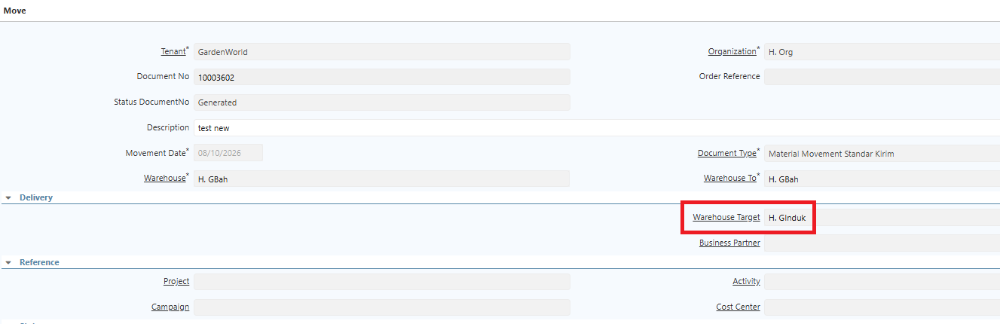 {#Figure258}

Sistem juga otomatis membuat **Movement Receipt** dari In-Transit ke warehouse dan locator tujuan, beserta informasi **Movement Source/Target** sesuai alur perpindahan barang.

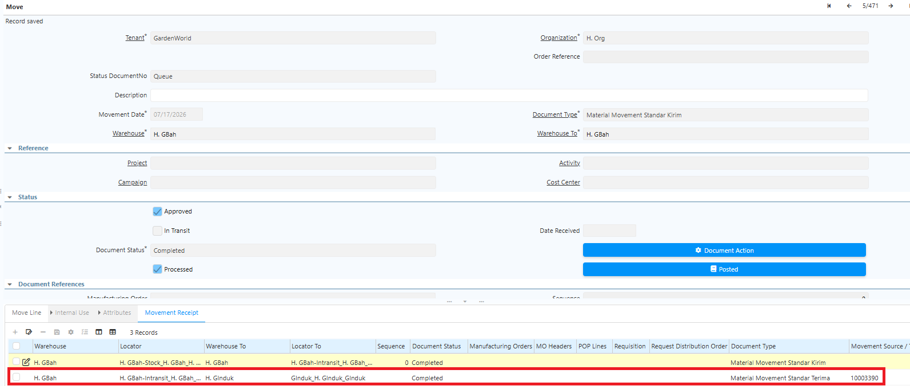 {#Figure148}
### Proses Penerimaan (Receipt)

Setelah produk berpindah ke warehouse intransit, proses Movement Receipt untuk memindahkan produk ke warehouse dan locator tujuan. Ikuti langkah berikut:

1. Buka menu **Inventory Move**.
2. Cari dokumen dengan memfilter **Movement Source/Target** — input Movement Source/Target yang tercantum di dokumen Movement Delivery.
3. Masuk ke **Move Line**.
4. Tentukan **quantity** produk yang akan diproses.
5. Klik **Save**.
6. Klik **Complete** pada dokumen Movement.

Jika quantity yang diterima hanya sebagian (_parsial_), sistem otomatis membuat **back order** atas kekurangan quantity tersebut yang dapat ditelusuri melalui **Movement Source/Target**.
## Return to Vendor

**Return to Vendor** digunakan untuk mengembalikan barang kepada vendor atas barang yang sebelumnya diterima melalui proses pembelian. Saat proses ini dijalankan, sistem akan mengurangi stok, mencatat transaksi pengembalian, dan menjaga konsistensi data inventory serta transaksi pembelian.
### Konfigurasi RMA Type

Sebelum melakukan **Return to Vendor**, buat terlebih dahulu **RMA Type** sebagai kategori atau alasan pengembalian barang. Langkah konfigurasi:

1. Buka menu **RMA Type**.
2. Isi **Name** sesuai kebutuhan operasional.

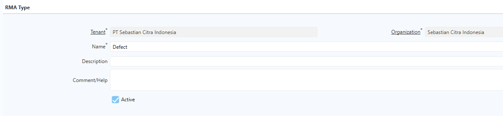 {#Figure197}

3. Klik **Save**.
### Konfigurasi Vendor RMA

**Vendor RMA** berfungsi sebagai dokumen otorisasi pengembalian barang kepada vendor. Dokumen ini menghubungkan proses **Return to Vendor** dengan **Material Receipt** yang menjadi referensi.

Saat membuat Vendor RMA, user dapat memilih **UoM** atas produk yang akan di-return — apakah menggunakan **Base UoM** atau **UoM Conversion**. UoM yang dikonfigurasi di Vendor RMA otomatis disalin ke dokumen **Return to Vendor** dan **AP Credit Memo**, sehingga UoM yang digunakan pada ketiga dokumen tersebut tetap selaras.

Langkah konfigurasi:

1. Buka menu **Vendor RMA**.
2. Pilih **Document Type**.
3. Tentukan **RMA Type**.
4. Pada field **Receipt**, pilih dokumen **Material Receipt** yang akan direferensikan.

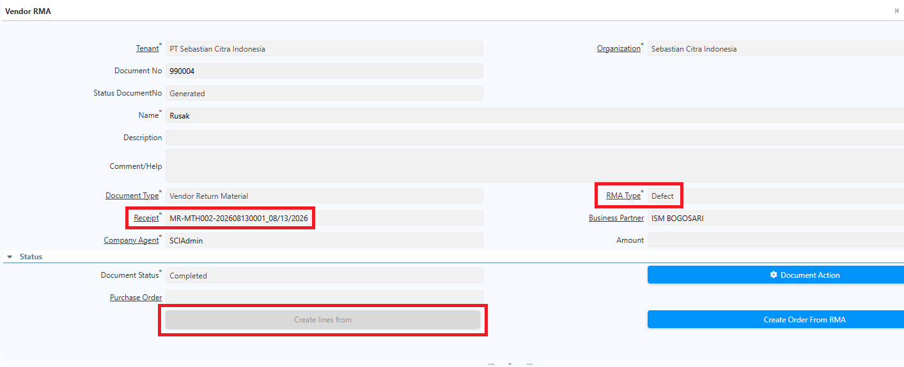 {#Figure198}

5. Klik **Create Lines From**.
6. Pilih **Material Receipt** yang akan diproses.
7. Buka tab **RMA Line**.
8. Tentukan **UoM** atas produk yang akan di-return.
9. Tentukan **quantity** produk yang akan di-return.

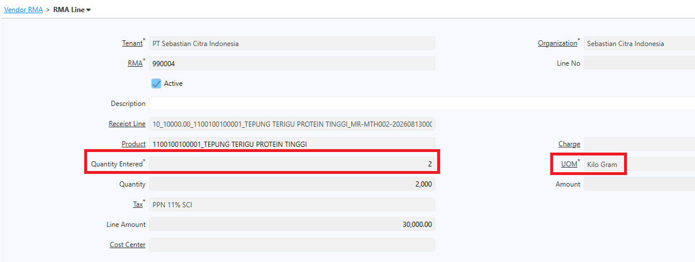 {#Figure242}

11. Klik **Save**.
12. Klik **Complete**.

### Konfigurasi Document Type Return to Vendor

1. Buka menu **Document Type**.
2. Klik **New**.
3. Isi **Name** sesuai kebutuhan operasional.
4. Pada field **Document Base Type**, pilih **Material Delivery**.
5. Centang field **Document Number Is Controlled**.
6. Centang field **MR. Auto Invoice AP**

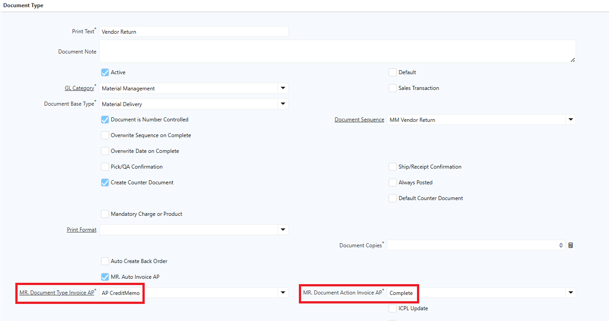 {#Figure241}

7. Pada field **MR. Document Type Invoice AP**, pilih document AP Credit Memo yang telah dikonfigurasi.
8. Pada field **MR. Document Action Invoice AP**, pilih document action untuk menentukan status invoice credit memo yang ter-generate — _Prepare_ atau _Complete_
9. Klik **Save**.
### Langkah Proses Return to Vendor

1. Buka menu **Return to Vendor**.
2. Pilih **Document Type**.
3. Tentukan **Movement Date**.
4. Pilih **Business Partner**.
5. Tentukan **Warehouse** tempat penyimpanan barang.
6. Klik **Create Lines From**.
7. Pilih dokumen **Vendor RMA** yang telah dibuat.

  {#Figure199}

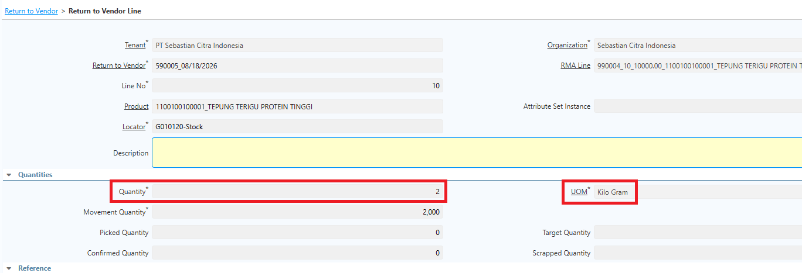 {#Figure243}

8. Klik **Complete**.

Setelah dokumen Return to Vendor di-_complete_, sistem akan:

- Mengurangi stok sesuai kuantitas barang yang dikembalikan.
- Mencatat transaksi pengeluaran barang dari warehouse.
- Membentuk jurnal akuntansi Return to Vendor.

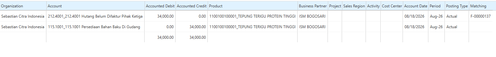 {#Figure190}

- Menyimpan riwayat transaksi pada tab Transactions dan Located At di menu Product.
- Membuat dokumen AP Credit Memo dengan status Complete.
### AP Credit Memo

Setelah proses **Return to Vendor** selesai, sistem secara otomatis:

- Membuat dokumen **AP Credit Memo**.
- Menyalin seluruh informasi transaksi dari **Return to Vendor** ke **Invoice Line** pada AP Credit Memo.

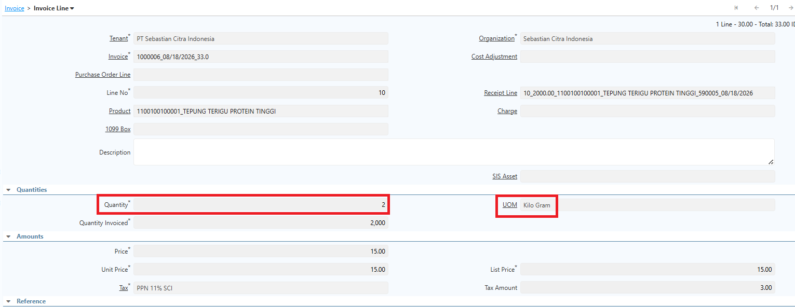 {#Figure244}

- Menyelesaikan dokumen dengan status **Complete**.
- Membentuk jurnal akuntansi **AP Credit Memo** sesuai transaksi yang dihasilkan.

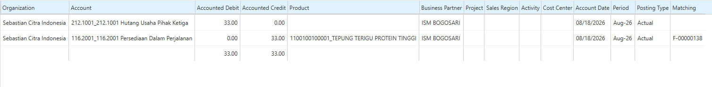 {#Figure191}

Selanjutnya, sistem menjalankan proses **Matching** antara transaksi **Return to Vendor** dan **AP Credit Memo**. Proses ini memastikan nilai transaksi pembelian telah direkonsiliasi sehingga tidak terdapat saldo maupun akun pembelian yang masih menggantung.

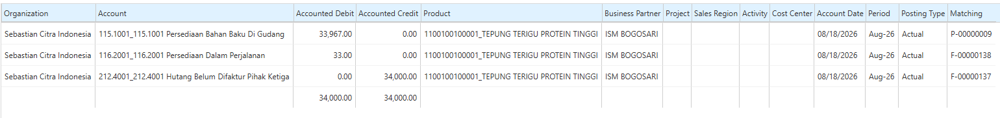 {#Figure192}

#### Allocation AP Credit Memo

Selain membuat **AP Credit Memo**, sistem juga melakukan proses **Allocation** secara otomatis terhadap invoice pembelian yang masih memiliki saldo outstanding. Mekanisme allocation berjalan sebagai berikut:
##### Invoice masih outstanding

Sistem mengalokasikan **AP Credit Memo** dengan invoice pembelian sehingga saldo tagihan berkurang sesuai nilai pengembalian barang.

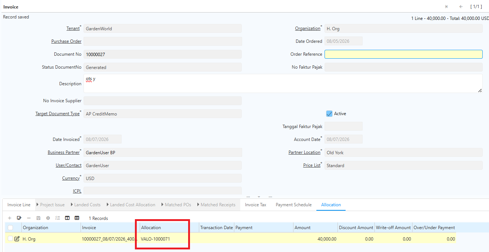 {#Figure215}
##### Invoice telah dibayar sebagian (Partial Payment)  

Sistem tetap melakukan allocation antara **AP Credit Memo** dan invoice pembelian. Allocation dilakukan terhadap sisa tagihan yang masih outstanding sehingga nilai hutang tersisa berkurang sesuai nominal AP Credit Memo.

") {#Figure216}
##### Invoice telah dibayar penuh (Fully Paid)  

Sistem tetap membuat **AP Credit Memo**, namun tidak melakukan allocation karena invoice pembelian telah lunas dan seluruh nilainya telah dialokasikan ke transaksi pembayaran sebelumnya. Dalam kondisi ini, AP Credit Memo tetap tersedia sebagai saldo kredit yang dapat dimanfaatkan pada transaksi berikutnya sesuai kebijakan perusahaan.

"){#Figure217}
## Ekspedisi

Movement dengan Ekspedisi digunakan untuk mencatat perpindahan barang antar warehouse yang melibatkan pihak ekspedisi atau proses pengiriman. Mekanisme ini memisahkan proses pengiriman dari proses penerimaan barang di warehouse tujuan, sehingga status barang dapat dipantau selama proses distribusi.
### Konfigurasi Ekspedisi

Sebelum melakukan movement dengan ekspedisi, lakukan konfigurasi pada warehouse asal. Ikuti langkah berikut:

1. Buka menu **Warehouse and Locators**.
2. Input **Search Key** dan **Name** untuk warehouse.
3. Input **alamat** warehouse.
4. Centang field **Source Expedition**.

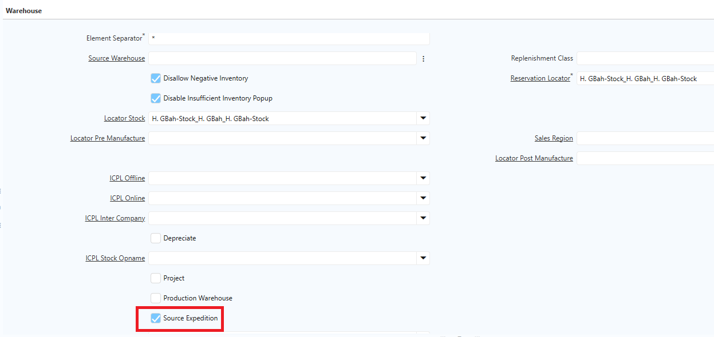 {#Figure208}

5. Klik **Save**.

### Mekanisme Ekspedisi

#### Membuat Dokumen Movement

1. Buka menu **Inventory Move**.
2. Tentukan **warehouse asal** yang telah dikonfigurasi dan **warehouse tujuan**.

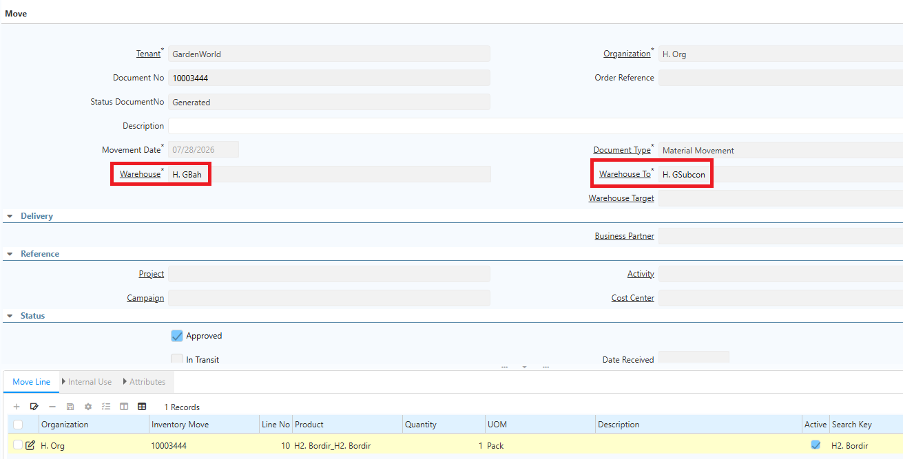 {#Figure209}

3. Masuk ke **Move Line**.
4. Tentukan **produk** yang akan diproses.
5. Tentukan **quantity** produk.
6. Tentukan **Locator** asal dan **Locator** tujuan.
7. Klik **Save**.
8. Klik **Complete** pada dokumen Inventory Move.

Dokumen Inventory Move ini digunakan sebagai acuan oleh pihak gudang untuk memproses produk melalui ekspedisi.
#### Proses Pengiriman (Ekspedisi)

1. Buka menu **SIS Expedition**.
2. Tentukan **Document Date**.
3. Tentukan **Business Partner** — dalam hal ini adalah pihak ekspedisi.
4. Masuk ke tab **Line**.
5. Input dokumen **Inventory Move** yang akan diproses.
6. Tentukan **quantity** produk yang akan diproses.

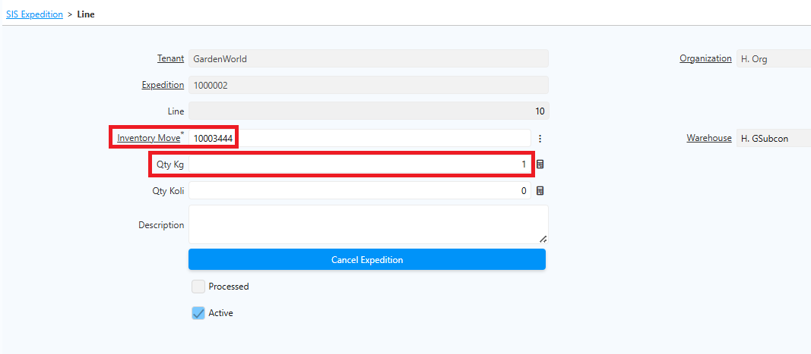 {#Figure210}

7. Klik **Save**.
8. Klik **Complete** pada dokumen.

Saat nomor Inventory Move diinput, field **Warehouse** terisi otomatis sesuai warehouse tujuan di Inventory Move tersebut — user tidak dapat menginput warehouse tujuan secara manual di dokumen ekspedisi.

Setelah dokumen di-complete, sistem otomatis menandai dokumen Inventory Move terkait dengan flag **SIS_Expedition = Y**, yang berarti dokumen tersebut tidak dapat digunakan untuk proses pengiriman ekspedisi lain. Field **Active** pada Line SIS Expedition juga tercentang secara otomatis.
#### Pembatalan Ekspedisi

Jika proses pengiriman mengalami kendala, lakukan pembatalan ekspedisi dengan langkah berikut:

1. Buka menu **SIS Expedition**.
2. Pilih dokumen ekspedisi yang akan dibatalkan.
3. Masuk ke tab **Line**.
4. Klik **Cancel Expedition**.

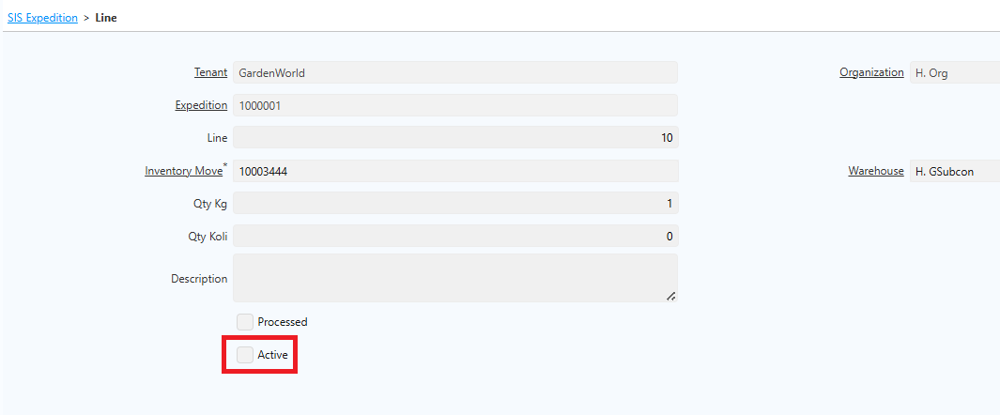 {#Figure211}

Saat ekspedisi dibatalkan, field **Active** pada Line akan ter-uncheck secara otomatis. Flag **SIS_Expedition** pada dokumen Inventory Move terkait juga direset, sehingga dokumen tersebut dapat ditautkan ke dokumen ekspedisi yang baru.

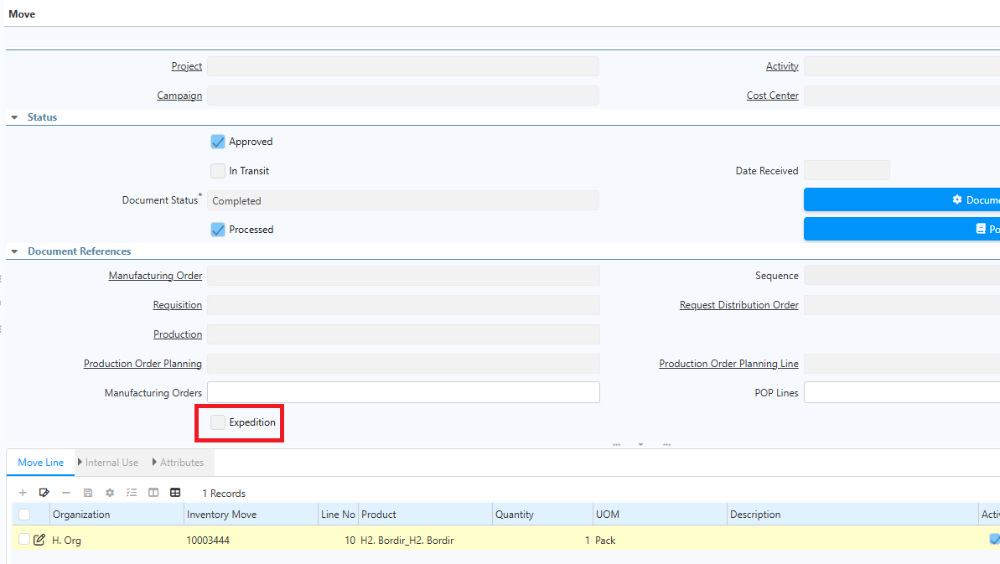 {#Figure212}

> **Catatan:** Jika pengiriman dilakukan secara bertahap, gunakan dokumen Movement yang berbeda untuk setiap tahap pengiriman agar setiap pengiriman memiliki dokumen ekspedisi dan penerimaan tersendiri.