# Mekanisme Movement

**Inventory Move** digunakan untuk memindahkan persediaan dari satu locator ke locator lain, baik dalam warehouse yang sama maupun antar warehouse. Proses ini hanya mengubah lokasi penyimpanan barang dan **tidak mengubah nilai persediaan (inventory value).**

Sistem iDempiere menyediakan dua mekanisme perpindahan persediaan:

- **Movement Langsung** – Memindahkan produk langsung dari locator asal ke locator tujuan tanpa melalui locator In-Transit.
- **Movement Standard** – Memindahkan produk antar warehouse melalui warehouse dan locator **In-Transit** sebelum diterima di warehouse tujuan.

Pada **Movement Standard**, perpindahan barang terdiri dari dua tahap, yaitu **Delivery** (pengiriman) dan **Receipt** (penerimaan). Barang tidak langsung masuk ke warehouse tujuan, tetapi terlebih dahulu berada pada status **In-Transit**, sehingga proses perpindahan dapat dipantau dengan lebih akurat.

Karena proses Delivery dan Receipt saling terhubung, lakukan konfigurasi dua **Document Type**, yaitu **Movement Standard Delivery** dan **Movement Standard Receipt**.
## Konfigurasi Document Type

### Document Type Movement Langsung

1. Buka menu **Document Type**.
2. Klik **New**.
3. Isi **Name** sesuai kebutuhan operasional.
4. Pada field **Document Base Type**, pilih **Material Movement**.
5. Pada field **Internal Use Doc Type**, tentukan dokumen Internal Use yang digunakan.
6. Centang field **Auto Create Back Order**.
7. Klik **Save**.
### Document Type Movement Penerimaan (Receipt)

1. Buka menu **Document Type**.
2. Klik **New**.
3. Isi **Name** sesuai kebutuhan operasional.
4. Pada field **Document Base Type**, pilih **Material Movement**.
5. Pada field **Internal Use Doc Type**, tentukan dokumen Internal Use yang digunakan.
6. Centang field **Auto Create Back Order**.
7. Klik **Save**.
### Document Type Movement Pengiriman (Delivery)

1. Buka menu **Document Type**.
2. Klik **New**.
3. Isi **Name** sesuai kebutuhan operasional.
4. Pada field **Document Base Type**, pilih **Material Movement**.
5. Pada field **Internal Use Doc Type**, tentukan dokumen Internal Use yang digunakan.
6. Pada field **Warehouse Intransit**, tentukan warehouse yang digunakan untuk intransit.
7. Pada field **Locator Intransit**, tentukan locator yang digunakan untuk intransit.
8. Pada field **Document Type Receipt**, pilih document Movement Penerimaan yang telah dikonfigurasi.
9. Klik **Save**.
## Implementasi Movement Standard

### Proses Pengiriman (Delivery)

1. Buka menu **Inventory Move**.
2. Tentukan **Document Type** yang akan digunakan.
3. Tentukan **Warehouse** asal dan **Warehouse** tujuan.
4. Klik **Save**.
5. Masuk ke **Move Line**.
6. Tentukan **produk** yang akan diproses.
7. Tentukan **Locator** asal dan **Locator** tujuan.
8. Tentukan **quantity** produk yang akan diproses.
9. Klik **Save**.
10. Klik **Complete** pada dokumen Movement.

Saat Movement di-complete, warehouse dan locator tujuan otomatis berubah menjadi warehouse dan locator **In-Transit** sesuai konfigurasi document type. Selain itu, field **Warehouse Target** — yaitu warehouse tujuan movement — akan muncul secara otomatis.

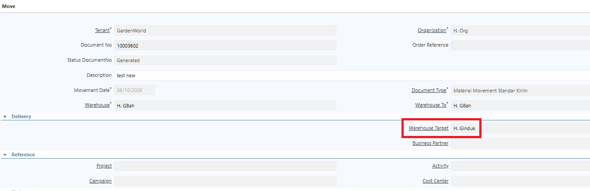 {#Figure258}

Sistem juga otomatis membuat **Movement Receipt** dari In-Transit ke warehouse dan locator tujuan, beserta informasi **Movement Source/Target** sesuai alur perpindahan barang.

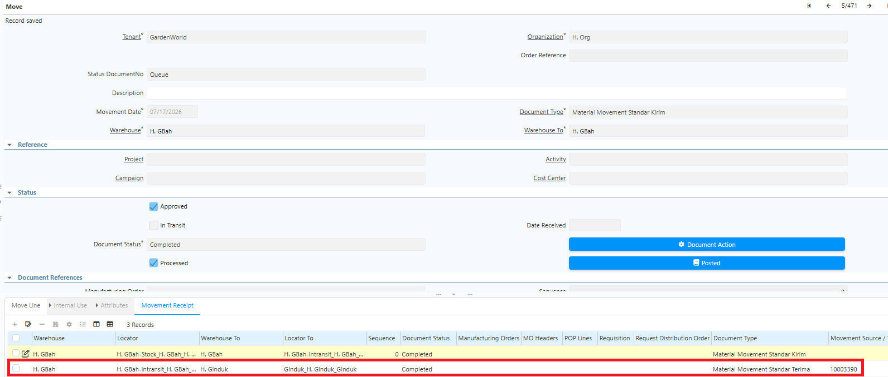 {#Figure148}
### Proses Penerimaan (Receipt)

Setelah produk berpindah ke warehouse intransit, proses Movement Receipt untuk memindahkan produk ke warehouse dan locator tujuan. Ikuti langkah berikut:

1. Buka menu **Inventory Move**.
2. Cari dokumen dengan memfilter **Movement Source/Target** — input Movement Source/Target yang tercantum di dokumen Movement Delivery.
3. Masuk ke **Move Line**.
4. Tentukan **quantity** produk yang akan diproses.
5. Klik **Save**.
6. Klik **Complete** pada dokumen Movement.

Jika quantity yang diterima hanya sebagian (_parsial_), sistem otomatis membuat **back order** atas kekurangan quantity tersebut yang dapat ditelusuri melalui **Movement Source/Target**.
## Ekspedisi

Movement dengan Ekspedisi digunakan untuk mencatat perpindahan barang antar warehouse yang melibatkan pihak ekspedisi atau proses pengiriman. Mekanisme ini memisahkan proses pengiriman dari proses penerimaan barang di warehouse tujuan, sehingga status barang dapat dipantau selama proses distribusi.
### Konfigurasi Ekspedisi

Sebelum melakukan movement dengan ekspedisi, lakukan konfigurasi pada warehouse asal. Ikuti langkah berikut:

1. Buka menu **Warehouse and Locators**.
2. Input **Search Key** dan **Name** untuk warehouse.
3. Input **alamat** warehouse.
4. Centang field **Source Expedition**.

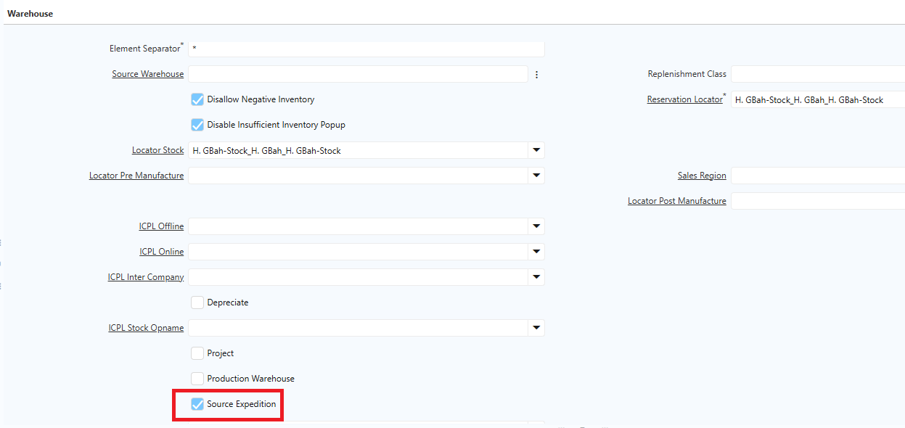 {#Figure208}

5. Klik **Save**.

### Mekanisme Ekspedisi

#### Membuat Dokumen Movement

1. Buka menu **Inventory Move**.
2. Tentukan **warehouse asal** yang telah dikonfigurasi dan **warehouse tujuan**.

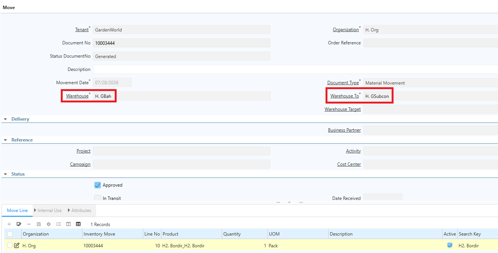 {#Figure209}

3. Masuk ke **Move Line**.
4. Tentukan **produk** yang akan diproses.
5. Tentukan **quantity** produk.
6. Tentukan **Locator** asal dan **Locator** tujuan.
7. Klik **Save**.
8. Klik **Complete** pada dokumen Inventory Move.

Dokumen Inventory Move ini digunakan sebagai acuan oleh pihak gudang untuk memproses produk melalui ekspedisi.
#### Proses Pengiriman (Ekspedisi)

1. Buka menu **SIS Expedition**.
2. Tentukan **Document Date**.
3. Tentukan **Business Partner** — dalam hal ini adalah pihak ekspedisi.
4. Masuk ke tab **Line**.
5. Input dokumen **Inventory Move** yang akan diproses.
6. Tentukan **quantity** produk yang akan diproses.

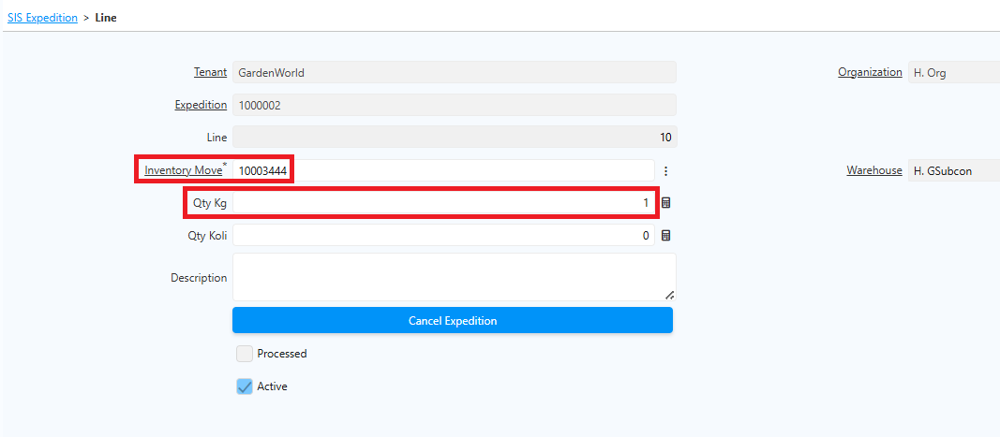 {#Figure210}

7. Klik **Save**.
8. Klik **Complete** pada dokumen.

Saat nomor Inventory Move diinput, field **Warehouse** terisi otomatis sesuai warehouse tujuan di Inventory Move tersebut — user tidak dapat menginput warehouse tujuan secara manual di dokumen ekspedisi.

Setelah dokumen di-complete, sistem otomatis menandai dokumen Inventory Move terkait dengan flag **SIS_Expedition = Y**, yang berarti dokumen tersebut tidak dapat digunakan untuk proses pengiriman ekspedisi lain. Field **Active** pada Line SIS Expedition juga tercentang secara otomatis.
#### Pembatalan Ekspedisi

Jika proses pengiriman mengalami kendala, lakukan pembatalan ekspedisi dengan langkah berikut:

1. Buka menu **SIS Expedition**.
2. Pilih dokumen ekspedisi yang akan dibatalkan.
3. Masuk ke tab **Line**.
4. Klik **Cancel Expedition**.

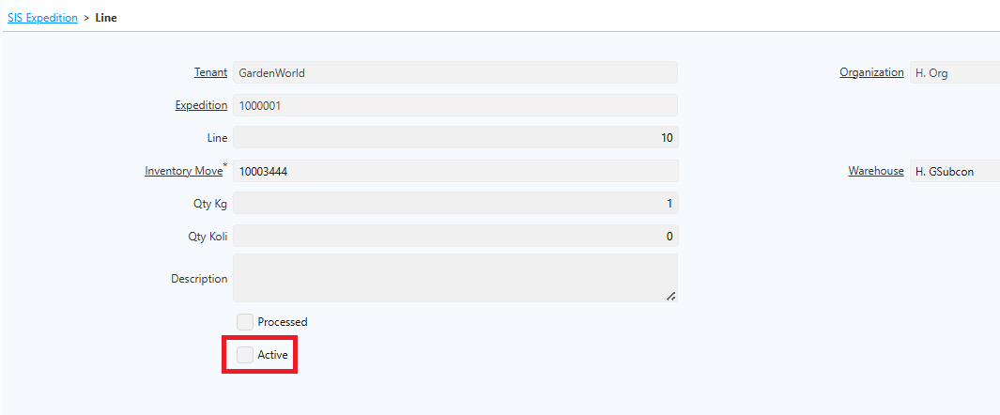 {#Figure211}

Saat ekspedisi dibatalkan, field **Active** pada Line akan ter-uncheck secara otomatis. Flag **SIS_Expedition** pada dokumen Inventory Move terkait juga direset, sehingga dokumen tersebut dapat ditautkan ke dokumen ekspedisi yang baru.

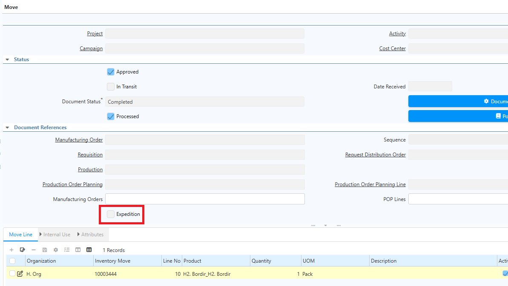 {#Figure212}

> **Catatan:** Jika pengiriman dilakukan secara bertahap, gunakan dokumen Movement yang berbeda untuk setiap tahap pengiriman agar setiap pengiriman memiliki dokumen ekspedisi dan penerimaan tersendiri.

#### Proses Penerimaan dari Ekspedisi

Perpindahan barang yang menggunakan mekanisme intransit melibatkan dua warehouse tujuan — warehouse intransit dan warehouse tujuan sebenarnya. Proses ini menghasilkan dua dokumen: dokumen pengiriman dan dokumen penerimaan.

Saat dokumen Inventory Move Pengiriman di-complete, warehouse tujuan otomatis berubah menjadi warehouse intransit dan sistem otomatis membuat dokumen penerimaan.
#### Penerimaan dengan Ekspedisi

Jika perpindahan barang melibatkan ekspedisi, proses penerimaan hanya dapat dilakukan setelah dokumen ekspedisi diproses melalui menu **SIS Expedition**. Jika penerimaan diproses sebelum ekspedisi selesai, Inventory Move tidak dapat di-complete.
#### Penerimaan tanpa Ekspedisi

Jika perpindahan barang tidak melibatkan ekspedisi, dokumen penerimaan dapat langsung diproses setelah Inventory Move Pengiriman di-complete.
### Informasi Tambahan Pada Ekspedisi

Saat proses perpindahan barang menggunakan ekspedisi, dokumen ekspedisi memuat informasi **supir**, **kernet**, **nama kendaraan**, dan **nomor polisi kendaraan**. Informasi ini penting untuk memastikan setiap pengiriman dapat ditelusuri — termasuk siapa yang mengantarkan dan kendaraan apa yang digunakan.

Supir dan kernet dikonfigurasi sebagai **User** di sistem, sehingga master data untuk setiap supir dan kernet harus dibuat terlebih dahulu. Begitu pula dengan kendaraan — master data kendaraan juga harus dikonfigurasi sebelum digunakan.
#### Konfigurasi Supir dan Kernet

Ikuti langkah berikut untuk membuat master data supir dan kernet:

1. Buka menu **User**.
2. Tentukan **nama** dan **Search Key** untuk supir atau kernet.
3. Pada field **Expedition Role**, tentukan apakah user tersebut berperan sebagai **supir** atau **kernet**.

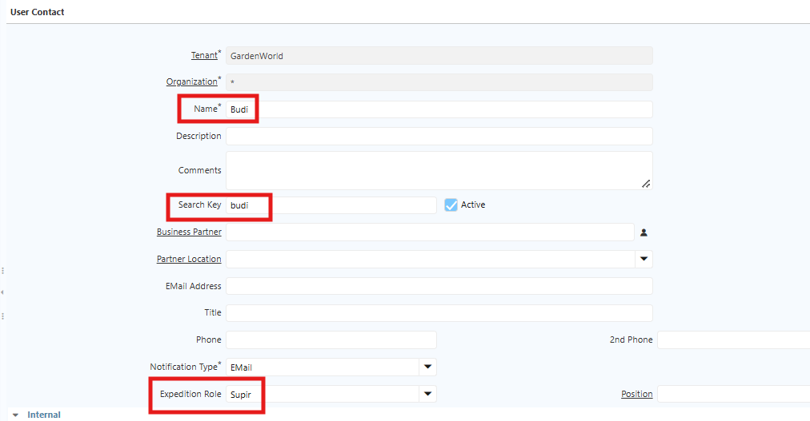 {#Figure301}

4. Klik **Save**.

#### Konfigurasi Kendaraan

Ikuti langkah berikut untuk membuat master data kendaraan:

1. Buka menu **Kendaraan Expedition**.
2. Input **Search Key** dengan nomor polisi kendaraan.
3. Input **Name** dengan nama kendaraan.

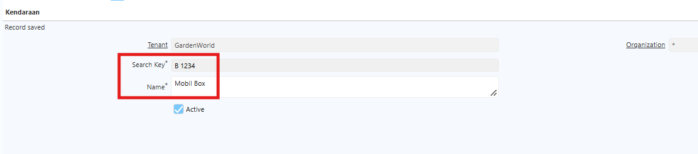 {#Figure302}

4. Klik **Save**.

Setiap dokumen ekspedisi akan menampilkan informasi **nama supir**, **kernet**, **nomor kendaraan**, dan **jenis kendaraan**, sehingga perusahaan dapat memantau pengiriman barang secara lengkap dan akurat.

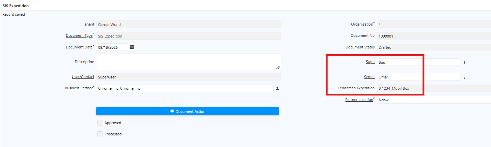 {#Figure303}

## Pembatalan Sebagian

**Pembatalan Sebagian** digunakan untuk membatalkan produk tertentu pada dokumen **Inventory Move Delivery** tanpa harus membatalkan seluruh produk dalam satu dokumen. Pembatalan dilakukan pada level **Inventory Move Line** dengan ketentuan berikut:

- Pembatalan sebagian hanya dapat dilakukan jika dokumen Inventory Move Delivery sudah berstatus **Complete**.
- Pembatalan dilakukan **per line**, bukan per quantity. Jika satu line dibatalkan, seluruh quantity pada line tersebut ikut dibatalkan.

### Proses Pembatalan Sebagian

1. Buka menu **Inventory Move**.
2. Tentukan dokumen **Inventory Move Delivery** yang akan diproses dan berstatus **complete**.
3. Setelah dokumen berstatus Complete, sistem akan menampilkan button **Cancel Delivery**.

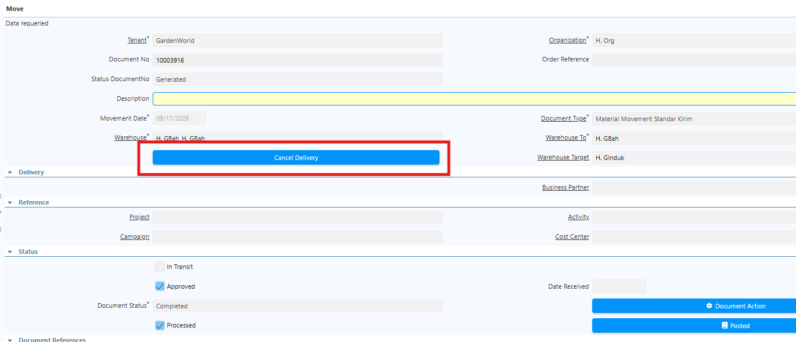 {#Figure300}

4. Klik button **Cancel Delivery** untuk memulai proses pembatalan.
5. Pilih **Inventory Move Line** yang akan dibatalkan.

 {#Figure301}

6. Klik **SIS Cancel Delivery**.

Setelah pembatalan dilakukan, sistem otomatis membentuk **Inventory Move pembalik** untuk Inventory Move Line yang dibatalkan dan menyesuaikan dokumen **Inventory Move Receipt** yang terkait.

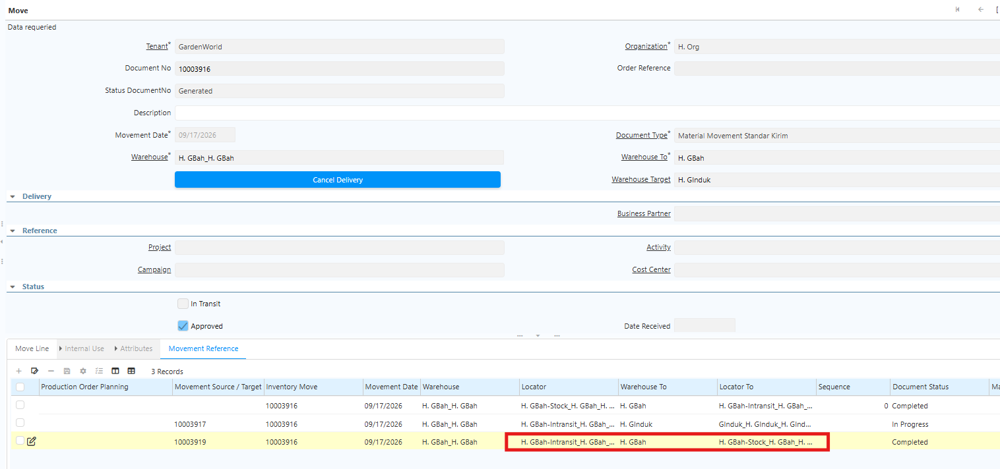 {#Figure302}

- **Inventory Move Line yang dibatalkan** — otomatis terhapus dari Inventory Move Receipt.
- **Inventory Move Line yang tidak dibatalkan** — tetap tersedia pada Inventory Move Receipt dan dapat dilanjutkan ke proses penerimaan.

Dengan demikian, jika dalam satu Inventory Move Delivery terdapat beberapa produk dan hanya sebagian yang dibatalkan, hanya produk yang tidak dibatalkan yang akan diproses pada Inventory Move Receipt. 

## Rute di Ekspedisi

Proses Ekspedisi menggunakan informasi rute untuk menentukan tujuan pengiriman product. Setiap ekspedisi dapat memiliki tujuan yang berbeda, sehingga user perlu menentukan rute sebelum melakukan pengiriman. User membuat rute sebagai master data yang terdiri dari warehouse asal dan warehouse tujuan.
### Membuat Rute

User dapat membuat rute dengan langkah berikut:

1. Buka menu **SIS Route**.
2. Klik **New**.
3. Isi **Search Key** dan **Name** untuk rute.
4. Tentukan **Warehouse Asal**.

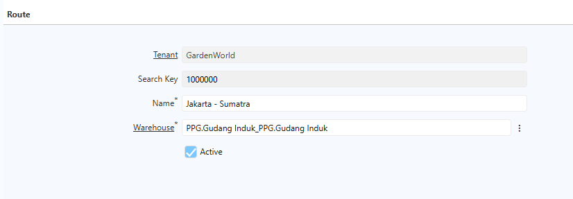 {#Figure328}

5. Masuk ke tab **Route Line**.
6. Tentukan **Warehouse Tujuan**.

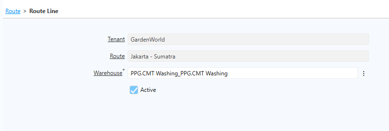 {#Figure329}

7. Klik **Save**.

### Konfigurasi Volume Product

Selain menentukan rute, user perlu mengisi volume pada setiap product yang akan diproses melalui ekspedisi.

Pada **Product Master**, isi field **Volume** dengan volume masing-masing product. Sistem menggunakan informasi tersebut untuk menghitung total volume product pada proses **Inventory Move** dan **Expedition**.

### Membuat Inventory Move dari RDO

Setelah user menentukan rute, warehouse asal, dan warehouse tujuan, user dapat membuat Inventory Move melalui **RDO** dengan langkah berikut:

1. Buka menu **SIS RDO**.
2. Tentukan **Warehouse** dan **Locator Asal**.
3. Tentukan **Rute Pengiriman**.

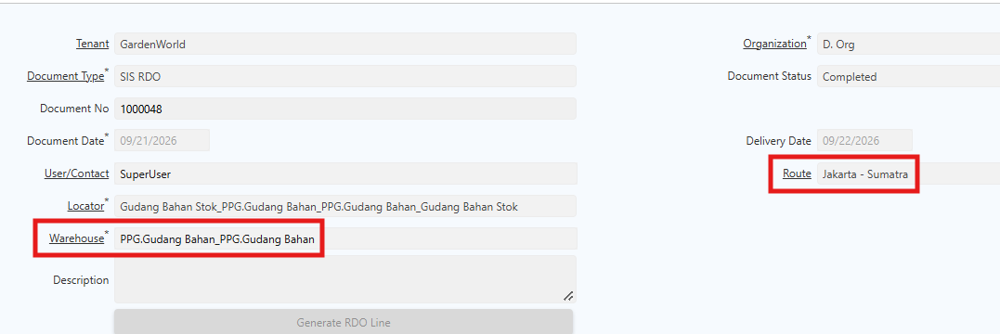 {#Figure330}

4. Klik **Generate RDO Line**.
5. Pilih product yang akan diproses.
6. Klik **SIS Generate RDO Line**.
7. Masuk ke tab **Line**.
8. Tentukan **Warehouse Tujuan** untuk masing-masing product.
9. Klik **Save**.
10. Klik **Complete** pada dokumen.

Setelah RDO berstatus Complete, sistem akan membuat Inventory Move Delivery dan Inventory Move Receipt.

#### Inventory Move Delivery

User perlu memproses Inventory Move Delivery terlebih dahulu. Pada header Inventory Move terdapat informasi Volume. Sistem menghitung volume tersebut berdasarkan volume product pada Move Line.

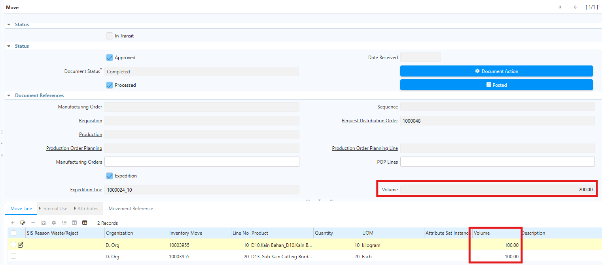 {#Figure331}

Setelah Inventory Move Delivery selesai diproses, user dapat melanjutkan ke proses ekspedisi.
#### Membuat Expedition

User dapat membuat dokumen ekspedisi dengan langkah berikut:

1. Buka menu **SIS Expedition**.
2. Tentukan **Business Partner**.
3. Tentukan **Supir** dan **Kernet**.
4. Tentukan **Kendaraan** yang digunakan.
5. Masuk ke tab **Line**.
6. Masukkan nomor **Inventory Move** yang akan diproses.
7. Klik **Save**.

Pada header Expedition terdapat informasi Volume. Sistem menghitung total volume berdasarkan volume Inventory Move yang terdapat pada Expedition Line.
#### Pembatalan Expedition Line

User dapat membatalkan ekspedisi pada masing-masing Expedition Line apabila diperlukan. Saat user membatalkan Inventory Move pada Expedition Line, sistem akan melakukan perhitungan ulang terhadap Volume pada header Expedition. Volume akan berkurang sesuai dengan volume Inventory Move yang dibatalkan.

Dengan demikian, informasi volume pada header Expedition selalu mengikuti Inventory Move yang masih aktif pada Expedition Line.

## Movement Product dengan BoM

Fitur Movement Product dengan BoM digunakan untuk memindahkan product jadi atau setengah jadi beserta komponen BoM (Bill of Material) yang membentuk product tersebut.

Product yang memiliki BoM dapat terdiri dari beberapa komponen, seperti Product Item dan Product Expense. Saat user melakukan movement dengan konfigurasi Move BOM Component, sistem akan memindahkan stock product jadi atau setengah jadi beserta stock komponen yang memiliki Product Type Item.

### Konfigurasi Move BOM Component

Sebelum melakukan Inventory Move, user perlu mengaktifkan konfigurasi Move BOM Component pada Document Type Inventory Move.

Field Move BOM Component terdapat pada Document Base Type = Material Movement dan berfungsi untuk menentukan apakah sistem akan memindahkan komponen BoM saat user melakukan movement.

- Move BOM Component = Yes → Sistem memindahkan product jadi atau setengah jadi beserta komponen BoM yang memiliki Product Type Item.
- Move BOM Component = No → Sistem hanya memindahkan product jadi atau setengah jadi. Komponen BoM tidak ikut dipindahkan.

### Proses Inventory Move dengan BoM

Setelah konfigurasi **Move BOM Component** selesai, user dapat melakukan Inventory Move dengan langkah berikut:

1. Buka menu **Inventory Move**.
2. Pilih **Document Type** yang sudah dikonfigurasi dengan **Move BOM Component**.
3. Tentukan **Warehouse From** dan **Warehouse To**.
4. Klik **Save**.
5. Pada field **Phantom Product**, pilih product jadi atau setengah jadi yang akan dipindahkan.
6. Pada field **Phantom BOM**, pilih BoM yang akan digunakan.
7. Pada field **Phantom Qty**, masukkan jumlah product yang akan dipindahkan.

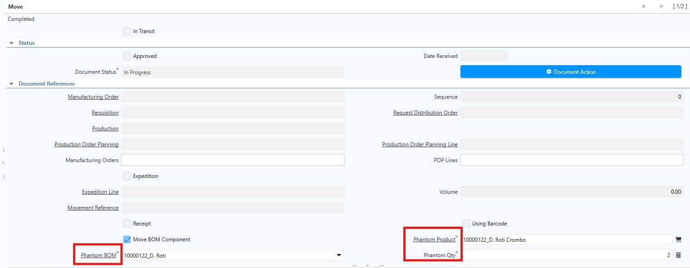 {#Figure326}

8. Klik **Save**.
9. Klik **Document Action**.
10. Pilih **Prepare**.
11. Klik **OK**.

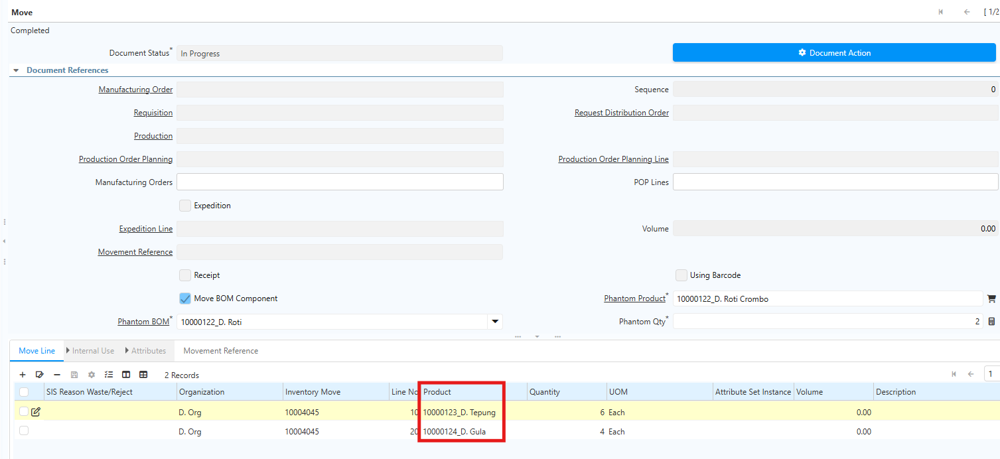 {#Figure327}

Setelah user menjalankan **Prepare**, sistem akan membuat **Move Line** berdasarkan komponen pada BoM yang dipilih.

Sistem akan memindahkan stock product jadi atau setengah jadi sesuai quantity yang ditentukan. Selain itu, sistem juga akan memindahkan stock komponen BoM yang memiliki Product Type Item.

## Proses Input Move Line dengan Scan Barcode

Saat melakukan perpindahan barang, perusahaan dapat menggunakan fitur **scan barcode** untuk memindai kode artikel. Setelah artikel berhasil di-scan dan quantity ditentukan, user menekan **Enter** — sistem otomatis membuat Move Line atas produk tersebut dengan quantity sesuai yang diinput.

Sebelum menggunakan fitur ini, lakukan konfigurasi pada **Document Type Material Movement**. Terdapat field **Using Barcode** dengan ketentuan berikut:

- **Using Barcode = Y** — Movement menggunakan barcode.
- **Using Barcode = N** — Movement tidak menggunakan barcode dan berjalan seperti biasa.

### Mekanisme Scan Barcode di Inventory Move

1. Buka menu **Inventory Move**.
2. Tentukan **Document Type** yang telah dikonfigurasi.
3. Tentukan **Warehouse** asal dan **Warehouse** tujuan.
4. Klik **Save**.

Saat dokumen disimpan, field **Using Barcode** pada header Inventory Move otomatis tercentang.

5. Input kode artikel pada field **Product Value** atau scan melalui **barcode scanner**.
6. Tentukan **Qty Barcode**.

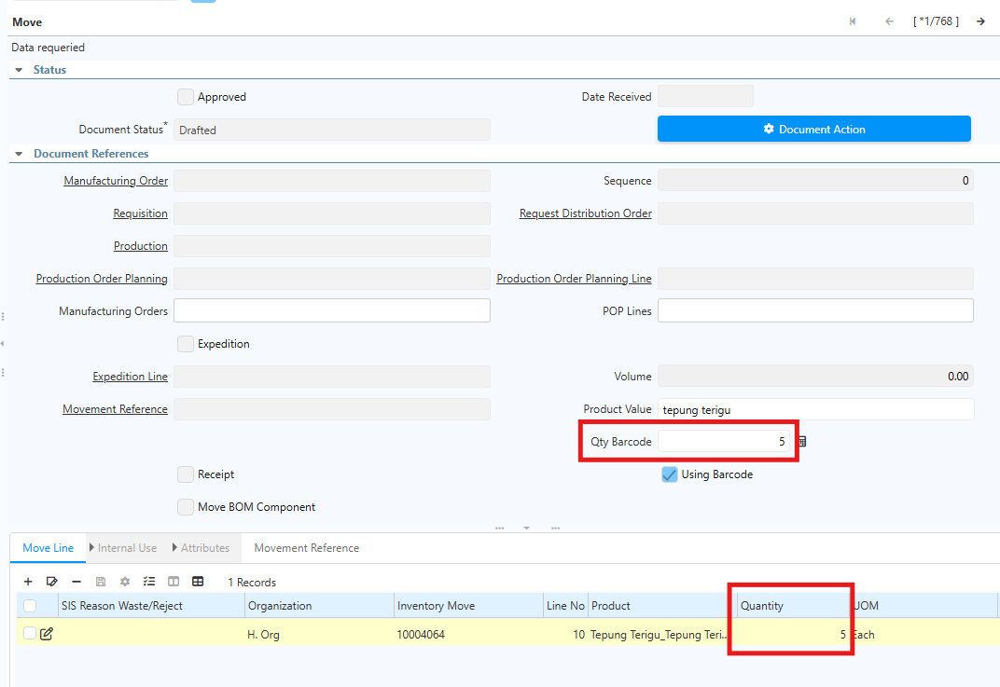 {#Figure334}

7. Klik **Enter** pada PC atau perangkat.

Setelah Enter diklik, sistem otomatis membuat **Move Line** atas produk tersebut dengan ketentuan berikut:

- **Locator asal dan tujuan** — sesuai konfigurasi di header.
- **Quantity** — sesuai Qty Barcode yang telah diinput.

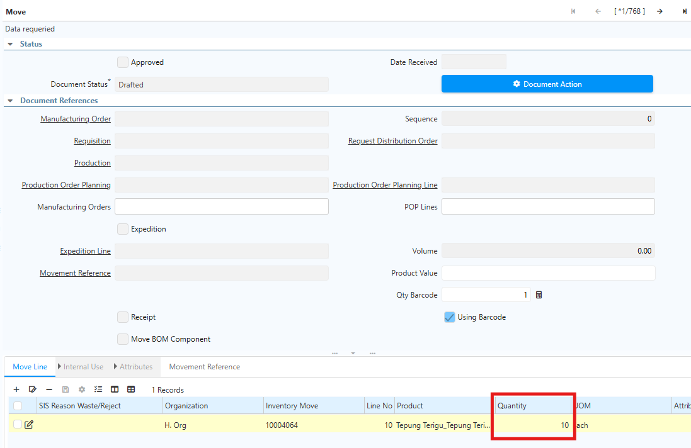 {#Figure335}

## Movement untuk Product dengan ASI

Proses **Inventory Move** dapat dilakukan untuk product yang menggunakan **ASI (Attribute Set Instance)** maupun product yang tidak menggunakan ASI.

### Movement Product Tanpa ASI

Untuk product yang tidak menggunakan ASI, sistem mengambil stock berdasarkan Warehouse dan Locator asal. Sistem menentukan stock yang akan dipindahkan berdasarkan metode yang dikonfigurasi pada Product Category, yaitu:

- FIFO (First In First Out) → Sistem mengambil stock yang pertama kali masuk.
- LIFO (Last In First Out) → Sistem mengambil stock yang terakhir kali masuk.

### Movement Product dengan ASI

Product yang menggunakan ASI memiliki identitas masing-masing berdasarkan ASI. Saat user menerima product, setiap ASI dapat memiliki identitas yang berbeda sehingga satu Material Receipt dapat terdiri dari beberapa ASI. Saat user melakukan Inventory Move untuk product dengan ASI, sistem akan menentukan stock berdasarkan ASI yang tersedia pada **Locator** asal.

User dapat menentukan ASI yang akan dipindahkan secara otomatis oleh sistem atau secara manual.
#### Penentuan ASI oleh Sistem

Jika user tidak menentukan ASI secara manual, sistem akan menentukan ASI berdasarkan metode pengambilan stock yang berlaku, yaitu FIFO atau LIFO. Sistem akan memilih ASI yang masih memiliki stock pada Locator asal sesuai dengan metode tersebut.
#### Penentuan ASI Secara Manual

User dapat menentukan ASI secara manual dengan mengaktifkan field **Manual ASI Selection** pada header Inventory Move. Jika Manual ASI Selection dicentang, user dapat menentukan ASI yang akan dipindahkan secara langsung.

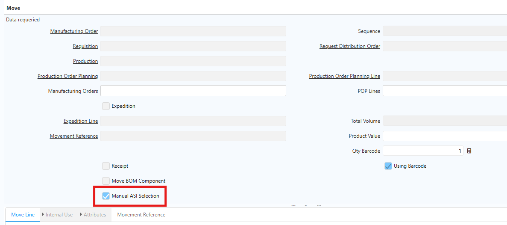 {#Figure336}

### Langkah Menentukan ASI Secara Manual

1. Buat **Inventory Move**.
2. Tentukan **Warehouse** dan **Locator** asal serta tujuan.
3. Tentukan product dan quantity yang akan dipindahkan.
4. Masuk ke tab **Attributes**.
5. Klik kolom **Attribute Set Instance**.
6. Uncentang **New Record**.
7. Klik **Selection Existing Record**.
8. Pilih **ASI** yang akan dipindahkan.

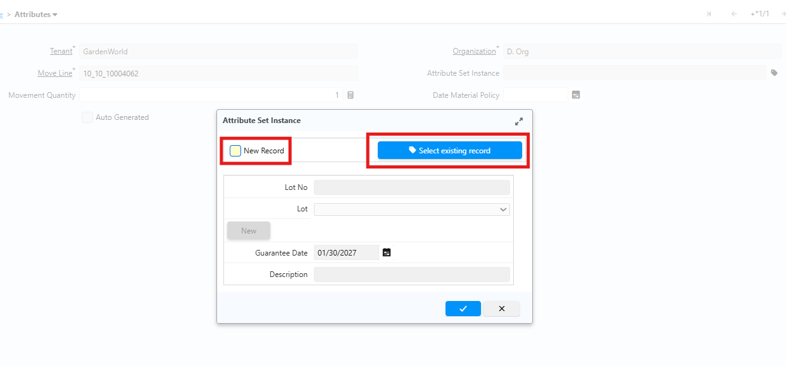 {#Figure337}

9. Klik **Ok**.
10. Klik **Save**.
11. Klik **Complete**.

Setelah Inventory Move selesai diproses, sistem akan mengurangi stock ASI pada Locator asal dan menambahkan stock ASI yang sama pada Locator tujuan.