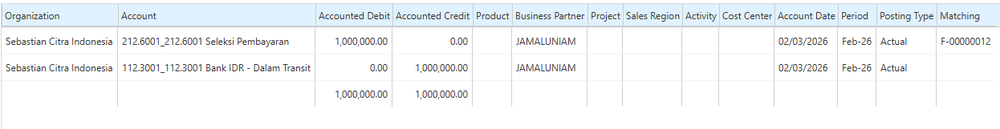
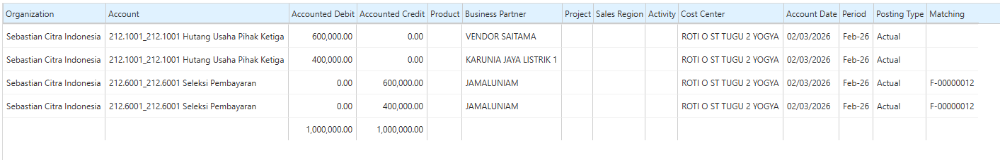
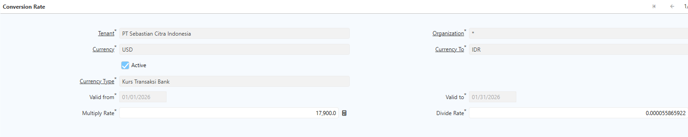
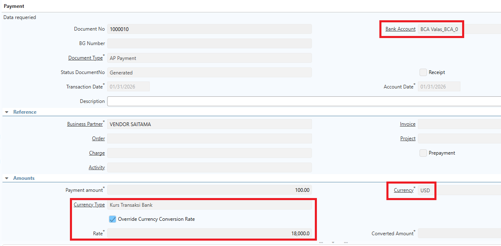
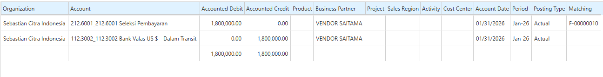
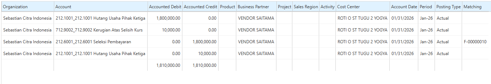

# Mekanisme Pembayaran

Setelah **AP Invoice** berstatus **Completed**, perusahaan dapat melakukan pembayaran kepada vendor melalui menu **Payment and Receipt**. Proses ini berfungsi untuk menyelesaikan kewajiban perusahaan atas invoice yang telah diterbitkan.

iDempiere mendukung beberapa mekanisme pembayaran, antara lain pembayaran satu invoice, multi invoice, multi Business Partner (Business Partner Pembayar), serta pembayaran menggunakan valuta asing (valas).
## Pembayaran Multi BP (Business Partner)

Mekanisme **Multi Business Partner** digunakan ketika pembayaran dilakukan menggunakan **Business Partner yang berbeda** dengan vendor pada invoice. Kondisi ini umumnya diterapkan apabila terdapat vendor induk, perusahaan afiliasi, atau pihak ketiga yang bertindak sebagai penerima pembayaran.

Untuk melakukan pembayaran Multi Business Partner, lakukan langkah-langkah berikut:

1. Buka menu **Payment and Receipt**.
2. Tentukan **Document Type**.
3. Pilih **Bank Account** yang digunakan untuk pembayaran.
4. Tentukan **Transaction Date**.
5. Pilih **Business Partner** sebagai pihak yang melakukan atau menerima pembayaran.
6. Buka tab **Allocate**.
7. Input invoice yang akan dibayarkan.
8. Klik **save**.
9. Klik **complete**.

Setelah pembayaran diselesaikan, sistem membentuk **satu jurnal AP Payment** menggunakan **Business Partner** yang tercantum pada dokumen pembayaran.

 {#Figure168}

Selanjutnya, pada proses **Payment Allocation**, sistem secara otomatis mengalokasikan pembayaran ke masing-masing invoice dan membentuk jurnal hutang usaha sesuai **vendor pada setiap invoice**. Dengan mekanisme ini, seluruh invoice tetap terlunasi berdasarkan vendor masing-masing meskipun pembayaran dilakukan melalui satu Business Partner.

 {#Figure169}
## Pembayaran Valuta Asing (Valas)

Sebelum melakukan pembayaran menggunakan mata uang asing, perusahaan harus mengonfigurasi **Currency Rate** sebagai dasar konversi nilai transaksi ke mata uang dasar perusahaan. Sistem akan menggunakan konfigurasi tersebut untuk menentukan kurs yang berlaku pada saat pembayaran.

Lakukan konfigurasi **Currency Rate** sebagai berikut:

1. Buka menu **Currency Rate**.
2. Tentukan **Currency From** dan **Currency To**.
3. Pilih **Currency Type**.
4. Tentukan periode **Valid From** dan **Valid To**.
5. Isi **Multiply Rate** atau **Divide Rate** sesuai metode konversi yang digunakan. Hanya salah satu field yang perlu diisi.

 {#Figure170}

6. Klik **save**.

Setelah konfigurasi selesai, lakukan pembayaran dengan langkah-langkah berikut:

1. Buka menu **Payment and Receipt**.
2. Tentukan **Document Type**.
3. Pilih **Bank Account** yang digunakan.
4. Tentukan **Transaction Date**.
5. Pilih **Business Partner**.
6. Tentukan **Currency** yang digunakan untuk pembayaran.
7. Pilih **Currency Type** agar sistem mengambil nilai kurs sesuai konfigurasi **Currency Rate**.
8. Jika diperlukan, aktifkan **Override Currency Conversion Rate** untuk memasukkan nilai kurs secara manual. Fitur ini bersifat opsional dan akan mengesampingkan kurs yang diperoleh dari konfigurasi sistem.

 {#Figure171}

9. Buka tab **Allocate**.
10. Pilih invoice yang akan dibayarkan.
11. Klik **save**.
12. Klik **complete**. 

Pada saat pembayaran dialokasikan, sistem akan membentuk jurnal pembayaran sesuai nilai kurs yang digunakan. 

 {#Figure172}

Apabila terjadi selisih kurs antara saat pencatatan invoice dan saat pembayaran, sistem akan mencatat Realized Gain atau Realized Loss sesuai hasil konversi mata uang.

 {#Figure173}

Konfigurasi akun untuk **Realized Gain/Loss** maupun **Unrealized Gain/Loss** dilakukan pada **Accounting Schema**. Seluruh akun yang digunakan dalam proses pembayaran dapat disesuaikan dengan kebijakan akuntansi masing-masing perusahaan.