# Mekanisme Pembayaran

Setelah AP Invoice berstatus _Completed_, perusahaan dapat melakukan pembayaran kepada vendor melalui menu **Payment and Receipt**. Proses ini digunakan untuk menyelesaikan kewajiban perusahaan atas invoice yang telah diterbitkan.

iDempiere mendukung beberapa mekanisme pembayaran, antara lain:

- Pembayaran satu invoice
- Pembayaran multi invoice
- Pembayaran multi Business Partner (_Business Partner Pembayar_)
- Pembayaran menggunakan valuta asing (valas)
## Konfigurasi Document Type

Document Type untuk payment dapat dibedakan sesuai kebutuhan operasional. Namun sebelum digunakan, pastikan field **Payment Multi BP** pada Document Type AP Payment sudah dikonfigurasi. Berikut ketentuannya:

- **Dicentang (Y)** — Pembayaran dengan document type tersebut diizinkan untuk multi BP, artinya BP Payment dan BP Invoice dapat berbeda.
- **Tidak dicentang (N)** — Pembayaran hanya dapat dilakukan dengan BP yang sama dengan BP pada invoice. Jika BP di Payment dan Invoice berbeda, sistem otomatis memblokir transaksi tersebut.

Sesuaikan konfigurasi ini dengan kebutuhan operasional perusahaan.
## Pembayaran Multi BP (Business Partner)

Mekanisme **Multi Business Partner** digunakan ketika pembayaran dilakukan kepada Business Partner yang berbeda dengan vendor pada invoice. Kondisi ini umumnya diterapkan jika terdapat vendor induk, perusahaan afiliasi, atau pihak ketiga yang bertindak sebagai penerima pembayaran.

Untuk melakukan pembayaran Multi Business Partner, lakukan langkah-langkah berikut:

1. Buka menu **Payment and Receipt**.
2. Tentukan **Document Type**.
3. Pilih **Bank Account** yang digunakan untuk pembayaran.
4. Tentukan **Transaction Date**.
5. Pilih **Business Partner** sebagai pihak yang melakukan atau menerima pembayaran.
6. Buka tab **Allocate**.
7. Input invoice yang akan dibayarkan.
8. Klik **save**.
9. Klik **complete**.

>**Catatan:** Payment Date tidak boleh lebih awal dari Invoice Date. Jika Payment Date < Invoice Date, sistem otomatis memblokir transaksi dan menampilkan pesan bahwa Payment Date tidak boleh sebelum Invoice Date.

Setelah pembayaran diselesaikan, sistem membentuk **satu jurnal AP Payment** menggunakan **Business Partner** yang tercantum pada dokumen pembayaran.

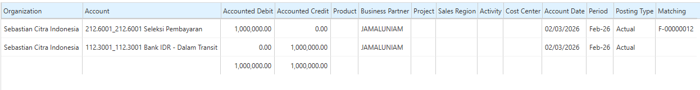 {#Figure168}

Selanjutnya, pada proses **Payment Allocation**, sistem secara otomatis mengalokasikan pembayaran ke masing-masing invoice dan membentuk jurnal hutang usaha sesuai **vendor pada setiap invoice**. Dengan mekanisme ini, seluruh invoice tetap terlunasi berdasarkan vendor masing-masing meskipun pembayaran dilakukan melalui satu Business Partner.

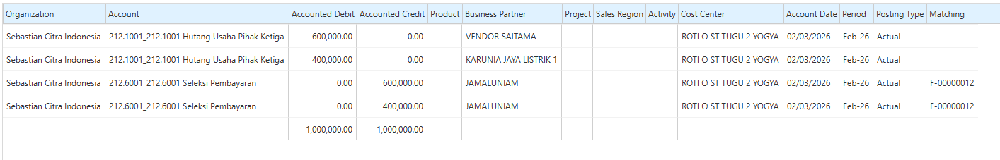 {#Figure169}
## Pembayaran Valuta Asing (Valas)

Sebelum melakukan pembayaran menggunakan mata uang asing, perusahaan harus mengonfigurasi **Currency Rate** sebagai dasar konversi nilai transaksi ke mata uang dasar perusahaan. Sistem akan menggunakan konfigurasi tersebut untuk menentukan kurs yang berlaku pada saat pembayaran.

Lakukan konfigurasi **Currency Rate** sebagai berikut:

1. Buka menu **Currency Rate**.
2. Tentukan **Currency From** dan **Currency To**.
3. Pilih **Currency Type**.
4. Tentukan periode **Valid From** dan **Valid To**.
5. Isi **Multiply Rate** atau **Divide Rate** sesuai metode konversi yang digunakan. Hanya salah satu field yang perlu diisi.

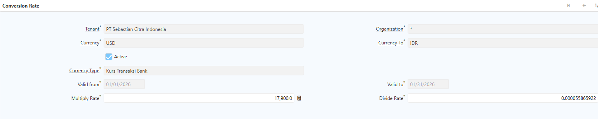 {#Figure170}

6. Klik **save**.

Setelah konfigurasi selesai, lakukan pembayaran dengan langkah-langkah berikut:

1. Buka menu **Payment and Receipt**.
2. Tentukan **Document Type**.
3. Pilih **Bank Account** yang digunakan.
4. Tentukan **Transaction Date**.
5. Pilih **Business Partner**.
6. Tentukan **Currency** yang digunakan untuk pembayaran.
7. Pilih **Currency Type** agar sistem mengambil nilai kurs sesuai konfigurasi **Currency Rate**.
8. Jika diperlukan, aktifkan **Override Currency Conversion Rate** untuk memasukkan nilai kurs secara manual. Fitur ini bersifat opsional dan akan mengesampingkan kurs yang diperoleh dari konfigurasi sistem.

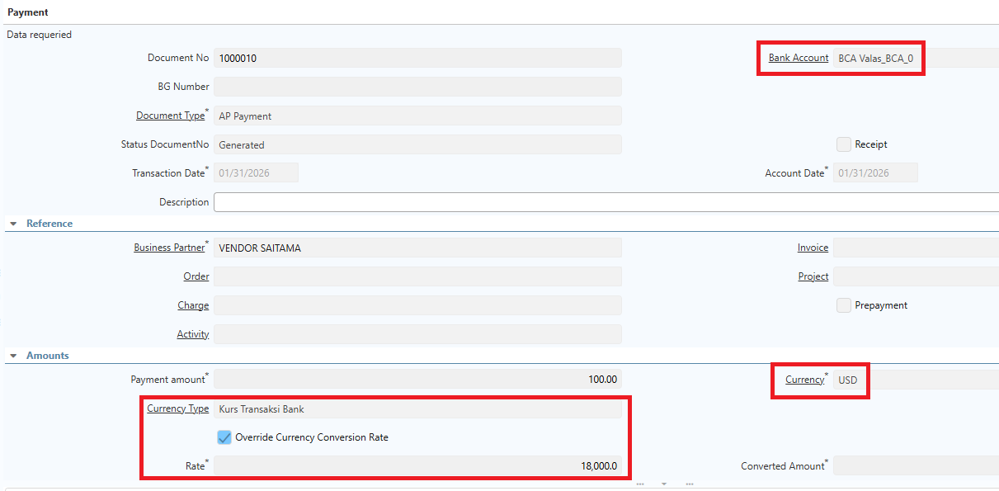 {#Figure171}

9. Buka tab **Allocate**.
10. Pilih invoice yang akan dibayarkan.
11. Klik **save**.
12. Klik **complete**. 

Pada saat pembayaran dialokasikan, sistem akan membentuk jurnal pembayaran sesuai nilai kurs yang digunakan. 

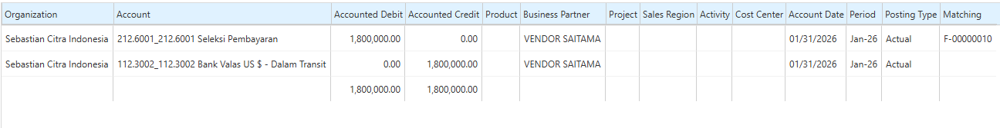 {#Figure172}

Apabila terjadi selisih kurs antara saat pencatatan invoice dan saat pembayaran, sistem akan mencatat Realized Gain atau Realized Loss sesuai hasil konversi mata uang.

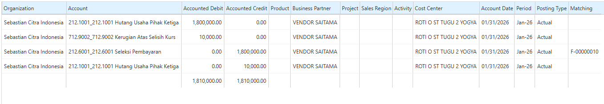 {#Figure173}

Konfigurasi akun untuk **Realized Gain/Loss** maupun **Unrealized Gain/Loss** dilakukan pada **Accounting Schema**. Seluruh akun yang digunakan dalam proses pembayaran dapat disesuaikan dengan kebijakan akuntansi masing-masing perusahaan.

## Bank/Cash Statement

Bank/Cash Statement adalah fitur yang digunakan untuk mencatat mutasi rekening bank atau kas berdasarkan rekening koran (_bank statement_) maupun laporan transaksi kas. Fitur ini berfungsi sebagai media rekonsiliasi antara transaksi yang terjadi di bank dengan transaksi yang telah dicatat di sistem, seperti Payment, Receipt, maupun transaksi lainnya.

Transaksi Payment hanya mencatat bahwa perusahaan telah melakukan atau menerima pembayaran, namun belum membuktikan bahwa dana benar-benar telah masuk atau keluar dari rekening bank. Proses **Bank/Cash Statement** digunakan untuk mengonfirmasi bahwa transaksi Payment tersebut benar-benar telah terjadi di rekening bank melalui proses **rekonsiliasi (_matching_)**. Dengan demikian, Bank/Cash Statement menjadi kontrol untuk memastikan setiap transaksi pembayaran dan penerimaan sesuai dengan mutasi rekening yang diterbitkan bank.

### Validasi Currency

Salah satu validasi penting dalam proses rekonsiliasi adalah **currency antara Payment dan Bank/Cash Statement harus sama**. Mekanisme validasinya adalah sebagai berikut:

- Jika Payment menggunakan mata uang **IDR**, maka Bank/Cash Statement juga harus menggunakan **IDR**.
- Jika Payment menggunakan mata uang **USD**, maka Bank/Cash Statement juga harus menggunakan **USD**.
- Sistem hanya menampilkan dan mengizinkan proses _matching_ terhadap Payment yang memiliki currency yang sama dengan Bank/Cash Statement.

### Rate pada Bank/Cash Statament

Untuk Bank/Cash Statement yang telah direkonsiliasi ke Payment tertentu, jurnal yang ter-generate menggunakan **rate yang digunakan di Payment**. Rate pada Payment dapat diambil dari nilai rate atas currency type pada tanggal tersebut, atau dari hasil **overwrite rate**.

Berikut contoh Payment dengan currency USD menggunakan overwrite rate, beserta Bank Statement atas payment tersebut:

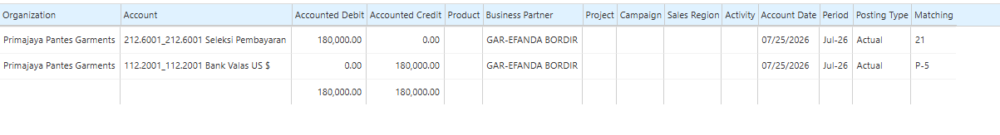 {#Figure171}

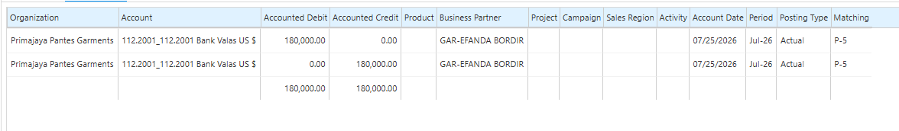 {#Figure172}

### Revaluasi Bank/Cash Statement

Pada transaksi Bank/Cash Statement yang menggunakan mata uang asing, nilai transaksi dalam mata uang dasar (misalnya IDR) dapat berubah akibat perbedaan kurs antara tanggal transaksi pembayaran dan tanggal penutupan periode. Oleh karena itu, diperlukan proses **Revaluasi** di akhir periode akuntansi untuk menyesuaikan nilai saldo rekening bank sesuai kurs penutupan. Revaluasi ini hanya memengaruhi nilai dalam mata uang dasar — nilai dalam mata uang asal (misalnya USD) tetap tidak berubah.
#### Mekanisme Revaluasi

Contoh: perusahaan melakukan Payment sebesar **USD 5** dengan kurs transaksi **Rp10.000/USD**, sehingga nilai yang tercatat adalah **Rp50.000**. Pada akhir bulan, kurs penutupan berubah menjadi **Rp10.100/USD**. Sistem menjalankan **Currency Revaluation** sehingga nilai saldo bank disesuaikan menjadi **Rp50.500**. Selisih sebesar **Rp500** diakui sebagai keuntungan atau kerugian selisih kurs sesuai konfigurasi akun akuntansi.

Ikuti langkah berikut untuk melakukan revaluasi Bank/Cash:

1. Buka menu **SIS Revaluasi Valas Bank/Cash**.
2. Input parameter berikut:
- **Organization**
- **Document Type**
- **Period Revaluation**

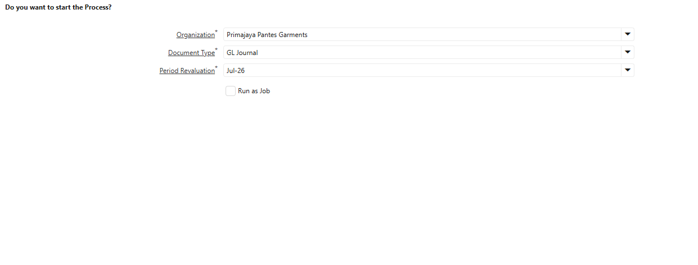 {#Figure175}

3. Klik **Start**.

Proses revaluasi menghasilkan dua jurnal:

- **Jurnal Revaluasi Akhir Bulan** — Menyesuaikan nilai saldo bank berdasarkan kurs penutupan periode sehingga laporan keuangan mencerminkan nilai aset atau kewajiban yang sebenarnya pada tanggal pelaporan.

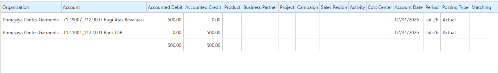 {#Figure176}

- **Jurnal Pembalik Awal Bulan (_Reversing Journal_)** — Sistem otomatis membalik jurnal revaluasi pada hari pertama periode berikutnya agar transaksi kembali menggunakan nilai historis dan proses rekonsiliasi Payment dengan Bank/Cash Statement tetap sesuai.

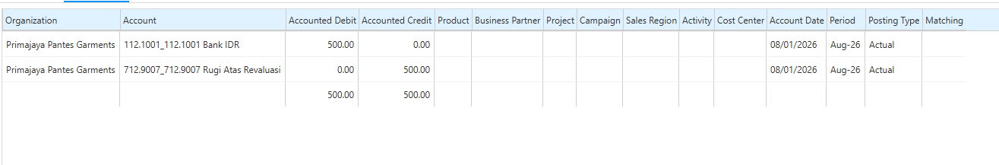 {#Figure177}

## Bank/Cash Transfer

Fitur Bank/Cash Transfer digunakan untuk memindahkan dana antar rekening bank maupun kas di sistem. Proses ini hanya memindahkan saldo antar akun kas/bank milik perusahaan dan tidak melibatkan Business Partner maupun penyelesaian piutang atau utang.

Setiap transaksi Bank/Cash Transfer memperbarui saldo pada rekening asal dan rekening tujuan, serta menghasilkan jurnal akuntansi sesuai konfigurasi akun pada masing-masing Bank/Cash.

### Langkah Proses Bank/Cash Transfer

1. Buka menu **Bank/Cash Transfer**.
2. Input field pada header:
- **From Bank Account** — Bank sumber dana.
- **From Bank Currency** — Terisi otomatis mengikuti currency pada master Bank Account.
- **From Charge** - Set default untuk biaya transfer yang dibebankan kepada **rekening sumber (Bank/Cash From)**.
- **Amount** — Nominal yang akan dipindahkan berdasarkan currency.
- **To Bank Account** — Bank tujuan transfer.
- **To Charge** - Set default untuk biaya transfer yang dibebankan kepada **rekening tujuan (Bank/Cash To)**.
- **To Bank Currency** — Terisi otomatis mengikuti currency pada master Bank Account.
- **Currency Type** — Rate currency yang digunakan _(field muncul jika transfer lintas currency)_.
- **Override Currency Conversion Rate** — Menentukan kurs secara manual _(field muncul jika transfer lintas currency)_.
- **Rate** — Nilai kurs yang digunakan _(field muncul jika transfer lintas currency)_.
- **To Amount** — Nominal dana di rekening tujuan.

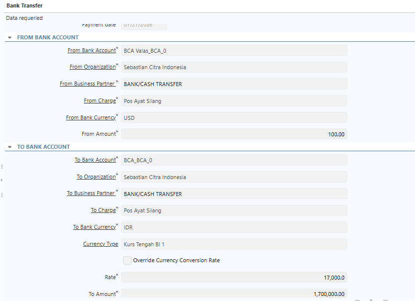 {#Figure179}

3. Klik **Complete** pada dokumen.

Saat dokumen Bank/Cash Transfer di-complete, sistem otomatis membuat dua dokumen dengan status _Complete_:

- **AP Payment** — Merepresentasikan dana keluar (pengurangan saldo) dari **Bank/Cash From**.
- **AR Receipt** — Merepresentasikan dana masuk (penambahan saldo) ke **Bank/Cash To**.

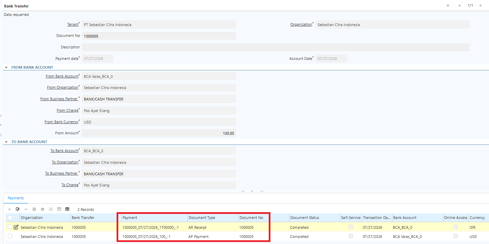 {#Figure180}

Sistem membentuk kedua dokumen tersebut secara otomatis, sehingga user tidak perlu membuat AP Payment maupun AR Receipt secara manual.

Berikut jurnal yang terbentuk atas AP Payment dan AR Receipt untuk Bank/Cash Transfer:

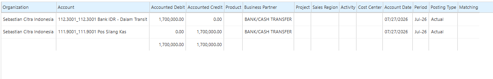 {#Figure181}

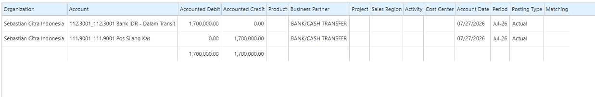 {#Figure182}