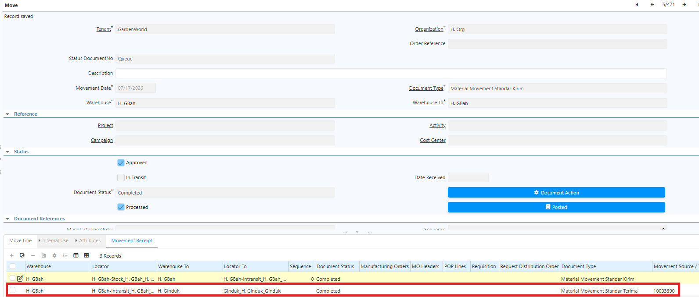

# Movement Standard

Movement Standard adalah mekanisme perpindahan barang antar warehouse yang membutuhkan proses **pengiriman (_delivery_)** dan **penerimaan (_receipt_)**. Mekanisme ini memastikan barang tidak langsung berpindah ke warehouse tujuan, melainkan berstatus _in transit_ terlebih dahulu sehingga stok dapat dipantau dengan lebih akurat.

Proses pengiriman dan penerimaan saling terhubung, sehingga diperlukan konfigurasi dua document type: **Movement Standard Pengiriman** dan **Movement Standard Penerimaan**.
## Konfigurasi Document Type

### Document Type Movement Penerimaan (Receipt)

1. Buka menu **Document Type**.
2. Klik **New**.
3. Isi **Name** sesuai kebutuhan operasional.
4. Pada field **Document Base Type**, pilih **Material Movement**.
5. Pada field **Internal Use Doc Type**, tentukan dokumen Internal Use yang digunakan.
6. Centang field **Auto Create Back Order**.
7. Klik **Save**.
### Document Type Movement Pengiriman (Delivery)

1. Buka menu **Document Type**.
2. Klik **New**.
3. Isi **Name** sesuai kebutuhan operasional.
4. Pada field **Document Base Type**, pilih **Material Movement**.
5. Pada field **Internal Use Doc Type**, tentukan dokumen Internal Use yang digunakan.
6. Pada field **Warehouse Intransit**, tentukan warehouse yang digunakan untuk intransit.
7. Pada field **Locator Intransit**, tentukan locator yang digunakan untuk intransit.
8. Pada field **Document Type Receipt**, pilih document Movement Penerimaan yang telah dikonfigurasi.
9. Klik **Save**.
## Implementasi Movement Standard

### Proses Pengiriman (Delivery)

1. Buka menu **Inventory Move**.
2. Tentukan **Document Type** yang akan digunakan.
3. Tentukan **Warehouse** asal dan **Warehouse** tujuan.
4. Klik **Save**.
5. Masuk ke **Move Line**.
6. Tentukan **produk** yang akan diproses.
7. Tentukan **Locator** asal dan **Locator** tujuan.
8. Tentukan **quantity** produk yang akan diproses.
9. Klik **Save**.
10. Klik **Complete** pada dokumen Movement.

Saat Movement di-complete, warehouse dan locator tujuan otomatis berubah menjadi warehouse dan locator **In-Transit** sesuai konfigurasi document type. Sistem juga otomatis membuat **Movement Receipt** dari In-Transit ke warehouse dan locator tujuan, beserta informasi **Movement Source/Target** sesuai alur perpindahan barang.

 {#Figure148}
### Proses Penerimaan (Receipt)

Setelah produk berpindah ke warehouse intransit, proses Movement Receipt untuk memindahkan produk ke warehouse dan locator tujuan. Ikuti langkah berikut:

1. Buka menu **Inventory Move**.
2. Cari dokumen dengan memfilter **Movement Source/Target** — input Movement Source/Target yang tercantum di dokumen Movement Delivery.
3. Masuk ke **Move Line**.
4. Tentukan **quantity** produk yang akan diproses.
5. Klik **Save**.
6. Klik **Complete** pada dokumen Movement.

Jika quantity yang diterima hanya sebagian (_parsial_), sistem otomatis membuat **back order** atas kekurangan quantity tersebut yang dapat ditelusuri melalui **Movement Source/Target**.