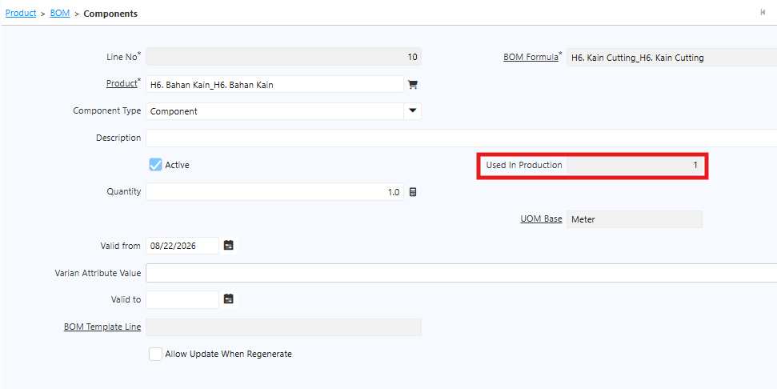

# Bill of Material

Bill of Material (BoM) adalah struktur daftar komponen atau bahan yang digunakan untuk memproduksi suatu produk. BoM digunakan pada  Manufacturing dan Production untuk mendukung proses produksi.

Bill of Material berfungsi untuk:
1. Menentukan komponen penyusun produk
2. Menghitung kebutuhan bahan baku
3. Mendukung proses produksi
4. Menghitung biaya produksi

Satu produk dapat memiliki lebih dari satu BoM sesuai kebutuhan produksi.
## Konfigurasi Bill of Material

### Type BoM

- **Manufacturing Product** — Produksi dilakukan secara _in-house_ oleh perusahaan.
- **Subcontracting** — Produksi dilakukan di luar perusahaan melalui vendor.
### UoM Base

UoM Base bersifat _read-only_ dan terisi otomatis sesuai UoM Base yang dikonfigurasi di level product.
### Component

Komponen atau material yang digunakan dalam proses produksi. Jika komponen pada BoM sudah digunakan dalam transaksi Production, field **Used In Production** otomatis bertambah sesuai quantity yang digunakan. Komponen yang sudah digunakan untuk transaksi produksi tidak dapat dihapus dari BoM.

  {#Figure275}

Berikut field yang tersedia pada Component:

- **Product** — Produk yang menjadi komponen Semi Finished Goods maupun Finished Goods.
- **Qty** — Quantity yang diperlukan untuk memproduksi Semi Finished Goods maupun Finished Goods.
- **UoM Base** — Terisi otomatis sesuai UoM Base pada product dan bersifat _read-only_.
- **Valid From** — Periode mulai berlakunya komponen BoM untuk produk tersebut.
- **Valid To** — Periode berakhirnya komponen BoM untuk produk tersebut.
### BoM Reference

BoM referensi yang digunakan untuk artikel Semi Finished Goods yang memiliki struktur BoM dan komponen tersendiri.
### Valid From

Periode mulai berlakunya BoM untuk produk tersebut.

**Contoh Bill of Material**

Untuk memproduksi **1 pcs Kemeja** dibutuhkan komponen berikut:

| Finished Goods | Komponen     | Qty |
| -------------- | ------------ | --- |
| Kemeja         | Kain Cutting | 2   |
| Kemeja         | Label        | 1   |
| Kemeja         | Kancing      | 4   |
"Bill of Material"{#Tabel3}

