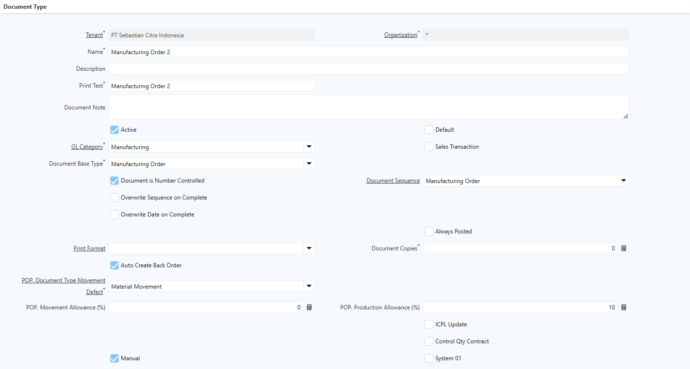
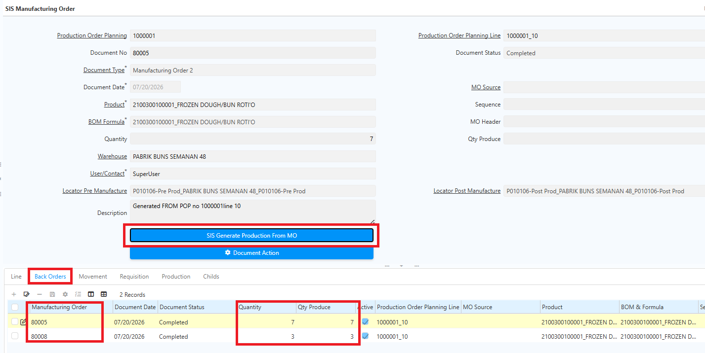
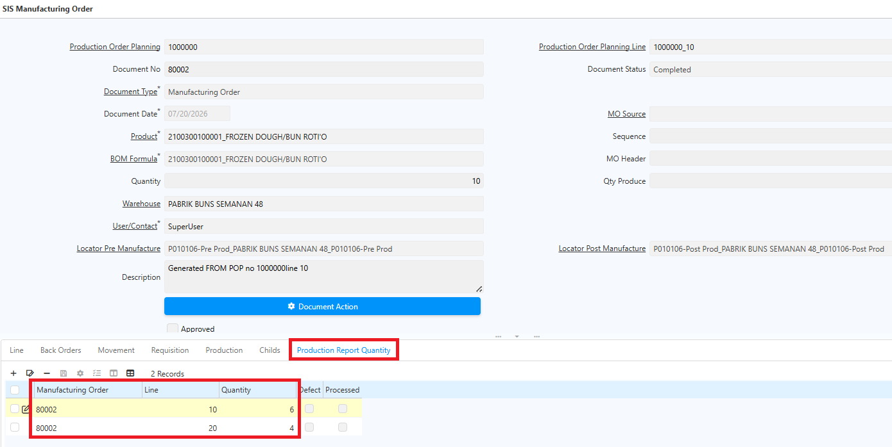
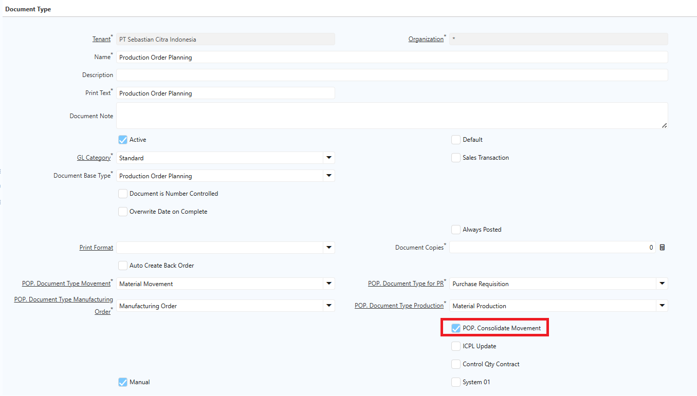
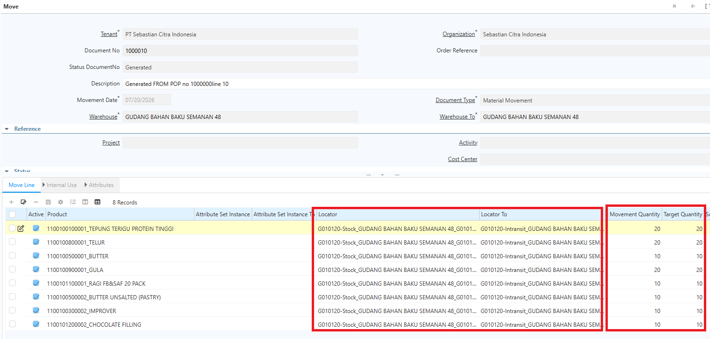
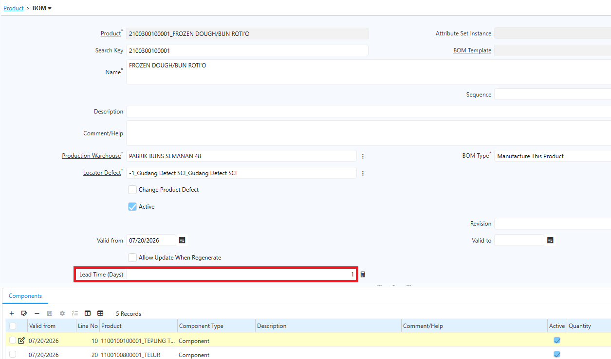

# Production Order Planning

Production Order Planning (POP) adalah dasar perencanaan produksi yang digunakan untuk menentukan produk yang akan diproduksi.

Dalam satu POP, user dapat memproduksi beberapa produk atau beberapa line sekaligus. POP mengacu pada master data produk dan routing. Maka dari itu, routing harus dikonfigurasi terlebih dahulu sebelum membuat POP.
## Fungsi Production Order Planning

Dalam satu POP line, sistem dapat menghasilkan beberapa Manufacturing Order tergantung jumlah dan jenis produk.

POP juga berfungsi untuk:
- Menghitung kebutuhan bahan baku
- Menyiapkan inventory movement
- Menjadi dasar penarikan material dari gudang ke area produksi
## Langkah Production Order Planning di Sistem

1. Buka menu **SIS Production Order Planning**
2. Masuk ke Tab **Line**
3. Input:
  - Produk yang akan diproduksi
  - Quantity produksi
  - BoM yang digunakan
4. Jalankan proses **SIS Generate POP BoM**. Sistem akan menampilkan struktur BoM produk tersebut.

 {#Figure17}

	
5. Klik **SIS Generate MO**. Sistem akan membuat Manufacturing Order secara otomatis.

	 {#Figure18}

6. Masuk ke menu **Manufacturing Order**. Setelah proses Generate MO selesai, sistem otomatis membuat dokumen berikut:
  - Back Order
  - Movement
  - Requisition
  - Production
  - Child
  - Production Report Quantity

Dokumen **Requisition** hanya muncul jika stok material tidak mencukupi.

	
 {#Figure19}

7. Lakukan proses requisition untuk komponen raw material yang dibutuhkan. Alur proses:
  - Requisition Complete
  - Purchase Order Complete
  - Material Receipt
8. Klik Tab **Movement** dan lakukan movement sesuai urutan proses
9. Setelah movement selesai dan stok tersedia, jalankan proses produksi pada tab **Production Report Quantity**:
  - Isi quantity produksi
  - Jika terdapat produk defect, isi quantity defect
  - Centang field **Defect** untuk produk defect

Produk defect akan diproses movement manual ke locator sesuai konfigurasi pada BoM.

	
!(80%)[Production](../Prod_Report_Reg.png "Production Report Quantity") {#Figure20}
	

10. Setelah quantity ditentukan, lakukan **Complete Document MO**. Sistem akan menjalankan proses production secara otomatis di belakang layar dan mengkonsumsi **Raw Material** dan **Semi Finished Goods**

	 {#Figure21}

11. Setelah produk finished goods selesai diproduksi, klik **Complete** pada dokumen POP.

>**Catatan:** Dokumen POP hanya dapat di-complete jika seluruh dokumen **Requisition**, **Purchase Order**, dan **Manufacturing Order** sudah berstatus _Complete_. Jika masih terdapat dokumen yang outstanding atau belum diproses, sistem akan menampilkan pesan error dan dokumen POP tidak dapat di-complete.

 {#Figure126}

Dokumen **Manufacturing Order (MO)**, **Movement**, dan **Requisition** sudah memuat informasi POP yang bersangkutan. Selain itu, user dapat melakukan pencarian Movement berdasarkan nomor POP melalui fitur **Search**, sehingga tim gudang dapat memfilter POP mana yang sudah atau belum diproses dengan mudah.

Berikut contoh tampilan dokumen MO dan Movement yang sudah memuat informasi **POP** dan **POP Line** terkait:

 {#Figure125}

 {#Figure126}

Di header Production Order Planning, terdapat tombol **SIS Generate POP BoM** dan **Generate MO**. Kedua tombol ini memungkinkan user men-generate BoM dan MO untuk seluruh line dalam satu POP sekaligus, tanpa perlu melakukan generate satu per satu.
### SIS Generate POP BoM

Ikuti langkah berikut untuk men-generate BoM pada seluruh line POP:

1. Buka menu **Production Order Planning**.
2. Pilih dokumen yang akan diproses.
3. Masuk ke header **Production Order Planning**.
4. Klik tombol **SIS Generate POP BoM**.

 {#Figure115}

5. Klik **ok**.

Sistem otomatis men-generate BoM pada seluruh line POP tersebut.
### Generate MO

Ikuti langkah berikut untuk men-generate Manufacturing Order (MO) pada seluruh line POP:

1. Buka menu **Production Order Planning**.
2. Pilih dokumen yang akan diproses.
3. Masuk ke header **Production Order Planning**.
4. Klik tombol **Generate MO**.

 {#Figure116}

5. Klik **OK**.

Sistem otomatis men-generate MO pada seluruh line POP tersebut.
## Generate Listing Document POP

Fitur **Generate Listing Document POP** digunakan untuk mengekspor seluruh dokumen POP — mulai dari Requisition, Purchase Order, Material Receipt, hingga jurnal Rate Variance — dalam format **Excel**. Dokumen yang dihasilkan memuat informasi quantity dan status dokumen di setiap tahapan produksi.

Ikuti langkah berikut untuk mengekspor dokumen POP:

1. Buka menu **SIS Production Order Planning**.
2. Pilih dokumen yang akan diproses.
3. Klik ikon **Setting (⚙)**.
4. Klik **Generate Listing Document POP**.
5. Pilih document yang akan diproses berdasarkan document status.

 {#Figure117}

5. Klik **OK**
6. Sistem menampilkan dokumen dalam format **Excel**.

 {#Figure118}

7. Klik dokumen tersebut, kemudian klik **Download**.

Dokumen yang dihasilkan terfilter berdasarkan **Document Status** yang dikonfigurasi. Contoh: jika filter Document Status diset _Complete_, maka hasil generate hanya menampilkan dokumen berstatus _Complete_. Ketentuan yang sama berlaku untuk status lainnya seperti _Draft_, _In Progress_, dan _Invalid_.

Jika field Document Status dikosongkan, sistem menampilkan seluruh dokumen tanpa filter, mencakup informasi quantity dan komponen artikel yang digunakan dalam proses produksi beserta jurnal transaksi terkait, meliputi:

- Purchase Order (PO)
- Material Receipt (MR)
- Invoice
- Matched Invoice
- Material Movement
- Production
## Mekanisme Production

Di iDempiere, terdapat dua mekanisme produksi yang dikonfigurasi di level **Document Type Manufacturing Order**:

- **Pendekatan Lama** — User menentukan quantity production reports di level MO dengan mengklik **SIS Generate Production From MO**. Sistem otomatis membentuk dokumen Production berstatus _Complete_ dan MO ikut ter-complete. Jika produksi dilakukan secara parsial, sistem otomatis membuat **back order MO** atas sisa quantity yang belum diproduksi.
- **Pendekatan Baru** — Hanya terdapat satu MO, namun user dapat mengatur production reports berkali-kali sebelum MO di-complete. User menginput quantity produk yang diproses di tab **Production Report Qty** — baik sekaligus maupun secara parsial — kemudian baru mengcomplete dokumen MO. Di pendekatan ini tidak ada auto back order untuk produksi parsial; user harus menentukan quantity production terlebih dahulu sebelum meng-complete MO.

Ikuti langkah berikut untuk mengkonfigurasi mekanisme production:

1. Buka menu **Document Type**.
2. Cari dokumen **Manufacturing Order**.
3. Pada field **Auto Back Order**, lakukan konfigurasi:
- **Y** — Menggunakan mekanisme production versi lama.
- **N** — Menggunakan mekanisme production versi baru.

{#Figure151}

4. Klik **Save**.

Berikut contoh tampilan window dan proses Manufacturing Order untuk versi lama dan versi baru:

 {#Figure152}

 {#Figure153}
## Konsolidasi Movement

Fitur **Konsolidasi Movement** digunakan untuk menggabungkan beberapa kebutuhan perpindahan barang ke dalam satu dokumen **Inventory Move**, selama memiliki **Warehouse From** dan **Warehouse To** yang sama. Dengan fitur ini, jumlah dokumen movement berkurang sehingga proses pengiriman, penerimaan, dan administrasi gudang menjadi lebih efisien.
### Konfigurasi Konsolidasi

Saat sistem men-generate Material Movement, sistem membandingkan informasi perpindahan setiap artikel. Jika beberapa artikel memiliki kombinasi **Warehouse From** dan **Warehouse To** yang sama, sistem menggabungkannya ke dalam **satu dokumen Inventory Move**.

Ikuti langkah berikut untuk mengkonfigurasi konsolidasi movement:

1. Buka menu **Document Type**.
2. Cari dokumen **Production Order Planning**.
3. Pada field **Consolidate Movement**, lakukan konfigurasi:
- **Y** — Movement akan dikonsolidasi.
- **N** — Movement tidak dikonsolidasi.

 {#Figure154}

4. Klik **Save**.
### Implementasi Konsolidasi Movement

Meskipun beberapa artikel digabung dalam satu dokumen movement, **quantity setiap artikel tetap dihitung secara independen** sesuai konfigurasi di level product. Sistem tidak menjumlahkan quantity antar artikel yang berbeda — setiap artikel tetap menggunakan quantity hasil perhitungan sesuai konfigurasi BoM, Routing, atau kebutuhan produksinya masing-masing.

Contoh:

|Artikel|Warehouse From|Warehouse To|Qty Movement|
|---|---|---|---|
|Tepung Terigu|Gudang Bahan|Gudang Produksi|20 Kg|
|Gula Pasir|Gudang Bahan|Gudang Produksi|20 Kg|
|Ragi|Gudang Bahan|Gudang Produksi|10 Kg|

 {#Figure155}

Karena seluruh artikel memiliki Warehouse From dan Warehouse To yang sama, sistem menghasilkan **satu dokumen Inventory Move** dengan tiga line — masing-masing quantity mengikuti kebutuhan artikel tersebut.

Jika konsolidasi movement tidak dikonfigurasi, setiap artikel akan memiliki dokumen Inventory Move tersendiri as existing saat ini meskipun locator asal dan tujuannya sama.
## Lead Time

**Lead Time Produksi** adalah estimasi waktu yang dibutuhkan untuk menyelesaikan proses produksi suatu produk — sejak produksi dimulai hingga produk selesai. Sistem menggunakan nilai ini untuk menghitung **Document Date** pada MO dan Movement.

### Konfigurasi Lead Time

Konfigurasi Lead Time dilakukan pada **Bill of Material (BoM)** produk melalui field **Lead Time (Days)** — berisi jumlah hari yang dibutuhkan untuk memproduksi produk tersebut.

Contoh konfigurasi:

| Produk            | Lead Time (Days) |
| ----------------- | ---------------- |
| Frozen Dough Buns | 1 Hari           |

 {#Figure156}
### Implementasi Lead Time

Di iDempiere, **Estimated Date** (tanggal output produksi) ditentukan oleh user. Konfigurasi Lead Time pada BoM berfungsi untuk menentukan **Document Date** MO dan Movement, dengan rumus berikut:

> **Document Date = Estimated Date − Lead Time (Days)**

Contoh:

|Estimated Date|Lead Time|Document Date|
|---|---|---|
|21 Juli 2026|1 Hari|20 Juli 2026