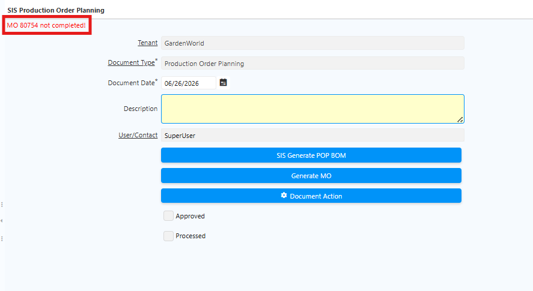
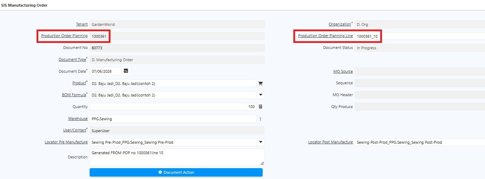
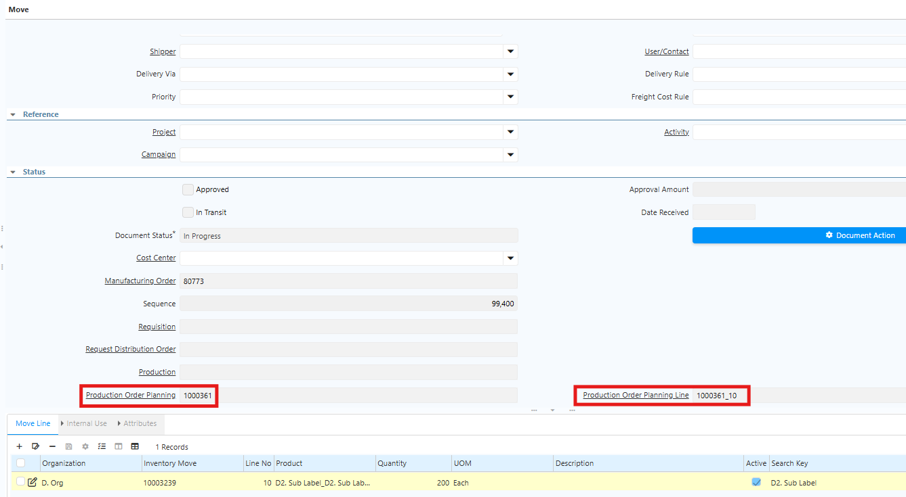
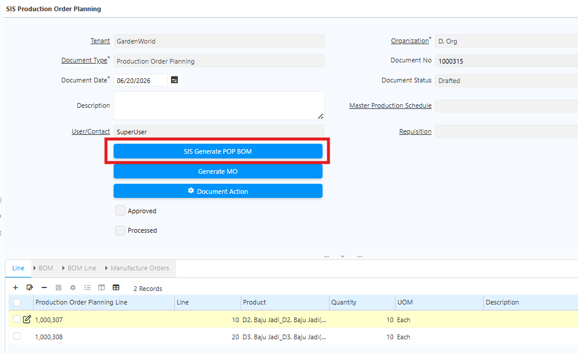
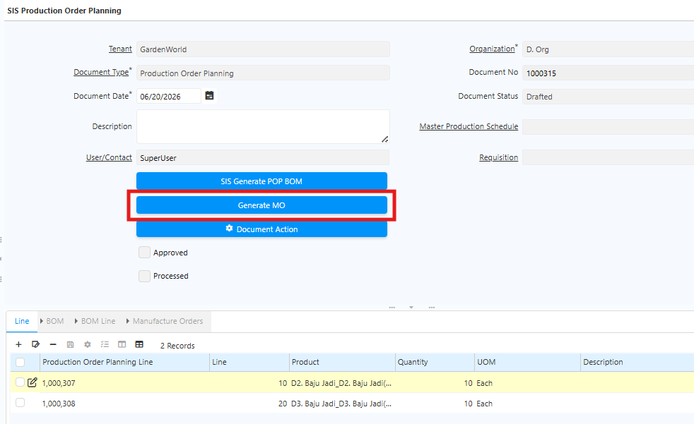
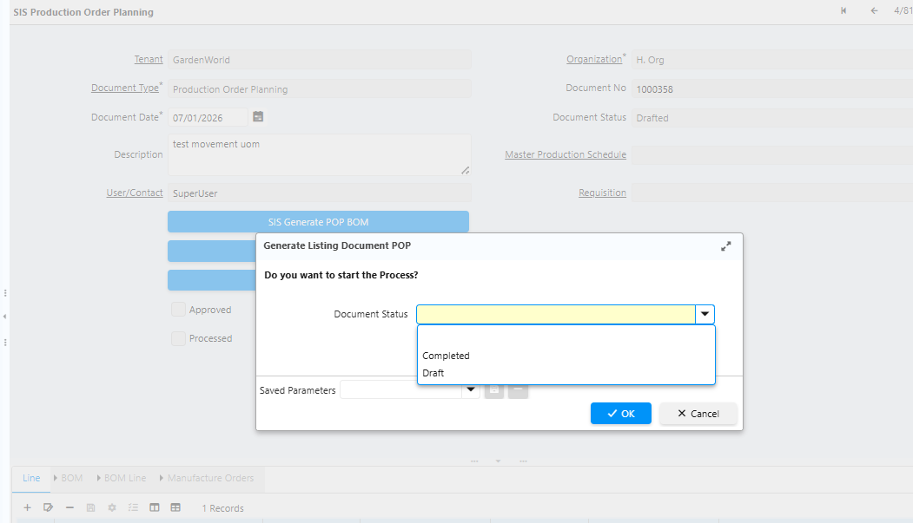
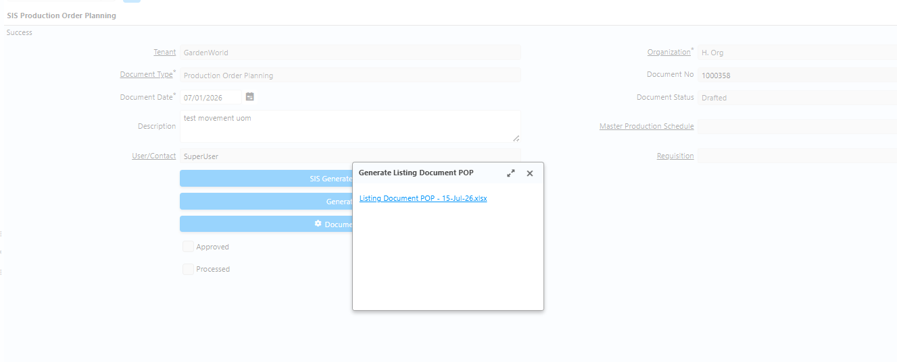

# Production Order Planning

Production Order Planning (POP) adalah dasar perencanaan produksi yang digunakan untuk menentukan produk yang akan diproduksi.

Dalam satu POP, user dapat memproduksi beberapa produk atau beberapa line sekaligus. POP mengacu pada master data produk dan routing. Maka dari itu, routing harus dikonfigurasi terlebih dahulu sebelum membuat POP.
## Fungsi Production Order Planning

Dalam satu POP line, sistem dapat menghasilkan beberapa Manufacturing Order tergantung jumlah dan jenis produk.

POP juga berfungsi untuk:
- Menghitung kebutuhan bahan baku
- Menyiapkan inventory movement
- Menjadi dasar penarikan material dari gudang ke area produksi
## Langkah Production Order Planning di Sistem

1. Buka menu **SIS Production Order Planning**
2. Masuk ke Tab **Line**
3. Input:
  - Produk yang akan diproduksi
  - Quantity produksi
  - BoM yang digunakan
4. Jalankan proses **SIS Generate POP BoM**. Sistem akan menampilkan struktur BoM produk tersebut.

 {#Figure17}

	
5. Klik **SIS Generate MO**. Sistem akan membuat Manufacturing Order secara otomatis.

	 {#Figure18}

6. Masuk ke menu **Manufacturing Order**. Setelah proses Generate MO selesai, sistem otomatis membuat dokumen berikut:
  - Back Order
  - Movement
  - Requisition
  - Production
  - Child
  - Production Report Quantity

Dokumen **Requisition** hanya muncul jika stok material tidak mencukupi.

	
 {#Figure19}

7. Lakukan proses requisition untuk komponen raw material yang dibutuhkan. Alur proses:
  - Requisition Complete
  - Purchase Order Complete
  - Material Receipt
8. Klik Tab **Movement** dan lakukan movement sesuai urutan proses
9. Setelah movement selesai dan stok tersedia, jalankan proses produksi pada tab **Production Report Quantity**:
  - Isi quantity produksi
  - Jika terdapat produk defect, isi quantity defect
  - Centang field **Defect** untuk produk defect

Produk defect akan diproses movement manual ke locator sesuai konfigurasi pada BoM.

	
!(80%)[Production](../Prod_Report_Reg.png "Production Report Quantity") {#Figure20}
	

10. Setelah quantity ditentukan, lakukan **Complete Document MO**. Sistem akan menjalankan proses production secara otomatis di belakang layar dan mengkonsumsi **Raw Material** dan **Semi Finished Goods**

	 {#Figure21}

11. Setelah produk finished goods selesai diproduksi, klik **Complete** pada dokumen POP.

>**Catatan:** Dokumen POP hanya dapat di-complete jika seluruh dokumen **Requisition**, **Purchase Order**, dan **Manufacturing Order** sudah berstatus _Complete_. Jika masih terdapat dokumen yang outstanding atau belum diproses, sistem akan menampilkan pesan error dan dokumen POP tidak dapat di-complete.

 {#Figure126}

Dokumen **Manufacturing Order (MO)**, **Movement**, dan **Requisition** sudah memuat informasi POP yang bersangkutan. Selain itu, user dapat melakukan pencarian Movement berdasarkan nomor POP melalui fitur **Search**, sehingga tim gudang dapat memfilter POP mana yang sudah atau belum diproses dengan mudah.

Berikut contoh tampilan dokumen MO dan Movement yang sudah memuat informasi **POP** dan **POP Line** terkait:

 {#Figure125}

 {#Figure126}

Di header Production Order Planning, terdapat tombol **SIS Generate POP BoM** dan **Generate MO**. Kedua tombol ini memungkinkan user men-generate BoM dan MO untuk seluruh line dalam satu POP sekaligus, tanpa perlu melakukan generate satu per satu.
### SIS Generate POP BoM

Ikuti langkah berikut untuk men-generate BoM pada seluruh line POP:

1. Buka menu **Production Order Planning**.
2. Pilih dokumen yang akan diproses.
3. Masuk ke header **Production Order Planning**.
4. Klik tombol **SIS Generate POP BoM**.

 {#Figure115}

5. Klik **ok**.

Sistem otomatis men-generate BoM pada seluruh line POP tersebut.
### Generate MO

Ikuti langkah berikut untuk men-generate Manufacturing Order (MO) pada seluruh line POP:

1. Buka menu **Production Order Planning**.
2. Pilih dokumen yang akan diproses.
3. Masuk ke header **Production Order Planning**.
4. Klik tombol **Generate MO**.

 {#Figure116}

5. Klik **OK**.

Sistem otomatis men-generate MO pada seluruh line POP tersebut.
## Generate Listing Document POP

Fitur **Generate Listing Document POP** digunakan untuk mengekspor seluruh dokumen POP — mulai dari Requisition, Purchase Order, Material Receipt, hingga jurnal Rate Variance — dalam format **Excel**. Dokumen yang dihasilkan memuat informasi quantity dan status dokumen di setiap tahapan produksi.

Ikuti langkah berikut untuk mengekspor dokumen POP:

1. Buka menu **SIS Production Order Planning**.
2. Pilih dokumen yang akan diproses.
3. Klik ikon **Setting (⚙)**.
4. Klik **Generate Listing Document POP**.
5. Pilih document yang akan diproses berdasarkan document status.

 {#Figure117}

5. Klik **OK**
6. Sistem menampilkan dokumen dalam format **Excel**.

 {#Figure118}

7. Klik dokumen tersebut, kemudian klik **Download**.

Dokumen yang dihasilkan terfilter berdasarkan **Document Status** yang dikonfigurasi. Contoh: jika filter Document Status diset _Complete_, maka hasil generate hanya menampilkan dokumen berstatus _Complete_. Ketentuan yang sama berlaku untuk status lainnya seperti _Draft_, _In Progress_, dan _Invalid_.

Jika field Document Status dikosongkan, sistem menampilkan seluruh dokumen tanpa filter, mencakup informasi quantity dan komponen artikel yang digunakan dalam proses produksi beserta jurnal transaksi terkait, meliputi:

- Purchase Order (PO)
- Material Receipt (MR)
- Invoice
- Matched Invoice
- Material Movement
- Production
