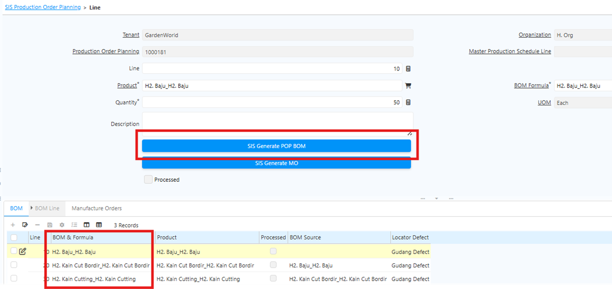
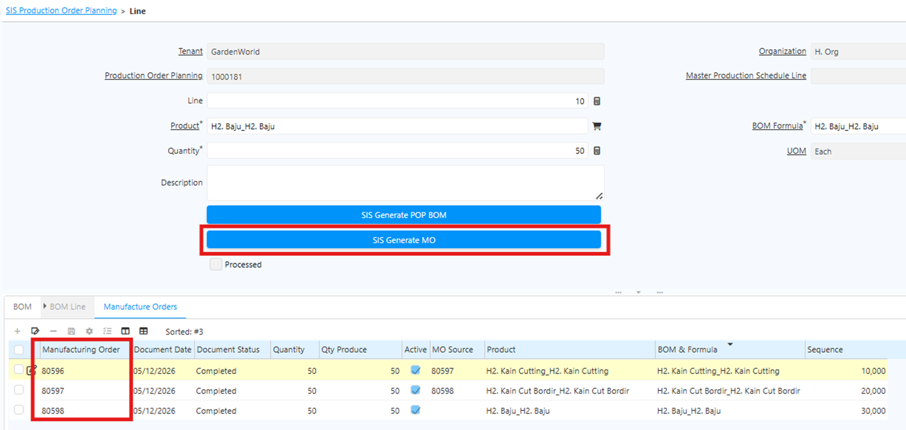
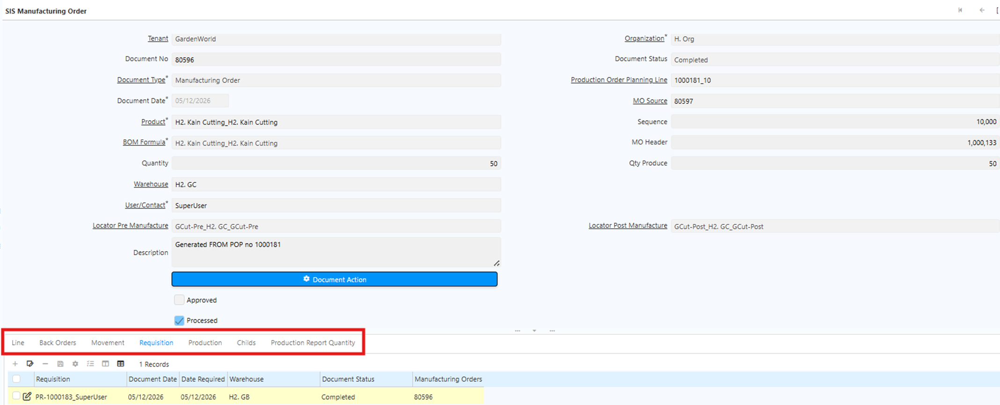
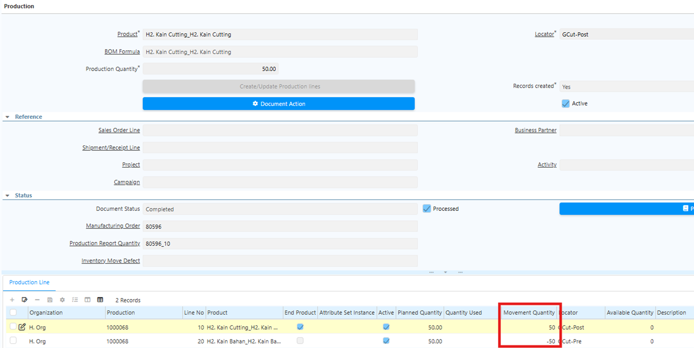

# Production Order Planning

Production Order Planning (POP) adalah dasar perencanaan produksi yang digunakan untuk menentukan produk yang akan diproduksi.

Dalam satu POP, user dapat memproduksi beberapa produk atau beberapa line sekaligus. POP mengacu pada master data produk dan routing. Maka dari itu, routing harus dikonfigurasi terlebih dahulu sebelum membuat POP.
## Fungsi Production Order Planning

Dalam satu POP line, sistem dapat menghasilkan beberapa Manufacturing Order tergantung jumlah dan jenis produk.

POP juga berfungsi untuk:
- Menghitung kebutuhan bahan baku
- Menyiapkan inventory movement
- Menjadi dasar penarikan material dari gudang ke area produksi

## Langkah Production Order Planning di Sistem

1. Buka menu **SIS Production Order Planning**
2. Masuk ke Tab **Line**
3. Input:
  - Produk yang akan diproduksi
  - Quantity produksi
  - BoM yang digunakan
4. Jalankan proses **SIS Generate POP BoM**. Sistem akan menampilkan struktur BoM produk tersebut.

 {#Figure17}

	
5. Klik **SIS Generate MO**. Sistem akan membuat Manufacturing Order secara otomatis.

	 {#Figure18}

	
6. Masuk ke menu **Manufacturing Order**. Setelah proses Generate MO selesai, sistem otomatis membuat dokumen berikut:
   + Back Order
   + Movement
   + Requisition
   + Production
   + Child
   + Production Report Quantity

Dokumen **Requisition** hanya muncul jika stok material tidak mencukupi.

	
	 {#Figure19}

	
7. Lakukan proses requisition untuk komponen raw material yang dibutuhkan. Alur proses:
  - Requisition Complete
  - Purchase Order Complete
  - Material Receipt
8. Klik Tab **Movement** dan lakukan movement sesuai urutan proses
9. Setelah movement selesai dan stok tersedia, jalankan proses produksi pada tab **Production Report Quantity**:
  + Isi quantity produksi
  + Jika terdapat produk defect, isi quantity defect
  + Centang field **Defect** untuk produk defect

Produk defect akan diproses movement manual ke locator sesuai konfigurasi pada BoM.

	
		!(80%)[Production](../Prod_Report_Reg.png "Production Report Quantity") {#Figure20}
	

10. Setelah quantity ditentukan, lakukan **Complete Document MO**. Sistem akan menjalankan proses production secara otomatis di belakang layar dan mengkonsumsi **Raw Material** dan **Semi Finished Goods**

	 {#Figure21}

