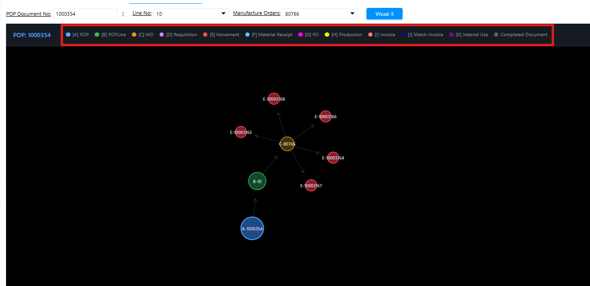
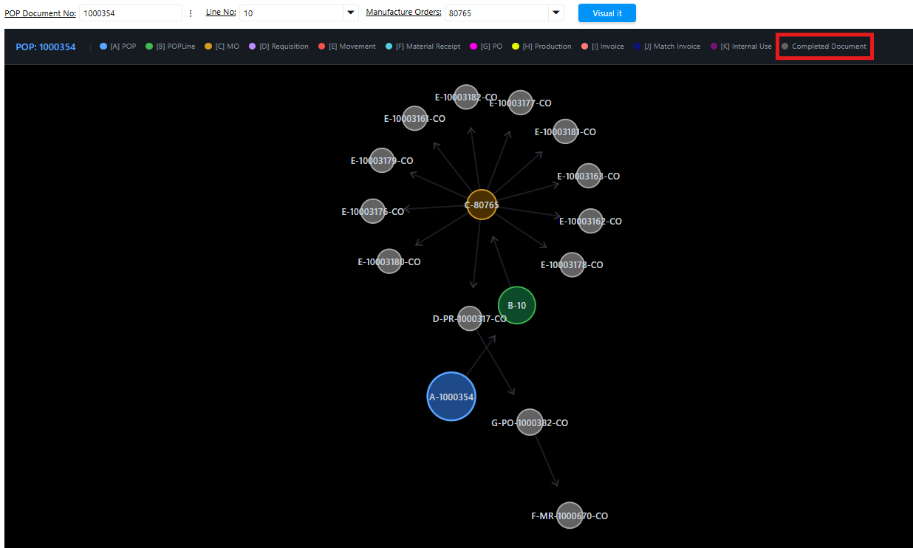
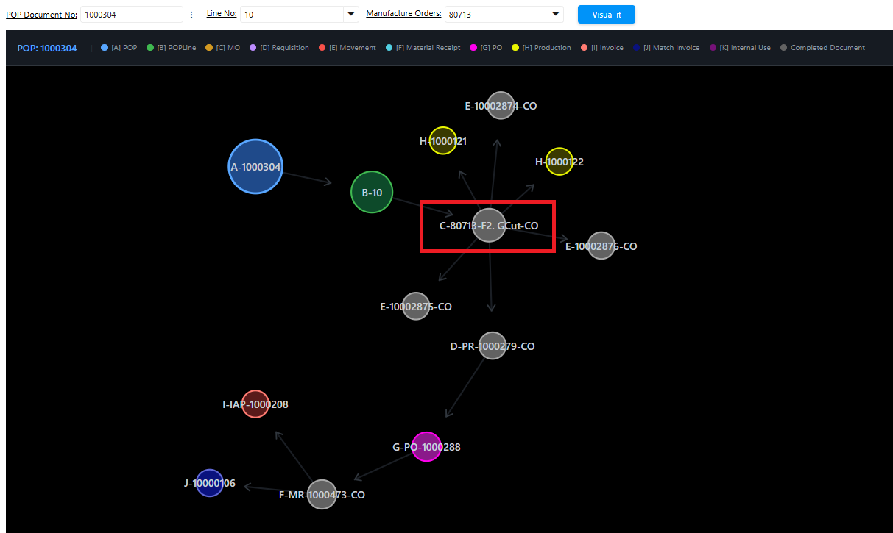

# Pelita POP Visual Data

Pelita POP Visual Data adalah fitur visualisasi yang menampilkan setiap tahapan Production Order Planning (POP) — mulai dari penentuan artikel yang akan diproduksi hingga artikel selesai diproduksi. Fitur ini memudahkan pemantauan progress produksi sekaligus memungkinkan generate dokumen di masing-masing tahapan.
## Langkah Akses Pelita POP Visual Data

1. Buka menu Pelita POP Visual Data
2. Input nomor POP di field POP Document No
3. Input Line No POP
4. Input Manufacture Order
5. Klik Visual It

 {#Figure79}

Sistem menampilkan visualisasi Production Order Planning berdasarkan Manufacturing Order (MO) yang dipilih. Setiap tahapan produksi dibedakan menggunakan kodefikasi A–J dengan warna yang berbeda, sehingga progress produksi dapat dipantau secara langsung.
## Ketentuan Visualisasi

Berikut ketentuan perubahan warna pada visualisasi:

- Abu-abu — Dokumen sudah di-complete (berlaku untuk Movement, MO, Requisition, PO, dan MR).

 {#Figure80}

- Warna sesuai konfigurasi — Dokumen belum di-complete (berlaku untuk Movement, MO, Requisition, PO, dan MR).

 {#Figure81}

Untuk dokumen selain Movement, Requisition, Purchase Order, dan Material Receipt, warna pada visualisasi tidak berubah — baik saat status dokumen masih draft maupun sudah complete.

Berikut interaksi yang tersedia pada visualisasi:

- Klik satu kali pada salah satu tahapan untuk melihat detail, termasuk dokumen masuk (incoming) dan dokumen keluar (outgoing).
- Klik dua kali pada node untuk membuka menu terkait. Contoh: klik dua kali pada node A akan membuka menu POP.
- Sorot salah satu tahapan untuk melihat informasi dokumen beserta keterkaitannya.
### Informasi Warehouse pada Manufacturing Order (MO)

Setiap Manufacturing Order (MO) kini memuat informasi **warehouse produksi** untuk masing-masing artikel. Dengan informasi ini, user dapat memantau tahapan produksi yang sudah selesai dan yang masih _outstanding_, serta mengetahui artikel sudah diproduksi sampai tahap mana — apakah masih di _cutting_, _sewing_, atau _finishing_.

Berikut contoh implementasi informasi warehouse pada masing-masing MO:

 {#Figure130}