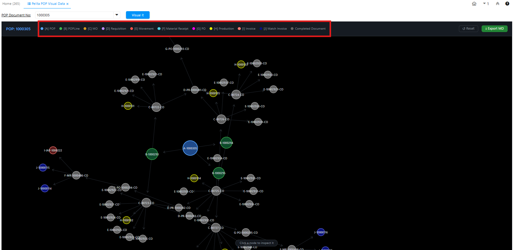

# Pelita POP Visual Data

Pelita POP Visual Data adalah fitur visualisasi yang menampilkan setiap tahapan Production Order Planning (POP) — mulai dari penentuan artikel yang akan diproduksi hingga artikel selesai diproduksi. Fitur ini memudahkan pemantauan progress produksi sekaligus memungkinkan generate dokumen di masing-masing tahapan.

## Langkah Akses Pelita POP Visual Data

1. Buka menu Pelita POP Visual Data
2. Input nomor POP di field POP Document No
3. Klik Visual It

 {#Figure79}

Sistem menampilkan visualisasi Production Order Planning yang dipilih. Setiap tahapan produksi dibedakan menggunakan kodefikasi A–J dengan warna yang berbeda, sehingga progress produksi dapat dipantau secara langsung.

## Ketentuan Visualisasi
Berikut ketentuan perubahan warna pada visualisasi:

- Abu-abu — Dokumen sudah di-complete (berlaku untuk Movement, MO, Requisition, PO, dan MR).
- Warna sesuai konfigurasi — Dokumen belum di-complete (berlaku untuk Movement, MO, Requisition, PO, dan MR).

Untuk dokumen selain Movement, MO, Requisition, PO, dan MR, warna pada visualisasi tidak berubah — baik saat status dokumen masih draft maupun sudah complete.

Berikut interaksi yang tersedia pada visualisasi:

- Klik satu kali pada salah satu tahapan untuk melihat detail, termasuk dokumen masuk (incoming) dan dokumen keluar (outgoing).
- Klik dua kali pada node untuk membuka menu terkait. Contoh: klik dua kali pada node A akan membuka menu POP.
- Sorot salah satu tahapan untuk melihat informasi dokumen beserta keterkaitannya.