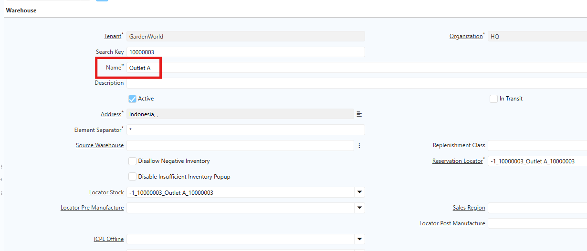
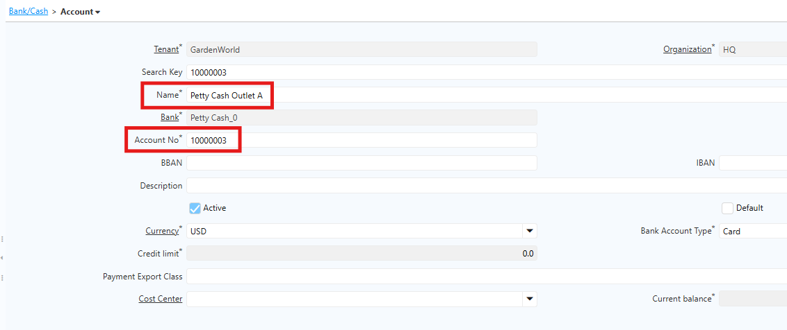
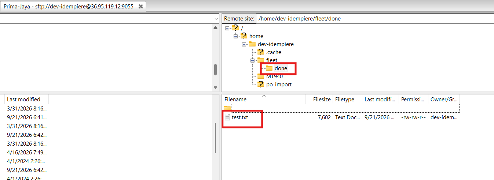
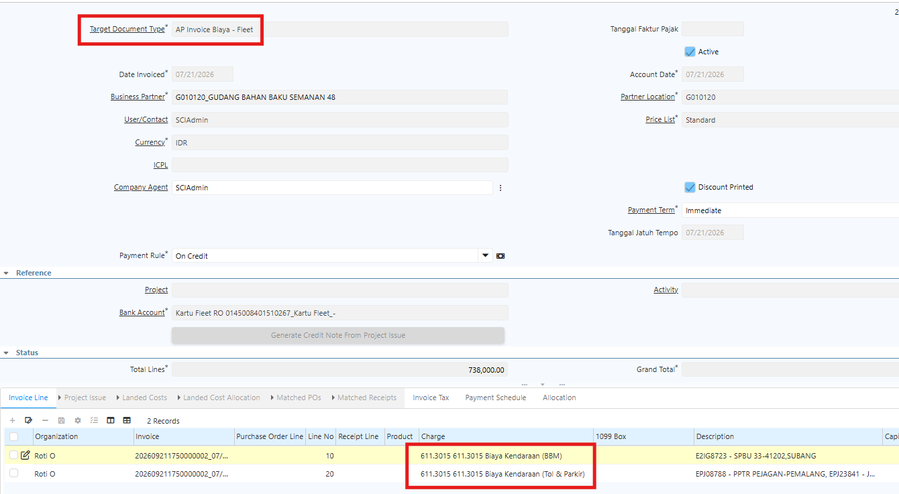

# Petty Cash dan Kartu Fleet

**Petty Cash** adalah mekanisme untuk mengelola kas kecil perusahaan yang digunakan untuk membayar pengeluaran operasional bernilai relatif kecil dan bersifat rutin. **Kartu Fleet** digunakan untuk mencatat dan memantau kendaraan perusahaan beserta transaksi atau aktivitas yang berkaitan dengan kendaraan tersebut.
## Konfigurasi Petty Cash dan Kartu Fleet

Di iDempiere, Petty Cash dan Kartu Fleet dikelola melalui menu **Bank/Cash**. Ikuti langkah berikut untuk membuat master data Petty Cash:

1. Buka menu **Bank/Cash**.
2. Input **nama Petty Cash**.
3. Masuk ke tab **Account**.
4. Input **nama Petty Cash outlet**.
5. Klik **Save**.
6. Ulangi langkah di atas untuk outlet lainnya.

Akun pada master data Petty Cash dapat dibuat per outlet, sehingga pembagiannya berdasarkan akun outlet.

Ikuti langkah berikut untuk membuat master data Kartu Fleet:

1. Buka menu **Bank/Cash**.
2. Input **nama Kartu Fleet**.
3. Masuk ke tab **Account**.
4. Input **nama** sesuai kebijakan.
5. Input **nomor kartu** pada field **Account No**.
6. Klik **Save**.

Akun bank asset untuk Petty Cash dan Kartu Fleet berbeda, sehingga perlu dilakukan konfigurasi accounting pada akun bank asset masing-masing. Ikuti langkah berikut:

1. Buka menu **Bank/Cash**.
2. Buat master data untuk **Petty Cash** dan **Kartu Fleet**.
3. Masuk ke tab **Account**, lalu masuk ke tab **Accounting**.
4. Pada field **Bank Asset**, lakukan konfigurasi berikut:
- **Petty Cash** — Kas Belanja Toko.
- **Kartu Fleet** — Uang Muka Jaminan Lain-Lain.
## Mekanisme Pindah dana Petty Cash

1. Buka menu **Bank/Cash Transfer**.
2. Tentukan **bank asal**.
3. Pada field **Bank To**, input **Petty Cash**.

 {#Figure242}

4. Tentukan **amount** yang akan diproses.
5. Klik **Complete**.

Saat Bank/Cash Transfer di-complete, sistem membentuk dua dokumen payment dengan jurnal berikut:

 {#Figure243}

### Pindah Dana (Bank Asal)

 {#Figure244}
### Terima Dana (Petty Cash)

 {#Figure245}

### Proses Matching Ayat Silang melalui Bank Statement

 {#Figure246}
## Mekanisme Pindah Dana Kartu Fleet

1. Buka menu **Bank/Cash Transfer**.
2. Tentukan **bank asal**.
3. Pada field **Bank To**, input **Kartu Fleet**.

 {#Figure247}

4. Tentukan **amount** yang akan diproses.
5. Klik **Complete**.

Saat Bank/Cash Transfer di-complete, sistem membentuk dua dokumen payment dengan jurnal berikut:

### Pindah Dana (Bank Asal)

 {#Figure248}
### Terima Dana (Kartu Fleet)

 {#Figure249}
### Proses Matching Ayat Silang melalui Bank Statement

 {#Figure250}

## Invoice Biaya atas Kartu Fleet

Kartu Fleet digunakan untuk mencatat dan memantau kendaraan perusahaan beserta transaksi yang berkaitan. Pencatatan biaya atas Kartu Fleet diakui sebagai beban dan dilakukan tanpa PO maupun MR/BPB.

Agar invoice biaya Kartu Fleet yang sudah di-complete otomatis membentuk dokumen **Payment**, lakukan konfigurasi pada **Document Type Invoice** terlebih dahulu. Ikuti langkah berikut:

1. Buka menu **Document Type**.
2. Klik **New**.
3. Isi **Name** sesuai kebutuhan operasional.
4. Pada field **Document Base Type**, pilih **AP Invoice**.
5. Centang field **Document Number Is Controlled**.
6. Centang field **Auto Payment**.
7. Tentukan **Document Type Payment Fleet**.
8. Tentukan **Document Action** atas Payment Fleet.
9. Field **Auto Bank Statement** — jika dicentang, sistem otomatis membuat Bank Statement saat Payment di-complete.
10. Tentukan **Document Type Bank Statement Fleet**.
11. Tentukan **Document Action** atas Bank Statement Fleet.

 {#Figure250}

12. Klik **Save**.
### Langkah Membuat AP Invoice Biaya Kartu Fleet

1. Buka menu **Purchase Invoice and Credit/Debit Note**.
2. Tentukan **Target Document Type**.
3. Tentukan **Business Partner**.
4. Tentukan **Bank Account** yang digunakan.
5. Masuk ke **Invoice Line**.
6. Tentukan **Charge** atau biaya yang akan diproses.
7. Tentukan **Qty** _(default 1)_.
8. Tentukan **Price** untuk biaya tersebut.

 {#Figure251}

9. Klik **Save**.
10. Klik **Complete**.

Berikut contoh jurnal yang terbentuk atas invoice biaya _(nama akun dapat disesuaikan dengan ketentuan)_:

 {#Figure252}

Setelah Invoice di-complete, sistem otomatis membuat dokumen **Payment** atas invoice tersebut. Document Action pada Payment mengikuti konfigurasi di Document Type Invoice.

 {#Figure253}

Berikut contoh jurnal yang terbentuk saat Payment di-complete:

 {#Figure254}

Saat Payment di-complete, sistem otomatis membuat dokumen **Bank Statement** sesuai konfigurasi sebelumnya. 

 {#Figure255}

 {#Figure256}

Informasi pada Bank Statement diambil dari invoice dan payment, sehingga setiap Payment dan Bank Statement dapat ditelusuri kaitannya dengan invoice dan Business Partner yang bersangkutan.

## Auto Create Bank Account Petty Cash

Di iDempiere, setiap outlet memiliki Bank Account Petty Cash tersendiri. Karena jumlah outlet bisa mencapai ratusan, sistem otomatis membuat Bank Account Petty Cash untuk setiap warehouse yang dibuat, dengan penamaan **Petty Cash + Nama Warehouse**.

Sebelum membuat master data warehouse, lakukan konfigurasi sistem berikut terlebih dahulu:

- Tambahkan konfigurasi **SIS_BANK_PETTY_CASH_ID** dengan nilai **C_Bank_ID** dari bank Petty Cash yang telah dibuat di menu **Bank/Cash**.

Setelah konfigurasi selesai, sistem otomatis membuat Bank Account Petty Cash setiap kali warehouse baru dibuat.

### Proses Auto Create Bank Account Petty Cash dari Warehouse

Ikuti langkah berikut untuk membuat warehouse:

1. Buka menu **Warehouse and Locator**.
2. Tentukan **Search Key**. **Search Key** yang diinput merepresentasikan **Account Number** di Bank/Cash.
3. Tentukan **Name** warehouse.
4. Tentukan **alamat** warehouse.
5. Klik **Save**.

Saat warehouse disimpan, sistem otomatis:

- Membuat **satu locator default** yang dikonfigurasi sebagai _Stock Locator_ dan _Reserve Locator_.
- Membuat **Bank Account Petty Cash** atas warehouse tersebut.

 {#Figure303}
### Verifikasi Bank Account Petty Cash

Untuk memverifikasi bahwa Bank Account Petty Cash sudah ter-create otomatis, ikuti langkah berikut:

1. Buka menu **Bank/Cash**.
2. Cari bank Petty Cash yang dikonfigurasi pada **SIS_BANK_PETTY_CASH_ID**.
3. Masuk ke tab **Account**.
4. Sistem menampilkan account Petty Cash yang ter-create otomatis dengan nama **Petty Cash + Nama Warehouse**.

 {#Figure304}

Dengan mekanisme ini, user tidak perlu membuat account Petty Cash secara manual untuk setiap outlet. Setiap Warehouse atau Outlet baru yang dibuat otomatis memiliki **Bank Account Petty Cash** yang terhubung dengan warehouse tersebut.

## Import Transaksi Kartu Fleet

Transaksi **Kartu Fleet** pada sistem iDempiere direpresentasikan sebagai **AP Invoice**. Setiap transaksi yang berasal dari Kartu Fleet akan diproses menjadi AP Invoice berdasarkan **tanggal transaksi dan nomor Kartu Fleet**.

Dalam prosesnya, transaksi Kartu Fleet dapat terdiri dari beberapa jenis transaksi. Namun, dari sisi pembebanan biaya, transaksi tersebut akan dikelompokkan menjadi dua kategori utama, yaitu:

- **BBM**, untuk transaksi yang berkaitan dengan pembelian bahan bakar.
- **Non-BBM**, untuk transaksi selain BBM, seperti **Tol, Parkir**, atau charge lainnya.

Data transaksi Kartu Fleet diperoleh dalam bentuk file dan akan diimport ke sistem menggunakan **FileZilla**.

Sebelum transaksi Kartu Fleet dapat diproses, perlu dilakukan konfigurasi terlebih dahulu pada sistem. Konfigurasi yang diperlukan meliputi:

### Konfigurasi Sebelum Import Transaksi

#### Konfigurasi Sistem

| Konfigurasi                   | Value            |
| ----------------------------- | ---------------- |
| SIS_FLEET_CHARGE_TOL_ID       | C_Charge_ID      |
| SIS_FLEET_CHARGE_BBM_ID       | C_Charge_ID      |
| SIS_FLEET_PRICE_LIST_ID       | C_Charge_ID      |
| SIS_FLEET_TAX_ID              | M_PriceList_ID   |
| SIS_FLEET_PAYMENT_TERM_ID     | C_PaymentTerm_ID |
| SIS_FLEET_DEFAULT_DOC_TYPE_ID | C_DocType_ID     |
| SIS_FLEET_CURRENCY_ID         | C_Currency_ID    |
| SIS_FLEET_USER_ID             | AD_User_ID       |
#### Konfigurasi Nomor Kartu Fleet

Nomor atau akun Kartu Fleet harus dikonfigurasi pada sistem sebagai identitas kartu yang digunakan untuk melakukan transaksi.

Informasi ini nantinya digunakan untuk mengidentifikasi transaksi yang berasal dari masing-masing Kartu Fleet pada saat proses import dan pembentukan AP Invoice.
#### Konfigurasi Cost Center

Pada konfigurasi **Bank Account**, perlu ditentukan **Cost Center** yang terkait dengan Kartu Fleet. Cost Center yang dikonfigurasi pada Bank Account tersebut nantinya akan digunakan sebagai **Business Partner pada AP Invoice** yang terbentuk dari transaksi Kartu Fleet.

### Proses Import Transaksi

1. Siapkan file Transaksi Kartu Fleet yang menggunakan format **TXT**.
2. Import melalui FileZilla
  - Navigasi ke /home/dev-idempiere/Fleet → Import Transaksi
  - Pilih file Transaksi Kartu Fleet yang akan diimport

 {#Figure310}

3. Jika import berhasil, file otomatis berpindah ke folder **done**

Di idempiere akan tercreate AP Invoice atas transaksi kartu fleet dengan masing-masing bank account, business partner dan tanggal transaksi. Seluruh informasi yang ada diinvoice sesuai dengan konfigurasi di sistem dan yang ada di file transaksinya. Document AP Invoice yang berhasil diimport berstatus draft.

 {#Figure311}