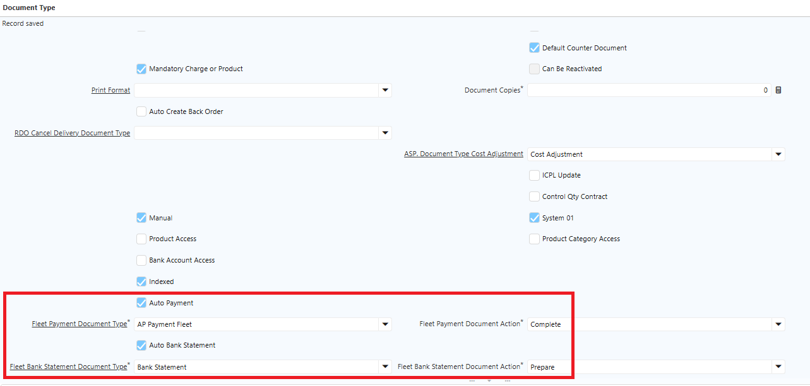
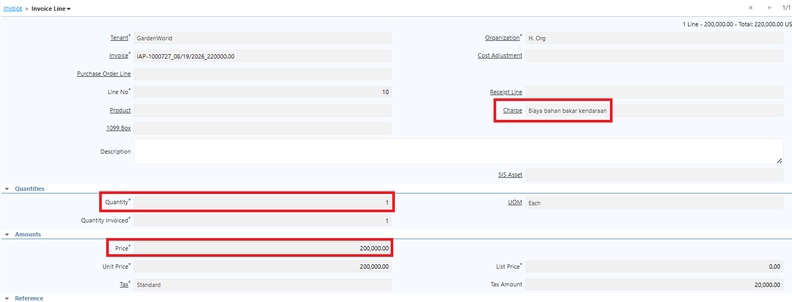
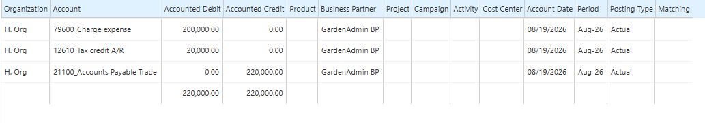
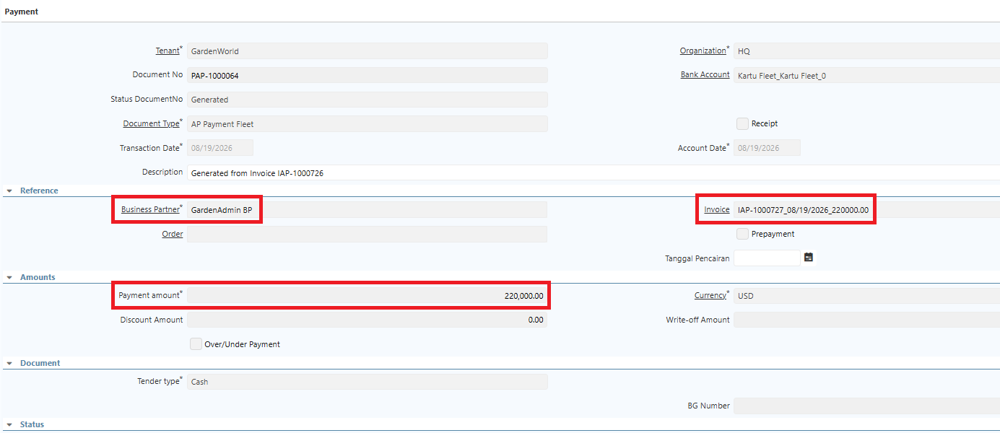
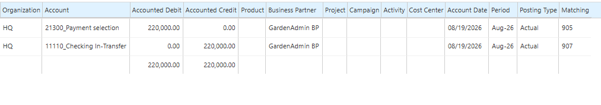
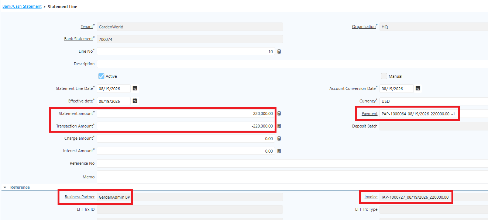
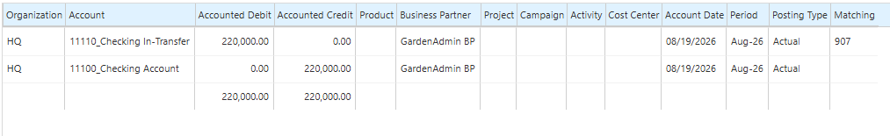

# Petty Cash dan Kartu Fleet

**Petty Cash** adalah mekanisme untuk mengelola kas kecil perusahaan yang digunakan untuk membayar pengeluaran operasional bernilai relatif kecil dan bersifat rutin. **Kartu Fleet** digunakan untuk mencatat dan memantau kendaraan perusahaan beserta transaksi atau aktivitas yang berkaitan dengan kendaraan tersebut.
## Konfigurasi Petty Cash dan Kartu Fleet

Di iDempiere, Petty Cash dan Kartu Fleet dikelola melalui menu **Bank/Cash**. Ikuti langkah berikut untuk membuat master data Petty Cash:

1. Buka menu **Bank/Cash**.
2. Input **nama Petty Cash**.
3. Masuk ke tab **Account**.
4. Input **nama Petty Cash outlet**.
5. Klik **Save**.
6. Ulangi langkah di atas untuk outlet lainnya.

Akun pada master data Petty Cash dapat dibuat per outlet, sehingga pembagiannya berdasarkan akun outlet.

Ikuti langkah berikut untuk membuat master data Kartu Fleet:

1. Buka menu **Bank/Cash**.
2. Input **nama Kartu Fleet**.
3. Masuk ke tab **Account**.
4. Input **nama** sesuai kebijakan.
5. Input **nomor kartu** pada field **Account No**.
6. Klik **Save**.

Akun bank asset untuk Petty Cash dan Kartu Fleet berbeda, sehingga perlu dilakukan konfigurasi accounting pada akun bank asset masing-masing. Ikuti langkah berikut:

1. Buka menu **Bank/Cash**.
2. Buat master data untuk **Petty Cash** dan **Kartu Fleet**.
3. Masuk ke tab **Account**, lalu masuk ke tab **Accounting**.
4. Pada field **Bank Asset**, lakukan konfigurasi berikut:
- **Petty Cash** — Kas Belanja Toko.
- **Kartu Fleet** — Uang Muka Jaminan Lain-Lain.
## Mekanisme Pindah dana Petty Cash

1. Buka menu **Bank/Cash Transfer**.
2. Tentukan **bank asal**.
3. Pada field **Bank To**, input **Petty Cash**.

 {#Figure242}

4. Tentukan **amount** yang akan diproses.
5. Klik **Complete**.

Saat Bank/Cash Transfer di-complete, sistem membentuk dua dokumen payment dengan jurnal berikut:

 {#Figure243}

### Pindah Dana (Bank Asal)

 {#Figure244}
### Terima Dana (Petty Cash)

 {#Figure245}

### Proses Matching Ayat Silang melalui Bank Statement

 {#Figure246}
## Mekanisme Pindah Dana Kartu Fleet

1. Buka menu **Bank/Cash Transfer**.
2. Tentukan **bank asal**.
3. Pada field **Bank To**, input **Kartu Fleet**.

 {#Figure247}

4. Tentukan **amount** yang akan diproses.
5. Klik **Complete**.

Saat Bank/Cash Transfer di-complete, sistem membentuk dua dokumen payment dengan jurnal berikut:

### Pindah Dana (Bank Asal)

 {#Figure248}
### Terima Dana (Kartu Fleet)

 {#Figure249}
### Proses Matching Ayat Silang melalui Bank Statement

 {#Figure250}

## Invoice Biaya atas Kartu Fleet

Kartu Fleet digunakan untuk mencatat dan memantau kendaraan perusahaan beserta transaksi yang berkaitan. Pencatatan biaya atas Kartu Fleet diakui sebagai beban dan dilakukan tanpa PO maupun MR/BPB.

Agar invoice biaya Kartu Fleet yang sudah di-complete otomatis membentuk dokumen **Payment**, lakukan konfigurasi pada **Document Type Invoice** terlebih dahulu. Ikuti langkah berikut:

1. Buka menu **Document Type**.
2. Klik **New**.
3. Isi **Name** sesuai kebutuhan operasional.
4. Pada field **Document Base Type**, pilih **AP Invoice**.
5. Centang field **Document Number Is Controlled**.
6. Centang field **Auto Payment**.
7. Tentukan **Document Type Payment Fleet**.
8. Tentukan **Document Action** atas Payment Fleet.
9. Field **Auto Bank Statement** — jika dicentang, sistem otomatis membuat Bank Statement saat Payment di-complete.
10. Tentukan **Document Type Bank Statement Fleet**.
11. Tentukan **Document Action** atas Bank Statement Fleet.

 {#Figure250}

12. Klik **Save**.
### Langkah Membuat AP Invoice Biaya Kartu Fleet

1. Buka menu **Purchase Invoice and Credit/Debit Note**.
2. Tentukan **Target Document Type**.
3. Tentukan **Business Partner**.
4. Tentukan **Bank Account** yang digunakan.
5. Masuk ke **Invoice Line**.
6. Tentukan **Charge** atau biaya yang akan diproses.
7. Tentukan **Qty** _(default 1)_.
8. Tentukan **Price** untuk biaya tersebut.

 {#Figure251}

9. Klik **Save**.
10. Klik **Complete**.

Berikut contoh jurnal yang terbentuk atas invoice biaya _(nama akun dapat disesuaikan dengan ketentuan)_:

 {#Figure252}

Setelah Invoice di-complete, sistem otomatis membuat dokumen **Payment** atas invoice tersebut. Document Action pada Payment mengikuti konfigurasi di Document Type Invoice.

 {#Figure253}

Berikut contoh jurnal yang terbentuk saat Payment di-complete:

 {#Figure254}

Saat Payment di-complete, sistem otomatis membuat dokumen **Bank Statement** sesuai konfigurasi sebelumnya. 

 {#Figure255}

 {#Figure256}

Informasi pada Bank Statement diambil dari invoice dan payment, sehingga setiap Payment dan Bank Statement dapat ditelusuri kaitannya dengan invoice dan Business Partner yang bersangkutan.