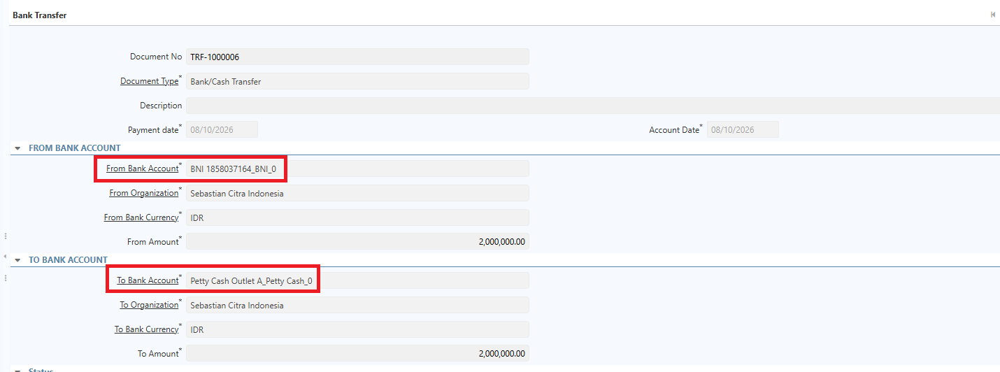
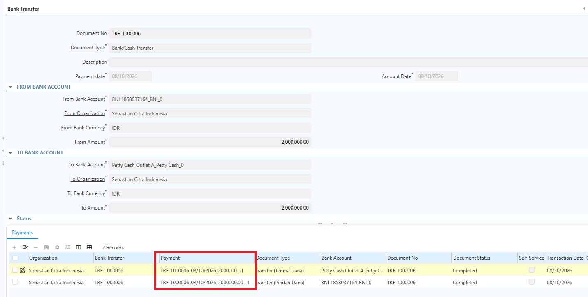
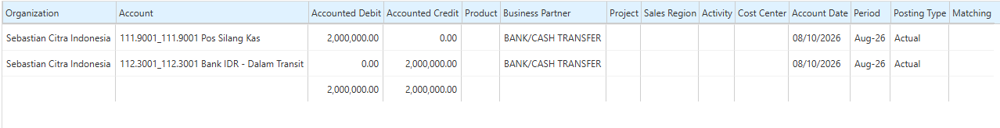
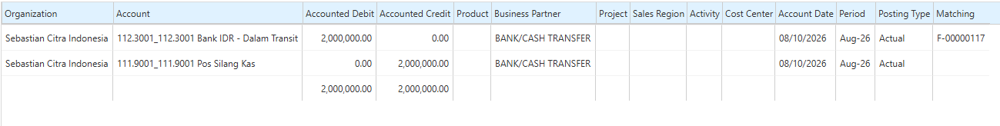
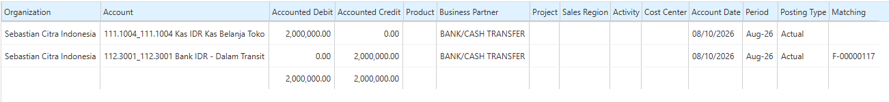
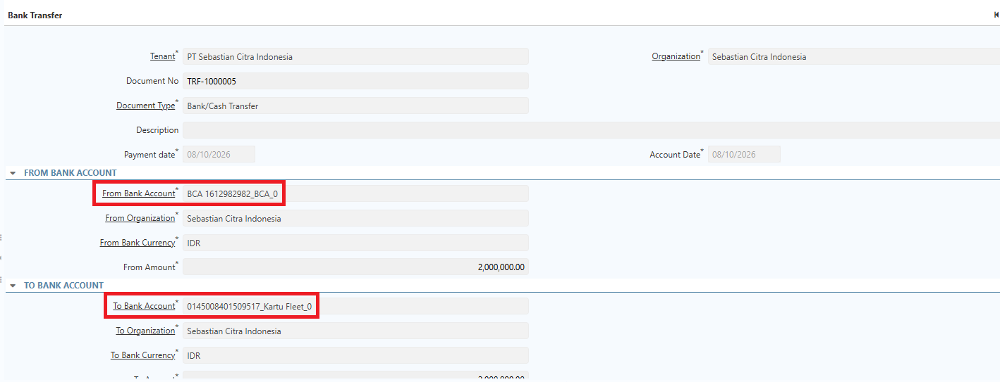
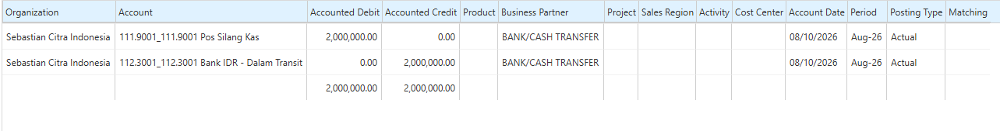
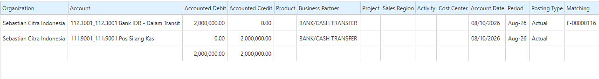
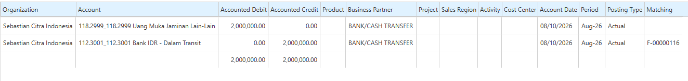

# Petty Cash dan Kartu Fleet

**Petty Cash** adalah mekanisme untuk mengelola kas kecil perusahaan yang digunakan untuk membayar pengeluaran operasional bernilai relatif kecil dan bersifat rutin. **Kartu Fleet** digunakan untuk mencatat dan memantau kendaraan perusahaan beserta transaksi atau aktivitas yang berkaitan dengan kendaraan tersebut.
## Konfigurasi Petty Cash dan Kartu Fleet

Di iDempiere, Petty Cash dan Kartu Fleet dikelola melalui menu **Bank/Cash**. Ikuti langkah berikut untuk membuat master data Petty Cash:

1. Buka menu **Bank/Cash**.
2. Input **nama Petty Cash**.
3. Masuk ke tab **Account**.
4. Input **nama Petty Cash outlet**.
5. Klik **Save**.
6. Ulangi langkah di atas untuk outlet lainnya.

Akun pada master data Petty Cash dapat dibuat per outlet, sehingga pembagiannya berdasarkan akun outlet.

Ikuti langkah berikut untuk membuat master data Kartu Fleet:

1. Buka menu **Bank/Cash**.
2. Input **nama Kartu Fleet**.
3. Masuk ke tab **Account**.
4. Input **nama** sesuai kebijakan.
5. Input **nomor kartu** pada field **Account No**.
6. Klik **Save**.

Akun bank asset untuk Petty Cash dan Kartu Fleet berbeda, sehingga perlu dilakukan konfigurasi accounting pada akun bank asset masing-masing. Ikuti langkah berikut:

1. Buka menu **Bank/Cash**.
2. Buat master data untuk **Petty Cash** dan **Kartu Fleet**.
3. Masuk ke tab **Account**, lalu masuk ke tab **Accounting**.
4. Pada field **Bank Asset**, lakukan konfigurasi berikut:
- **Petty Cash** — Kas Belanja Toko.
- **Kartu Fleet** — Uang Muka Jaminan Lain-Lain.
## Mekanisme Pindah dana Petty Cash

1. Buka menu **Bank/Cash Transfer**.
2. Tentukan **bank asal**.
3. Pada field **Bank To**, input **Petty Cash**.

 {#Figure242}

4. Tentukan **amount** yang akan diproses.
5. Klik **Complete**.

Saat Bank/Cash Transfer di-complete, sistem membentuk dua dokumen payment dengan jurnal berikut:

 {#Figure243}

### Pindah Dana (Bank Asal)

 {#Figure244}
### Terima Dana (Petty Cash)

 {#Figure245}

### Proses Matching Ayat Silang melalui Bank Statement

 {#Figure246}
## Mekanisme Pindah Dana Kartu Fleet

1. Buka menu **Bank/Cash Transfer**.
2. Tentukan **bank asal**.
3. Pada field **Bank To**, input **Kartu Fleet**.

 {#Figure247}

4. Tentukan **amount** yang akan diproses.
5. Klik **Complete**.

Saat Bank/Cash Transfer di-complete, sistem membentuk dua dokumen payment dengan jurnal berikut:

### Pindah Dana (Bank Asal)

 {#Figure248}
### Terima Dana (Kartu Fleet)

 {#Figure249}
### Proses Matching Ayat Silang melalui Bank Statement

 {#Figure250}