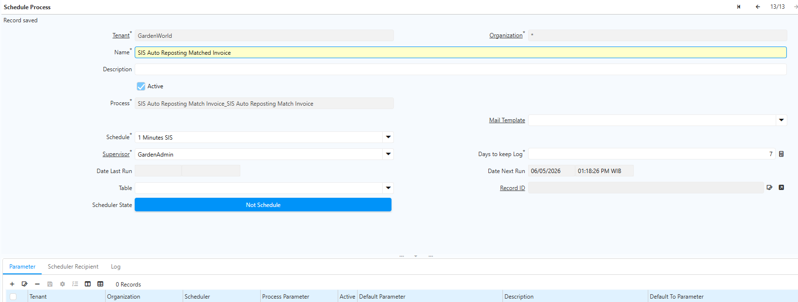

# Posting Matched Invoice

Sebelum melakukan posting jurnal matched invoice, lakukan konfigurasi Scheduler terlebih dahulu. Ikuti langkah berikut:

1. Buka menu **Scheduler**.
2. Klik **New**.
3. Input nama: "**SIS Auto Reposting Matched Invoice**".
4. Pada field Process, pilih "**SIS Auto Reposting Match Invoice_SIS Auto Reposting Match Invoice**".
5. Pada field Schedule, pilih "**1 Minutes SIS**".
6. Pada field Supervisor, input sesuai kebutuhan.
7. Pada field Days to Keep Log, pilih "**1**" — nilai ini menentukan jumlah hari log yang akan disimpan.
8. Klik **Save**.
9. Klik **Not Schedule**.

 {#Figure 73}

Konfigurasi scheduler ini diperlukan karena jurnal matched invoice dapat mengalami posting error akibat pengaturan auto invoice di document type. Dengan scheduler ini, sistem akan otomatis melakukan reposting jurnal sesuai jadwal yang dikonfigurasi. Meskipun posting error muncul, sistem tetap mencatat jurnal matched invoice di latar belakang.

Tab Log akan diperbarui setiap satu menit sesuai konfigurasi. Sistem secara berkala menjalankan proses reposting matched invoice di latar belakang. Setelah jurnal berhasil ter-posting, log tetap berjalan selama periode yang ditentukan di Days to Keep Log.
