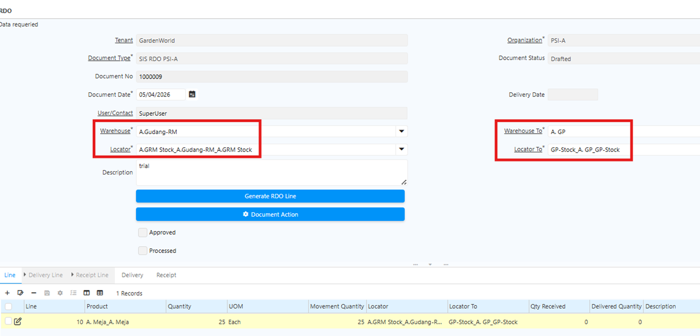
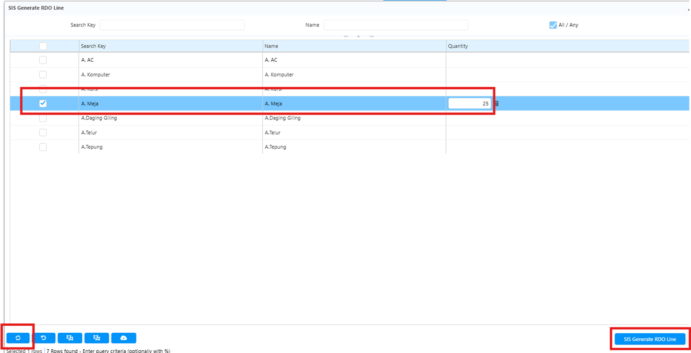

## Product Category dan Product Access

**Product Category Access** membatasi produk yang dapat diproses dalam suatu transaksi berdasarkan kategori produk yang telah dikonfigurasi di level Product Category. Jika kategori produk dikonfigurasi pada document type tertentu, hanya produk dalam kategori tersebut yang dapat diproses — produk di luar kategori tidak akan bisa digunakan.

**Product Access** bekerja dengan prinsip yang sama, namun pembatasan dilakukan per produk secara spesifik. User menentukan produk mana saja yang dapat diproses, dan sistem hanya memproses transaksi untuk produk-produk tersebut.

Konfigurasi Product Category Access dan Product Access dilakukan di level **Document Type**. Document type yang mendukung konfigurasi ini antara lain:

- Order Line
- Movement Line
- Invoice Line
- RDO Line
- ICPL Line
## Konfigurasi Product Category dan Product Access

Karena konfigurasi berlaku per document type, lakukan konfigurasi untuk setiap document type yang dibutuhkan.
### Konfigurasi Product Access

1. Buka menu **Document Type**.
2. Klik **New**
3. Input **Name** document type
4. Centang field **Product Access** pada header untuk mengaktifkan pembatasan produk.
5. Klik **Generate Product,** kemudian input produk-produk yang akan diproses.
6. Klik **SIS Generate Product Access**.
7. Tab **Product Access** akan menampilkan daftar produk yang telah dikonfigurasi.

### Konfigurasi Product Category Access

1. Buka menu **Document Type**
2. Klik **New**
3. Input **Name** document type
4. Centang field **Product Category Access** pada header untuk mengaktifkan pembatasan kategori produk.
5. Klik **Generate Product Category**, kemudian input kategori produk yang akan diproses.
6. Klik **SIS Generate Product Category Access**.
7. Tab **Product Category Access** akan menampilkan daftar kategori produk yang telah dikonfigurasi.

Ulangi langkah di atas untuk setiap document type lain yang memerlukan konfigurasi. Jika transaksi tidak memerlukan pembatasan produk khusus, konfigurasi ini tidak perlu dilakukan.
## Implementasi Product & Category Access

### Purchase Order

1. Buka menu **Purchase Order**.
2. Pilih **Document Type** yang telah dikonfigurasi.
3. Input **Business Partner**.
4. Input **Warehouse** untuk penempatan produk.
5. Masuk ke tab **PO Line**.
6. Pada field **Product**, sistem hanya menampilkan produk yang sesuai konfigurasi Product & Category Access.
7. Input **quantity** product.
8. Klik **Save**.
9. Klik **Complete** pada dokumen.
### Movement

1. Buka menu **Inventory Move**.
2. Pilih **Document Type** yang telah dikonfigurasi.
3. Input **Business Partner**.
4. Input **Warehouse** untuk penempatan produk.
5. Masuk ke tab **Move Line**.
6. Pada field **Product**, sistem hanya menampilkan produk yang sesuai konfigurasi Product & Category Access.
7. Input **quantity** product.
8. Pilih **Locator** untuk penempatan produk.
9. Klik **Save**.
10. Klik **Complete** pada dokumen.
### Invoice

1. Buka menu P**urchase Invoice and Credit/Debit**.
2. Pilih **Target Document Type** yang telah dikonfigurasi.
3. Input **Business Partner**.
4. Masuk ke tab **Invoice Line**.
5. Pada field **Product**, sistem hanya menampilkan produk yang sesuai konfigurasi Product & Category Access.
6. Input **quantity** product.
7. Klik **Save**.
8. Klik **Complete** pada dokumen.
### Request Distribution Order (RDO)

1. Buka menu **SIS RDO**.
2. Tentukan **Warehouse** dan **Warehouse To** untuk pendistribusian produk.
3. Tentukan **Locator** dan **Locator To** untuk penempatan produk.

	 {#Figure30
	
4. Jalankan **Generate RDO Line** — sistem menampilkan daftar produk yang telah dikonfigurasi.
5. Pilih produk yang akan didistribusikan sesuai kebutuhan.

	 {#Figure31}

6. Validasi quantity distribusi.
7. Klik **Complete Document** untuk menyelesaikan proses RDO.