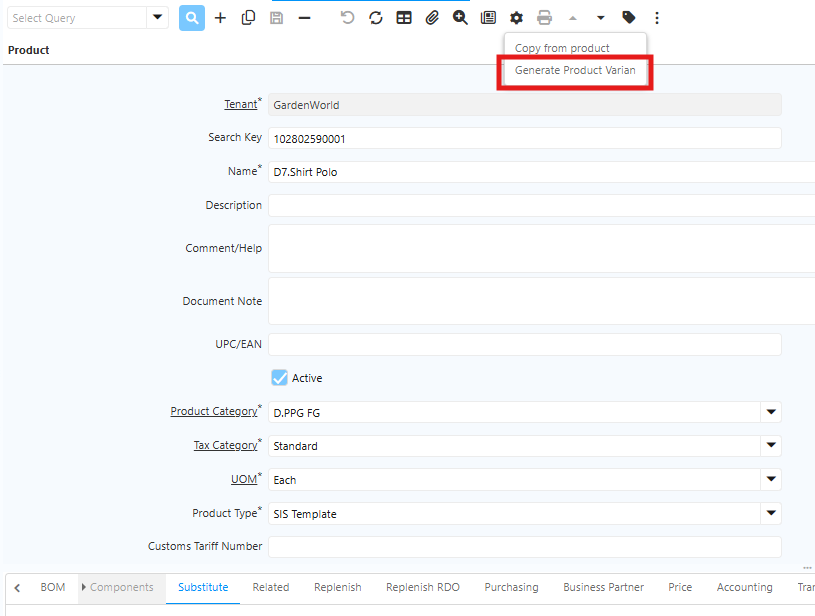
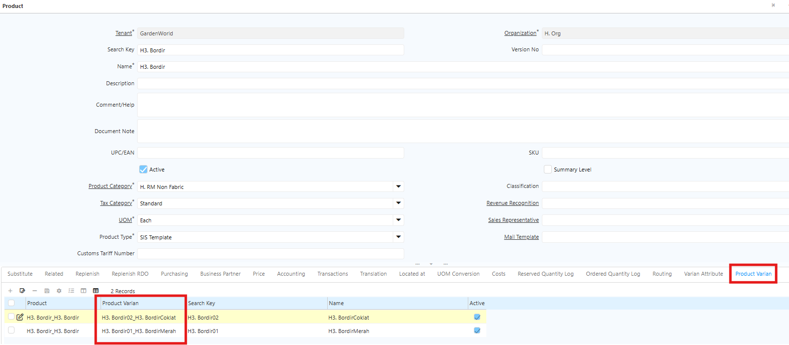
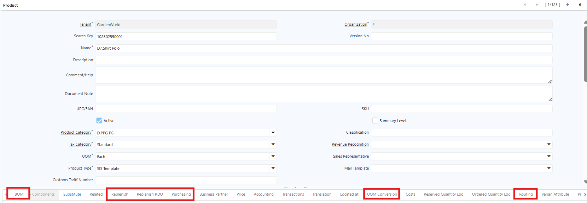

# Finalisasi Pembuatan Item/Artikel/Product
Berikut ini adalah langkah langkah dalam melakukan proses finalisasi pembuatan Item/Artikel/Product

## Generate Product Varian

Setelah Product Template, Item Type, Attribute Set dan Varian Attribute selesai dikonfigurasi, jalankan fitur Generate Product Varian melalui langkah berikut:

1. Buka menu **Product**.
2. Klik ikon **Setting** (⚙).
3. Jalankan fitur **Generate Product Varian**.

	 {#Figure5}

Sistem akan membuat produk varian secara otomatis berdasarkan kombinasi varian yang telah ditentukan, dan menampilkannya pada tab **Product Varian**. Produk varian yang terbentuk merupakan produk reguler dengan Product Type Item.

	 {#Figure59}

 Untuk produk Semi Finished Goods dan Finished Goods yang menggunakan Bill of Material, pastikan BoM sudah dikonfigurasi dengan benar sebelum menjalankan Generate Product Varian. Struktur BoM pada product template akan otomatis disalin ke setiap produk varian yang dihasilkan.

Saat proses Generate dijalankan, sistem menyalin informasi berikut dari product template ke setiap product varian:
- Bill of Material
- Purchasing
- Routing
- Replenish
- Replenish RDO
- UoM Conversion

 {#Figure60}

Distribusi komponen bahan di BoM pada setiap produk varian akan menyesuaikan attribute dan konfigurasi BoM yang telah diatur di level template.
